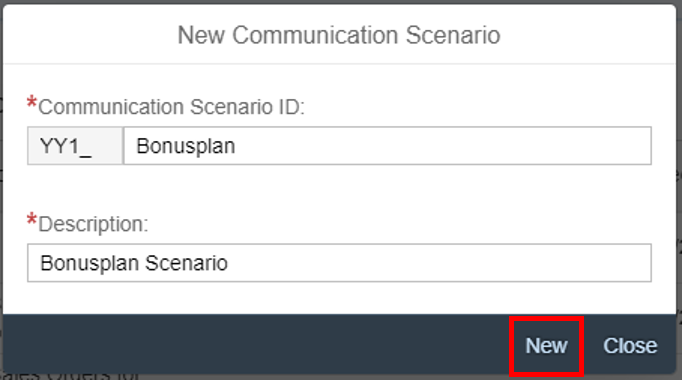

## Prerequisites  
The assignment of the business catalog **`SAP_CORE_BC_COM`**, **`SAP_CORE_BC_EXT`** to your user and **`Enable SAP Web IDE for S/4HANA system via OAuth`** as tutorial represents the prerequisites for the usage of the service generation as well as custom communication scenario and communication arrangement creation.

## Details
### You will learn  
- How to create service for a custom business object
- How to expose UI by the creation of a custom communication scenario
- How to expose UI by the creation of a communication arrangement

This tutorial describes how the service generation can be activated for an existing custom business object. Furthermore the addition of CDS views to custom communication scenario is explained. The creation of communication arrangements for `Bonusplan` scenarios also takes place in this tutorial.

### Time to Complete
**15 Min**.

---

[ACCORDION-BEGIN [Step 1: ](Open custom business objects application)]
Navigate to **Custom Business Objects** tile to start the application.

[ACCORDION-END]

[ACCORDION-BEGIN [Step 2: ](Generate OData service)]
Open details of your custom business object **`Bonusplan`**, create draft and select the **Service Generation** checkbox. Click **Save** and **Publish**. With this step an OData service is created.

[ACCORDION-END]

[ACCORDION-BEGIN [Step 3: ](Open custom communication scenarios application)]
Open **Custom Communication Scenarios** application.

[ACCORDION-END]

[ACCORDION-BEGIN [Step 4: ](Create communication scenario)]
A communication scenario is the basis definition for a communication between systems. It defines a solution to be made available for external systems. Click **New**, give your scenario a name, description and click **New** again.

Enter **`Bonusplan Scenario`** as description and click **New**.

[ACCORDION-END]

[ACCORDION-BEGIN [Step 5: ](Add inbound service to scenario)]
Add your CDS view **`YY1_BONUSPLAN_CDS`** by clicking **+**. Check and publish it.

[ACCORDION-END]

[ACCORDION-BEGIN [Step 6: ](Open communication arrangements application)]
Open **Communication Arrangements** application.

[ACCORDION-END]

[ACCORDION-BEGIN [Step 7: ](Create communication arrangement)]
Create a communication arrangement. This time you create it for your `Bonusplan` scenario.

[ACCORDION-END]

[ACCORDION-BEGIN [Step 8: ](Set communication system in arrangement)]
Select **`SCP_DEV_SYSTEM`** as your communication system. Select **`SCP_DEV`** as communication system with **`OAuth 2.0`** as authentication method.

Click **Save**.

[ACCORDION-END]
