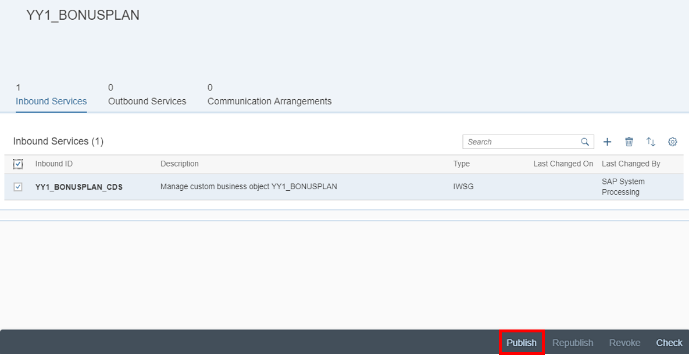

## Prerequisites  
The assignment of the Business Catalog **`SAP_CORE_BC_COM`**, **`SAP_CORE_BC_EXT`** to your user and **`Communication Arrangement and Destination`** as tutorial represents the Prerequisites for the usage of the Service Generation as well as Custom Communication Scenario and Communication Arrangement creation.

## Next Steps
 (coming soon).
## Details
This tutorial describes how the Service Generation can be activated for an existing Custom Business Object. Furthermore the addition of a CDS View to the Custom Communication Scenario is explained. The creation of a Communication Arrangement for the `Bonusplan` Scenario takes also place in this tutorial.
### You will learn  
You will learn how to create a service for a custom business object and expose it by the creation of a custom communication scenario and a communication arrangement in the web.

### Time to Complete
**15 Min**.

---

[ACCORDION-BEGIN [Step 1: ](Open Custom Business Objects Application)]
Navigate to **Custom Business Objects** tile to start the application.

[ACCORDION-END]

[ACCORDION-BEGIN [Step 2: ](Generate OData Service)]
Open details of your custom business object **`Bonusplan`**, Create Draft and select Service Generation checkbox. Afterwards save your draft and publish your changes. With this step an OData service is created.

[ACCORDION-END]

[ACCORDION-BEGIN [Step 3: ](Open Custom Communication Scenarios Application)]
Open the **Custom Communication Scenarios** application.

[ACCORDION-END]

[ACCORDION-BEGIN [Step 4: ](Create Communication Scenario)]
A communication scenario is the basis definition for a communication between systems. It defines a solution to be made available for external systems.

Give your scenario a name, a description and click on **New**.

[ACCORDION-END]

[ACCORDION-BEGIN [Step 5: ](Add Inbound Service to Scenario)]
Add your CDS View `YY1_BONUSPLAN_CDS` by clicking on the **Plus** symbol. Furthermore **check** and **publish** it.

[ACCORDION-END]

[ACCORDION-BEGIN [Step 6: ](Open Communication Arrangements Application)]
Open the **Communication Arrangements** application.

[ACCORDION-END]

[ACCORDION-BEGIN [Step 7: ](Create Communication Arrangement)]
Now create a Communication Arrangement again. This time you create it for your `Bonusplan` Scenario.

[ACCORDION-END]

[ACCORDION-BEGIN [Step 8: ](Set Communication System in Arrangement)]
First select **`SCP_DEV_SYSTEM`** as your communication system. Afterwards select `SCP_DEV` as communication system with `OAuth 2.0` as authentication method.

Now save your changes.

[ACCORDION-END]

## Next Steps
(coming soon)
