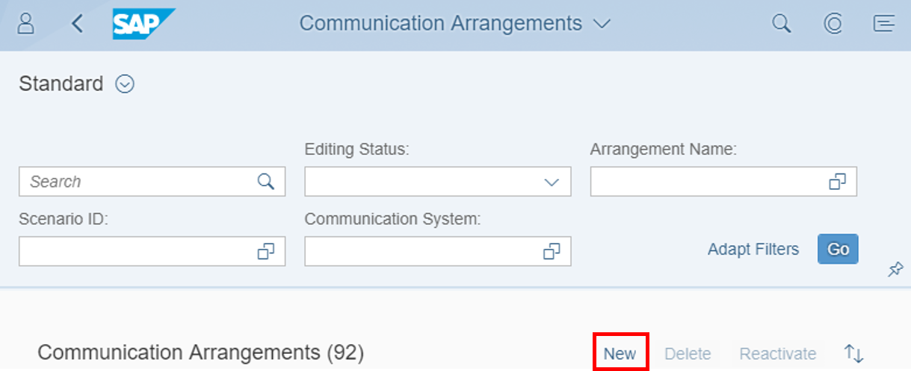
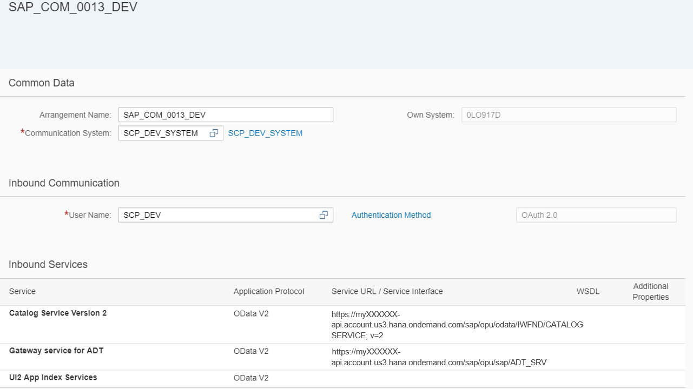

## Prerequisites  
The assignment of the Business Catalog **`SAP_CORE_BC_COM`** to your user and **`ABAP Custom New UI - Communication System`** as tutorial represents the Prerequisites for the usage of Communication Arrangement.

## Next Steps
 (coming soon).
## Details
This tutorial describes which information is needed to create a Communication Arrangement. It refers to the `SAP_COM_0013` scenario. The `OAuth2.0` authentication method is also selected by specifying the Communication System.

### You will learn  
In this tutorial you will learn how to set up a Communication Arrangement.

### Time to Complete
**15 Min**.

---

[ACCORDION-BEGIN [Step 1: ](Open Communication Arrangements Application)]
Navigate to **Communication Arrangements** tile to start the application.

[ACCORDION-END]

[ACCORDION-BEGIN [Step 2: ](Create New Communication Arrangement)]
Click on the **New** button to create a new communication arrangement.

[ACCORDION-END]

[ACCORDION-BEGIN [Step 3: ](Select Scenario)]
Select `SAP_COM_0013` as Scenario and rename your Arrangement Name.

[ACCORDION-END]

[ACCORDION-BEGIN [Step 4: ](Add Communication System)]
Add your Communication System to your Communication Arrangement and save it.
Also select `SCP_DEV` with `OAuth2.0` as communication system.
Be sure that your service status of you Launch SAP Web IDE is activated and save your changes.

[ACCORDION-END]

[ACCORDION-BEGIN [Step 5: ](Check Data)]
Now following should be listed:

[ACCORDION-END]

## Next Steps
(coming soon)
