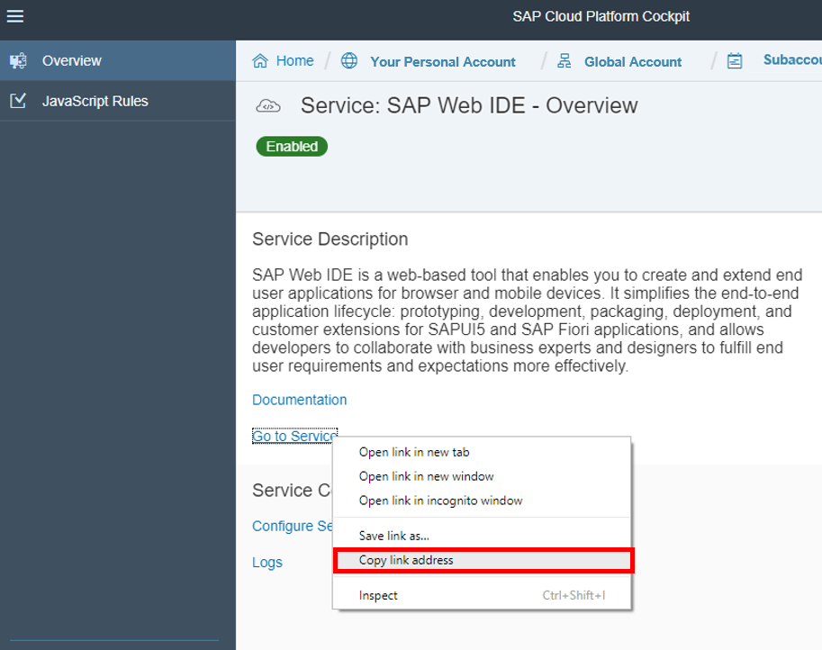
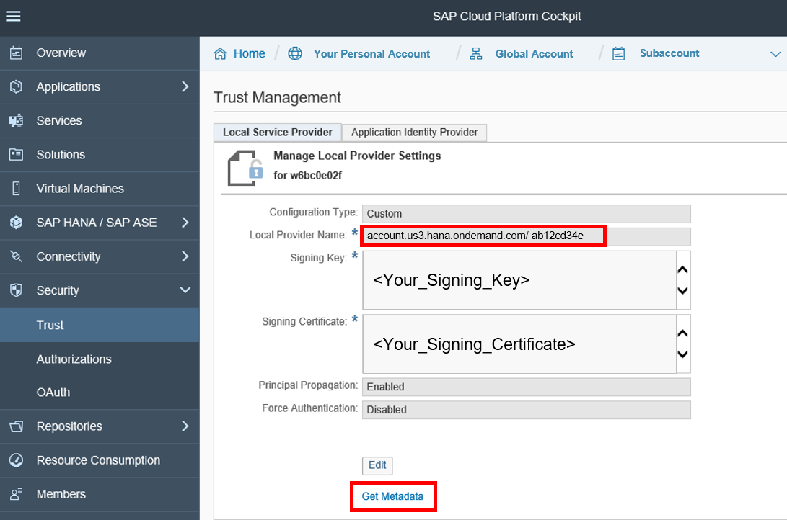

## Prerequisites  
The assignment of the Business Catalog **`SAP_CORE_BC_COM`** to your user and **`Set Up Trust Between Identity Authentication and SAP Cloud Platform Subaccount`** as tutorial represents the Prerequisites for the usage of Communication System.

## Next Steps
 (coming soon).
## Details
With this an application you are able to create Communication Systems. To create the communication system, you have to specify the SAP Web IDE link from SAP Cloud Platform as host name. Within the Communication System application you can generate also a System User, which can be found under Inbound Communication User. The Upload of your certificate can be realized furthermore.

### You will learn  
You will learn in this tutorial how to create a Communication System and User. It also shows how to specify the SAP Web IDE link from SAP Cloud Platform and upload the certificate.

### Time to Complete
**15 Min**.

---

[ACCORDION-BEGIN [Step 1: ](Open Communication System Application)]
Navigate to **Communication Systems** tile to start the application.


[ACCORDION-END]

[ACCORDION-BEGIN [Step 2: ](Create Communication System)]
Create a new communication system. Therefore just click on the **New** button.


[ACCORDION-END]

[ACCORDION-BEGIN [Step 3: ](Add System ID and System Name)]
By adding a system ID, system name and clicking on the **Create** button, you are able to register a new communication system.


[ACCORDION-END]

[ACCORDION-BEGIN [Step 4: ](Copy Link Address)]
Now switch back to your SAP Cloud Platform Cockpit, go to Services and select SAP Web IDE. Copy the link address of **`Go to Service`**. This will be needed in the creation process of the communication system.



[ACCORDION-END]

[ACCORDION-BEGIN [Step 5: ](Add Host Name)]
Now you can add your host name. You can find this information on SAP Cloud Platform. It corresponds to the link address copied from step 4 of this tutorial.


[ACCORDION-END]

[ACCORDION-BEGIN [Step 6: ](Add Inbound Communication User to System)]
Click on the plus sign to add a user for inbound communication. Inbound communication means the here defined system is used from a communication partner to call from external into the S/4HANA system. Doing this the user that will be added next has to be used to get authorized.


[ACCORDION-END]

[ACCORDION-BEGIN [Step 7: ](Create Communication User)]
Now click on **New User** to create one.


[ACCORDION-END]

[ACCORDION-BEGIN [Step 8: ](Add User Data and Password)]
Write a user name and description for your user.
Also give your user a password and click on the create button.


[ACCORDION-END]

[ACCORDION-BEGIN [Step 9: ](Confirm User to Add)]
The new user will be generated by clicking on the **OK** button.


[ACCORDION-END]

[ACCORDION-BEGIN [Step 10: ](Get SAP Cloud Platform Subaccount's Metadata)]
Now switch again to your Subaccount in SAP Cloud Platform Cockpit and download its Metadata. Open trust settings and download the metadata by clicking on the **Get Metadata** link. Also copy the Local Provider Name for later use.



[ACCORDION-END]

[ACCORDION-BEGIN [Step 11: ](Create Certificate from Metadata)]
Take your downloaded Metadata-File from SAP Cloud Platform and open it with an editor of your choice.
(1) Copy the code between the two tags in another file.


(2) Add also the begin and end tag to your copied code:

```swift
      -----BEGIN CERTIFICATE-----
           your_copied_code
      -----END CERTIFICATE-----

```
Now save your changes as `.cer` file

[ACCORDION-END]

[ACCORDION-BEGIN [Step 12: ](Upload Signing Certificate to Communication System)]
Now go back to your SAP S/4HANA Cloud System and open your created Communication System Draft. Edit your draft and enable it for OAuth 2.0 by checking the Enabled box. Then upload the certificate by clicking the button Upload Signing Certificate. Enter the provider name which is the Subaccount's Local Service Provider's Name. You copied it a few steps before.


[ACCORDION-END]
subaccounts metadata

## Next Steps
(coming soon)
