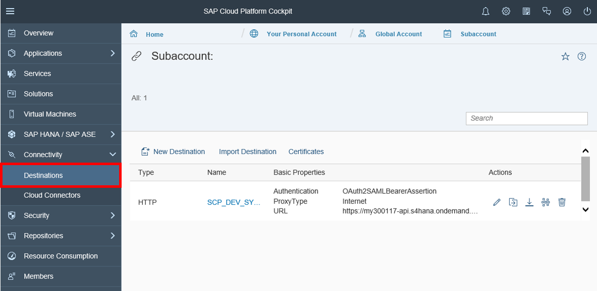
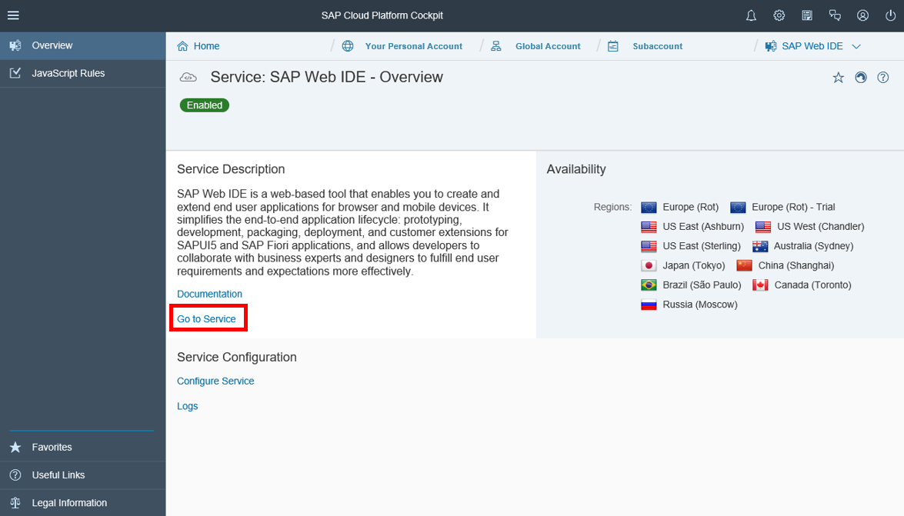
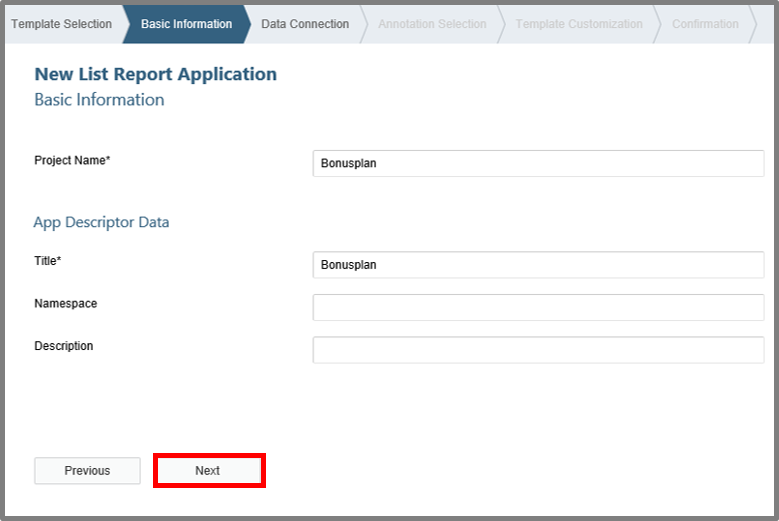
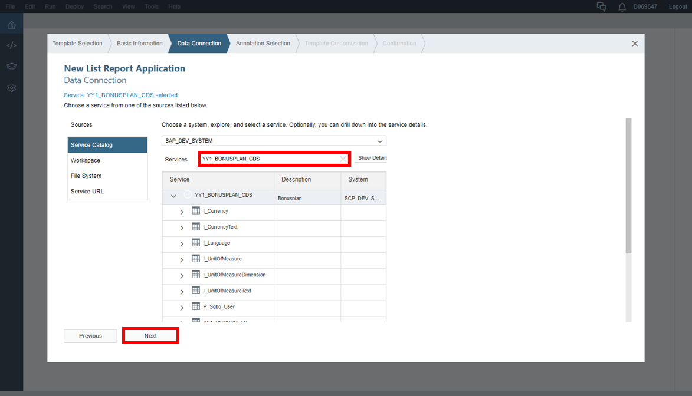

## Prerequisites  
The assignment of the Business Catalog **`SAP_CORE_BC_COM`**, **`SAP_CORE_BC_EXT`** to your user and **`Custom Business Object exposure as External Web Service Arrangement`** as tutorial represents the Prerequisites for the usage of the Service Generation as well as Custom Communication Scenario and Communication Arrangement creation.

## Next Steps
 (coming soon).
## Details

### You will learn  
You will learn how to make a Custom Business Object's Service consumable on Cloud Platform in case of OAuth authentication. This will be done by enhancing the Platform Subaccount's Destination to the services S/4HANA system. The service will be added to the scope of the destination. At the end you cannot only choose the service in Web IDE, but also retrieve its data.

### Time to Complete
**15 Min**.

---

[ACCORDION-BEGIN [Step 1: ](Open SAP Cloud Platform Destination)]
Open **SAP Cloud Platform Destination**.

[ACCORDION-END]

[ACCORDION-BEGIN [Step 2: ](Add Service Scope to Destination)]
Add service scope to destination. Therefore add your custom CDS view service to your scope.

| -------------- | --------------------------------------------------------------------------------- |
|  **`scope:`**  |  `ADT_001 /UI5/APP_INDEX_0001 /IWFND/SG_MED_CATALOG_0002 YY1_BONUSPLAN_CDS_0001`  |

Now your **scope** consists of 4 parts:
 - `ADT_001`: scope of the Gateway service for ADT  
 - `/UI5/APP_INDEX_0001`: scope of the UI2 App Index
 - `/IWFND/SG_MED_CATALOG_0002`: scope of the Catalog service version 2.0
 - `<CustomBusinessObjectServiceName> + _0001`: custom CDS view

    example: `YY1_BONUSPLAN_CDS_0001`

[ACCORDION-END]

[ACCORDION-BEGIN [Step 3: ](Open SAP Web IDE)]
Go to Services, search for **SAP Web IDE** and select it on your SAP Cloud Platform Account.

[ACCORDION-END]

[ACCORDION-BEGIN [Step 4: ](View Service Catalog)]
Now click on **Go to Service** to open SAP Web IDE.
Create a new project from template, select a List Report Application and your Service Catalog. Choose your destination and see the list of services afterwards.

[ACCORDION-END]

[ACCORDION-BEGIN [Step 5: ](Open SAP Web IDE)]
Select **New project from Template** to generate one on SAP Web IDE.

[ACCORDION-END]

[ACCORDION-BEGIN [Step 6: ](Create UI Project)]
Choose the **List Report Application** template to create a new UI.

The alternative way would be following:
File -> New -> Project from Template

[ACCORDION-END]

[ACCORDION-BEGIN [Step 7: ](Enter Basic Information)]
Now enter **`Bonusplan`** as project name and UI for **`Bonusplan`** as title.

Afterwards click on the **Next** button.

[ACCORDION-END]

[ACCORDION-BEGIN [Step 8: ](Explore Business Object's Service in Web IDE)]
Search for `YY1_BONUSPLAN_CDS` and open the list. Now you can see following:

Without `YY1_BONUSPLAN_CDS_0001` as parameter in your scope, this wouldn't be possible.

[ACCORDION-END]

## Next Steps
(coming soon)
