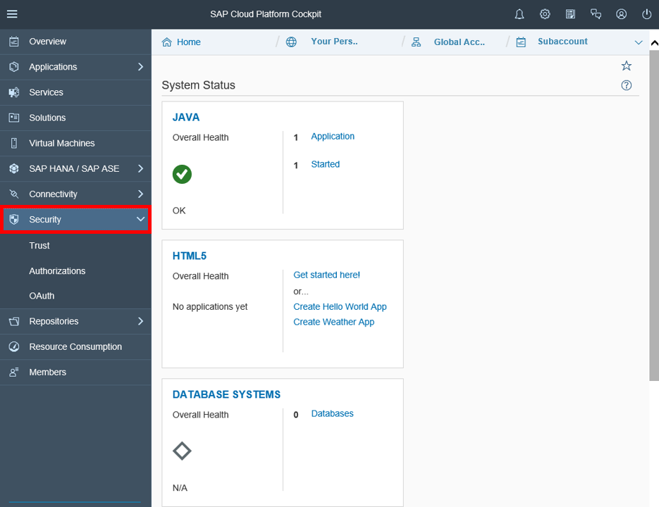
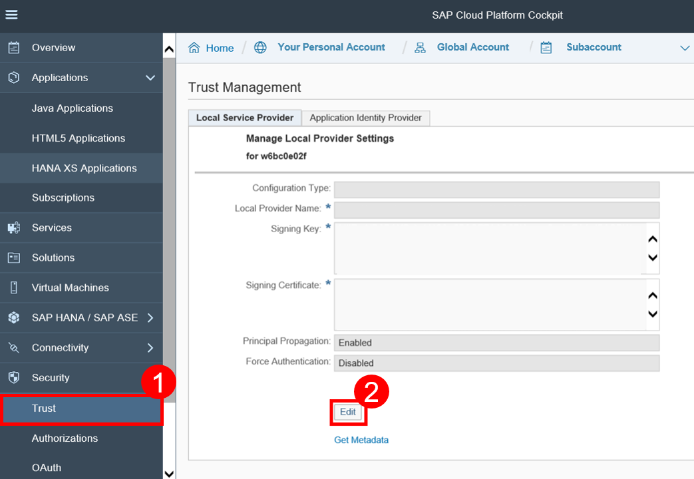
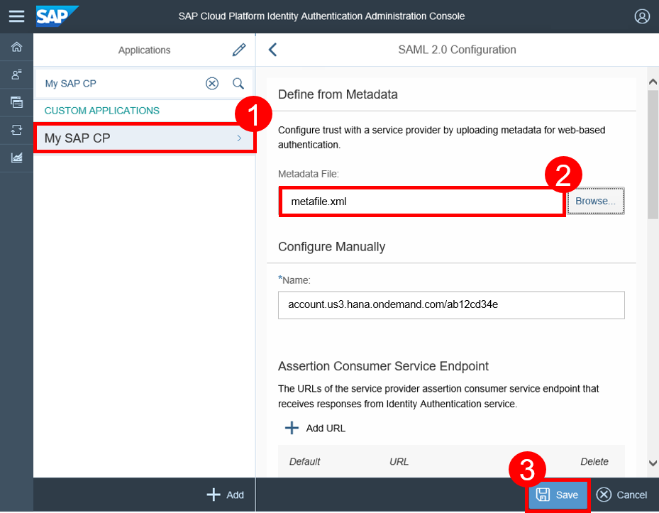
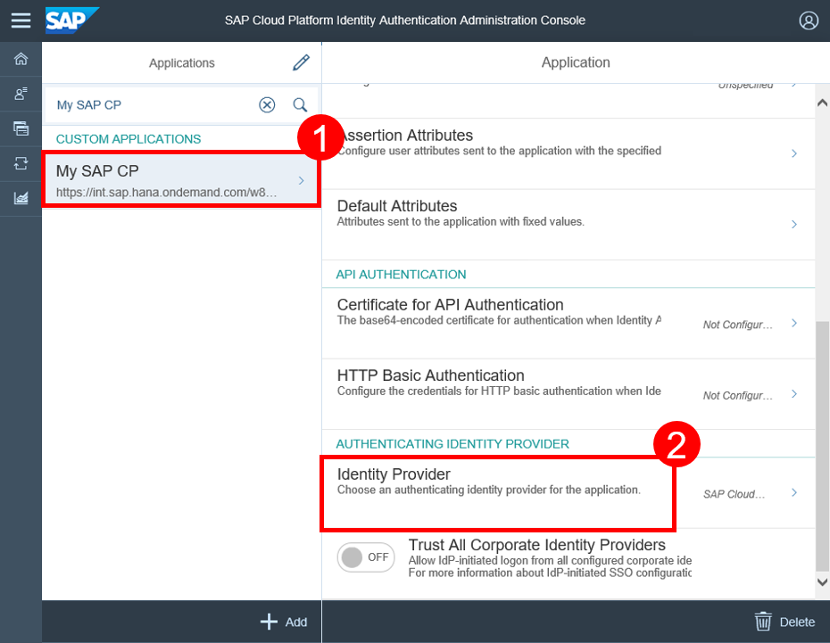
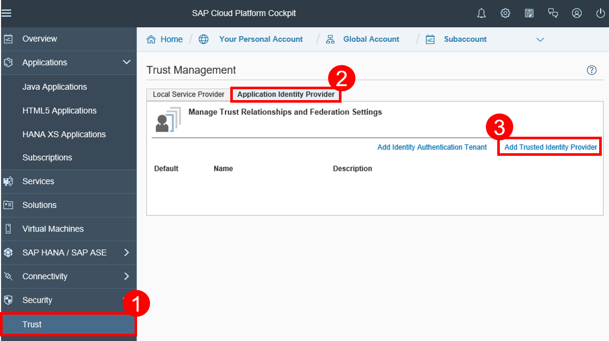
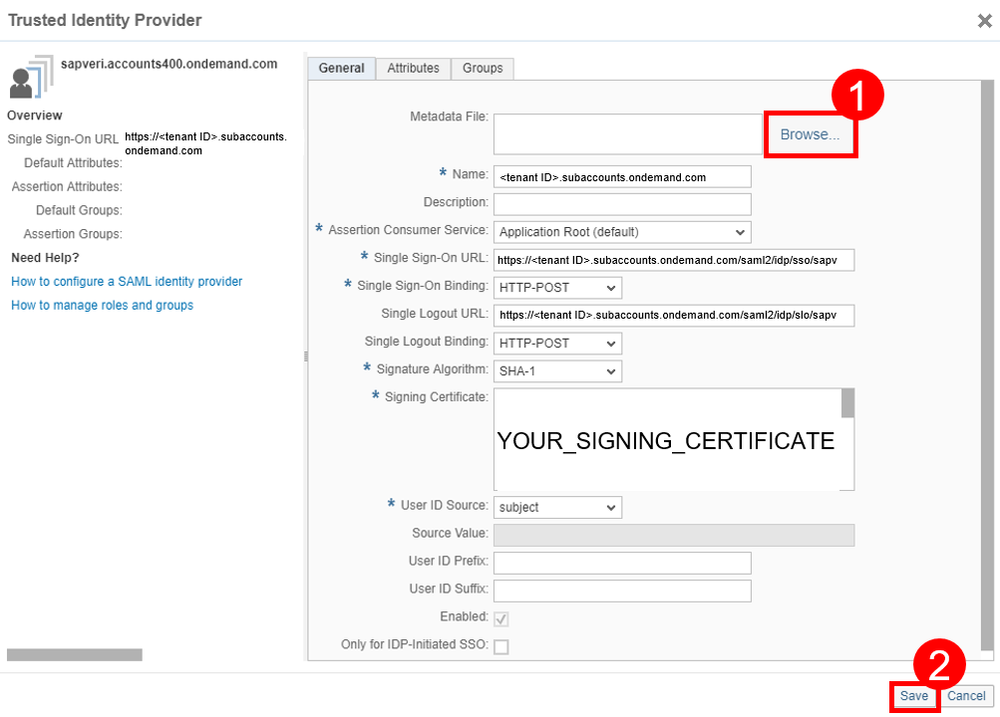

## Prerequisites  
**`Maintain platform subaccounts and Web IDE permissions`** as tutorial is a prerequisite .

## Next Steps
 (coming soon).

## Details
This tutorial describes how the trust between Identity Authentication and SAP Cloud Platform is set up. You can assign members different roles. With these roles users have different rights on SAP Cloud Platform. Furthermore you will be able to Configure SAML 2.0 Trust with SAP Cloud Platform and upload Metadata of SAP Cloud Platform Subaccount.

### You will learn  
You will be able to learn how to set up trust between Identity Authentication and SAP Cloud Platform.

### Time to Complete
**25 Min**.

---

[ACCORDION-BEGIN [Step 1: ](Enter SAP Cloud Platform Subaccount)]
Enter the **SAP Cloud Platform Subaccount** as an administrator and expand the **Security** section.

[ACCORDION-END]

[ACCORDION-BEGIN [Step 2: ](Edit Local Service Provider)]
Switch to your **Trust settings** and create your Local Service Provider by Editing the not yet existing one.

[ACCORDION-END]

[ACCORDION-BEGIN [Step 3: ](Add Provider Data)]
Click on Generate Key Pair and add following information to your Local Provider:

Configuration Type: Custom
Local Provider Name: `<Platform Region s URL>/<Subaccount Name>`
Principal Propagation: Enabled
Force Authentication: Disabled
Save your changes.

[ACCORDION-END]

[ACCORDION-BEGIN [Step 4: ](Enter SAP Cloud Platform Identity Authentication Administration Console)]
Enter SAP Cloud Platform Identity Authentication Administration Console with:
`https://<tenant ID>.subaccounts.ondemand.com/admin`
You can also get the URL from the Identity Authentication tenant registration e-mail.

[ACCORDION-END]

[ACCORDION-BEGIN [Step 5: ](Add Subaccount as Application)]
Choose **Applications & Resources** and go to Applications.
Click on the `+Add` button on the left hand panel to enter the name of your SAP Cloud Platform subaccount. Now save your changes.

[ACCORDION-END]

[ACCORDION-BEGIN [Step 6: ](Configure Application' s SAML 2.0 trust with Subaccount)]
Click on the newly created application on the left side and then on Trust. Configure the `SAML 2.0` trust with SAP Cloud Platform subaccount as a service provider.

[ACCORDION-END]

[ACCORDION-BEGIN [Step 7: ](Get Metadata of Subaccount)]
Now switch again to your **SAP Cloud Platform Subaccount** and open trust settings to download the metadata by clicking on the **`Get Metadata`** link. In addition the local provider name will be important in the further steps.

[ACCORDION-END]

[ACCORDION-BEGIN [Step 8: ](Upload Subaccount' s Metadata as SAML 2.0 trust)]
Now go back to your SAP Cloud Platform Identity Authentication Administration Console and **choose `SAML 2.0` Configuration**. Upload the metadata XML file of your SAP Cloud Platform subaccount. On service provider metadata upload, the fields are populated with the parsed data from the XML file. Save the configuration settings.

[ACCORDION-END]

[ACCORDION-BEGIN [Step 9: ](Select Name ID Attribute)]
Select Name ID Attribute.

[ACCORDION-END]

[ACCORDION-BEGIN [Step 10: ](Set Application' s Name ID Attribute)]
Choose Login Name and save your changes.

[ACCORDION-END]

[ACCORDION-BEGIN [Step 11: ](Set Application' s Identity Provider)]
Now switch to Identity Provider and select it.

[ACCORDION-END]

[ACCORDION-BEGIN [Step 12: ](Set Identity Provider)]
Now select `sapdev` as Identity Provider and click afterwards on the save button.

[ACCORDION-END]

[ACCORDION-BEGIN [Step 13: ](Save Metadata of Identity Authentication Tenant)]
Save the metadata of your Identity Authentication tenant on your local file system as an XML file. You can find the tenant at:
`https://<tenant ID>.subaccounts.ondemand.com/saml2/metadata`

[ACCORDION-END]

[ACCORDION-BEGIN [Step 14: ](Add Subaccount' s Trusted Identity Provider)]
Now switch back to your SAP Cloud Platform Cockpit, go to your Trust Settings.
Choose Application Identity Provider to add a Trusted Identity Provider.

[ACCORDION-END]

[ACCORDION-BEGIN [Step 15: ](Upload Identity Tenant' s Metadata as Trusted Identity Provider)]
Upload the Identity Authentication metadata XML file of your Identity Authentication tenant (Step 13) in the Metadata File field.
Save your changes.

[ACCORDION-END]

## Next Steps
(coming soon)
