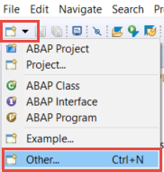
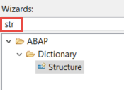
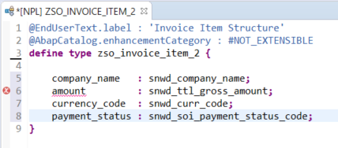
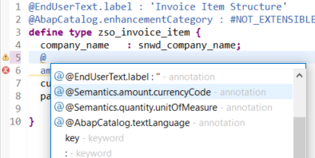
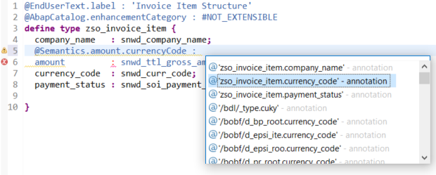

## Prerequisites  
 - **Proficiency:** Beginner
 - **Tutorials:**
[Display database content and run SQL queries](http://www.sap.com/developer/tutorials/abap-display-data-queries.html)


## Next Steps
[Create an ABAP class](https://www.sap.com/developer/tutorials/abap-dev-create-new-class.html)

## Details
### You will learn  
You will learn how to create an Data Dictionary structure. You will then use this structure in a global ABAP class to retrieve data from the database. (The structure provides a type for the table.)

### Time to Complete
**5 Min**

---

[ACCORDION-BEGIN [Step 1: ](Create a global Data Dictionary structure)]

Now you will create a global Data Dictionary ("DDIC") structure: In the toolbar, select the *New* icon, then choose **Other...**:



[DONE]
[ACCORDION-END]

[ACCORDION-BEGIN [Step 2: ](Filter the list of object types)]

In the wizard that appears, filter the list of ABAP repository object types by entering `**struct**`.



[DONE]
[ACCORDION-END]

[ACCORDION-BEGIN [Step 3: ](Enter name and description)]

Then enter the following and choose **Finish**.
•	Name = **`ZSO_INVOICE_ITEM`**
•	Description = for example, **Invoice item structure**


> A new text editor is opened showing the content of the newly created Data Dictionary structure.

[DONE]
[ACCORDION-END]

[ACCORDION-BEGIN [Step 4: ](Remove the generated component)]

Remove the generated example component `component_to_be_changed` from the structure:


[DONE]
[ACCORDION-END]

[ACCORDION-BEGIN [Step 5: ](Define fields for the structure)]

In the item structure, define the fields `company_name`, `amount`, `currency_code`, and `payment_status` as follows:
```ABAP
  company_name   : snwd_company_name;
  amount         : snwd_ttl_gross_amount;
  currency_code  : snwd_curr_code;
  payment_status : snwd_soi_payment_status_code;
```




> The editor shows a syntax error because the amount has not yet been bound to the currency code.

[DONE]
[ACCORDION-END]

[ACCORDION-BEGIN [Step 6: ](Bind amount to currency code annotation)]

To bind the amount to the currency code:
a. Add a new line in front of the field **`amount`**, add **`@`** and open code completion, by entering  **Ctrl+Space**. A list of all possible annotations is shown.

b. Select the annotation **`@Semantics.amount.currencyCode`**.



c. Trigger the code completion again: enter **`: '`** after `@Semantics.amount.currencyCode`, then choose **Ctrl+Space**, then choose the annotation **`zso_invoice_item.currency_code`**:



d. Finally choose **Save (Ctrl+S)**

> You should no longer get a syntax error.

[DONE]
[ACCORDION-END]

[ACCORDION-BEGIN [Step 7: ](Check and activate the structure)]

Back in the structure `ZSO_INVOICE_ITEM`, choose **Check ABAP Development Object (Ctrl+F2)**. Then choose **Activate (Ctrl+F3)**.

> The Data Dictionary structure `ZSO_INVOICE_ITEM` is now activated.

Your code should look like this:

```ABAP
@EndUserText.label : 'Invoice Item Structure'
@AbapCatalog.enhancementCategory : #NOT_EXTENSIBLE
define type zso_invoice_item {
  company_name   : snwd_company_name;
  @Semantics.amount.currencyCode : 'zso_invoice_item.currency_code'
  amount         : snwd_ttl_gross_amount;
  currency_code  : snwd_curr_code;
  payment_status : snwd_soi_payment_status_code;

}

```

[DONE]
[ACCORDION-END]

---

## Next Steps
- [Create an ABAP class](https://www.sap.com/developer/tutorials/abap-dev-create-new-class.html)
