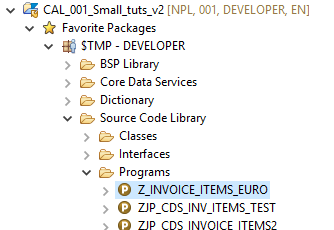
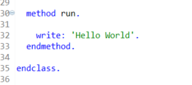

## Prerequisites  
 - **Proficiency:** Beginner
 - **Tutorials:**

[Create a CDS view](https://www.sap.com/developer/tutorials/abap-dev-adt-create-cds-view.html)

## Next Steps
 - Select a tutorial from the [Tutorial Navigator](http://www.sap.com/developer/tutorial-navigator.html) or the [Tutorial Catalog](http://www.sap.com/developer/tutorials.html)

## Details
### You will learn  
In this tutorial you will learn how to to consume the CDS view in the SAP List Viewer ("ALV") with Integrated Data Access (ALV with IDA). ALV with IDA lets you display views and tables that contain very large quantities of data.

### Time to Complete
**15 Min**  

---

[ACCORDION-BEGIN [Step 1: ](Open the ABAP program)]
Open the ABAP program you created in the previous tutorial, [Create and run an ABAP program](https://www.sap.com/developer/tutorials/abap-create-basic-app.html):




[ACCORDION-END]

[ACCORDION-BEGIN [Step 2: ](Replace with IDA)]

You will now replace the implementation of the RUN method with a new implementation:

a.	Delete the WRITE statement: Delete the whole line, by placing the cursor somewhere in the WRITE statement and choosing Ctrl+D:



b.  Now create an ALV with IDA for your CDS view `Z_Invoice_Items` and display the ALV in full screen:

`cl_salv_gui_table_ida=>create_for_cds_view( 'Z_Invoice_Items' )->fullscreen( )->display( ).`


c.	Choose **Save (Ctrl+S)**  and **Activate (Ctrl+F3)**.
d.	Execute your program by choosing **Execute (F8)**.

> The invoice items are displayed in ALV with IDA.


[ACCORDION-END]


[ACCORDION-BEGIN [Step 3: ](Display the mouse-over information)]

Display the mouse-over information for the Paid column by positioning the cursor on the column heading.
**NOTE**: Notice that, in our case, the information is incorrect.
We will change this information in the CDS view using an annotation.


[ACCORDION-END]

[ACCORDION-BEGIN [Step 4: ](Set the mouse-over information with an annotation)]

**NOTE: Write the annotation before the CASE statement.**

a. Set the mouse-over information for the `payment_status` to:

 `@EndUserText.quickInfo: 'Paid' `

 b. Choose **Save (Ctrl+S)**  and **Activate (Ctrl+F3)**.


[ACCORDION-END]

[ACCORDION-BEGIN [Step 5: ](Execute the program)]

Execute `ZCDS_INVOICE_ITEMS_EURO` again by choosing **Execute (F8)**.

> The mouse-over information for the Paid column has been changed.

Your code should look like this:

```ABAP
*&---------------------------------------------------------------------*
*& Report zjp_cds_inv_items_test
*&---------------------------------------------------------------------*
*&
*&---------------------------------------------------------------------*
REPORT zjp_cds_inv_items_test.

class lcl_main definition create private.

  public section.
    CLASS-METHODS create
      RETURNING
        value(r_result) TYPE REF TO lcl_main.

    methods run.

  protected section.
  private section.

endclass.

class lcl_main implementation.

  method create.
    create object r_result.
  endmethod.

  method run.

cl_salv_gui_table_ida=>create_for_cds_view( 'Z_Invoice_Items' )->fullscreen( )->display( ).
  endmethod.
endclass.

start-of-selection.

lcl_main=>create( )->run( ).

```

[ACCORDION-END]

## Next Steps

- Select a tutorial from the [Tutorial Navigator](http://www.sap.com/developer/tutorial-navigator.html) or the [Tutorial Catalog](http://www.sap.com/developer/tutorials.html)
