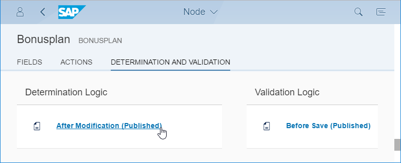
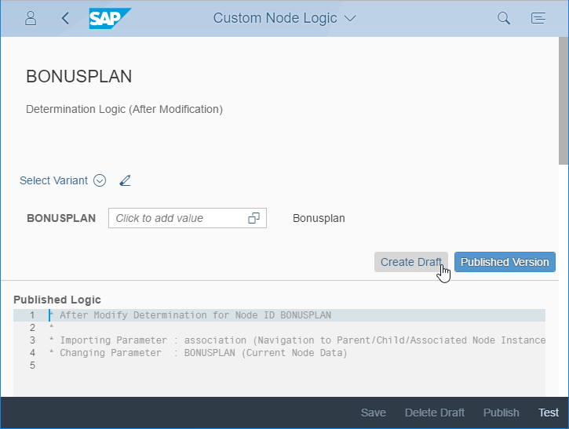
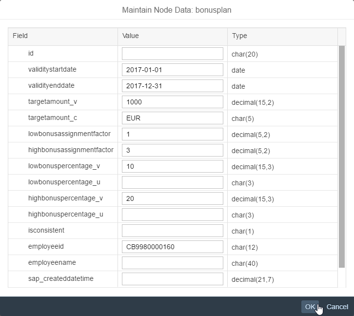
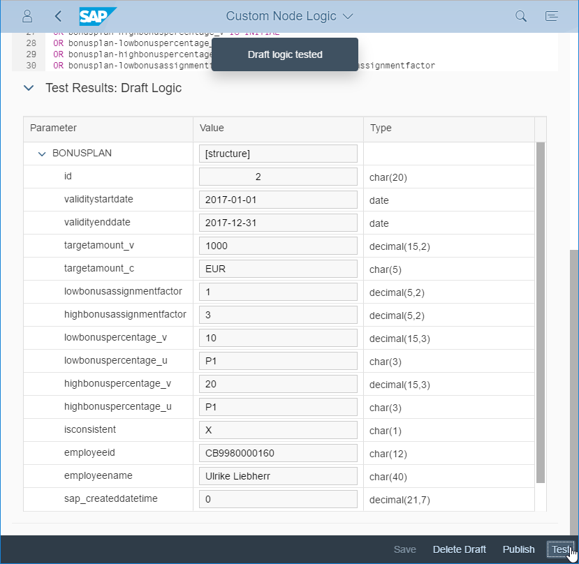

## Prerequisites  
 - **Proficiency:** Beginner
 - **Tutorials:** [Creating a UI for a Custom Business Object](https://www.sap.com/developer/tutorials/abap-extensibility-cbo-ui-generation.html)
 - **Authorizations:** Your user needs a business role with business catalog **Extensibility** (ID: `SAP_CORE_BC_EXT`)

## Next Steps
 - [Adapting the UI of a Custom Business Object](https://www.sap.com/developer/tutorials/abap-extensibility-cbo-ui-adaptation.html)

## Details

### You will learn  
In the preceding tutorial you created a custom business object, its simple data structure, persistence and application UI.
Data could only be provided by the UI. Now you'll implement logic to set some data from the backend only and to check all data of an instance.
You will also learn how to ease development and test already while doing it.

At the end your application will set some data automatically and reject a save with an error message for the causing inconsistencies.

**Example**
A several tutorials spanning example will show extensibility along custom Bonus Management applications.

In the first parts a Manager wants to define business objects "Bonus Plan" for employees. A Bonus Plan is there to save employee specific rules for bonus entitlement.

### Time to Complete
**20 Min**

---
[ACCORDION-BEGIN [Step 1: ](Make key field Read-Only)]
As there was no backend implementation to set the mandatory key field **`ID`** so far, we were forced to set it from the UI to be able to save instances.
Now, as we will implement the logic to set the ID in backend and nowhere else, we will set that key field to Read-Only for the UI.

`1.` Open the business object **Bonus Plan** in Custom Business Objects application
2. Start Edit Mode by executing the **Edit Draft** action.
3. **Go to Fields and Logic**.
4. **Check** the Read-Only box for key field **`ID`**.

5. Go back via the application's **Back** button.


[ACCORDION-END]
[ACCORDION-BEGIN [Step 2: ](Enable logic implementation)]

`1.` Still editing the custom business object **Bonus Plan**'s definition, **Check** the box for **Determination and Validation**

2. **Publish** the business object definition.

Now you are enabled to implement **determination logic** which is called **after each modification** to a Bonus Plan instance from the UI, as well as **validation logic** which is called **before each save** of an instance.


[ACCORDION-END]
[ACCORDION-BEGIN [Step 3: ](Start logic implementation)]
For **published** Custom Business Objects **without a Draft version** you can implement logic.

1. **Go to Fields and Logic**

2. Enter the After Modification Event Logic which is a Determination Logic.

3. In the logic view you initially see the not editable empty published version.
Click the **Create Draft** action.

An editable copy of the published version appears left to it. With the **Draft Version** and **Published Version** actions you can decide what coding to see.


[ACCORDION-END]
[ACCORDION-BEGIN [Step 4: ](Implement After Modification: fix values)]
Implement After Modification event with following fix value functionality:

- Set the key field `ID` if still initial.
>**Hint:** Changing Parameter `bonusplan` enables you to read current node data and change it.
**Hint:** You can read existing Bonus Plan data via the CDS View that is named as the Business Object's Identifier (here: `YY1_BONUSPLAN`).
**Hint:** With the key combination **CTRL + Space** you can access the very helpful code completion.


```abap
* set ID
IF bonusplan-id IS INITIAL.
   SELECT MAX( id ) FROM yy1_bonusplan INTO @DATA(current_max_id).
   bonusplan-id = current_max_id + 1.
ENDIF.
```
- Set the Unit of Measure for the Bonus Percentages to `P1` which is the code for % (percent)

```abap
* set percentage unit
bonusplan-lowbonuspercentage_u = bonusplan-highbonuspercentage_u = 'P1'.
```

- Determine and set the Employee Name from the Employee ID
>**Hint:** Extensibility offers Helper class `CL_ABAP_CONTEXT_INFO` with method `GET_USER_FORMATTED_NAME` that needs a user ID to return its formatted name

```abap
* set Employee Name
IF bonusplan-employeeid IS NOT INITIAL.
   bonusplan-employeename = cl_abap_context_info=>get_user_formatted_name( bonusplan-employeeid ).
ENDIF.
```


[ACCORDION-END]

[ACCORDION-BEGIN [Step 5: ](Implement After Modification: consistency check)]
In dependence on following checks, set the `isconsistent` property.

- Check that `ValidityStartDate` and `ValidityEndDate` are set and that `ValidityStartDate` is earlier in time than `ValidityEndDate`.
- Check that Factors and Percentages are set correctly (all > 0, Percentages < 100, `LowBonusAssignmentFactor` < `HighBonusAssignmentFactor`)
- Check that Employee ID is set

```ABAP
* consistency check START
IF bonusplan-validitystartdate IS INITIAL
 OR bonusplan-validityenddate IS INITIAL
 OR bonusplan-validitystartdate GE bonusplan-validityenddate
 OR bonusplan-lowbonusassignmentfactor IS INITIAL
 OR bonusplan-highbonusassignmentfactor IS INITIAL
 OR bonusplan-lowbonuspercentage_v IS INITIAL
 OR bonusplan-highbonuspercentage_v IS INITIAL
 OR bonusplan-lowbonuspercentage_v GE 100
 OR bonusplan-highbonuspercentage_v GE 100
 OR bonusplan-lowbonusassignmentfactor GE bonusplan-highbonusassignmentfactor
 OR bonusplan-employeeid IS INITIAL.
    bonusplan-isconsistent = abap_false.
ELSE.
    bonusplan-isconsistent = abap_true.
ENDIF.
* consistency check END
```


[ACCORDION-END]
[ACCORDION-BEGIN [Step 6: ](Test the logic during development)]

On top of the coding you can maintain runtime data for the current node structure which represents the data before running the test functionality. This data can also be saved as variant for later usages.

1. Click the value help to add test data


2. Enter following data

| Field	Name | Field Value |
|------------|-------------|
| `validitystartdate` | `2017-01-01` |
| `validityenddate` | `2017-12-31` |
| `targetamount_v` | `1000` |
| `targetamount_c` | `EUR` |
| `lowbonusassignmentfactor` | `1` |
| `highbonusassignmentfactor` | `3` |
| `lowbonuspercentage` | `10` |
| `highbonuspercentage` | `20` |
| `employeeid` | `<any>` |

`employeeid` `<any>` shall be the one of a sales person that created sales orders with a Net Amount of more than 3000.00 EUR in 2016 and that are completed.

This will look as follows.


3. Execute the **Test** action and you can see the node data after your logic was executed.

You can see that your logic works as `id`, `*percentage_u` fields and `employename` are filled and `isconsistent` is 'X'.


[ACCORDION-END]

[ACCORDION-BEGIN [Step 7: ](Implement Before Save)]

1. **Implement** Before Save event with following functionality

- If the bonus plan is consistent, it can be continued to save, if not save shall be rejected. In case of save no further processing is needed and logic can be left.
>**Hint:** Exporting parameter valid must be set to true for save and to false for save rejection

```abap
* decide about save rejection
IF bonusplan-isconsistent EQ abap_true.
    valid = abap_true.
    RETURN.
ELSE.
    valid = abap_false.
ENDIF.
```

- If the bonus plan is not consistent, write the first found error into the message and end the logic processing.
These are the possible errors in detail:
      - `ValidityStartDate` and `ValidityEndDate` must be set
      - `ValidityStartDate` must be earlier in time than `ValidityEndDate`
      - Factors and Percentages must be > 0
      - Percentages must be < 100
      - LowBonusAssignmentFactor must be < HighBonusAssignmentFactor
      - Empoyee ID must be set

```abap
* consistency error message START
IF bonusplan-validitystartdate IS INITIAL OR bonusplan-validityenddate IS INITIAL.
    message = 'Validity Period must not be empty.'.
    RETURN.
ELSEIF bonusplan-validitystartdate GE bonusplan-validityenddate.
    CONCATENATE 'Validity End Date' bonusplan-validityenddate 'must be later than Validity Start Date' bonusplan-validitystartdate '!' INTO message SEPARATED BY space.
    RETURN.
ENDIF.

IF bonusplan-targetamount_v IS INITIAL.
    message = 'Target Amount must be over 0!'.
    RETURN.
ENDIF.

IF bonusplan-targetamount_c IS INITIAL.
    message = 'Target Amount Currency must be set!'.
    RETURN.
ENDIF.

IF bonusplan-lowbonusassignmentfactor IS INITIAL
 OR bonusplan-highbonusassignmentfactor IS INITIAL.
    message = 'Assignment Factors must be over 0!'.
    RETURN.
ENDIF.

IF bonusplan-lowbonuspercentage_v IS INITIAL
 OR bonusplan-highbonuspercentage_v IS INITIAL.
    message = 'Percentages must be over 0!'.
    RETURN.
ENDIF.

IF bonusplan-lowbonuspercentage_v GE 100
 OR bonusplan-highbonuspercentage_v GE 100.
    message = 'Percentage must be below 100!'.
    RETURN.
ENDIF.

IF bonusplan-lowbonusassignmentfactor GE bonusplan-highbonusassignmentfactor.
    message = 'Low Bonus Factor must be smaller than High Bonus Factor!'.
    RETURN.
ENDIF.

IF bonusplan-employeeid IS INITIAL.
    message = 'Employee ID must be set!'.
    RETURN.
ENDIF.
* consistency error message  END
```

`2.` **Publish** the Before Save Logic


[ACCORDION-END]
[ACCORDION-BEGIN [Step 8: ](Test via the UI)]
Once ensured that both logic implementations were successfully published you can start testing the Application like an end user via the UI.

1. **Open** the Bonus Plan application
2. **Open** the Bonus Plan with ID `1`
3. **Edit** this Bonus Plan
4. **Enter** value `10` into field **Low Bonus Percentage**
5. **Save** the Bonus plan. You can see that your business logic works as the Percentage Units and the Employee Name get filled, but save fails due to the validation error messages for missing percentages.
6. **Enter** value `20` into field **High Bonus Percentage**
7. **Save** the Bonus Plan. Now it will not be rejected.


[ACCORDION-END]
---
## Next Steps
 - [Adapting the UI of a Custom Business Object](https://www-qa.sap.com/developer/tutorials/abap-extensibility-cbo-ui-adaptation.html)
