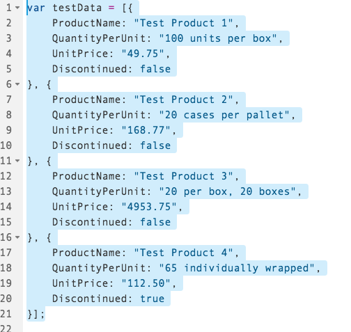

## Prerequisites  
 - **Proficiency:** Beginner 
 - **Tutorials** Step 4 [Separate the JavaScript and CSS Files](http://go.sap.com/developer/tutorials/angular-separate-files.html)

## Next Steps
 - **Tutorials** Step 6 [Add a Header and Detail Modal Dialog](http://go.sap.com/developer/tutorials/angular-add-header-detail-dialog.html)
 - 

## Details
### You will learn  
In this tutorial series, we will explore another technology for Single Page Application (SPA) development - AngularJS (or just Angular).  Angular is a popular web framework in North America, and is used by many companies for both internal and client-facing systems.  These tutorials will parallel our SAPUI5 tutorials, building a visual interface using Angular, and connecting it to an ODATA back end service.

### Time to Complete
**15 Min**.

---
#### AngularJS series
**Step 5**: Start to work with the `$http` service.  This service provides a way to asynchronously get data from a server.  We will be using the [public Northwind test data service](http://www.odata.org/) to provide this test data.

---

### Change the test data to the ODATA source

1.  Remove the test data from the JavaScript file.

    In the `main.js` file, select all of the test data (starting with `var testData =`, and delete it.
    
    >Don't forget to save your file.
 
       
    
2.  Change the line that defines the `productList` to start with an empty array.

    Select the line `$scope.productList = testData;`, and change it to
    
    ```javascript
    $scope.productList = [];
    ```

       

3.  Now we want to add in the HTML call to get the ODATA information.  To do that, we will use the `$http` service to get the data.  

    Change the `helloController` function to get the `$http` service from Angular
    
    ```javascript
    function helloController($scope, $http) {
    ```

       
    
4.  Now, add in the `$get` method.  

    Update your `helloController` function and add this code at the bottom:
    
    ```javascript
    var odataUrl = "//services.odata.org/V3/Northwind/Northwind.svc/";
	
	$http.get(odataUrl + "Products")
		.then( function(response) {
				$scope.productList = response.data.value;
			}, 
			function(error){
				alert("An error occurred");
			}
		);
    ```

       
    
5.  Run your application.  The data on the screen should now contain 20 rows, and look like this:

       


## Additional Information

#### Angular Services

- [`$http`](https://docs.angularjs.org/api/ng/service/$http)
- [`$get`](https://docs.angularjs.org/api/ng/service/$http#get) (which is a shortcut for `$http`)

## Next Steps
 - **Tutorials** Step 6 [Add a Header and Detail Modal Dialog](http://go.sap.com/developer/tutorials/angular-add-header-detail-dialog.html)
