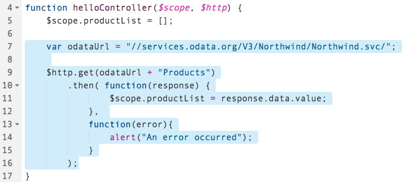

## Prerequisites  
 - **Proficiency:** Beginner 
#### AngularJS Series
 - Step #1 [AngularJS Getting Started](http://go.sap.com/)
 - Step #2 [Create the Bootstrap Template](http://go.sap.com/)
 - Step #3 [Add the AngularJS JavaScript](http://go.sap.com/) 
 - Step #4 [Separate the JavaScript and CSS Files](http://go.sap.com/)

## Next Steps
 - Step #6 [Add a Header and Detail Modal Dialog](http://go.sap.com/)  

## Details
### You will learn  
Developers writing the HTML5 front-end to modern web applications have many choices of development technologies and frameworks.  SAP offers SAPUI5 for front-end development, but it is not the only choice for developing rich SPA (Single Page Applications) on the web.

In this tutorial series, we will explore another technology for SPA development - AngularJS (which we will just call Angular).  Angular is a popular web framework, and is used by many companies.  This series will build a simple web front end, and connect that to ODATA services.
### Time to Complete
**15 Min**.

---
In the fifth tutorial, we will start to work with the `$http` service.  This service provides a way to asynchronously get data from a server.  We will be using the [public Northwind test data service](http://www.odata.org/) to provide this test data.

### Change the test data to the ODATA source

1.  Remove the test data from the JavaScript file.

    In the `main.js` file, select all of the test data (starting with `var testData =`, and delete it.
    
    >Don't forget to save your file.
 
       
    
2.  Change the line that defines the `productList` to start with an empty array.

    Select the line `$scope.productList = testData;`, and change it to
    
    ```javascript
    $scope.productList = [];
    ```

       

3.  Now we want to add in the HTML call to get the ODATA information.  To do that, we will use the `$http` service to get the data.  

    Change the `helloController` function to get the `$http` service from Angular
    
    ```javascript
    function helloController($scope, $http) {
    ```

       
    
4.  Now, add in the `$get` method.  

    Update your `helloController` function and add this code at the bottom:
    
    ```javascript
    var odataUrl = "//services.odata.org/V3/Northwind/Northwind.svc/";
	
	$http.get(odataUrl + "Products")
		.then( function(response) {
				$scope.productList = response.data.value;
			}, 
			function(error){
				alert("An error occurred");
			}
		);
    ```

       
    
5.  Run your application.  The data on the screen should now contain 20 rows, and look like this:

       


## Additional Information

#### Angular Services

- [`$http`](https://docs.angularjs.org/api/ng/service/$http)
- [`$get`](https://docs.angularjs.org/api/ng/service/$http#get) (which is a shortcut for `$http`)

## Next Steps
 - **Tutorials:**  Step #6 [Add a Header and Detail Modal Dialog](http://go.sap.com/) 
