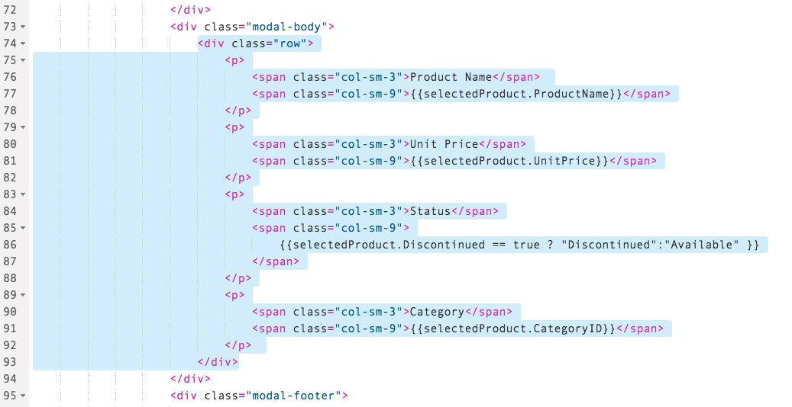
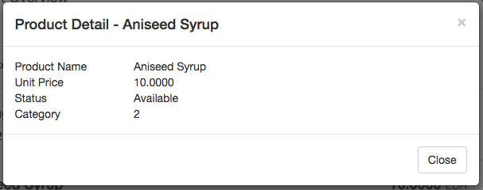
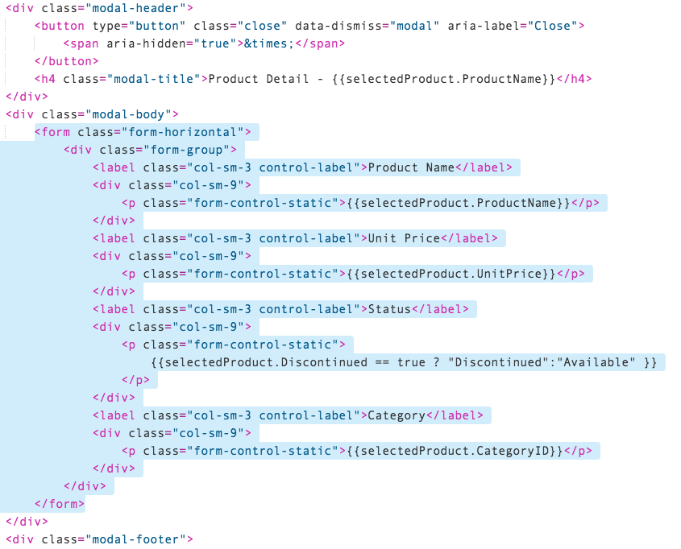
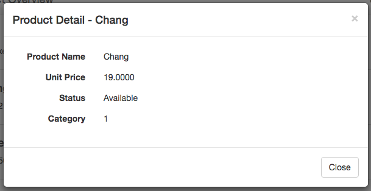
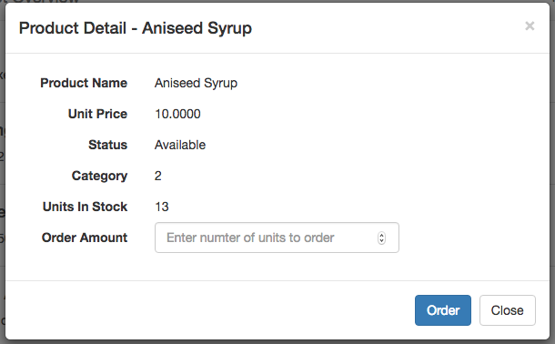
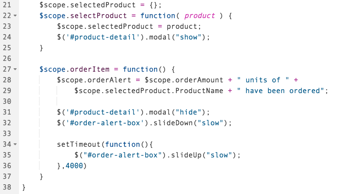
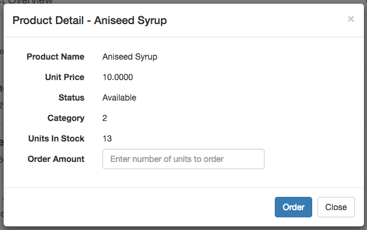
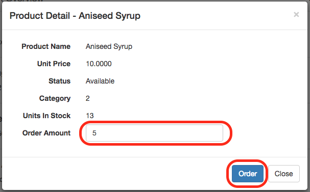

## Prerequisites  
 - **Proficiency:** Beginner 
 - **Tutorials** Step #6 [Add a Header and Detail Modal Dialog](http://go.sap.com/developer/tutorials/angular-add-header-detail-dialog.html)
 
## Next Steps
 - This is the end of the series - for now.  More are coming, stay tuned!

## Details
### You will learn  
In this tutorial series, we will explore another technology for Single Page Application (SPA) development - AngularJS (or just Angular).  Angular is a popular web framework in North America, and is used by many companies for both internal and client-facing systems.  These tutorials will parallel our SAPUI5 tutorials, building a visual interface using Angular, and connecting it to an ODATA back end service.

### Time to Complete
**15 Min**.

---
#### AngularJS series
**Step 6**: Set up [Bootstrap forms](https://getbootstrap.com/css/#forms) for our application.  We will use the form in our new detail modal dialog box, to organize the information.

---

### Update the Modal with a Form

Our existing modal dialog box is not well organized.  In order to get all of the information lined up, and to prepare for using input fields, we will add the form concept.  In our case, we will use labels and static text fields.  Later, we will add an input field and an "order" button.  (The order button won't actually do anything, other than just look nice.)

> **Note** We are about to use a `.row` class inside a dialog box.  This is one of the great features of Bootstrap.  You can nest a `.row` inside of another `.row`.  Each row will have 12 columns, and the columns will be divided using the existing space.  
> 
> For example, start with a page with  two columns, each size 6 (or 1/2 of the screen). If you put a row inside one of the columns, there will be 12 new columns inside that 1/2 of the screen.  Each column in that nested row will take up 1/24 of the screen (or 1/2 * 1/12).  It's not exactly 1/24, because of margins and padding, but that's the general idea! 

First, let's divide the modal body in to two panels, one for the the labels, and one for the data.

1.  Open your `index.html` file, and scroll down to the modal dialog box (`<div class="modal fade"...`)

    In the `<div class="modal-body">` section, **replace** the existing HTML with this new HTML:
    
    > **Note** If you look closely, you will realize we are cheating a little bit with this HTML.
    >
    > We don't start a new row for each line here.  Why?  Because Bootstrap has another feature, called *column wrapping*.  When a column extends off the right side, it just starts a new line.  Since each row here uses up 3 columns for the label + 9 columns for the data (=12 columns per row), each line wraps to the next line.  
    >
    > Go ahead and change the `col-sm-9` to something like `col-sm-4`, and see what happens to the rows!
    
    ```html
    <div class="row">
    	<p>
    		<span class="col-sm-3">Product Name</span> 
    		<span class="col-sm-9">{{selectedProduct.ProductName}}</span>
    	</p>
    	<p>
    		<span class="col-sm-3">Unit Price</span>
    		<span class="col-sm-9">{{selectedProduct.UnitPrice}}</span>
    	</p>
    	<p>
    		<span class="col-sm-3">Status</span>
    		<span class="col-sm-9">
    			{{selectedProduct.Discontinued == true ? "Discontinued":"Available" }}
    		</span>
    	</p>
    	<p>
    		<span class="col-sm-3">Category</span>
    		<span class="col-sm-9">{{selectedProduct.CategoryID}}</span>
    	</p> 
    </div>    
    ```

    

    

2.  Now run the application.  Click on a row, and your dialog box will be neatly divided in to two columns.

    

3.  OK, now that we have the columns worked out, we will introduce a `.form`.  

    In our case, we are going to use a horizontal form (or `.form-horizontal`) so that our labels and our fields are all on the same line.
    
    In your `index.html` file, in your modal dialog, **replace** the inside of your `<div class="modal-body">` with this HTML:
    
    ```html
    <form class="form-horizontal">
        <div class="form-group">
        	<label class="col-sm-3 control-label">Product Name</label>
        	<div class="col-sm-9">
            	<p class="form-control-static">{{selectedProduct.ProductName}}</p>
            </div>
        	<label class="col-sm-3 control-label">Unit Price</label>
        	<div class="col-sm-9">
            	<p class="form-control-static">{{selectedProduct.UnitPrice}}</p>
            </div>
        	<label class="col-sm-3 control-label">Status</label>
        	<div class="col-sm-9">
            	<p class="form-control-static">
            		{{selectedProduct.Discontinued == true ? "Discontinued":"Available" }}
            	</p>
            </div>
        	<label class="col-sm-3 control-label">Category</label>
        	<div class="col-sm-9">
            	<p class="form-control-static">{{selectedProduct.CategoryID}}</p>
            </div>
        </div>
    </form>
    ```
    
    
    
4.  Run your application.  When you click on a row, the display will now show the dialog box like this:

    

### Adding an input field to our form
Now that we have a form, we can add an "order" field to our application.  The order field will not do anything on the back end, but we will use it to show how to add input fields to a form.

We will also use two of the Products fields in order to validate the request.  We will use `UnitsInStock` to determine how many units we can order, and the field `Discontinued` will enable or disable our ability to order.

Let's start by adding in a line to show `UnitsInStock`.

1.  Open the `index.html` file, scroll down to the `<form>` tag, and add this HTML to the bottom of the form body.

    ```html
    <label class="col-sm-3 control-label">Units In Stock</label>
    <div class="col-sm-9">
    	<p class="form-control-static">{{selectedProduct.UnitsInStock}}</p>
    </div>
    ```
    

2.  Next, we will add a row to enter the number of units to order.  Add the following HTML to the bottom of the modal body, right under the last item.

    ```html
    <label class="col-sm-3 control-label">Order Amount</label>
    <div class="col-sm-6">
    	<input type="number" class="form-control" id="orderAmount" 
    	   placeholder="Enter number of units to order"/>
    </div>
    ```

    
        
3.  Now we need a button to submit the order.  Scroll down a little to the `<div class="modal-footer">`, and then add the following HTML **above** the existing `<button>`

    ```html
    <button type="button" class="btn btn-primary">Order</button>
    ```
    
    

4.  Run your application.  You will see the new static field, the new input field, and the button.

    

### Adding logic to your new input field
The input field is in the form, but it's not connected to anything.  Next, add in the Angular logic to order the items and display an alert when the items are ordered.

1.  Open your `main.js` file, and scroll to the bottom of the `helloController` method.  Add the following JavaScript to the **top** of the method:

    ```javascript
    $scope.orderAmount = "";
    $scope.orderAlert = "";
    ```
    
    
    
2.  Add the following code to the **bottom** of your `helloController` method

    ```javascript
    $scope.orderItem = function() {
        $scope.orderAlert = $scope.orderAmount + " units of " + 
        	$scope.selectedProduct.ProductName + " have been ordered";
        	
        $('#product-detail').modal("hide");
        $('#order-alert-box').slideDown("slow");
        
        setTimeout(function(){
            $("#order-alert-box").slideUp("slow");
        },4000)
    }
    ```

    
    
3.  Finally, modify the `selectedProduct` function, adding the following line:

    ```javascript
    $scope.orderAmount = "";
    ```

    
    
4.  Next, we need to bind the `orderAmount` in to our code, and then hook up the new button.  Open your `index.html` file, and **add** the following attribute to your `<input type="number"` element:

    ```html
    ng-model="orderAmount"
    ```

    
    
5.  Scroll down to the modal footer.  In the first `<button>` element, **add** the following attribute:

    ```html
    ng-click="orderItem()"
    ```

    
    
6.  Now run your application.  When you click on a row, you will see the following dialog box.  

    
    
7.  In the dialog box, enter a number in the Order Amount field, then click **Order**.

    

8.  The following alert box will appear on the screen, confirming the order.  And, after 4 seconds, it will scroll up and disappear!

    


## Additional Information

#### Bootstrap layout items:

- [Bootstrap Forms](https://getbootstrap.com/css/#forms) - More details about forms
- [Bootstrap alerts](https://getbootstrap.com/components/#alerts) - Adds an alert when a button is pressed

#### jQuery tools

- [`slideDown`](https://api.jquery.com/slidedown/) - slide the alert box down
- [`slideUp`](https://api.jquery.com/slideup/) - how we scrolled the box back up after we are finished with it

#### JavaScript functions 

- We used the [`setTimeout()`](http://www.w3schools.com/jsref/met_win_settimeout.asp) JavaScript function to add a delay before the alert box disappeared.  `setTimeout()` puts an event on the event queue after a specified delay (in milliseconds).  This is the best way to delay something, as the user will not be blocked while waiting for the timer to expire. 

## Next Steps
 - This is the end of the series - for now.  More are coming, stay tuned!
