## Prerequisites  
 - **Proficiency:** Beginner

## Details
### You will learn  
  - Create a prototype application with SAP Build's gallery and the easy to use drag-and-drop interface.

### Time to Complete
**25 Min**

---

[ACCORDION-BEGIN [Step 1: ](View Gallery applications)]
Log in to your [SAP Build account](https://www.build.me/splashapp/).

From the top menu bar, select **Gallery**. This will take you to the listing of all available template application prototypes you can use with SAP Build. The Gallery allows you to quick start an application prototype without having to build it from scratch.

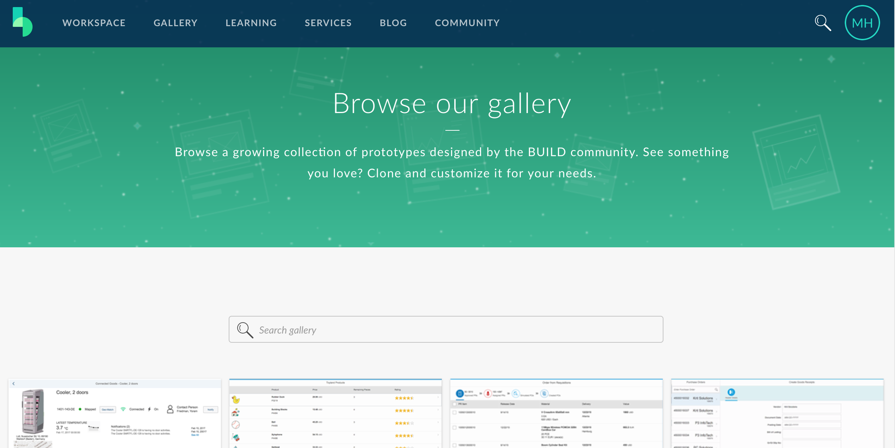

[DONE]
[ACCORDION-END]

[ACCORDION-BEGIN [Step 2: ](Select a Gallery app)]
In the **Gallery**, find the **search bar** and type in _inventory_.

This will filter down the list of applications. Select the **Inventory Dashboard** application from the filtered list.

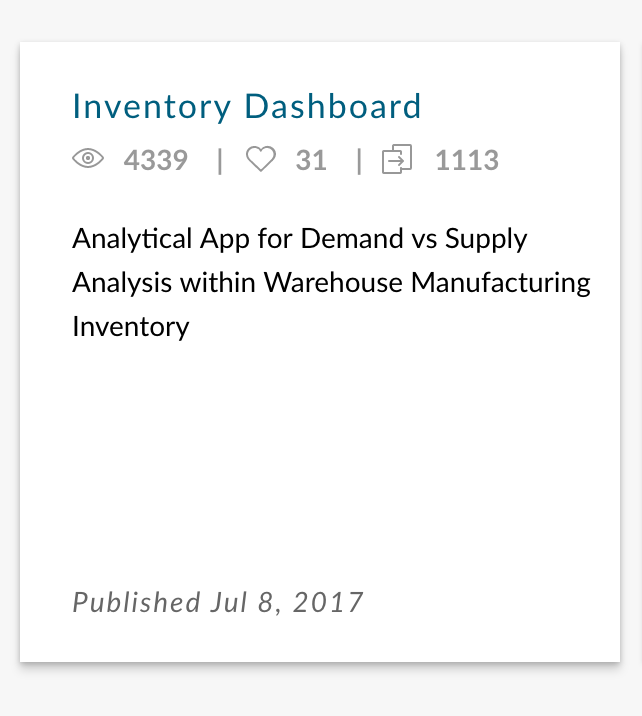

The prototype overview will provide you details about what screens are included and their navigation and what files are included.

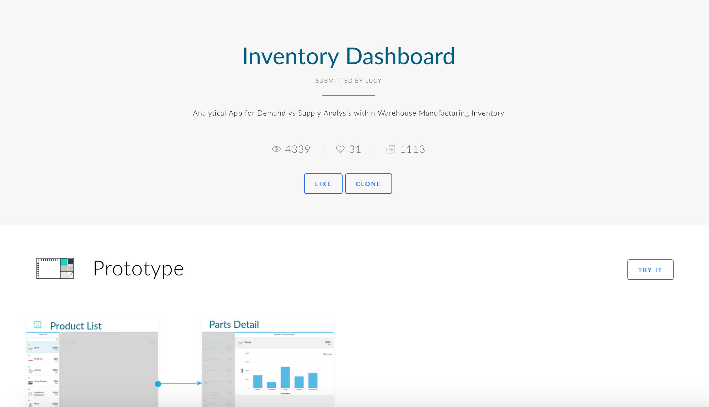

[VALIDATE_2]
[ACCORDION-END]

[ACCORDION-BEGIN [Step 3: ](Clone a prototype)]
Cloning a prototype will add the prototype to your project collection. Once in your collection, you can make edits and modifications to your local version.

On the prototype overview, click the **Clone** button under the basic details.

Verify that you want clone the application prototype when prompted by click **Clone**.

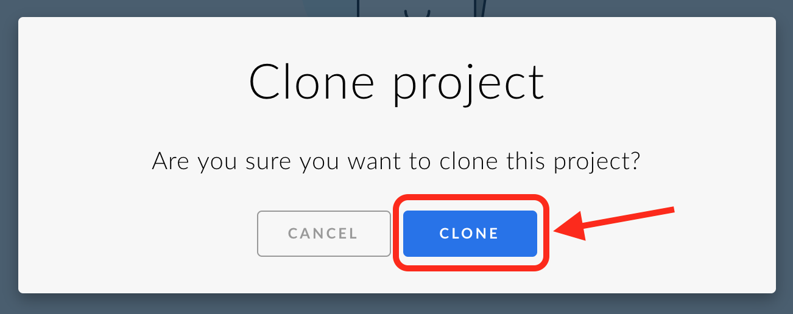

When the clone is complete, SAP Build will let you know. When prompted, click **OK** to view the cloned prototype in your workspace.

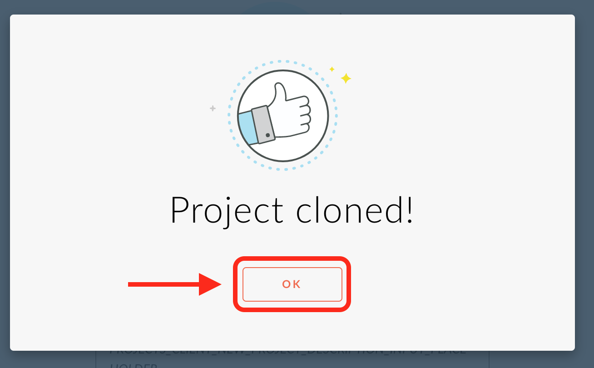

[DONE]
[ACCORDION-END]

[ACCORDION-BEGIN [Step 4: ](Modify the prototype)]
To open the UI editor, click on one of the screens under the **Prototype** section.

Here you can search for controls, drag and drop them onto the screen, and modify properties of the controls. You can also re-order data and remove controls that you don't need.

[DONE]
[ACCORDION-END]

[ACCORDION-BEGIN [Step 5: ](Add a table)]
To add a table to the main chart area, start by clicking the grayed-out chart area. This will select this view.

On the left hand side, you will find a _controls_ list. Search for **Table** in this list.

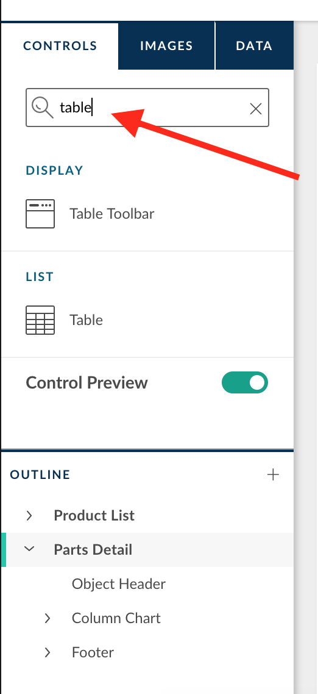

Find the *Table* control under the **List** control types.

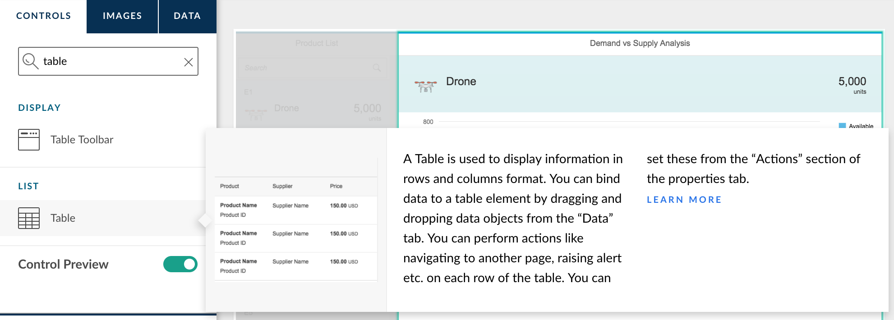

**Drag and drop** the control to underneath the chart.

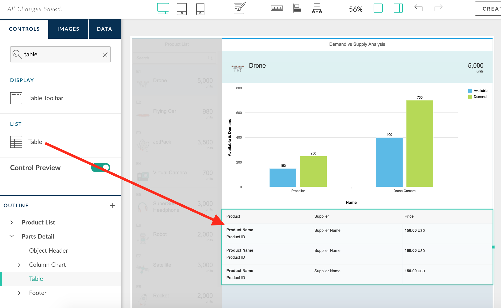

[VALIDATE_5]
[ACCORDION-END]

[ACCORDION-BEGIN [Step 6: ](Add columns to the table)]
You can customize the control from the GUI interface. To add columns, **right click** on a column in the table.

This will bring up a local menu bar. Select **Add Column Left** from the options to create a new column.

**Repeat this action.** You should have 2 new columns.

[DONE]
[ACCORDION-END]

[ACCORDION-BEGIN [Step 7: ](Rename the Column Headers)]
The names of the columns can also be modified in the GUI. To do this, **double click on the header name**.

This will highlight the header name and make it editable. Rename the headers to match the names below.

**Part ID** | **Image** | **Part's Name** | **Availability** | **Demand**
--- | --- | --- | --- | ---

[DONE]
[ACCORDION-END]

[ACCORDION-BEGIN [Step 8: ](Add controls to the table cells)]
In the controls list on the left hand side, search for **Label**.

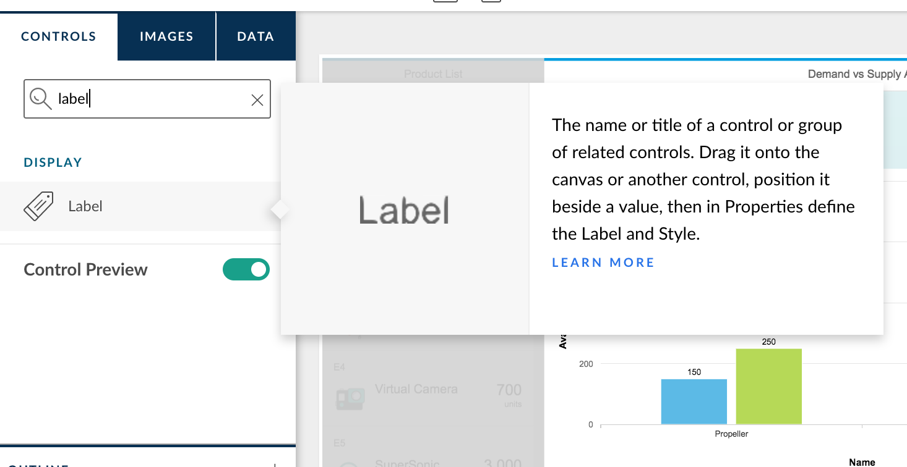

**Drag and drop** the label control into the _first column first cell_.

In the control list, search for **Image**.

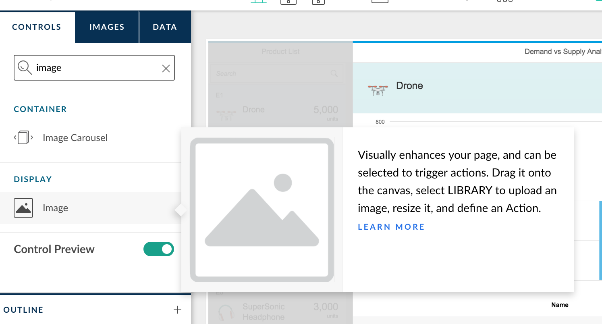

**Drag and drop** the image control into the _second column first cell_.

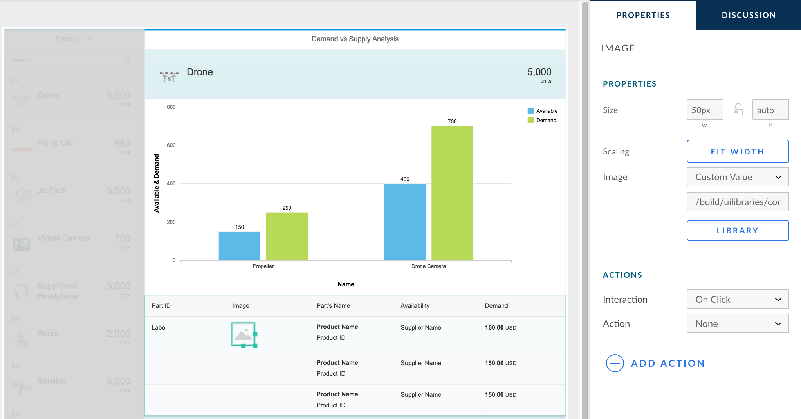

You can modify control properties in the right hand side bar. In the _properties_ pane for the image control, find the **Size** property. Change the **Height (h)** from _Auto_ to `50px`

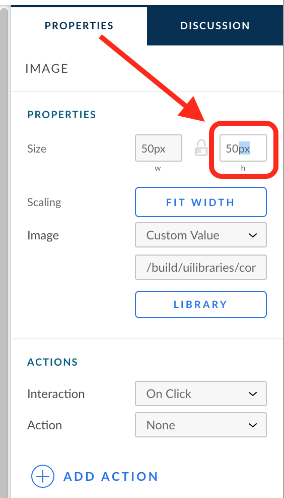

[DONE]
[ACCORDION-END]

[ACCORDION-BEGIN [Step 9: ](Populate the data)]
To populate data to the table, find the **Data** tab on the _left hand menu bar_. This will show the pre-populated data sources for this prototype.

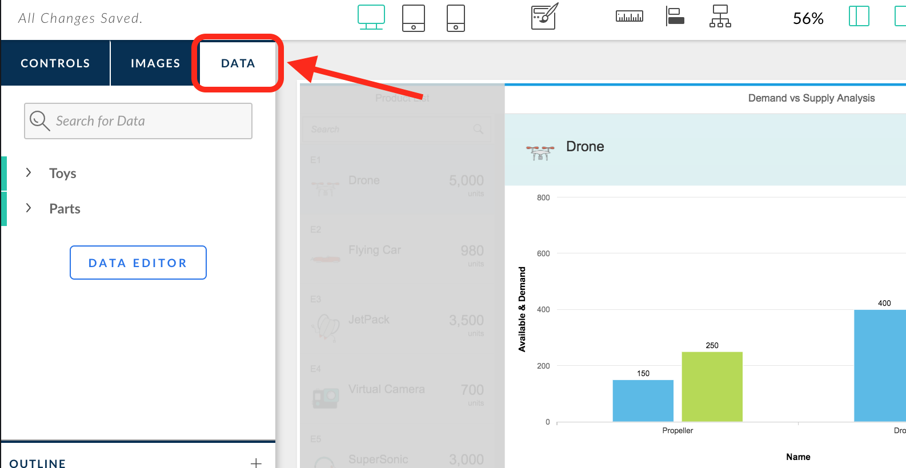

Select the **Parts** entity and **drag and drop it on the table**.

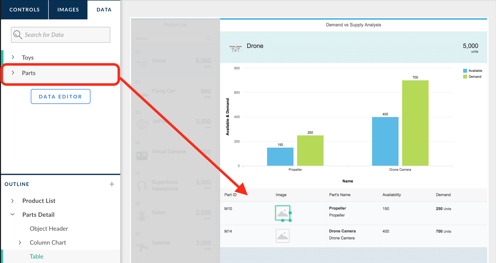

Column names that match properties of the entity will automatically map. You can also manually bind a specific field to a control. To bind a column to a specific field, **expand the entity** on the data pane to see the available fields.

Drag and drop the **Image** field to the **Image Control**.

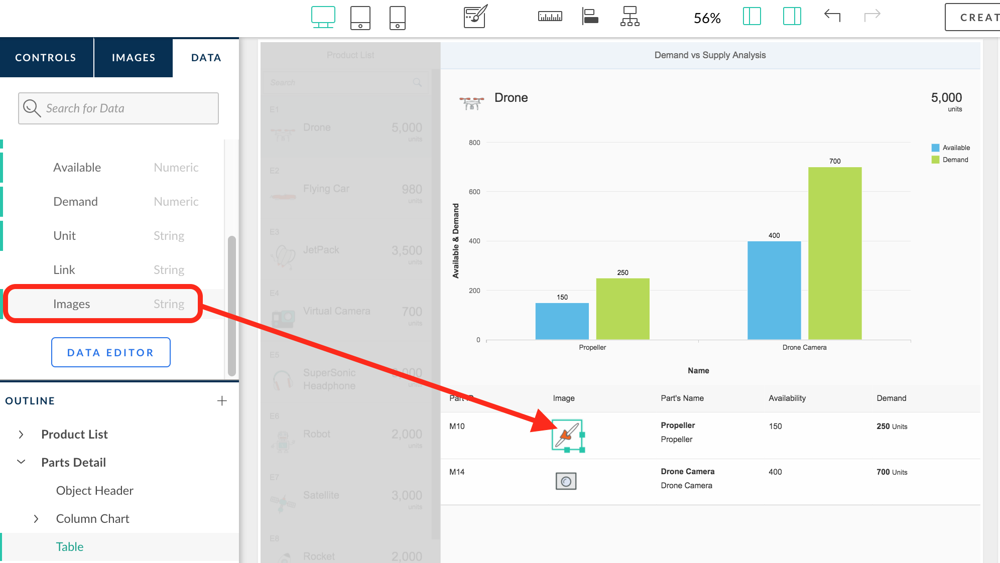

[DONE]
[ACCORDION-END]

[ACCORDION-BEGIN [Step 10: ](Preview the prototype)]
To preview the final view, click on the **Eye** icon in the top tool bar.

This will show you a "live" version of your prototype. You can preview how your application prototype will look on desktop, tablet, and mobile devices.

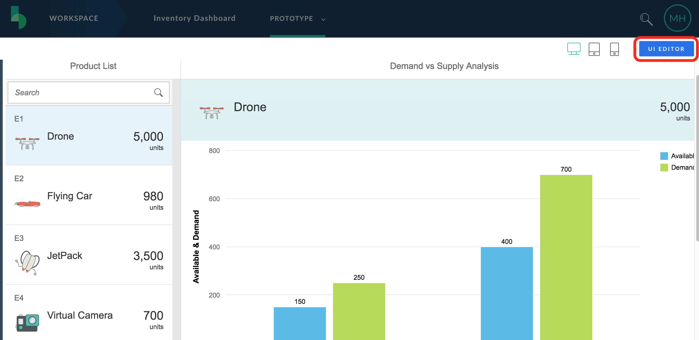

To get back to the UI Editor, click the **UI Editor button**.

[VALIDATE_10]
[ACCORDION-END]

[ACCORDION-BEGIN [Step 11: ](Change the theme)]
You can modify the overall color scheme, known as a "Theme" in SAP Fiori. **Go back to the UI Editor**.

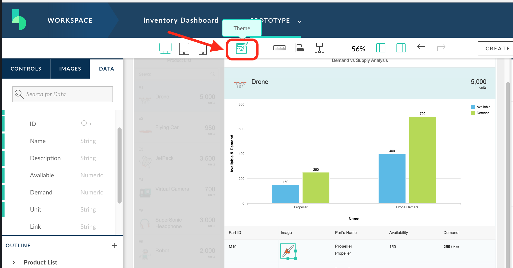

In the UI Editor, locate the **icon with a paintbrush** on the top tool bar. **Click it**.

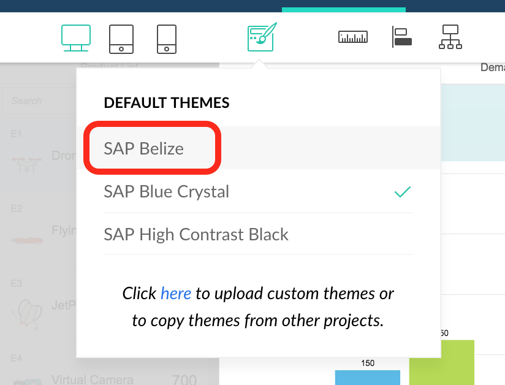

Select **SAP Belize** from the menu items. This will update the overall theme for the application. No need to update each individual screen or control!

[DONE]
[ACCORDION-END]

[ACCORDION-BEGIN [Step 12: ](Share your app)]
Once your prototype is complete, SAP Build lets your share your app in a couple different ways. To share your app, in the **UI Editor**, click on the **Share button**.

A dialog box will pop up with a shareable link, a Slack integration, and a download option. **Copy the link**.

To close the dialog box and go back to the UI Editor, click **Close**.

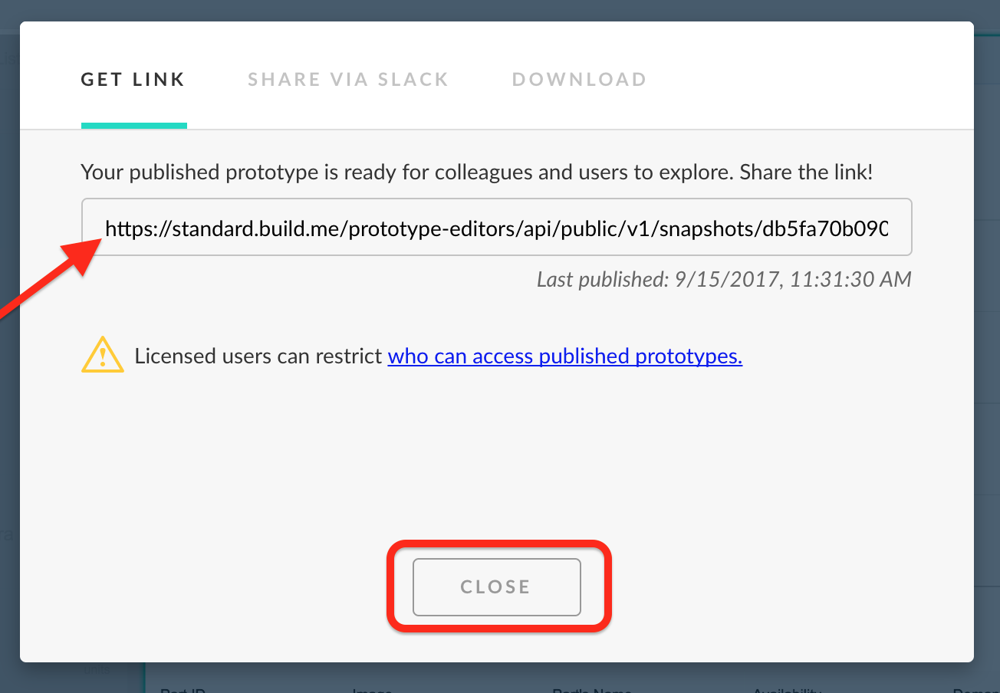

[VALIDATE_12]
[ACCORDION-END]
