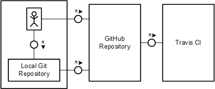
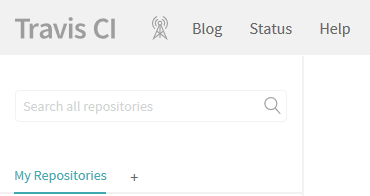
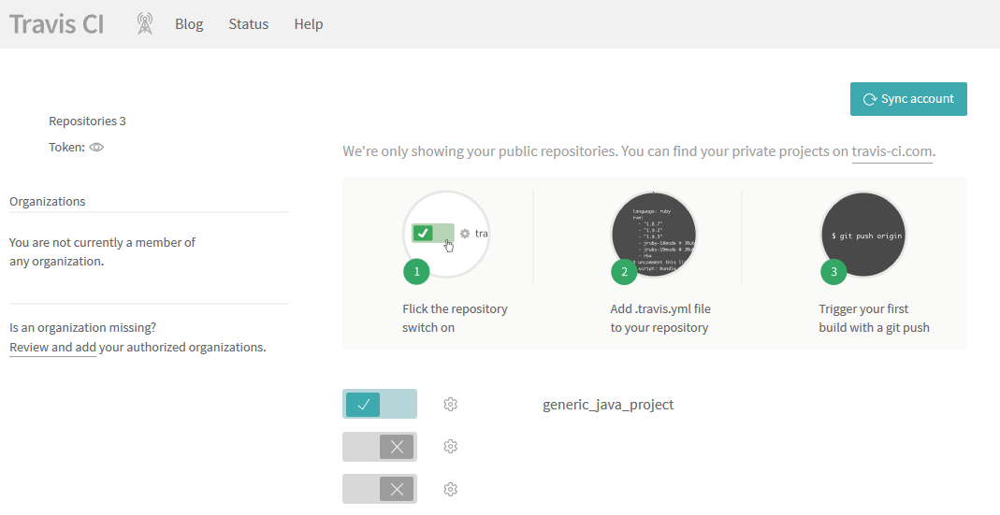
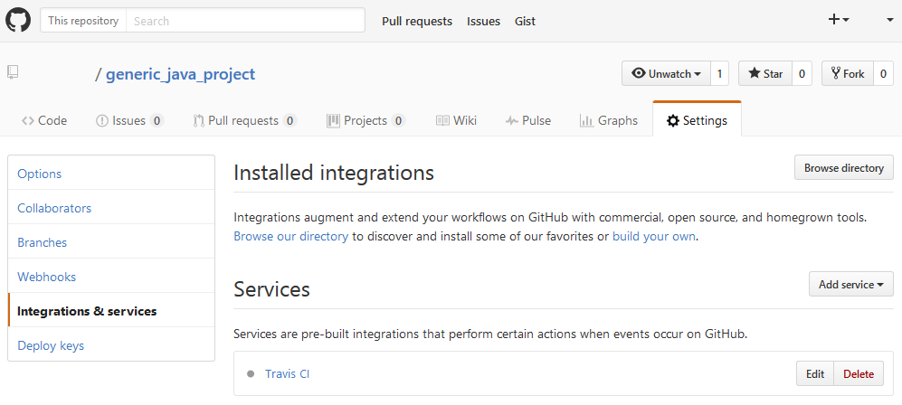
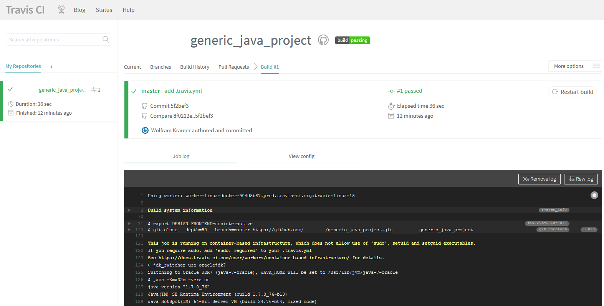
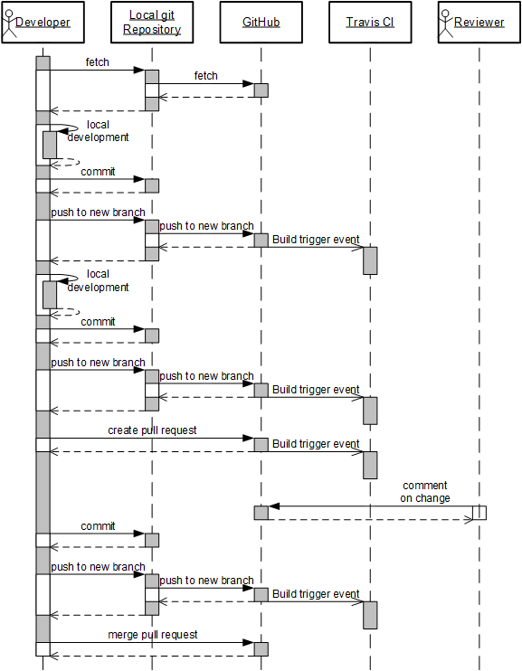

---

title: Continuous Integration (CI) Best Practices with SAP: Generic Project with CI using Cloud Services
description: Part 5.1: Configuring cloud-based CI system for Maven-based generic Java project.
tags: [  tutorial>intermediate, tutorial:type/project ]

---

## Prerequisites

  - **Proficiency:** Intermediate
  - [Generic Project](http://go.sap.com/developer/tutorials/ci-best-practices-generic.html)
  
## Next Steps

  - [Back to the Navigator](http://go.sap.com/developer/tutorials/ci-best-practices-intro.html)

---


This scenario focuses on using publicly available services to build Java applications very quickly and efficiently using the cloud services GitHub and Travis CI. There is no need to set up any local infrastructure.

This pipeline adheres to basic CI and CD practices and can be extended easily. It will make sure that each change to your project's repository is built centrally, thus applying the "Build Every Change" CI practice which is crucial for collaborative development.

Using the GitHub public SCM service and Travis CI as the build system, we benefit from a huge ecosystem. Travis CI is a hosted, distributed continuous integration service used to build and test software projects hosted at GitHub. Both GitHub and Travis CI offer a variety of plans to suit your individual requirements, ranging from a free public offering to an on-premise installation of their full service.

#### Prerequisites

- You have an account on GitHub and Travis CI. If you already have an account, you can reuse it.

Both solutions are also available as enterprise on-premise versions. Mixed scenarios using one part in the cloud and the other on-premise are also possible.

> GitHub: https://github.com  
> GitHub Enterprise: https://enterprise.github.com/home  
> Travis CI: https://travis-ci.org, https://en.wikipedia.org/wiki/Travis_CI


### Basic setup

In this example, we create a GitHub repository containing a small sample application and configure Travis CI to react on a commit event in GitHub by triggering a build.



Figure 1: The component landscape

####  Procedure

1. Enter the GitHub site. If you do not yet have an account, sign up for a new GitHub account.
  
    > GitHub: https://github.com
    
2. Log in to your account.

3. Create a new repository with a name of your choice. In the example, we choose `generic_java_project`.

    
    
    You may create an initial `README.md` file in your repository.
    
4. We now need a sample application. Clone the new repository to your local PC. First, you need to ensure that the proxy is set for Git.
  
    - Set the http proxy:
      
    ```
    git config --global http.proxy {the URL of your HTTP proxy}
    git config --global https.proxy {the URL of your HTTPS proxy}
    ```
      
    - Now clone the repository:
    
    ```
    git clone {The URL of the new GitHub project}
    ```

5. Add the initial project files into the Git workspace. For example, add the following files with the content taken from the appendix of the [Generic Project](http://go.sap.com/developer/tutorials/ci-best-practices-generic.html):

    ```
    {git repository root}/pom.xml
    {git repository root}/src/main/java/company/org/App.java
    {git repository root}/src/test/java/company/org/AppTest.java
    ```

6. Add, commit and push the sources. The initial project is now available in GitHub.

    ```
    git add .
    git commit -m "Initial version of HelloWorld"
    git push origin master
    ```

7. Open the URL of Travis CI in your browser and select **Sign in with GitHub**. If you do not already have an account at Travis CI, this step automatically creates one according to your GitHub account.
  
    > Travis CI: https://travis-ci.org
    
8. In the Travis CI front end, select **My Repositories** and select **+**.
 
    
    
    You get a list of your GitHub repositories.
   
9. Add your repository (in this example `generic_java_project`) to Travis CI by turning on the switch.

    

    A web hook to the settings of your GitHub repository is automatically added; it is called when you push new changes. You can verify in GitHub by selecting **Settings > Integrations & services** in your project:

    

10. Travis CI requires a file `.travis.yml` in your project's root directory which specifies the build technology and environment. In our example we have to declare Java as technology and the needed Java SDK version to be used for the compilation. Add a new `.travis.yml` file to your project root directory with the following content:

    ```
    sudo: false
    language: java
    jdk: oraclejdk7
    ```

11. Shortly after the commit, respectively the push of the new file, a build on Travis CI is triggered. Navigate to the build status page in Travis CI to check the build.

    


### Pull Requests

So far, we only made use of the `master` branch of the project without isolation of changes: the build triggered in Travis CI corresponds to a CI build, which takes the current change that already have been integrated into `master`.

To avoid spoiling `master` by unqualified changes, a concept similar to voter builds is required. New changes should be built and tested in isolation from the `master` branch before they are merged. For this purpose, pull requests in GitHub are attached to dedicated branches different from `master` in which the commits of a developer can be collected, reviewed, built and verified. Only after the quality of the content has been proven, the pull request is closed by the responsible person and the underlying branch is merged into `master`.

To implement this, no additional configuration needs to be done in the infrastructure: Travis CI reacts on any commit events irrespective in which branch it happens. Even the creation of the pull request is an event that triggers a build.

The development paradigm using pull requests follows the steps that are described below. For more information, please see the GitHub help page:

> GitHub Help: https://help.github.com/

Figure 2 illustrates the mechanics of pull requests.

1. The developer clones or fetches the current repository to his local disk.

2. The developer works on a local branch in which he creates commits.

3. A push to GitHub is done into a new central branch different from `master`.

4. The commit is automatically built by Travis CI.

5. Steps 2 - 4 are repeated until the developer decides to propose his changes to be merged into the `master` branch.

6. The developer creates a pull request in GitHub.

7. Travis CI builds the current content of the pull request and other developers get a chance to review the changes. The pull request is still open for commits.

8. As soon as the maturity of the pull request content has reached the desired level, the pull request is merged into `master` by the responsible person.



Figure 2: The CI process with pull requests in GitHub.


## Next Steps

  - [Back to the Navigator](http://go.sap.com/developer/tutorials/ci-best-practices-intro.html)
  
