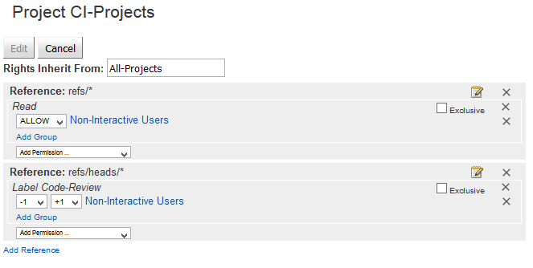
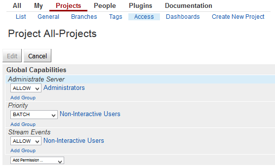

---

title: CI Best Practices Guide: Landscape Configuration
description: Part 3.4: Configuring the CI Component Landscape.
tags: [  tutorial>intermediate, tutorial:type/project ]

---

## Prerequisites  

  - **Proficiency:** Intermediate
  - [Source Code Versioning System](http://go.sap.com/developer/tutorials/ci-best-practices-scm.html)
  - [Build Scheduler](http://go.sap.com/developer/tutorials/ci-best-practices-build.html)

## Next Steps

  - [Back to the Navigator](http://go.sap.com/developer/tutorials/ci-best-practices-intro.html)
  
---


After having installed and started the components that are involved in our CI process landscape, there are some more steps to configure to make them smoothly work together within a process pipeline.


### Gerrit Parent Project

To avoid the need to maintain the Jenkins permissions in Gerrit for each project separately, it is a good practice to create a common parent project that hosts the needed permissions.  
> Documentation: https://wiki.jenkins-ci.org/display/JENKINS/Gerrit+Trigger#GerritTrigger-SetUp

#### Procedure

  1. In the Gerrit front end, go to "Projects" / "Create new Project". 
  2. Enter `CI-Projects` and check "Only serve as parent for other projects".
  3. Press "Create Project".
  4. Go to the "Access" tab and add the following permissions: 
     ```
     Reference: refs/*   
     Read: ALLOW for Non-Interactive Users   
     Reference: refs/*   
     Code-Review: -1, +1 for Non-Interactive Users
     ```
     
  5. Save.


### Subscribe Jenkins to Gerrit Events

Jenkins will establish an ssh connection to Gerrit to listen to the event stream. In order to do this, Jenkins needs access to Gerrit, and in the Jenkins configuration, Gerrit has to be defined:  
> Documentation: https://wiki.jenkins-ci.org/display/JENKINS/Gerrit+Trigger#GerritTrigger-SetUp

#### Procedure

  1. In Gerrit, create a new user `jenkins`. 
  2. In its properties, add the public key from `.ssh/id_rsa.pub` of in the `jenkins` home directory on the Jenkins master machine.
  3. Grant the needed permissions to the Gerrit user `jenkins`:
       1. In the Gerrit front end, go to "People" / "List groups" / "Non-interactive Users". 
       2. Add `jenkins` as member.
       
  4. Go to "Projects" / "List" / "All-Projects" / "Access", and in the section "Global Capabilities"  add 
     ```
     Stream Events: ALLOW for Non-Interactive Users
     ```  
     
  5. Open a browser window to Jenkins and go to "Manage Jenkins" / "Gerrit Trigger" / "Add new Server".
  6. Enter the following data:
     | Field | Value |
     | --- | ------------------------------------------------------------------------- |
     | Name | `{any logical name, e.g. the hostname of Gerrit}` |
     | Hostname | `{hostname of Gerrit}` |
     | Front end URL | `http://{hostname of Gerrit}:8080` |
     | SSH Port | `29418` |
     | Username | `jenkins` | 
     | SSH Key file | `/home/jenkins/.ssh/id_rsa` |
  6. Test the connection.
  7. Proceed with setting the review and voting values:  
     `1` for "Successful", `-1` for "Failed" and `0` otherwise are good starting values.
  8. Open the "Advanced" options. Enter the following values:
     | Field | Value |
     | --- | ------------------------------------------------------------------------- |
     | Started | `gerrit review --message 'Build Started <BUILDURL> <STARTED_STATS>' <CHANGE>,<PATCHSET>` |
     | Successful | `gerrit review --message 'Build Successful <BUILDS_STATS>' --code-review <CODE_REVIEW> <CHANGE>,<PATCHSET>` |
     | Failed | `gerrit review --message 'Build Failed <BUILDS_STATS>' --code-review <CODE_REVIEW> <CHANGE>,<PATCHSET>` |
     | Unstable | `gerrit review --message 'Build Unstable <BUILDS_STATS>' --code-review <CODE_REVIEW> <CHANGE>,<PATCHSET>` |
     | Not Built | `gerrit review --message 'No Builds Executed <BUILDS_STATS>' <CHANGE>,<PATCHSET>` |
  9. Save.
  10. Establish the connection by pressing the status button on the Gerrit Trigger overview page. It should change to green.


### Configure Nexus Deployment Target in Jenkins

For some scenarios, you need an upload of the build artifacts to Nexus. The upload URL is defined in the configuration of Maven on the Jenkins slave machines.

#### Procedure

  1. On the Jenkins slave machine, log on as user `jenkins`.
  2. In the home directory of `jenkins`, create a new folder `.m2` and in there, create a copy of the file `config/settings.xml` from the maven installation directory.
  3. Open the `settings.xml` file just copied and change the following parts according to your network setup:
       - In the "proxies" section, enter the right data according to your network configuration. 
         ```
         <proxies>
           <proxy>
             <active>true</active>
             <protocol>http</protocol>
             <host>{your proxy host}</host>
             <port>{your proxy port}</port>
             <nonProxyHosts>{include all host name patters that shall not be proxied}</nonProxyHosts>
           </proxy>
         </proxies>
         ```
       - In the "servers" section, enter the following lines that define the access credentials to the Nexus instance:
         ```
         <servers>
           <server>
             <id>nexus1</id>
             <username>deployment</username>
             <password>deployment123</password>
           </server>
         </servers>
         ```
         
The user `deployment` is a Nexus default user for deployments. For later productive usage, you should define another user with secure password. The `id` identifies the maven deployment target and will be referred in the `pom.xml` files of the projects.


#### Further Enhancements

  - Define a user and permission schema for Nexus. Especially create own Nexus users for Administration and Deployment with secure passwords.


## Next Steps

  - [Back to the Navigator](http://go.sap.com/developer/tutorials/ci-best-practices-intro.html)
