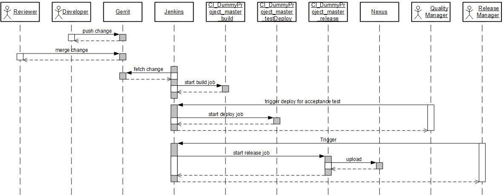
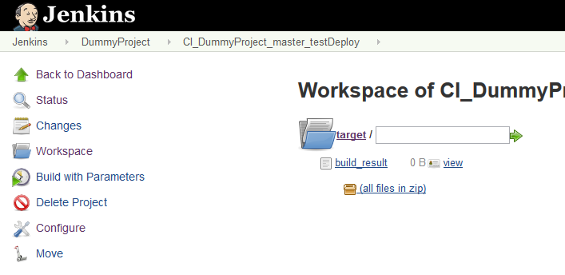
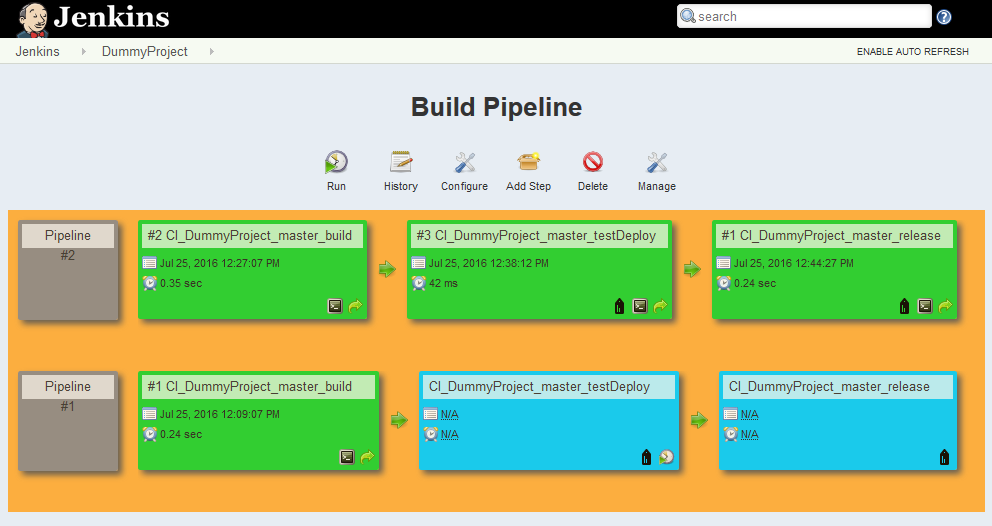

---

title: Continuous Integration (CI) Best Practices with SAP: Pipeline Skeleton Configuration
description: Part 3.5: Configuring a CD Pipeline Skeleton.
tags: [  tutorial>intermediate, tutorial:type/project ]

---

## Prerequisites  

  - **Proficiency:** Intermediate
  - [Build Landscape](http://go.sap.com/developer/tutorials/ci-best-practices-landscape.html)

## Next Steps

  - [Back to the Navigator](http://go.sap.com/developer/tutorials/ci-best-practices-intro.html)
  
---


In this part we will show how Jenkins can be used to set up a continuous delivery pipeline skeleton which includes an automatically
triggered continuous integration build (including automatic tests), a manual step to deploy the build result to a
test system and an additional manual step to release and deploy to the production system.
We assume that the project we want to build has the name `DummyProject`. 

Thus the full continuous delivery scenario consists of the following steps:

1. The developer does a change in the sources and pushes it to the central Gerrit instance.

2. A reviewer submits the change in Gerrit. Voter builds will make absolutely sense as described in the theoretical parts, but they are
    not really a part of continuous delivery pipeline since they run as pre-validation before the change reaches the `master` branch. Therefore,
    voter builds will not be described here.

3. A CI build job, which will be named `CI_DummyProject_master_build`,  is triggered automatically as soon as the change is merged into the
    `master` branch. Typically, the CI build job contains automatic tests, static code checks and so on as required. 

4. The build artifact is persisted to be used in eventual sequel steps which happens at the end of the job
    `CI_DummyProject_master_build`. The status that the change has reached at this point
    is that it was reviewed, successfully built and automatically tested. It has become a candidate for acceptance tests.
    
5. But acceptance tests are not done yet. They are often done manually, and
    not each of the candidates (many may be created each day) will undergo this procedure due to resource reasons.
    Rather they are scheduled for example on a daily basis taking the last stable candidate.
    In any case, there is a conscious decision by a quality manager or test coordinator
    to take a candidate and trigger that it is taken and deployed to a test system.
    In our example, this is done by starting the job `CI_DummyProject_master_testDeploy`
    After that, the test system remains stable for the rest of the day in the sense that no other candidates will be deployed. Only in
    the case that the candidate fails early and there is time enough to start the procedure once again at the same day,
    the deployment of another candidate could be triggered.

6. When the acceptance test was successful, the change can (but doesn't have to) be released. This again is a conscious manual process that is
    triggered by the quality or release manager depending on the outcome of the tests. With the release, which is technically done by starting
    the job `CI_DummyProject_master_release`, the artifact is uploaded
    to the Nexus repository.



In the following, we will create the jobs and orchestrate them using the features of Jenkins to give an idea of the principles.
It is currently not our goal to go into technical specifics of any build tooling. Therefore, we leave the jobs as a skeleton with more or less
void implementation. You will find concrete implementations in the sections that discuss the CI/CD processes for SAP specific technologies. 

There is only one place where we will use Maven explicitly, namely for uploading the released artifact to Nexus. For convenience reasons, we store
the metadata of the artifact in a `pom.xml` such that we do not have to care about how to pass them as parameters to the `mvn deploy` call. 
Other implementations not using Maven are also possible.


#### Prerequisites

- Running Git/Gerrit instance
- Running Jenkins Master and a Jenkins build slave 
- Running Nexus with at least one snapshot repository


### Setup of a dummy Gerrit project

Since the process described above is triggered by a source change, a Git repository is required.

#### Procedure

1. Access the Gerrit front end with a browser on port 8080 and log on with your admin user.

2. Go to **Projects > Create New Project**. 

3. Enter the project name `DummyProject` and select **Create initial empty commit**. This automatically creates the `master` branch.

4. Enter `Rights Inherit From:` `CI-Projects`.
  
5. Do an initial clone of the project to your PC and check out the `master` branch.

6. Add the following `pom.xml` file into your project folder:

    ```
    <project xsi:schemaLocation="http://maven.apache.org/POM/4.0.0 http://maven.apache.org/xsd/maven-4.0.0.xsd">
      <modelVersion>4.0.0</modelVersion>
      <groupId>company.samples</groupId>
      <artifactId>DummyProject</artifactId>
      <version>1.0.0</version>
    </project>
    ```

7. Commit and push the change.


### Setup of the CI build

The CI build is directly triggered by a merge of a change into the `master` branch, it does the build, automatic tests and build artifact
archiving for further usage. 

#### Procedure

1. Open the Jenkins front end and go to **New Item**, select **Freestyle project** and enter `CI_DummyProject_master_build` as name.

2. Enter the following values to the configuration:
  
    Field                                  | Value
    :------------------------------------- | :------------------------------------------------------------------------- 
    Restrict where this project can be run | `checked`; Label Expression: the label that you have assigned to the slave, in this case `builds` 
    Source Code Management                 | `Git`; Enter the repository URL and as Credentials: `jenkins` 
    Git                                    | `checked` 
    Repository URL                         | `{the ssh based URL of your repository}` 
    Credentials                            | `jenkins` 
    Ref spec                               | `{empty}` 
    Branches to build; Branch Specifier    | `master`
    Build Triggers                         |
    Poll SCM                               | `checked`
    Schedule                               | `{Enter a pull frequency. In order to have immediate results, every two minutes could be an appropriate value}`
    Build Environment                      |
    Delete workspace before build starts   | `checked`
    
3. Select **Add build step > Execute shell**  and enter as shell command

    ```
    mkdir target
    touch target/build_result.zip
    cp pom.xml target
    ```
    
    This rather silly operation simulates a build with a result located in the `target` folder.
    The `pom.xml` file is copied to the `target` folder as well to make the metadata accessible to the sequel jobs.
    
4. Select **Add post-build action > Archive the artifacts**. Enter `target/*`.

5. Select **Add post-build action > Build other projects (manual step)**. Enter `CI_DummyProject_master_testDeploy` as downstream project name.
    There will be a warning since the project does not yet exist. Ignore it for now. Enter as parameters
    
    ```
    BUILD_JOB_NUMBER=${BUILD_NUMBER}
    ```
    
    The build number will be passed to the test deploy job since that has to fetch the artifacts from the right place.
    
6. Save the job definition.


### Setup of the test deploy job

This job is manually triggered but semantically linked to the job before. 


#### Procedure

1. Open the Jenkins front end and go to **New Item**, select **Freestyle project** and enter `CI_DummyProject_master_testDeploy` as name.

2. Enter the following values to the configuration:
  
    Field                                  | Value
    :------------------------------------- | :------------------------------------------------------------------------- 
    Restrict where this project can be run | `checked`; Label Expression: the label that you have assigned to the slave, in this case `builds` 
    This job is parametrized               | `checked`
    Name                                   | `BUILD_JOB_NUMBER`
    Source Code Management                 | `none`
    
3. In the **Build** section, select ** Add build step > Copy artifacts from another project** and enter:

    Field                                  | Value
    :------------------------------------- | :------------------------------------------------------------------------- 
    Project name                           | `CI_DummyProject_master_build`
    Which build                            | `Specific build`
    Build number                           | `$BUILD_JOB_NUMBER`
    Artifacts to copy                      | `target/*`
    
4. Select **Add build step > Execute shell**  and enter as shell command

    ```
    echo "Now a real job would deploy the artifact to the test system."
    ```

5. Select **Add post-build action > Build other projects (manual step)**. Enter `CI_DummyProject_master_release` as downstream project name.
    There will be a warning since the project does not yet exist. Ignore it for now. Enter as parameters
    
    ```
    BUILD_JOB_NUMBER=${BUILD_NUMBER}
    ```
    
6. Save the job definition.


### Setup of the release job

As the job for the deployment to the test system, this job is manually triggered but semantically linked to the job before.

1. Open the Jenkins front end and go to **New Item**, select **Freestyle project** and enter `CI_DummyProject_master_release` as name.

2. Enter the following values to the configuration:
  
    Field                                  | Value
    :------------------------------------- | :------------------------------------------------------------------------- 
    Restrict where this project can be run | `checked`; Label Expression: the label that you have assigned to the slave, in this case `builds` 
    This job is parametrized               | `checked`
    Name                                   | `BUILD_JOB_NUMBER`
    Source Code Management                 | `none`
    
3. In the **Build** section, select ** Add build step > Copy artifacts from another project** and enter:

    Field                                  | Value
    :------------------------------------- | :------------------------------------------------------------------------- 
    Project name                           | `CI_DummyProject_master_build`
    Which build                            | `Specific build`
    Build number                           | `$BUILD_JOB_NUMBER`
    Artifacts to copy                      | `target/*`
       
4. Select **Add build step > Execute shell**  and enter as shell command

    ```
    echo "Now a real job would deploy the artifact to the production system."
    mv target/pom.xml .
    mvn deploy:deploy-file -Durl=http://{enter your nexus host here}:8081/nexus/content/repositories/releases -Dfile=target/build_result.zip -DrepositoryId={your repository Id} -Dpackaging=zip -DpomFile=pom.xml

    ```

    The value of `{your repository Id}`, the example given in our [Landscape Configuration](http://go.sap.com/developer/tutorials/ci-best-practices-landscape.html)
    assumes `nexus1`.
      
5. Save the job definition.


### Create a view to the Pipeline

So far, the jobs implementation cover single process steps and are connected to each other. To visualize the pipeline in Jenkins,
we use the Jenkins Build Pipeline Plugin.

#### Procedure

1. Open the Jenkins front end and click in the last view tab containing the `+` sign.

2. Provide a name for the new view like `DummyProject` and check **Build Pipeline View**. Press **OK**.

3. In the Layout section, enter the CI build job (here `CI_DummyProject_master_build`) into the field **Select Initial Job**.

4. In the field **No Of Displayed Builds** enter `5` for the beginning, but you may enter whatever is convenient for you. 

5. Press **OK**.

6. You should now see the pipeline like shown in the picture. Most probably, you will see that the first run of the build job was already done
    since it has fetched the first initial commit just after being defined.
    
    
    
    
### One roundtrip through the process

After having set up the continuous delivery pipeline, we do now a round trip through the process.

#### Procedure

1. On your local PC, add a file in the `DummyProject` and directly push it to `master` (for simplicity, we leave out the voting on Gerrit).

2. After not more than 2 minutes, the build job starts automatically. We assume that something usefully is built and tested.

    
    
3. Let us assume that this is the status that the quality manager or test coordinator sees when he enters his office in the morning. He has to decide
    on the version that should be tested today and decides for the artifact produced in pipeline #2. The pipeline view is interactive. In the bottom
    right corner of the box representing the deploy job to the test system, a trigger button is active. Push it.
    
4. We assume now that the artifacts are deployed to the test system.

    

    We can convince ourselves that the artifacts are in fact copied from the build
    job to this one by clicking onto the job in the view, then **Back to Project > Workspace**. There is a `target`
    folder containing the expected artifact.
    
    
    
5. After assumed successful test, the quality or release manager may decide to release the artifact. This means, he deploys it to the productive system
    and triggers an upload to Nexus as released version.
     
    
    
    As result, the artifact is available in Nexus.
    
    
    
It is worth to mention that only very few changes will finally be released.
The journey of most of them will end after the build step since either the build was failed (then the deploy step will not be possible at all),
the quality manager did not choose them for acceptance test execution or the release manager did not decide to release them.


