## Prerequisites  
 - **Proficiency:** Beginner

## Details
### You will learn  
Enable your SAP Portal service to create your very own Fiori Launchpad. Your Launchpad can be used with Web IDE to host apps that are deployed to the SAP Cloud Platform and registered with Fiori.

### Time to Complete
**10 Min**

---

[ACCORDION-BEGIN [Step 1: ](Go to Services)]

Back in your SAP Cloud Platform cockpit, go to the **Services** page.

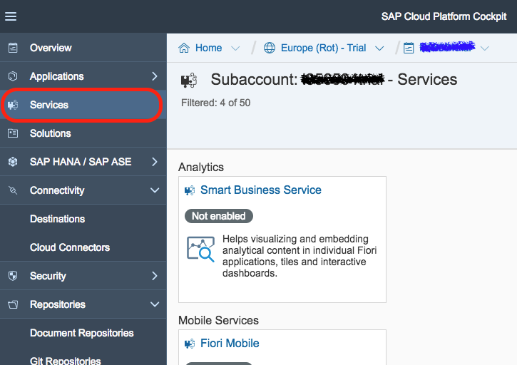

In the search menu, search for **Fiori**.

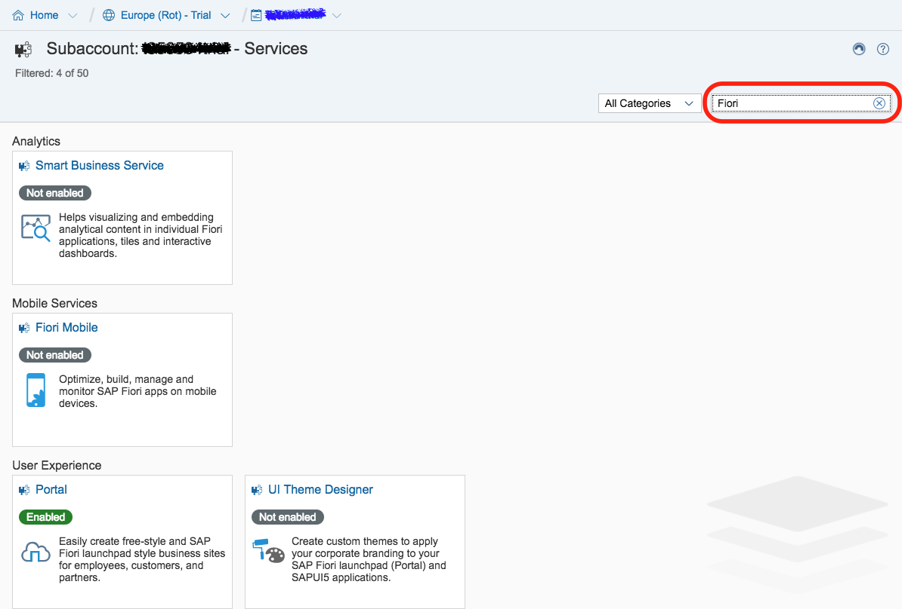

[DONE]
[ACCORDION-END]

[ACCORDION-BEGIN [Step 2: ](Open the Portal service)]

From the filtered down list of services, find the **Portal** service under the **User Experience** group.

**Click** on the tile for the Portal Service.

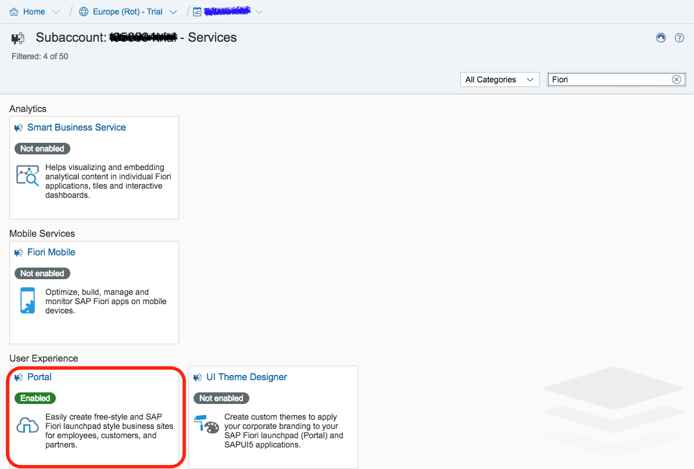

Make sure to enable the service if is not already enabled. Once you see the green Enabled status, click **Go to service** to launch the Fiori Launchpad Portal.

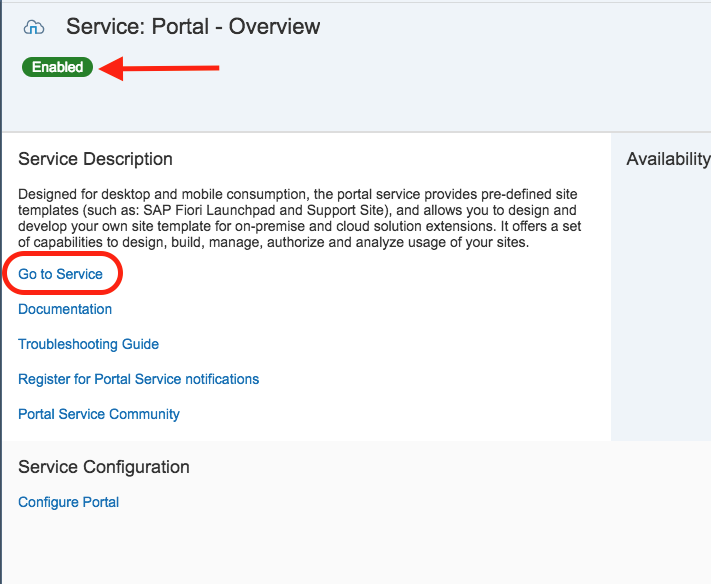

This will load the **Fiori Launchpad Portal**.

[DONE]
[ACCORDION-END]

[ACCORDION-BEGIN [Step 3: ](Create a new site)]

On the Fiori Launchpad Portal, click on the **Create New Site** button.

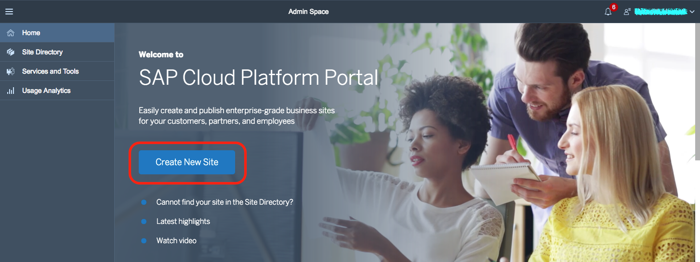

[DONE]
[ACCORDION-END]

[ACCORDION-BEGIN [Step 4: ](Set the site properties)]

Set the **Site Name** to **`MyLaunchpad`**.

Select the **SAP Fiori Launchpad** as the **Template Source**.

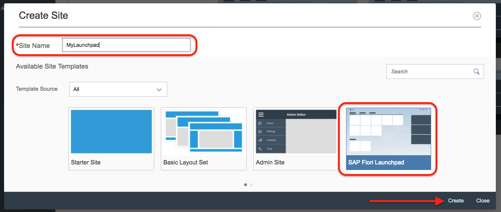

Click **Create**.

[DONE]
[ACCORDION-END]

[ACCORDION-BEGIN [Step 5: ](Fiori Configuration dashboard)]

Your Fiori Launchpad Configuration Cockpit will load.

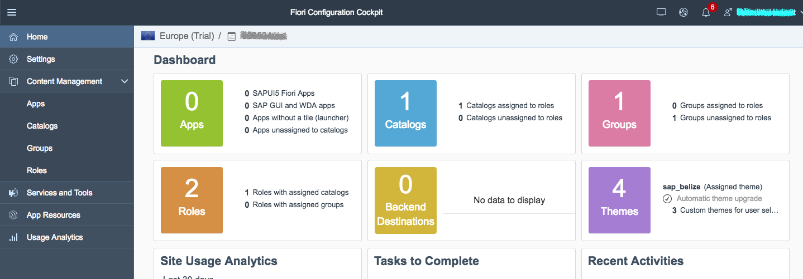

[DONE]
[ACCORDION-END]

[ACCORDION-BEGIN [Step 6: ](Validate your Fiori Launchpad)]

In your **Fiori Launchpad Cockpit dashboard**, copy the **URL up to the ?** and paste it in the below box.

[VALIDATE_6]
[ACCORDION-END]

[ACCORDION-BEGIN [Step 7: ](Open the settings)]

You can control the settings for your Launchpad from here. Click on the **Settings** tab.

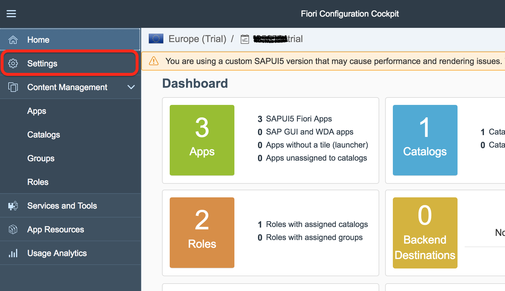

The settings page for your Fiori launchpad will open.

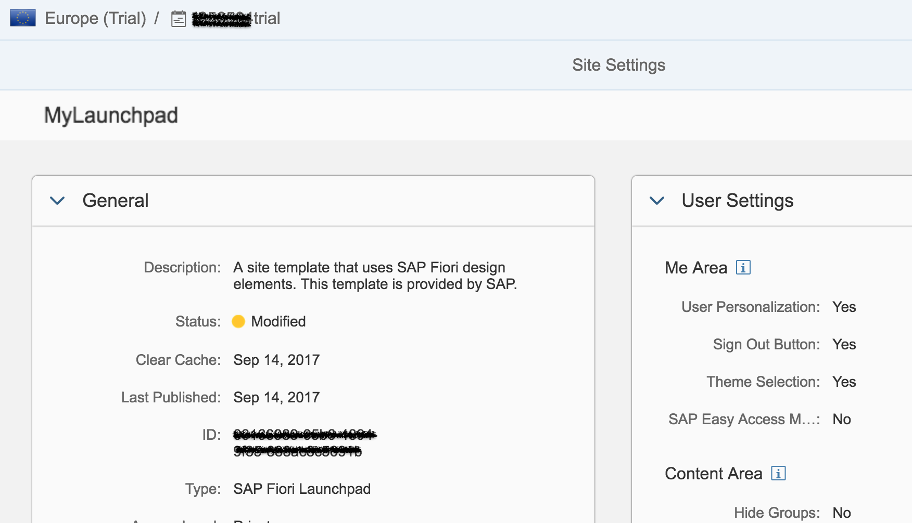

[DONE]
[ACCORDION-END]

[ACCORDION-BEGIN [Step 8: ](Update the SAPUI5 version)]

Scroll to the bottom of the settings page to find the **Edit button** in the bottom toolbar. **Click Edit**.

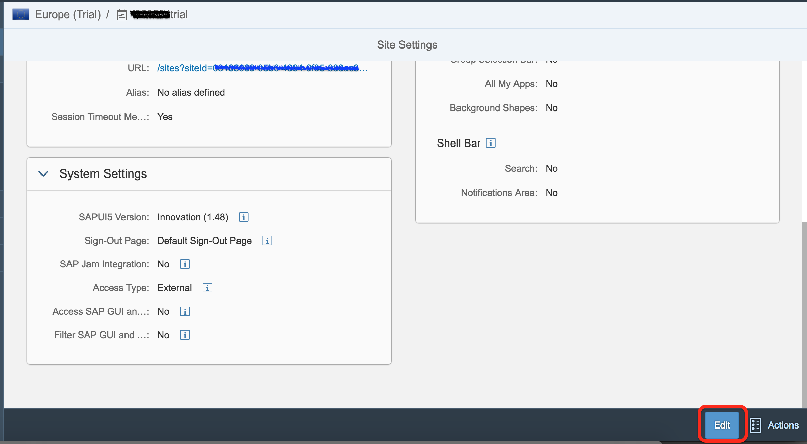

Under **System Settings**, locate the _SAPUI5 Version_. **Click the drop down** arrow and choose **Custom** from the list.

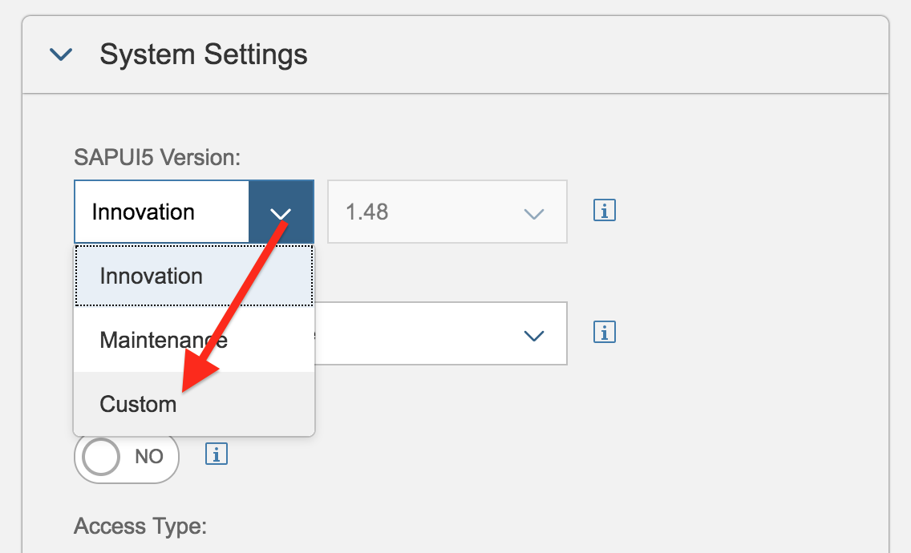

When the dialog box pops up, select **OK**.

From the number drop down menu, select the version number **1.40.18**.

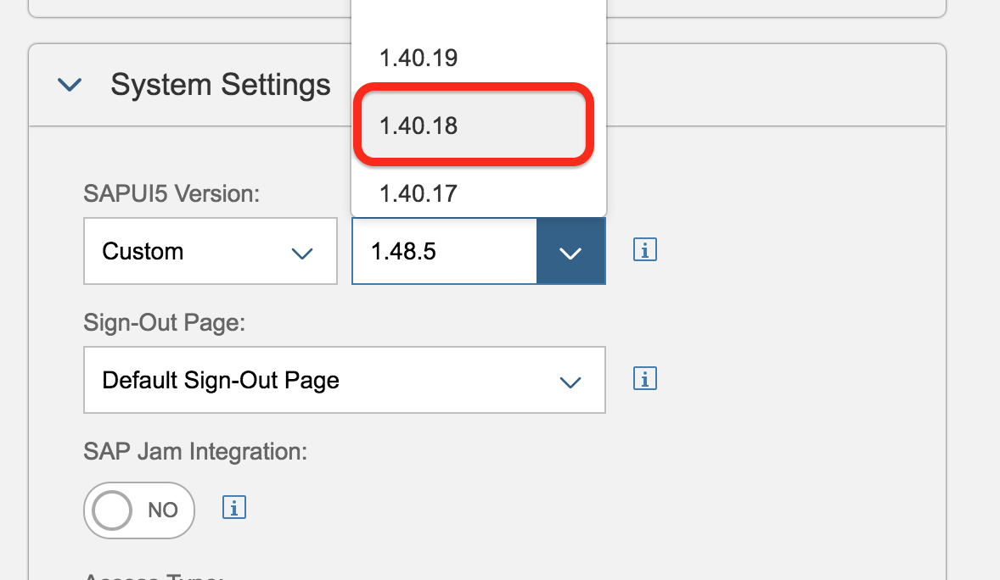

Verify your SAPUI5 version settings match the screenshot below and click **SAVE** in the bottom toolbar.

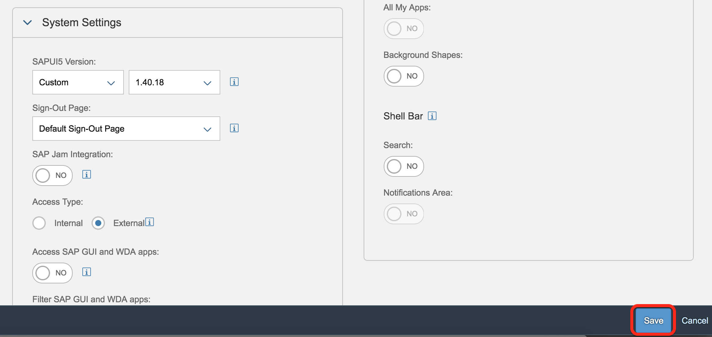

When the read only settings page load, verify that under **System Settings** the _SAPUI5 Version_ is `Custom (1.40.18)`

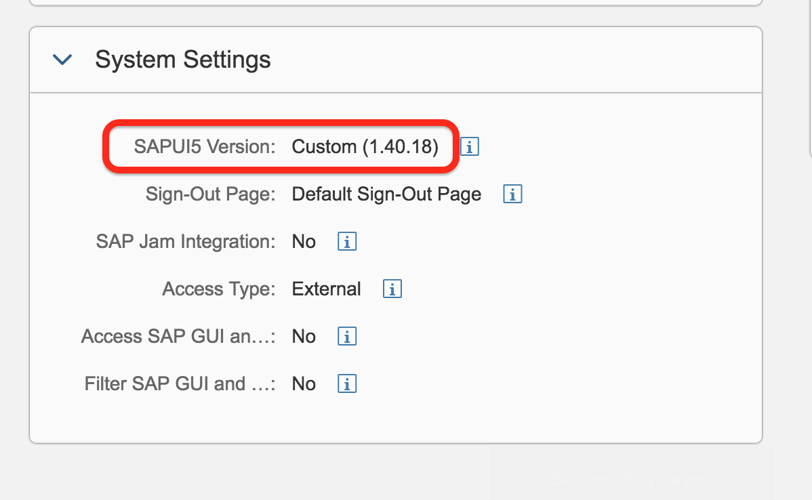

[DONE]
[ACCORDION-END]
