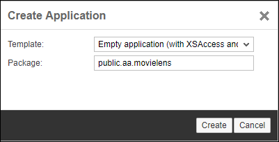
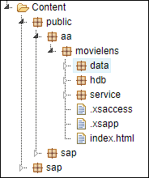
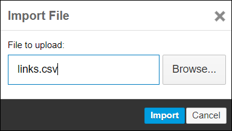
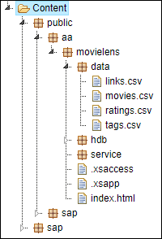
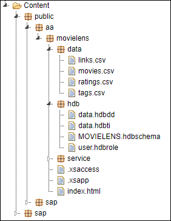

## Prerequisites  
 - **Proficiency:** Beginner

## Details
### You will learn  

- How to create the relevant CDS artefacts to expose your flat files as CDS entities.

### Time to Complete
**15 Min**

[ACCORDION-BEGIN [Info: ](Which MovieLens dataset?)]

In order to build your movie recommendation engine, we will be using one of the `MovieLens` dataset, as there are multiple one with different sizes.

These datasets are made available by the <a href="https://grouplens.org" target="new">`GroupLens Research`&copy;</a> group. They have collected and made available rating data sets from the <a href="http://movielens.org" target="new">`MovieLens`</a> web site which were collected over various periods of time.

The data set that we will be using for this series is the ***small*** version of the **`MovieLens` Latest Datasets** downloadable  <a href="http://grouplens.org/datasets/movielens/latest/" target="new">here</a>.

This dataset, thanks to its size, can easily be used with your SAP HANA MDC instance on the SAP Cloud Platform developer/trial account.

If you have a SAP Cloud Platform productive account with a larger SAP HANA instance, you can run this tutorial series with the larger datasets, but the validations steps implemented were built based on the "small dataset".

Before using these data sets, please review the <a href="http://files.grouplens.org/datasets/movielens/ml-latest-small-README.html" target="new">README</a> file for the usage licenses and other details.

[DONE]
[ACCORDION-END]

[ACCORDION-BEGIN [Info: ](SAP HANA import options)]

There are multiple ways to import data like the `MovieLens` flat files inside of your SAP HANA instance on the SAP Cloud Platform.

For example, there is an ***Import/Export*** feature in the ***SAP HANA plugin*** for the ***Eclipse IDE*** which would allow you to create a physical table and import the data.

However, this would require the ***SAP HANA plugin*** for the ***Eclipse IDE*** to be locally installed and properly configure with the SAP HANA plugin first.

Then, you would need to the complete and final file format description in order to create the tables with the proper columns structure. And any changes would require to reload the data.

This is why we will be using the ***SAP HANA Core Data Service*** (CDS) instead, which only requires the ***SAP HANA Web-based Development Workbench*** available with any SAP HANA MDC on the ***SAP Cloud Platform***. All the objects will be created as ***design-time*** and will  allow us to adapt the structure easily without reloading the data.

[DONE]
[ACCORDION-END]

[ACCORDION-BEGIN [Step 1: ](Switch to the Editor perspective)]

In order to create the CDS artifacts, we will be using the **Editor** perspective available in the **SAP HANA Web-based Development Workbench**.

From the ***SAP HANA Web-based Development Workbench*** main panel, click on **Editor**:


Else, if you are already accessing one of the perspective, then use the  icon from the menu:


> ### **Note**:
>**Make sure the currently connected user is TRIAL and not SYSTEM**. Check the upper right corner of the SAP HANA Web-based Development Workbench.

[DONE]
[ACCORDION-END]

[ACCORDION-BEGIN [Step 2: ](Create the package structure)]

Select the **Content** node from the tree, then right click on it and select **Create Application**.

Enter **`public.aa.movielens`** as your application package, then click on **Create**.

> **Note**: Make sure that the **Content** node is the item selected in the tree, else the package will be created under the currently selected tree node



Now, you can expand the **`public/aa/movielens`** package.

Create the following packages by selecting the **`movielens`** node from the tree, then using the right click with **New** > **Package**.

  - `cds`
  - `csv`

You should have the following package structure:



Check the message console, and make sure there is no errors. The following messages should be displayed:

```
[xx:xx:xx] Application in package public/aa/movielens created successfully.
[xx:xx:xx] Package /public/aa/movielens/cds created successfully.
[xx:xx:xx] Package /public/aa/movielens/cvs created successfully.
```

[DONE]
[ACCORDION-END]

[ACCORDION-BEGIN [Step 3: ](Download the dataset locally)]

As the files get updated periodically, and in order to ensure consistency of content and validation, the data is available under the <a href="https://github.com/SAPDocuments/Tutorial-Contribution/tree/master/tutorials/cp-hana-aa-movielens-01/csv" target="new">`csv`</a> directory within the SAP Tutorial GitHub repository.

Download the following files locally (right click on the link, then use the ***Save link as*** option):

- <a href="https://raw.githubusercontent.com/SAPDocuments/Tutorials/master/tutorials/cp-hana-aa-movielens-01/csv/links.csv" target="new">links</a>
- <a href="https://raw.githubusercontent.com/SAPDocuments/Tutorials/master/tutorials/cp-hana-aa-movielens-01/csv/movies.csv" target="new">movies</a>
- <a href="https://raw.githubusercontent.com/SAPDocuments/Tutorials/master/tutorials/cp-hana-aa-movielens-01/csv/ratings.csv" target="new">ratings</a>
- <a href="https://raw.githubusercontent.com/SAPDocuments/Tutorials/master/tutorials/cp-hana-aa-movielens-01/csv/tags.csv" target="new">tags</a>

Again, before using these files, make sure you have reviewed the dataset <a href="http://files.grouplens.org/datasets/movielens/ml-latest-small-README.html" target="new">README</a> file for the usage licenses and other details.

[DONE]
[ACCORDION-END]

[ACCORDION-BEGIN [Step 4: ](Import the dataset files)]

Right click on the `public/aa/movielens/csv` package node from the tree, and use the **Import** > **File** menu item.

Select one of the previously downloaded files.



Click on **Import**.

Repeat the operation for all the previously downloaded files:

- <a href="https://raw.githubusercontent.com/SAPDocuments/Tutorials/master/tutorials/cp-hana-aa-movielens-01/csv/links.csv" target="new">links</a>
- <a href="https://raw.githubusercontent.com/SAPDocuments/Tutorials/master/tutorials/cp-hana-aa-movielens-01/csv/movies.csv" target="new">movies</a>
- <a href="https://raw.githubusercontent.com/SAPDocuments/Tutorials/master/tutorials/cp-hana-aa-movielens-01/csv/ratings.csv" target="new">ratings</a>
- <a href="https://raw.githubusercontent.com/SAPDocuments/Tutorials/master/tutorials/cp-hana-aa-movielens-01/csv/tags.csv" target="new">tags</a>

Your package structure should now look like this:



> ### **Note**:
>You should close the tabs that got opened for each of the imported files in order to release the resources used by your browser.

&nbsp;

Check the message console, and make sure there is no errors. The following messages should be displayed:

```
[xx:xx:xx] File links.csv imported successfully in /public/aa/movielens/csv.
[xx:xx:xx] File movies.csv imported successfully in /public/aa/movielens/csv.
[xx:xx:xx] File ratings.csv imported successfully in /public/aa/movielens/csv.
[xx:xx:xx] File tags.csv imported successfully in /public/aa/movielens/csv.
```

[DONE]
[ACCORDION-END]

[ACCORDION-BEGIN [Step 5: ](Create the CDS schema)]

> **CDS schema**
>
>A **CDS schema** schema defines the container that holds database objects such as tables, views, and stored procedures. You need a schema to be able to write to the catalog.
>
>To create a database schema as a design-time object, you create a flat file that contains the schema definition. You save this file with the suffix `.hdbschema` in the appropriate package for your application in the SAP HANA repository.

&nbsp;

Create a new file named **`MOVIELENS.hdbschema`** in the **`public/aa/movielens/cds`** package with the following content:

```JavaScript
schema_name="MOVIELENS";
```

Save the file using the  icon from the menu or press `CTRL+S`.

Check the message console, and make sure there is no errors. The following messages should be displayed:

```
[xx:xx:xx] File /public/aa/movielens/cds/MOVIELENS.hdbschema created successfully.
[xx:xx:xx] File /public/aa/movielens/cds/MOVIELENS.hdbschema saved & activated successfully.
```

[DONE]
[ACCORDION-END]

[ACCORDION-BEGIN [Step 6: ](Create the CDS Role)]

> **CDS Role**
>
>The design-time definition of a role allows you to transport easily all the authorization that you want to apply for your application.
>
For example, you can implement a role that grant access to design-time object like specific CDS entities and even run-time privileges.
>
This provides a lot of flexibility in term of authorization management. They are specified in a text file with the extension `.hdbrole`.

&nbsp;

Create a new file named **`user.hdbrole`** in the **`public/aa/movielens/cds`** package.

By default, the ***Role Editor*** will open by default, but instead we will be using the ***Text Editor***, so you can close the ***Role Editor***.

Instead, right click on the **`user.hdbrole`** item in the tree, and use the **Open With** > **Text Editor** menu.

Now, paste the following content:  

```JavaScript
role public.aa.movielens.cds::user extends catalog role "sap.pa.apl.base.roles::APL_EXECUTE", "AFLPM_CREATOR_ERASER_EXECUTE", "AFL__SYS_AFL_AFLPAL_EXECUTE"
{
    schema public.aa.movielens.cds:MOVIELENS.hdbschema: SELECT, EXECUTE, CREATE ANY;
}
```

Here we have added the required roles and privileges to run our predictive algorithm scripts.

Save the file using the  icon from the menu or press `CTRL+S`.

Check the message console, and make sure there is no errors. The following messages should be displayed:

```
[xx:xx:xx] File /public/aa/movielens/cds/user.hdbrole created successfully.
[xx:xx:xx] File /public/aa/movielens/cds/user.hdbrole saved & activated successfully.
```

[DONE]
[ACCORDION-END]

[ACCORDION-BEGIN [Step 7: ](Create the CDS Document & Context)]

> **CDS Document & Context**
>
>CDS documents are design-time source files that contain DDL code that describes a persistence model according to rules defined in Core Data Services.
>
>CDS documents have the file suffix `.hdbdd`. Each CDS document must contain the following basic elements:
><li> Name space declaration: The name space you define must be the first declaration in the CDS document and match the absolute package path to the location of the CDS document in the repository. It is possible to enclose parts of the name space in quotes (""), for example, to solve the problem of illegal characters in name spaces.</li>
><li> CDS artifact definitions: The objects that make up your persistence model, for example: contexts, entities, structured types, and views</li>

&nbsp;

Create a new file named **`data.hdbdd`** in the **`public/aa/movielens/cds`** package with the following content:

```JavaScript
namespace public.aa.movielens.cds;

@Schema : 'MOVIELENS'
context "data"  {
  @Catalog.tableType : #COLUMN
  Entity LINKS {
    key MOVIEID : Integer;
    IMDBID      : Integer;
    TMDBID      : Integer;
  };

  @Catalog.tableType : #COLUMN
  Entity MOVIES {
    key MOVIEID  : Integer;
    TITLE        : String(255);
    GENRES       : String(255);
  };

  @Catalog.tableType : #COLUMN
  Entity RATINGS {
    key USERID   : Integer;
    key MOVIEID  : Integer;
    RATING       : hana.SMALLDECIMAL;
    TIMESTAMP    : Integer;
  };

  @Catalog.tableType : #COLUMN
  Entity TAGS {
    key USERID  : Integer;
    key MOVIEID : Integer;
    key TAG     : String(255);
    TIMESTAMP   : Integer;
  };
};
```

Save the file using the  icon from the menu or press `CTRL+S`.

Check the message console, and make sure there is no errors. The following messages should be displayed:

```
[xx:xx:xx] File /public/aa/movielens/cds/data.hdbdd created successfully.
[xx:xx:xx]File /public/aa/movielens/cds/data.hdbdd saved & activated successfully.
```

[DONE]
[ACCORDION-END]

[ACCORDION-BEGIN [Step 8: ](Create the CDS Table-Import Configuration)]

> **CDS Table-Import Configuration**
>
>SAP HANA Extended Application Services (SAP HANA XS) enables you to perform data-provisioning operations that you define in a design-time configuration file.
>
>The configuration file is transportable, which means you can transfer the data-provisioning between SAP HANA systems quickly and easily.
>
>The table-import configuration enables you to specify how data from a comma-separated-value (`.csv`) file is imported into a target table in SAP HANA.
>
>The configuration specifies the source file containing the data values to import and the target table in SAP HANA into which the data must be inserted.
>
>As further options, you can specify which field delimiter to use when interpreting data in the source `.csv` file and if keys must be used to determine which columns in the target table to insert the imported data into.

&nbsp;

Create a new file named **`data.hdbti`** in the **`public/aa/movielens/cds`** package with the following content:

```JavaScript
import = [
  {
    table  = "public.aa.movielens.cds::data.LINKS";
    schema = "MOVIELENS" ;
    file = "public.aa.movielens.csv:links.csv";
    header = true;
      delimField = ",";
      delimEnclosing= "\"";
  },
  {
    table  = "public.aa.movielens.cds::data.MOVIES";
    schema = "MOVIELENS" ;
    file = "public.aa.movielens.csv:movies.csv";
    header = true;
      delimField = ",";
      delimEnclosing = "\"";
  },
  {
    table  = "public.aa.movielens.cds::data.RATINGS";
    schema = "MOVIELENS" ;
    file = "public.aa.movielens.csv:ratings.csv";
    header = true;
      delimField = ",";
      delimEnclosing= "\"";
  },
  {
    table  = "public.aa.movielens.cds::data.TAGS";
    schema = "MOVIELENS" ;
    file = "public.aa.movielens.csv:tags.csv";
    header = true;
      delimField = ",";
      delimEnclosing= "\"";
  }
];
```

Save the file using the  icon from the menu or press `CTRL+S`.

Check the message console, and make sure there is no errors. The following messages should be displayed:

```
[xx:xx:xx] File /public/aa/movielens/cds/data.hdbdd created successfully.
[xx:xx:xx] File /public/aa/movielens/cds/data.hdbdd saved & activated successfully.
```

[DONE]
[ACCORDION-END]

[ACCORDION-BEGIN [Step 9: ](Granting roles)]

You should now have the following package and files structure in your environment:



Now, we need to grant the ***design-time*** role we created previously to our ***TRIAL*** user so that you can get access to the data and run the algorithm scripts.

To do that, you will be using the **Catalog** perspective available in the **SAP HANA Web-based Development Workbench** using the  icon from the menu:


> ### **Note**:
>**Make sure the currently connected user is TRIAL and not SYSTEM**. Check the upper right corner of the SAP HANA Web-based Development Workbench.

Open a new ***SQL Console*** using  icon from the menu or reuse an existing **SQL Console**.

Paste the following content in the console, and use the execute icon   from the menu.

```SQL
call _SYS_REPO.GRANT_ACTIVATED_ROLE ('public.aa.movielens.cds::user','TRIAL');
```

[DONE]
[ACCORDION-END]

[ACCORDION-BEGIN [Step 10: ](Validate the import)]

Let's now validate that the data was properly loaded.

Open using a new **SQL Console** using the  icon from the menu or reuse an existing one.

Paste the following content in the console, and use the execute icon   from the menu.

```SQL
select 'links'   as "table name", count(1) as "row count" from "MOVIELENS"."public.aa.movielens.cds::data.LINKS"
union all
select 'movies'  as "table name", count(1) as "row count" from "MOVIELENS"."public.aa.movielens.cds::data.MOVIES"
union all
select 'ratings' as "table name", count(1) as "row count" from "MOVIELENS"."public.aa.movielens.cds::data.RATINGS"
union all
select 'tags'    as "table name", count(1) as "row count" from "MOVIELENS"."public.aa.movielens.cds::data.TAGS";
```

Based on the result returned by the above SQL statement, provide an answer to the question below then click on **Validate**.

[VALIDATE_1]
[ACCORDION-END]

