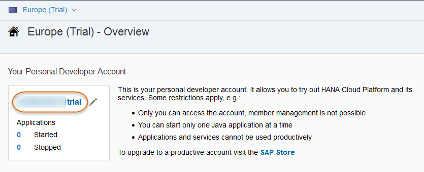
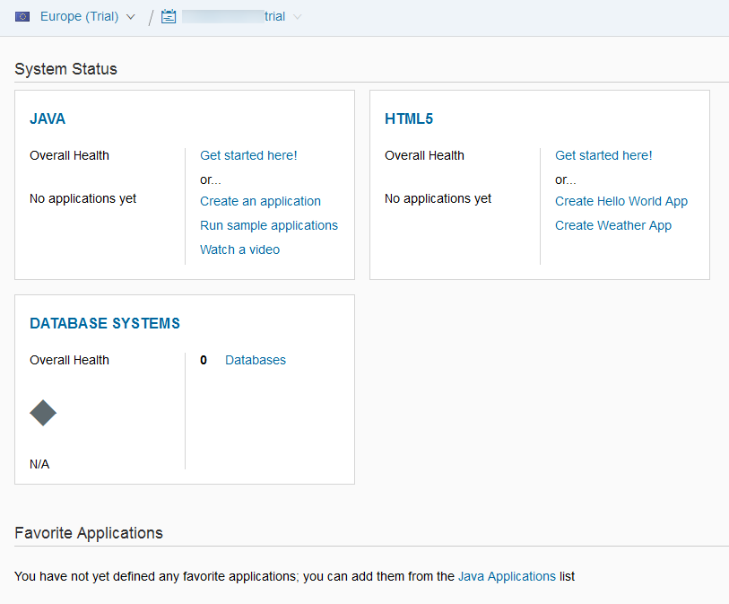
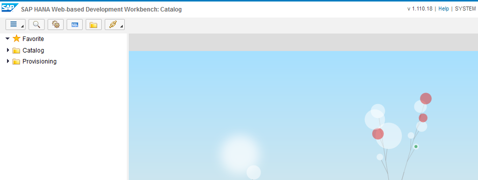
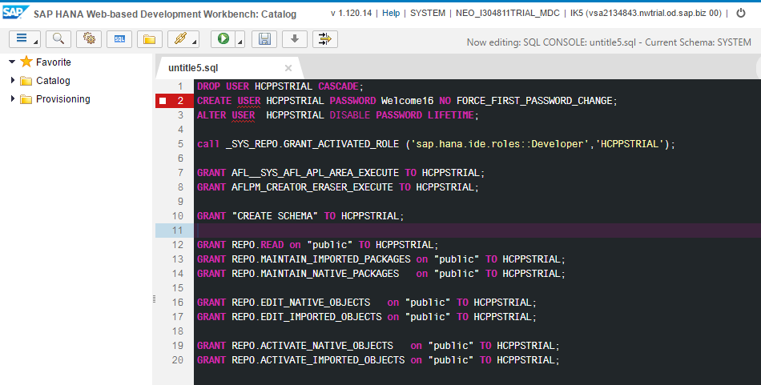
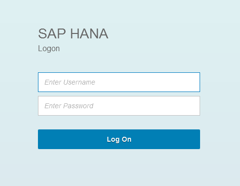

This instance will be used as your persistence service that you can use with your application or services.

As each HANA MDC instance comes only with a ***System Account*** called SYSTEM, which shall be used only to execute "System" related activities, we will need to add a new user account.

In the "real world", it is uncommon to use the ***System Account*** to develop an "end-user" application.

## Prerequisites
  - **Proficiency:** Beginner

## Details
### You will learn

- How to setup a SAP HANA MDC (Multi-Database Container) instance on the SAP Cloud Platform.

### Time to Complete
  **15 minutes**

[ACCORDION-BEGIN [Step 1: ](Access your SAP Cloud Platform account)]

Log into the <a href="http://account.hanatrial.ondemand.com/cockpit" target="new"><b>SAP Cloud Platform Cockpit</b></a> with your free trial account on the **Europe (Rot) - Trial** landscape and access *Your Personal Developer Account*.

Click on the link as highlighted on the below screenshot. By default, it ends with *trial* in fact is your account display name and can be changed using the pen icon).



You are now in your ***SAP Cloud Platform developer*** account!



[DONE]
[ACCORDION-END]

[ACCORDION-BEGIN [Step 2: ](Create your HANA MDC instance)]

On the left side menu bar, you can navigate to **SAP HANA / SAP ASE** > **Databases & Schemas**.


Click on **New**.

Complete the form following details information:

Field Name           | Value
-------------------- | --------------
Database ID          | `mdc`
Database System      | HANA MDC (< trial >)
System User Password | `Welcome17Welcome17`

> ### **Note**:
>**You can choose other values for theses properties. However, the validation steps implemented in the tutorials will be based on the Database ID being `mdc`. So you will have to adjust your entries to validate your progress.**
>
>Also, the default SAP HANA password policy was reinforced recently and now requires a 15 characters password that includes a digit.

&nbsp;


Click on **Save**

[DONE]
[ACCORDION-END]

[ACCORDION-BEGIN [Step 3: ](Wait for the creation to finish)]

It will take about 5 to 10 minutes for the creation process to complete. So, now is a good time to get a coffee refill!

The refresh icon  will spin every time the page content is refreshed.


The page should refresh by itself, but you can hit F5 if you are impatient like me.

Once you see the ***Tenant DB creation finished successfully (created and configured)*** event appears in the list, you can proceed with the next steps.

[DONE]
[ACCORDION-END]

[ACCORDION-BEGIN [Step 4: ](Restart the database)]

Now that we have our HANA MDC instance, we will simply restart it to clear out all the caches and free all resources that were allocated during the creation process.


Click on **Stop**.

On the left side menu, switch to **Events**.

Once you see the ***Database stopped successfully*** event appears in the list, switch back to **Overview** and click on **Start**.

Switch again to **Events**.

Once you see the ***Database started successfully*** event appears in the list, you can proceed with the next steps.

[DONE]
[ACCORDION-END]

[ACCORDION-BEGIN [Step 5: ](Finalize the System user account setup)]

When the SAP HANA MDC tenant is created, the System account is not yet finalized with the system roles and privileges.

Theses system roles and privileges are added on the first connection.

Therefore, we will need to connect to the ***SAP HANA Cockpit*** at least once using the *HANA System User* in order to finalize the system account setup and add all the necessary roles.

> ### **Warning**
>**Your SAP HANA MDC instance will be shutdown every 12 hours. And in case you don't restart your instance in the next 14 days, it will be deleted.**


Click on **SAP HANA Cockpit**.

You will be prompted to login.

Enter `SYSTEM` as user name and the ***HANA System Account*** password that was provided during the instance creation as password (`Welcome17Welcome17`).

Click on **Log On**.


You will receive an information message stating that your ***HANA System Account*** is not authorized to access the ***SAP HANA Cockpit***.


Click on **OK**.

Next, you will receive another information message regarding the granted roles.

Before closing the pop-up by clicking on **Continue**, look at the role list added to your System user, provide an answer to the question below then click on **Validate**.

[VALIDATE_1]
[ACCORDION-END]

[ACCORDION-BEGIN [Step 6: ](Extend the SYSTEM user)]

You are now in the ***SAP HANA Cockpit***.


In order to allow the **SYSTEM** user to run SQL statements, you will need to grant the "*IDE Developer*" role.

Click on **Manage Roles and Users**. This will open the ***SAP HANA Web-based Development Workbench*** **Security** perspective.

Under **Security**, expand **Users**, then double click on **SYSTEM**.

Select the **Granted Roles** tab, then click on the  icon, then add the following role:

  - `sap.hana.ide.roles::Developer`

Click on the  button in the top menu bar


[DONE]
[ACCORDION-END]

[ACCORDION-BEGIN [Step 7: ](Create your database user account)]

Using the  menu bar icon, select the **Catalog** perspective.

The following screen should appear:



Click on the  button in the top menu bar, and paste the following SQL code:

```sql
DROP USER TRIAL CASCADE;
CREATE USER TRIAL PASSWORD Welcome17Welcome17 NO FORCE_FIRST_PASSWORD_CHANGE;
ALTER USER  TRIAL DISABLE PASSWORD LIFETIME;

call _SYS_REPO.GRANT_ACTIVATED_ROLE ('sap.hana.ide.roles::CatalogDeveloper'     ,'TRIAL');
call _SYS_REPO.GRANT_ACTIVATED_ROLE ('sap.hana.ide.roles::Developer'            ,'TRIAL');
call _SYS_REPO.GRANT_ACTIVATED_ROLE ('sap.hana.ide.roles::EditorDeveloper'      ,'TRIAL');
call _SYS_REPO.GRANT_ACTIVATED_ROLE ('sap.hana.xs.ide.roles::CatalogDeveloper'  ,'TRIAL');
call _SYS_REPO.GRANT_ACTIVATED_ROLE ('sap.hana.xs.ide.roles::Developer'         ,'TRIAL');
call _SYS_REPO.GRANT_ACTIVATED_ROLE ('sap.hana.xs.ide.roles::EditorDeveloper'   ,'TRIAL');

GRANT EXECUTE on _SYS_REPO.GRANT_ACTIVATED_ROLE                         TO TRIAL WITH GRANT OPTION;
GRANT EXECUTE on _SYS_REPO.GRANT_SCHEMA_PRIVILEGE_ON_ACTIVATED_CONTENT  TO TRIAL WITH GRANT OPTION;
GRANT EXECUTE on _SYS_REPO.GRANT_PRIVILEGE_ON_ACTIVATED_CONTENT         TO TRIAL WITH GRANT OPTION;
GRANT EXECUTE on _SYS_REPO.REVOKE_ACTIVATED_ROLE                        TO TRIAL WITH GRANT OPTION;
GRANT EXECUTE on _SYS_REPO.REVOKE_SCHEMA_PRIVILEGE_ON_ACTIVATED_CONTENT TO TRIAL WITH GRANT OPTION;
GRANT EXECUTE on _SYS_REPO.REVOKE_PRIVILEGE_ON_ACTIVATED_CONTENT        TO TRIAL WITH GRANT OPTION;

GRANT "CREATE SCHEMA" TO TRIAL;

GRANT REPO.READ on "public" TO TRIAL;
GRANT REPO.MAINTAIN_IMPORTED_PACKAGES on "public" TO TRIAL;
GRANT REPO.MAINTAIN_NATIVE_PACKAGES   on "public" TO TRIAL;

GRANT REPO.EDIT_NATIVE_OBJECTS   on "public" TO TRIAL;
GRANT REPO.EDIT_IMPORTED_OBJECTS on "public" TO TRIAL;

GRANT REPO.ACTIVATE_NATIVE_OBJECTS   on "public" TO TRIAL;
GRANT REPO.ACTIVATE_IMPORTED_OBJECTS on "public" TO TRIAL;
```

Click on the  **Run** button or press **F8**.

> ### **Note**
>When executing this script, some statements will be marked with errors. This is because the script drop things before creating them. You can re-run the script again, and you won't get anymore errors.



[DONE]
[ACCORDION-END]

[ACCORDION-BEGIN [Step 8: ](Verify that your user is properly created)]

Click on the  **Logout** icon located in the top right corner of the screen.



Now, you need to connect with your **`TRIAL`** ***HANA User Account***.

Enter **`TRIAL`** as ***Username*** user name and **`Welcome17Welcome17`** as ***Password***, click on **Logon**.

If you can login successfully, then your ***HANA User Account*** is properly configured.

Click on **Catalog**.

Expand the **Catalog** and browse the schemas available with the **TRIAL** user.

Provide an answer to the question below then click on **Validate**.
[VALIDATE_2]
[ACCORDION-END]