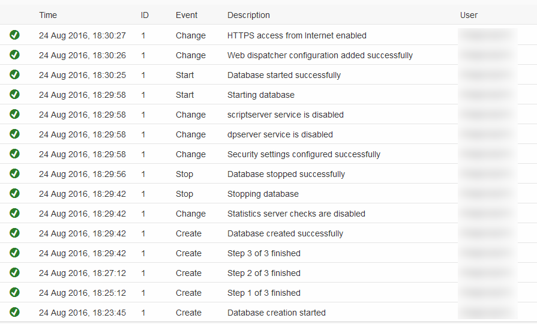
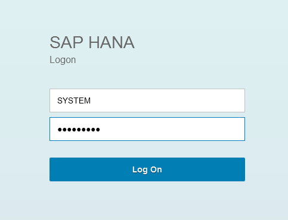
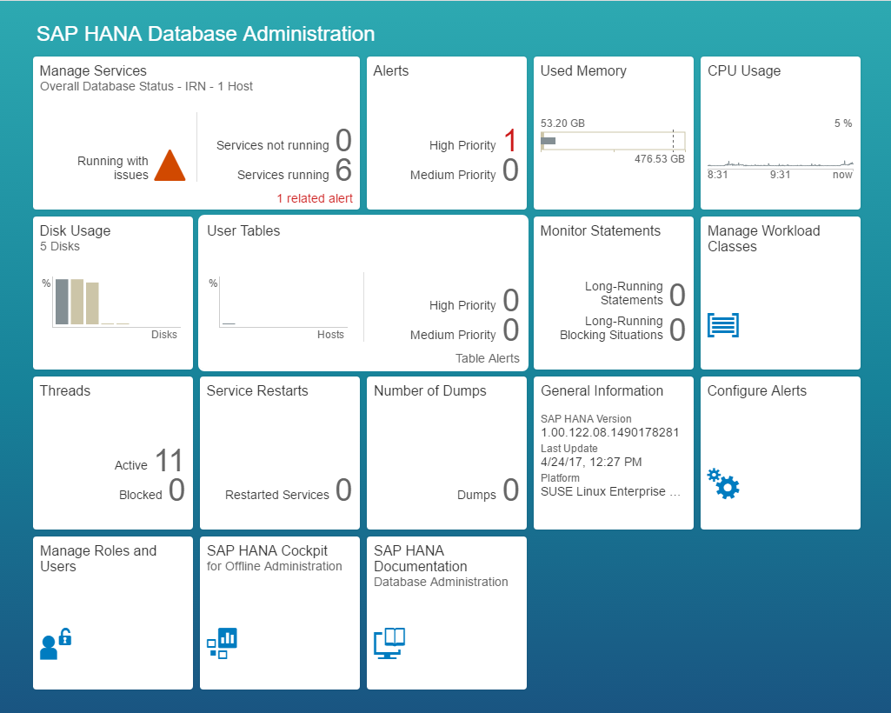
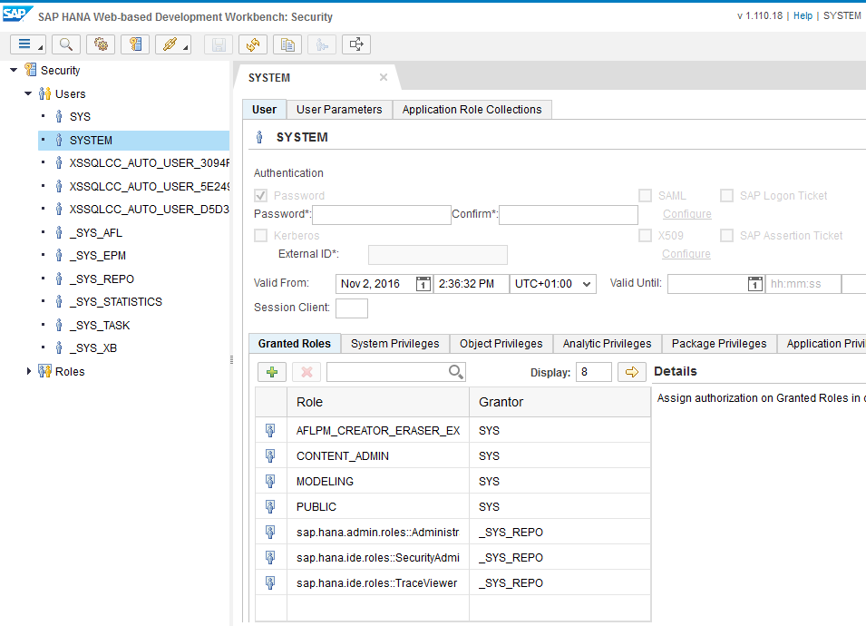

This instance will be used as your persistence service that you can use with your application or services.

As each HANA MDC instance comes only with a ***System Account*** called SYSTEM, which shall be used only to execute "System" related activities, you will need to add a new user account depending on your tutorial track.

## Prerequisites
  - **Proficiency:** Beginner

## Details
### You will learn

- How to setup a SAP HANA MDC (Multi-Database Container) instance on the SAP Cloud Platform.

### Time to Complete
  **15 minutes**

[ACCORDION-BEGIN [Step 1: ](Access your SAP Cloud Platform account)]

Log into the <a href="http://account.hanatrial.ondemand.com/cockpit" target="new"><b>SAP Cloud Platform Cockpit</b></a> with your free trial account on the **Europe (Rot) - Trial** landscape and access *Your Personal Developer Account*.

Click on the link as highlighted on the below screenshot. By default, it ends with *trial* in fact is your account display name and can be changed using the pen icon).

You are now in your ***SAP Cloud Platform developer*** account!

[DONE]
[ACCORDION-END]

[ACCORDION-BEGIN [Step 2: ](Create your HANA MDC instance)]

On the left side menu bar, you can navigate to **SAP HANA / SAP ASE** > **Databases & Schemas**.

Click on **New**.

Complete the form following details information:

Field Name           | Value
-------------------- | --------------
Database ID          | `mdc`
Database System      | Pick HANA MDC (< trial >) from the drop down
System User Password | `Welcome17Welcome17`

> ### **Note**:
>**You can choose other values for theses properties. However, the validation steps implemented in the tutorials will be based on the Database ID being `mdc`. So you will have to adjust your entries to validate your progress.**
>
>Also, the default SAP HANA password policy was reinforced recently and now requires a 15 characters password that includes a digit.

&nbsp;

Click on **Save**

[DONE]
[ACCORDION-END]

[ACCORDION-BEGIN [Step 3: ](Wait for the creation to finish)]

It will take about 5 to 10 minutes for the creation process to complete. So, now is a good time to get a coffee refill!

The refresh icon  will spin every time the page content is refreshed.

The page should refresh by itself, but you can hit F5 if you are impatient like me.

Once you see the ***Tenant DB creation finished successfully (created and configured)*** event appears in the list, you can proceed with the next steps.

[DONE]
[ACCORDION-END]

[ACCORDION-BEGIN [Step 4: ](Restart the database)]

Now that we have our HANA MDC instance, we will simply restart it to clear out all the caches and free all resources that were allocated during the creation process.

Click on **Stop**.

This page won't refresh automatically, so we will need to switch to the **Events** page.

On the left side menu, switch to **Events**.

Once you see the ***Database stopped successfully*** event appears in the list, switch back to **Overview** and click on **Start**.

> ### **Note**:
>**If you don't see your HANA MDC stopping right away in the Events log, it is probably because the initial backup is still pending.**
>
>The initial backup may take up to an hour to execute, and your HANA MDC will not restart until it is completed.
>
>Therefore you can proceed with the next steps. However, at some point, the backup will complete, and your instance will be shutdown, therefore you will need to start it.

&nbsp;

Switch again to **Events**.

Once you see the ***Database started successfully*** event appears in the list, you can proceed with the next steps.

[DONE]
[ACCORDION-END]

[ACCORDION-BEGIN [Step 5: ](Finalize the System user account setup)]

When the SAP HANA MDC tenant is created, the System account is not yet finalized with the system roles and privileges.

Theses system roles and privileges are added on the first connection.

Therefore, we will need to connect to the ***SAP HANA Cockpit*** at least once using the *HANA System User* in order to finalize the system account setup and add all the necessary roles.

> ### **Note:**
>**For your information: any SAP HANA MDC trial instances are shut down every 12 hours and in case a trial instance is not restarted in the next 14 days, it will be deleted.**

Click on **SAP HANA Cockpit**.

You will be prompted to login.

Enter `SYSTEM` as user name and the ***HANA System Account*** password that was provided during the instance creation as password (`Welcome17Welcome17`).

Click on **Log On**.

You will receive an information message stating that your ***HANA System Account*** is not authorized to access the ***SAP HANA Cockpit***.

Click on **OK** then click on **Continue**.

[DONE]
[ACCORDION-END]

[ACCORDION-BEGIN [Step 6: ](Extend the SYSTEM user)]

You are now in the ***SAP HANA Cockpit***.

In order to allow the **SYSTEM** user to run SQL statements, you will need to grant the "*IDE Developer*" role.

Click on **Manage Roles and Users**. This will open the ***SAP HANA Web-based Development Workbench*** **Security** perspective.

Under **Security**, expand **Users**, then double click on **SYSTEM**.

Select the **Granted Roles** tab, then click on the  icon, then add the following role:

  - `sap.hana.ide.roles::Developer`

Click on the  button in the top menu bar

Now, look at the granted roles for the ***HANA System Account***, provide an answer to the question below then click on **Validate**.

[VALIDATE_1]
[ACCORDION-END]
