## Prerequisites
- **Proficiency:** Intermediate
- **Tutorials:** [Expose OData services to SAP Cloud Platform](https://www.sap.com/developer/tutorials/cp-s4-ext-ui2-cloud-connector.html)
- **Systems, Tools, Services:**
    - SAP Web IDE
    - SAP CP cockpit
    - SAP CP Portal Service

## Next Steps
    -  [Extend an SAPUI5 application](https://www.sap.com/developer/tutorials/cp-s4-ext-ui4-build-ui.html)

## Details
### You will learn
You will create a SAP Fiori Launchpad on SAP Cloud Platform, which provides access to an application you will develop later. Acting as SAP Cloud Platform administrator, you first prepare the Portal Service inside your SAP Cloud Platform trial account and then add a first test application (SAP Web IDE) to a new launchpad with two groups, Product Management and Equipment Tracking.

### Time to Complete
**25 Mins**

---

[ACCORDION-BEGIN [Step 1:](Enable Portal Service in trial account)]

In SAP S/4HANA, the Fiori Launchpad is your central entry point for all sorts of SAP Fiori apps. You may operate a launchpad on-premises, or you might make use of the SAP Cloud Platform Portal service, which allows you to host the launchpad in your SAP Cloud Platform account. The Launchpad offers features such as navigation, personalization, and configuration options. The apps are displayed as various tiles and groups.

Administrators must first set up their SAP Cloud Platform account prior to working in SAP Fiori launchpad. In this step you will set up the Portal Service in your SAP CP Trial Account. 

1.  In Google Chrome browser open the SAP CP Trial cockpit page in a new tab.

2.  Open the **Services** pane and enter query string **portal** in the search field. Click the **Portal Service** tile to enter the admin page.

    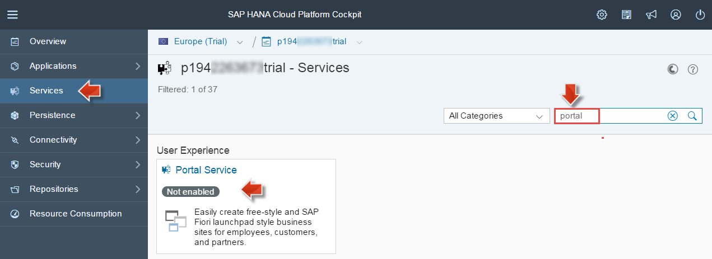

3.  Press the **Enable** button to provide a Portal to your SAP CP trial account.

    

    After few seconds a green icon indicates the enabled SAP CP Portal service.

    

4.  Click the link **Go to Service**.

    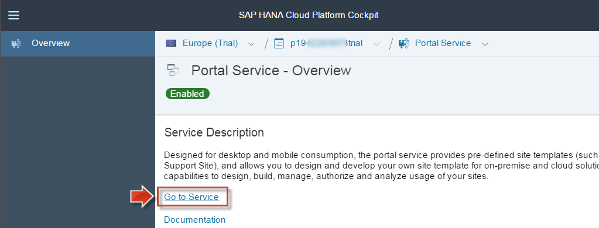

> **Result:**  You entered the **SAP HANA Cloud Portal Site Directory**. This is where you will create your new launchpad site.
>
> 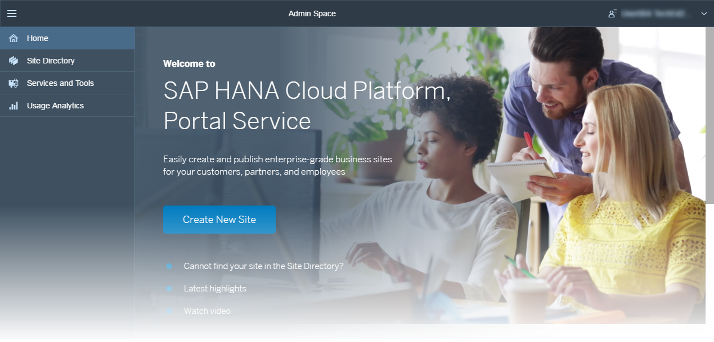

[ACCORDION-END]

[ACCORDION-BEGIN [Step 2:](Create new launchpad site)]

Before end users can work in an SAP Fiori launchpad, you as administrator must first set it up by configuring a new launchpad site with content such as app tiles, tile groups, catalogs, and roles that act as the building blocks of a launchpad.

To create a new `launchpad site` in the Site Directory of SAP HANA Cloud Portal apply the following steps:

1.  Choose **Create New Site**.

    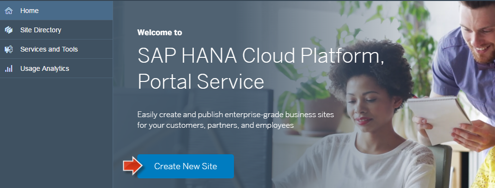

2.  Choose **SAP Fiori Launchpad** as template and enter **Procurement Launchpad** in input field `Site Name`.

    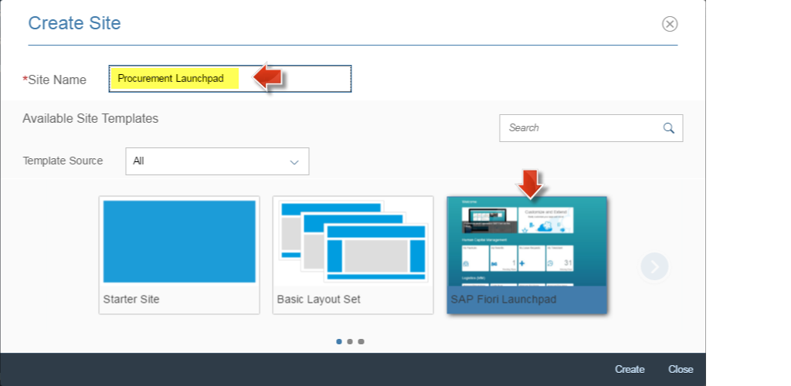

3.  Choose **Create**.

    

Another browser tab gets opened with the `Fiori Configuration Cockpit` for the new launchpad site **Procurement Launchpad**.

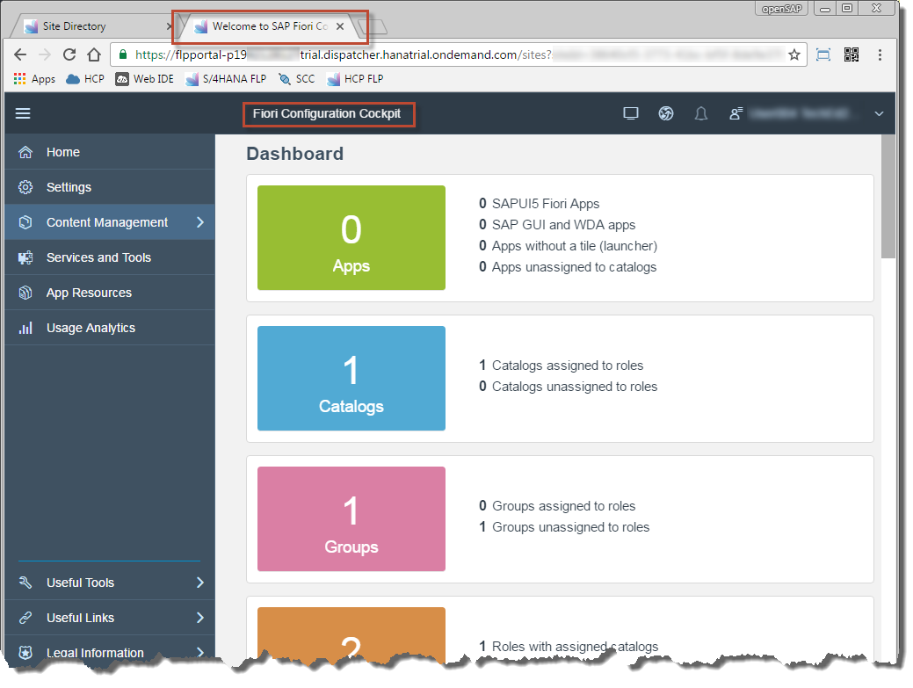

> **Result:**  You added a new launchpad site with name **Procurement Launchpad** to the Site Directory of SAP HANA Cloud Portal. In the browser tab where you added the new launchpad site it gets displayed as a new tile.
>
> 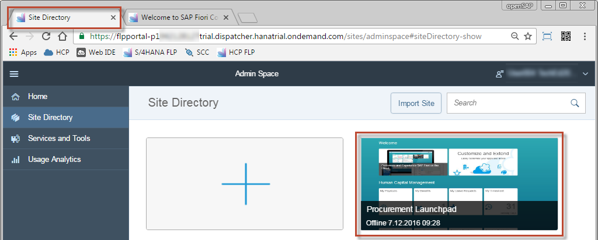
>
> **Related Resources:** For more details see SAP Cloud Platform Documentation:
>
> -   [SAP Fiori Launchpad on Cloud](https://help.hana.ondemand.com/cloud_portal_flp/frameset.htm)
> -   [SAP Fiori Launchpad Sites](https://help.hana.ondemand.com/cloud_portal/frameset.htm?69000b4a09b54f33bef1b58a1dbb4001.html  )

[ACCORDION-END]

[ACCORDION-BEGIN [Step 3:](Configure the launchpad site)]

To configure the new launchpad site `Procurement Launchpad` You now enter the **SAP Fiori launchpad configuration cockpit**, a browser-based tool used by administrators to create new and maintain existing content for SAP Fiori launchpads.

1.  In `Site Directory` click **Edit** at the bottom right of the `Procurement Launchpad` tile or select the browser tab `Welcome to SAP Fiori Configuration Cockpit` that was opened in the previous step.

    

    In the `Fiori Configuration Cockpit` you will see a navigation menu on the left hand side. From here you can access the various tools, editors, and services provided by the configuration cockpit.

    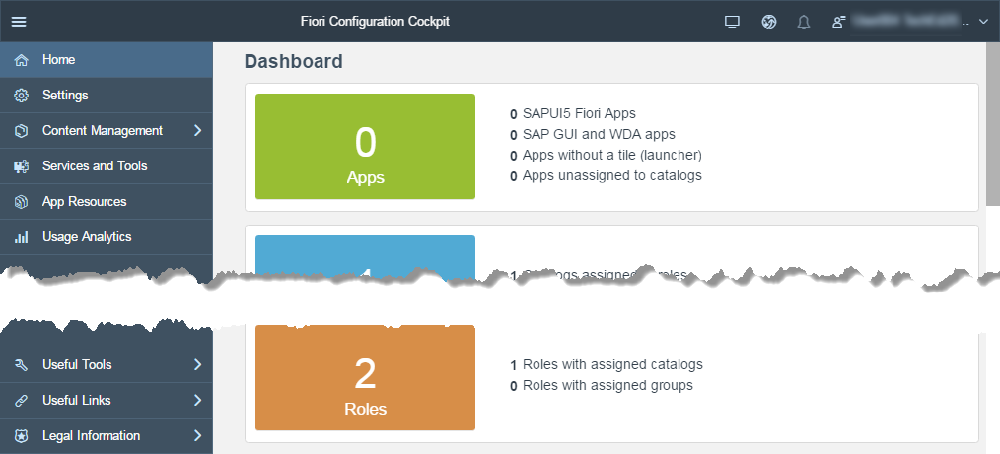

2.  To configure the launchpad catalog open menu item **Content Management** | **Catalogs** or click the **Catalogs** tile.

    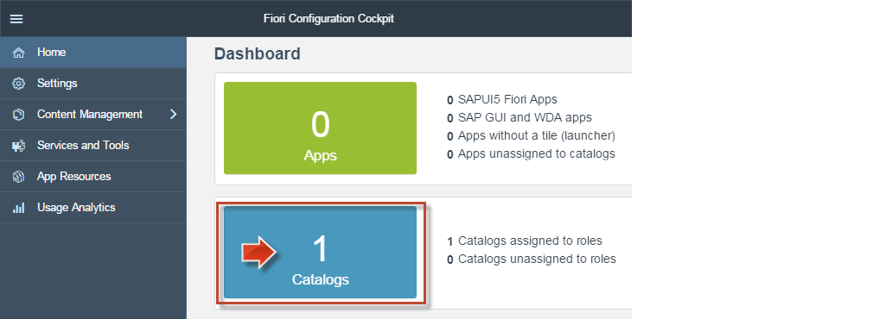

3.  To edit the `Sample Catalog` click the **Edit** button in the footer toolbar.

    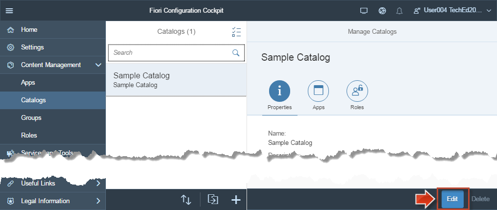

4.  In the `Properties` tab change name and description to **Procurement Applications**.

    

5.  Choose `Roles` tab and assign role **Everyone**.

    > **Hint:** In case the **Roles** tab does not open via mouse-click press the **Return** keyboard button instead.

6.  Click **Save**.

    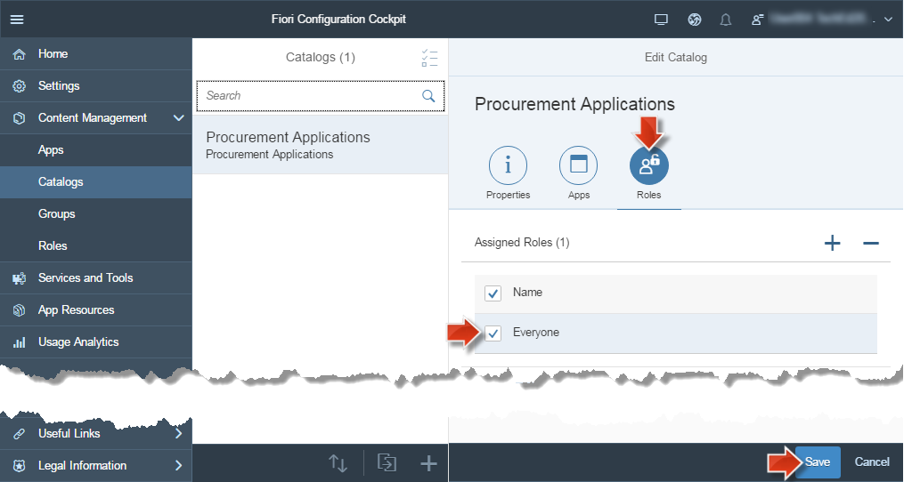

7.  Configure the launchpad groups:

8.  Go to `Groups` and click on **Edit**.

    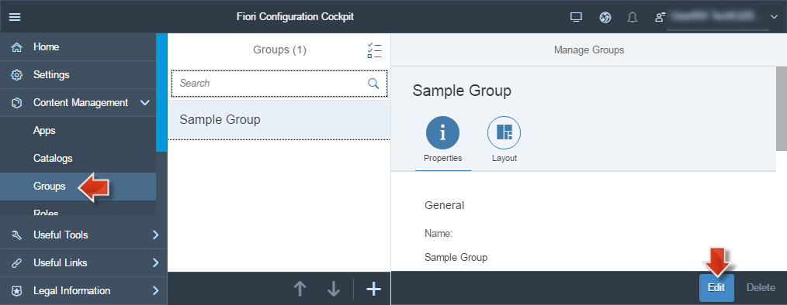

9.  Edit the `Sample Group`:
    -   Rename it to **Product Management**.
    -   Click **Save**.

    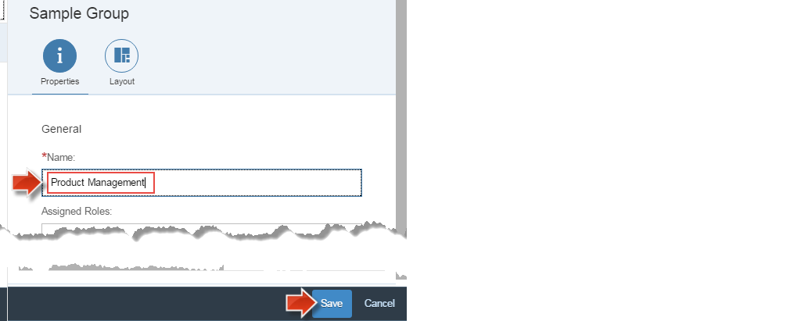

10. Create a new group named `Equipment Tracking` with the **+** button in the footer toolbar.

    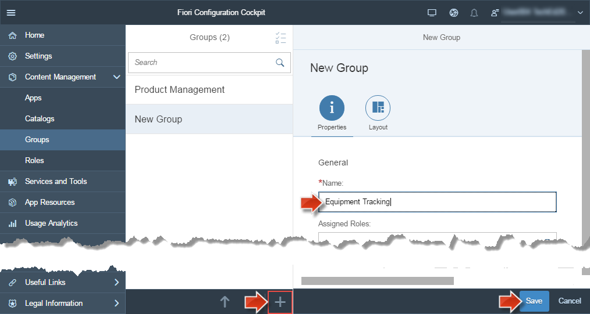

    > **Result:**  You configured the `Procurement` launchpad site to contain two groups named `Product Management` and `Equipment Tracking`:
    >
    > 

[ACCORDION-END]

[ACCORDION-BEGIN [Step 4:](Add application to launchpad site)]

Add SAP Web IDE as first application tile inside the `Procurement` launchpad.

1.  In the left navigation sidebar expand **Content Management** and go to **Apps**.

2.  Click **+** button in the footer toolbar to create a new app.

    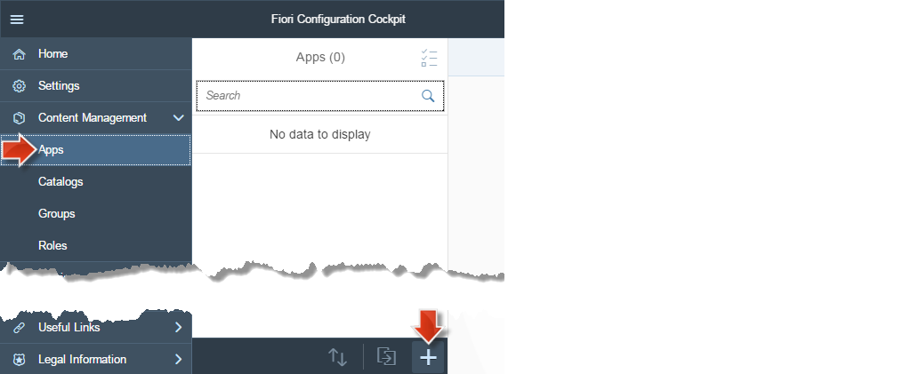

3.  In the `Properties` form enter the following values:
    -   Enter **General** | **App Title**: **`Demo Application`**.
    -   Under **App Resources Details** choose **App Type** menu item **URL**.
    -   Copy & paste the URL of your SAP Web IDE browser bookmark: `https://webide-p1942XXX.dispatcher.hanatrial.ondemand.com/` (replace placeholder **`p142XXX`** with your SAP Cloud Platform trial account user).
    -   Assign Catalogs: **`Procurement Applications`**
    -   Assign Groups: **`Product Management`**.
    -   Click **Save**.

    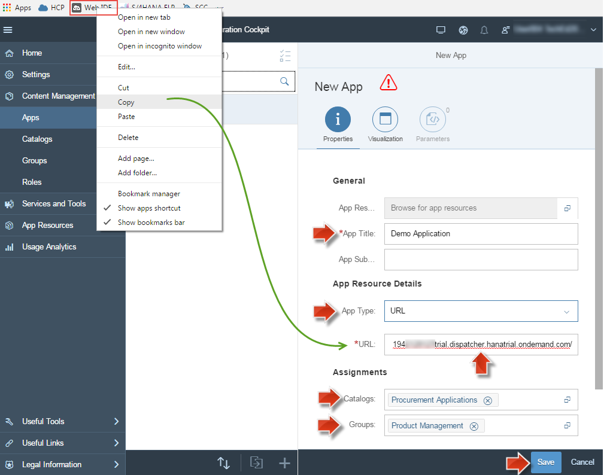

4.  Preview the new launchpad:

5.  Click on the **Site Preview** icon from the black toolbar bar in the top right corner.

      

6.  Verify that your `Demo Application` tile correctly works by navigating to the SAP Web IDE that starts in a new browser tab.

      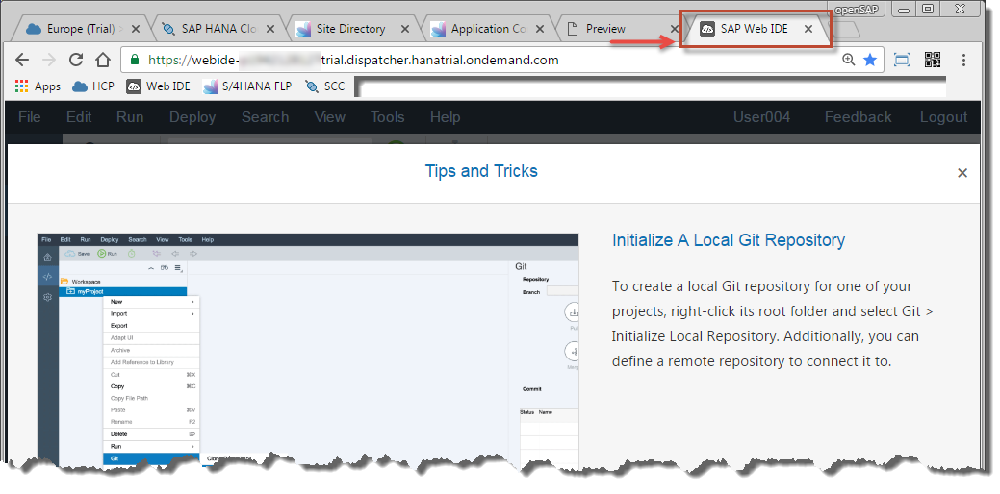

[ACCORDION-END]

[ACCORDION-BEGIN [Step 5:](Publish the launchpad site)]

In this page you will publish the configured SAP Fiori Launchpad in your SAP Cloud Platform trial account.

1.  Click **Home** to view the existing parts of the new site:
    - 1 Application
    - 1 Catalog
    - 2 Groups
    - 2 Roles

    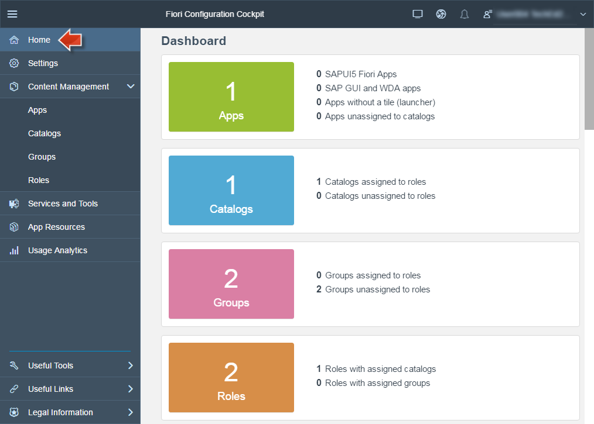

2.  Go to **Settings**.

3.  In the header toolbar click the **globe** icon to publish the site.

4.  Confirm the popup dialog and click **Publish and Open**.

    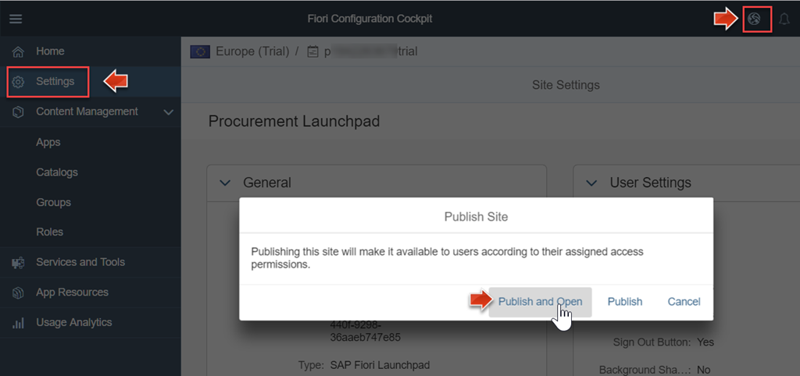

5.  Add a browser bookmark to the new site with name **SAP CP FLP**.

    

> **Result of Step 5:** You have successfully published your configured SAP Fiori Launchpad in your SAP Cloud Platform trial account.

[ACCORDION-END]

You have now successfully completed this tutorial. In the next tutorial you will learn how to import a SAPUI5 application from your SAP NetWeaver backend, register the application to the SAP Fiori Launchpad, and then extend the application by implementing sorting and filtering capabilities: [Extend an SAPUI5 application](https://www.sap.com/developer/tutorials/cp-s4-ext-ui4-build-ui.html)
