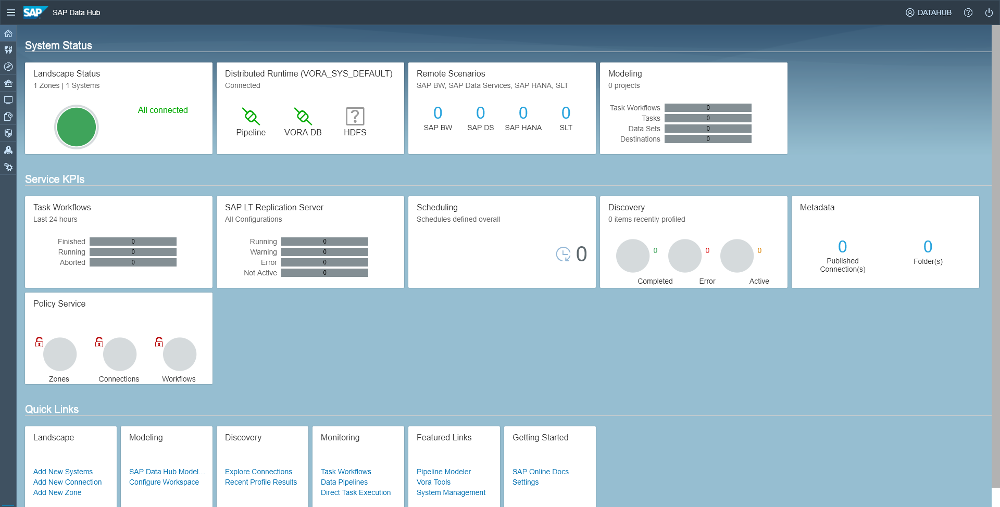

## Prerequisites  
 - **Proficiency:** Beginner

## Next Steps
 - [Navigate around SAP Data Hub, trial edition](https://www.sap.com/developer/tutorials/datahub-trial-navigation.html)

## Details
### You will learn  
During this tutorial, you will learn how to create a solution instance of SAP Data Hub, trial edition. SAP Data Hub, trial edition is provisioned via SAP Cloud Appliance Library. It runs in your account on Google Cloud Platform.

### Time to Complete
**30 Min**

---

[ACCORDION-BEGIN [Step 1: ](Create Google Cloud Platform project)]
Running SAP Data Hub, trial edition requires you to have access to a Google Cloud Platform project.

If you do not yet have an account on Google Cloud Platform, then create one as well as a  corresponding Google Cloud Platform project. Moreover you also need a so-called service account which is used by SAP Cloud Appliance Library while accessing Google Cloud Platform. You find more information about projects and service accounts in the Google Cloud Platform documentation.

* Google Cloud Platform Projects: <https://cloud.google.com/storage/docs/projects>
* Google Cloud Platform Service Accounts: <https://cloud.google.com/iam/docs/service-accounts>

The necessary roles for the service account are described in the [**Getting Started with SAP Data Hub, trial edition**] (https://caldocs.hana.ondemand.com/caldocs/help/Getting_Started_Data_Hub_SP04.pdf) guide (chapter 2.1).

[DONE]

[ACCORDION-END]

[ACCORDION-BEGIN [Step 2: ](Link project to SAP Cloud Appliance Library)]
Link your Google Cloud Platform project to SAP Cloud Appliance Library. This step is described in the SAP Cloud Appliance Library [documentation](https://calstatic.hana.ondemand.com/res/docEN/042bb15ad2324c3c9b7974dbde389640.html).

[DONE]

[ACCORDION-END]

[ACCORDION-BEGIN [Step 3: ](Create solution instance)]
Next, you can create a solution instance of SAP Data Hub, trial edition via SAP Cloud Appliance Library. The necessary steps to do so are described in the [**Getting Started with SAP Data Hub, trial edition**] (https://caldocs.hana.ondemand.com/caldocs/help/Getting_Started_Data_Hub_SP04.pdf) guide (chapter 2.3).

The creation of the solution instance takes around 40 minutes.

[DONE]

[ACCORDION-END]

[ACCORDION-BEGIN [Step 4: ](Connect to SAP Data Hub Cockpit)]
After the solution instance is up and running, you can finally connect to it.

Thereto you first maintain your local host file as described in the [**Getting Started with SAP Data Hub, trial edition**] (https://caldocs.hana.ondemand.com/caldocs/help/Getting_Started_Data_Hub_SP04.pdf) guide (chapter 3.2).

Afterwards you open (`https://vhcalhxedb:51076/`) via a web browser.

Enter `DATAHUB` as **HANA Username** and the password which you have selected during step 3 as **HANA Password** to logon to SAP Data Hub Cockpit. The system displays the **Overview** page.

  

In the SAP Data Hub Cockpit, find and open the link **SAP Data Hub Modeling**. After logging in, copy the URL from the webpage address bar and paste it in the frame below and click on **Validate**.

[VALIDATE_1]

[ACCORDION-END]

[ACCORDION-BEGIN [Step 5: ](Connect to Google Cloud Storage)]
From the SAP Data Hub Cockpit you can connect the solution instance to Google Cloud Storage. This is necessary to "bring in" data into SAP Data Hub.

The steps to connect the solution instance to Google Cloud Storage are described in the **Getting Started with SAP Data Hub, trial edition** guide (chapter 4).

Afterwards upload the following three files to Google Cloud Storage. Some of the subsequent tutorials will use these files to discover data in Google Cloud Storage, profile it and transform it:

- [`Customers.csv`](https://raw.githubusercontent.com/SAPDocuments/Tutorials/master/tutorials/datahub-trial-setup/Customers.csv)
- [`Devices.csv`](https://raw.githubusercontent.com/SAPDocuments/Tutorials/master/tutorials/datahub-trial-setup/Devices.csv)
- [`Events.parquet`](https://github.com/SAPDocuments/Tutorials/raw/master/tutorials/datahub-trial-setup/Events.parquet)

>Right click each of the above links and use the "Save link as.." option to download the files on your local drive.
[DONE]

[ACCORDION-END]

---

## Next Steps
[Navigate around SAP Data Hub, trial edition](https://www.sap.com/developer/tutorials/datahub-trial-navigation.html)
