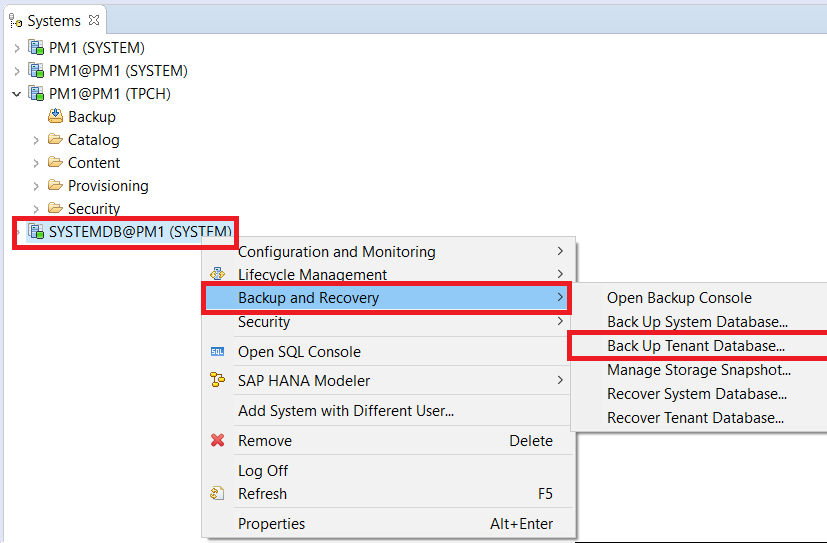
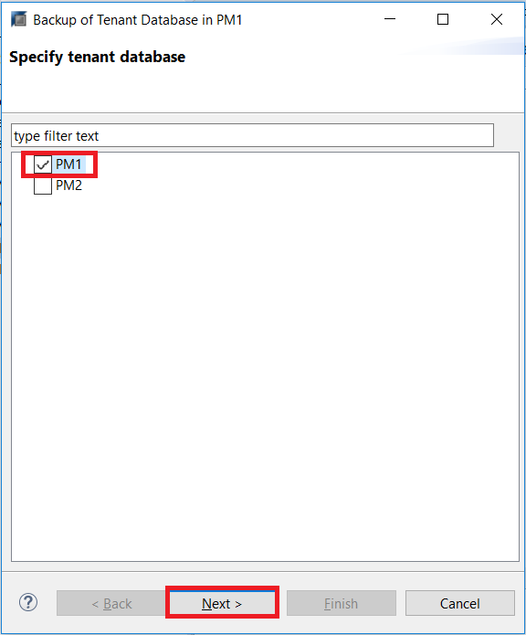
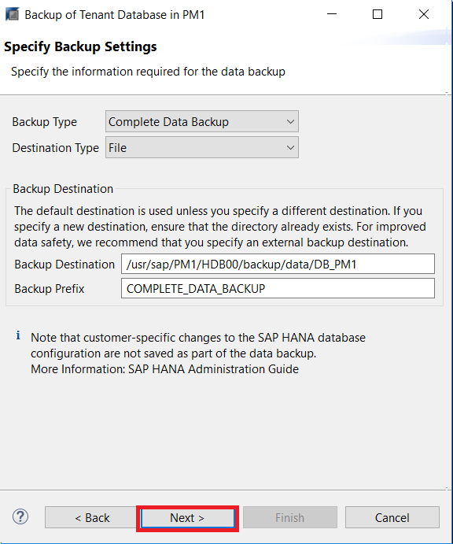
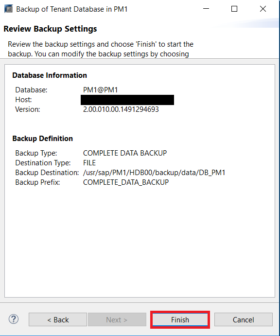
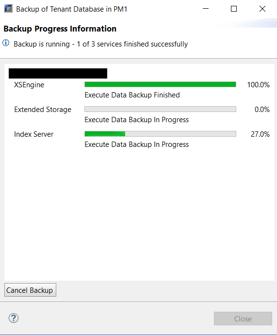
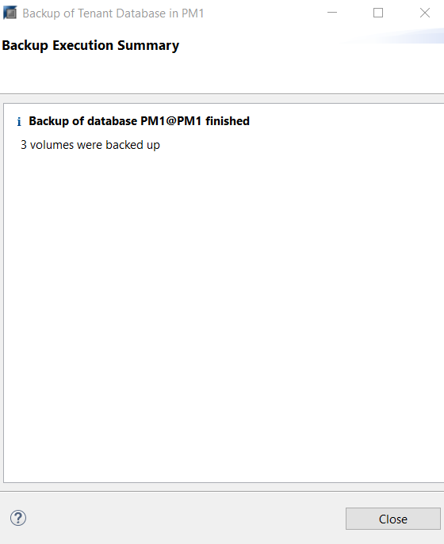

## Prerequisites
 - **Proficiency:** Beginner
 - **Tutorials** [Initializing Database Backup and Recovery](https://www.sap.com/developer/tutorials/dt-backup-recovery-part1.html)


## Next Steps
 - **Tutorials** [Database Recovery With HANA Dynamic Tiering](https://www.sap.com/developer/tutorials/dt-backup-recovery-part3.html)

## Details
### You will learn
- How to backup the System and Tenant Databases
- Different types of backups available

### Time to Complete
**15 Min**

---

[ACCORDION-BEGIN [Step 1: ](Backing Up the Tenant Database)]

In a Multi-Tenant Database system, a Tenant database is backed up through its System database.

To perform a backup, navigate to the Systems panel in your SAP HANA Administration Console, and right click the System database. After clicking on "**Backup and Recovery**" you will see options such as:
- Open Backup Console
- Back Up System Database...
- Back Up Tenant Database...

> Note: You can also use the Backup Console, rather than selecting "Back Up System Database..."" to backup your System Database as well.

For the purposes of this tutorial we will be backing up a Tenant database.

Select "Back Up Tenant Database:



SAP HANA Studio will then check readiness of backups, before prompting you to specify which Tenant database you want to backup. Check the Tenant database you want to backup and click **Next**.



The **Specify Backup Settings** window will open and where you can alter the "**Backup Destination**" and "**Backup Prefix**". Accept the default backup destination path as:
"`/usr/sap/<SID>/HDB<Instance#>/backup/data`"
for consistency.

> Note: From the last tutorial, we saw the default directory for `basepath_databackup` in the System's Configuration > Persistence. This is the the default backup destination path that appears in the window below, where `$(DIS_INSTANCE)` is `/usr/sap/<SID>/HDB<Instance#>/`.



> Note: You can change the "Backup Prefix" and enter a name of your choice. If the backup prefix is not changed, then each subsequent backup will overwrite the previous backup version. To maintain multiple backup versions, make sure that the next time you create the backup, the backup prefix is different than the previous one

Click "**Next**" which will give you a chance to review the backup settings before starting the backup.



If the backup settings look correct, then go ahead and click "**Finish**" to start the backup. You will see the backup being performed as shown below.



Once the backup completes, a "**Backup Execution Summary**" screen will be displayed which will verify the number of volumes that were backed up.



[DONE]
[ACCORDION-END]

[ACCORDION-BEGIN [Step 2: ](Creating Backups Using the BACKUP SQL Statement)]
The second way to backup data is through a SQL statement. Run the following in `SystemDB's` SQL console:

```SQL
BACKUP DATA USING FILE <'<file_prefix>')
```
> Note: the `<file_prefix>` refers to the Backup Prefix that will be used. This command will use the default file path specified in the Configuration, as seen in the previous tutorial.

[DONE]
[ACCORDION-END]

<!--
[ACCORDION-BEGIN [Additional Information: ](Creating Backups for the System Database Using the Backup Editor)]

Navigate to the the Systems panel in your SAP HANA Administration Console, and right click the System database. Select **Backup and Recovery** > **Open Backup Console**. This will then open the backup editor, which allows you to view options including the crrent destination path for the backup (located under the **Configuration** tab) and existing any existing backups (under the **Backup Catalog** tab). Click the "**Open Backup**" icon (highlighted in the screenshot below) to backup the System database.


The remainder of the process is similar to the backup we performed in **Step 1** of this tutorial..

[DONE]
[ACCORDION-END]
-->

## Next Steps
 - **Tutorials** [Database Recovery With HANA Dynamic Tiering](https://www.sap.com/developer/tutorials/dt-backup-recovery-part3.html)
