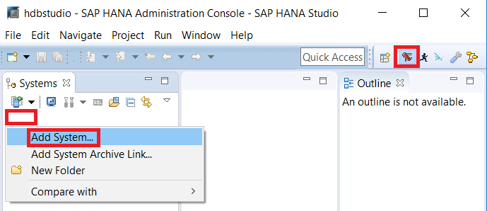
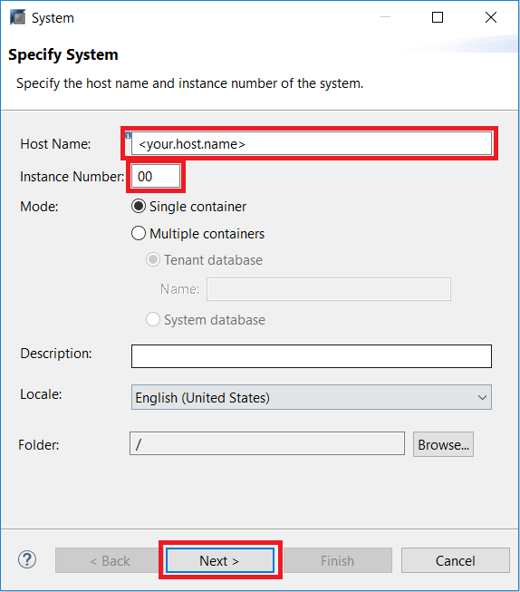
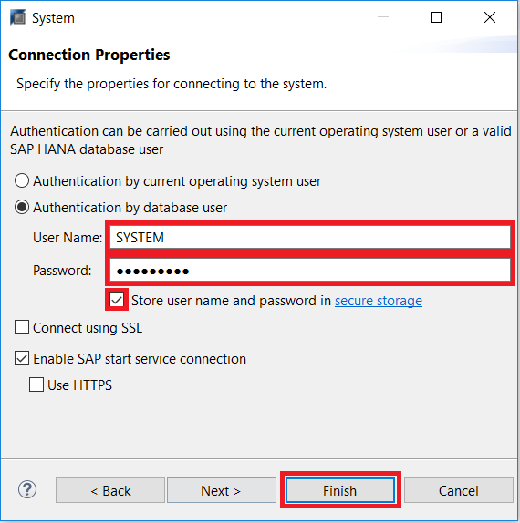
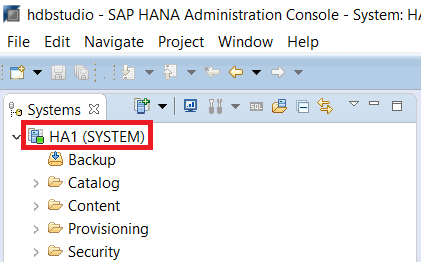
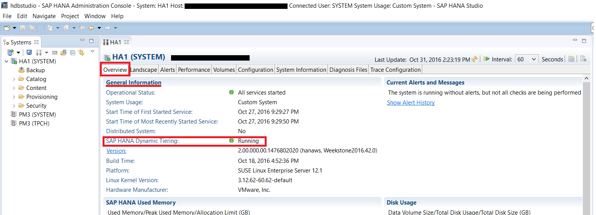
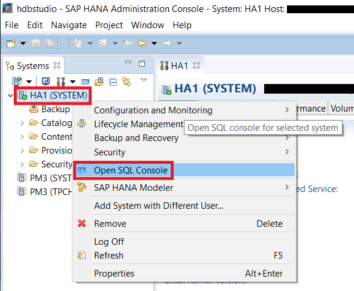

## Prerequisites
 - **Proficiency:** Beginner
 - **System:** Access to an SAP HANA 2.0 system with the optional SAP HANA Dynamic Tiering component installed. For older systems, please refer to [Dynamic Tiering Quick Start Guide - Lesson 1 - Creating Tables and Loading Data](http://www.sap.com/documents/2016/06/00f107f2-747c-0010-82c7-eda71af511fa.html) for instructions.
 - **Credentials:** Connection details to initially connect as the "SYSTEM" user.
 - **Integrated Development Environment:** Basic working knowledge of SAP HANA Studio. E.g. You should be able to connect to your HANA instance from SAP HANA Studio and feel comfortable with executing simple queries.

## Next Steps
 - **Tutorials:** [Create a New User and Assign Permissions](https://www.sap.com/developer/tutorials/dt-create-schema-load-data-part2.html)

## Details
### You will learn
 - Connecting to a SAP HANA system.
 - Verifying the status of SAP HANA dynamic tiering.
 - Create extended storage for the Dynamic Tiering host.

### Time to Complete
**10 Min**.

---

[ACCORDION-BEGIN [Step 1: ](Connect to a SAP HANA System)]
Open SAP HANA Studio. In the **SAP HANA Administration Console** perspective, right click in the white space within the **Systems** view on the left. Next select the **Add System...** menu item to execute it. You can also press **S**.



Enter the **Host Name** and the **Instance Number** of the SAP HANA host you will connect to. When you are done, click **Next**. You can also press **Alt+N**.



Enter "`SYSTEM`" as the **User Name** and enter your **Password**. Click the **Store user name and password in secure storage** checkbox so you won't have to re-enter your credentials when re-connecting to the system. Next click **Finish** or press **Alt+F**.




[ACCORDION-END]

[ACCORDION-BEGIN [Step 2: ](Verify Extended Storage Status)]
In the **System** view on the left side, double click on your system (format: `<SID> (SYSTEM)`) to open up the "Overview" tab.



In the **Overview** tab and under **General Information**, check the status of **SAP HANA Dynamic Tiering** (It should be under **Distributed System**).  If what you see is:

  - Empty and/or the "SAP HANA Dynamic Tiering" line does not exist, it probably means that Dynamic Tiering is not installed. Please install and register Dynamic Tiering before proceeding.
  - Status of "Errors" with a red circle. It might mean that Dynamic Tiering is not running. Please restart the Dynamic Tiering process before proceeding.
  - Status of "Installed but not running yet" with a yellow triangle, then proceed to **Create Extended Storage** section below.
  - Status of "Running" with a green box, then you are all set and can skip the rest of this tutorial section by scrolling to the bottom of this lesson and clicking the link to part 2.




[ACCORDION-END]

[ACCORDION-BEGIN [Step 3: ](Create Extended Storage)]
Right click on your system (format: `<SID> (SYSTEM)`) located under the **Systems** view. Then select **Open SQL Console** to open a connected SQL console.



In the SQL console, paste in the following script:
``` sql
CREATE EXTENDED STORAGE AT '<your.machine.name>' size 1000 MB;`
```
Replace "`<your.machine.name>`" with the host name of the machine where the Dynamic Tiering component is installed.


Click the Execute button to run the SQL script and create the extended storage `dbspace` for SAP HANA Dynamic Tiering. You can also press **F8**. Make sure it completes successfully. Go back to the **Verify Extended Storage Status** section to verify that extended storage is set up successfully.


[ACCORDION-END]

[ACCORDION-BEGIN [Step 4: ](Additional Information)]
The "CREATE EXTENDED STORAGE" statement creates the warm store and the required `dbspaces`. A `dbspace` is a logical name for a container of files used to store the Dynamic Tiering table data and related objects. `Dbspaces` are specialized to manage specific types of data. Types of `dbspaces` used by Dynamic Tiering include `ES_SYSTEM`, `ES_USER`, `ES_DELTA` etc. Creating the extended storage `dbspace` is a prerequisite to creating extended tables.


[ACCORDION-END]

## Next Steps
  - **Tutorials:** [Create a New User and Assign Permissions](https://www.sap.com/developer/tutorials/dt-create-schema-load-data-part2.html)
