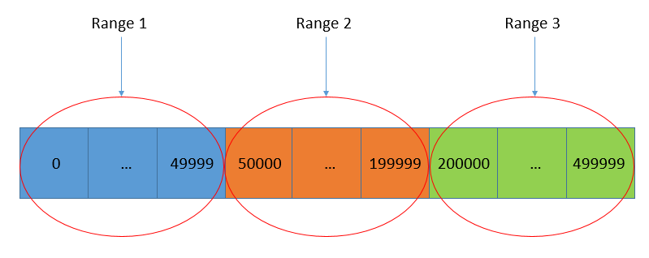
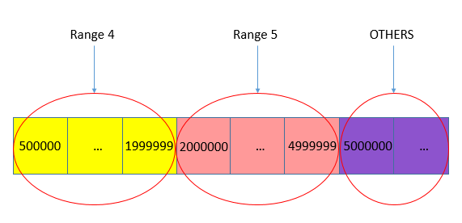
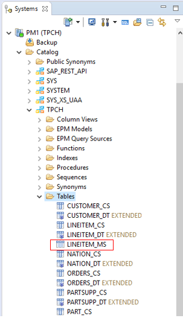
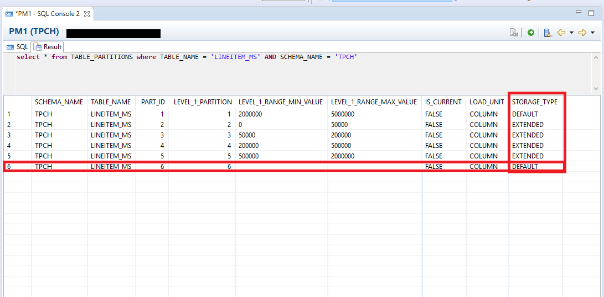
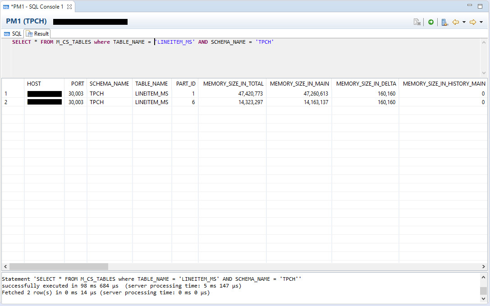
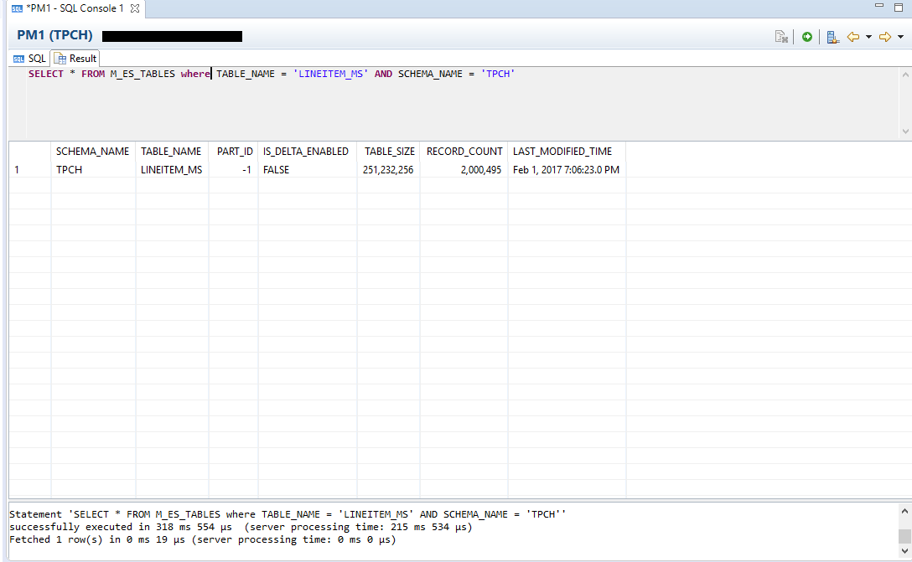

## Prerequisites
 - **Proficiency:** Beginner
  - **Tutorials:** [View Data Across Both In-Memory and Dynamic Tiering Tables Using a SQL View](http://www.sap.com/developer/tutorials/dt-create-schema-load-data-part7.html)

## Details
### You will learn
 - What a Multi-Store table is
 - Partitioning Types
 - Creating Multi-Store Tables

### Time to Complete
**10 Min**.

---

[ACCORDION-BEGIN [Step 1: ](Multistore Tables)]

Multistore tables are a type of SAP HANA column tables which can have partitions in the in-memory DEFAULT COLUMN STORAGE as well as other partitions in Dynamic Tiering EXTENDED STORAGE.

Multistore data management allows for administration tasks to be carried out more freely including:

  - Moving data between EXTENDED or DEFAULT STORAGE
  - Creating or dropping partitions directly in either EXTENDED or DEFAULT STORAGE
  - Repartitioning a table, if new partitioning does not move data between DEFAULT and EXTENDED STORAGE

One function of multistore tables is data aging which allows you to "age out" older data using Dynamic Tiering. Every multistore table contains at least two partitions: one of which is in the in-memory DEFAULT STORAGE and the other is in disk based EXTENDED STORAGE. This allows you to still access and update older data without managing two separate systems for current or older data and is cost effective as well. There may be some older data that isn't frequently used and so the "cold" data is moved into extended storage and the "hot" new and frequently used data remains in-memory.

[DONE]
[ACCORDION-END]

[ACCORDION-BEGIN [Step 2: ](Partitioning Types and Creating a Multistore Table)]

The types of partitioning include: range partitioning, hash-range and range-range partitioning, and time-selection partitioning.

In this module we will create a multistore table that uses single level Range partitioning. With single level range partitioning, at least one range partition must be in the DEFAULT STORAGE and one range partition in extended storage. Only range partitions are supported when it comes to single-level partitioning. The diagram below shows the ranges that will be defined.





> Note: We will store ranges 1 to 4 in EXTENDED STORAGE and range 5 and "`OTHERS`" in the in-memory DEFAULT STORAGE. The "`OTHERS`" range is optional but if it is created, it is always in DEFAULT STORAGE.

/Ignore this text. Used for formatting purposes./

Since multistore tables have been implemented on top of existing HANA and Dynamic Tiering capabilities, existing limitations of HANA and Dynamic Tiering are also inherited by multistore tables. The following are unsupported data types:

  - TIMESTAMP
  - SHORTTEXT
  - TEXT
  - ARRAY

The following are limitations set on table and index definitions:

  - No full text or geocode indexes
  - Several clauses specific to in-memory tables are not supported, other clauses will only apply to either the in-memory partition or the EXTENDED STORAGE partitions
  - No triggers on partitions in EXTENDED STORAGE

To create the single level range partitioned multistore table, copy the following into the SQL console and execute it.

``` sql
CREATE COLUMN TABLE "TPCH"."LINEITEM_MS" (
    L_ORDERKEY           integer                        not null,
    L_PARTKEY            integer                        not null,
    L_SUPPKEY            integer                        not null,
    L_LINENUMBER         integer                        not null,
    L_QUANTITY           decimal(15,2)                  not null,
    L_EXTENDEDPRICE      decimal(15,2)                  not null,
    L_DISCOUNT           decimal(15,2)                  not null,
    L_TAX                decimal(15,2)                  not null,
    L_RETURNFLAG         char                           not null,
    L_LINESTATUS         char                           not null,
    L_SHIPDATE           date                           not null,
    L_COMMITDATE         date                           not null,
    L_RECEIPTDATE        date                           not null,
    L_SHIPINSTRUCT       char(25)                       not null,
    L_SHIPMODE           char(10)                       not null,
    L_COMMENT            varchar(44)                    not null,
    primary key (L_ORDERKEY, L_LINENUMBER)
)
PARTITION BY RANGE ("L_ORDERKEY")
(
	USING DEFAULT STORAGE
	(		PARTITION OTHERS,
      PARTITION 2000000 <= VALUES < 5000000
	)
	USING EXTENDED STORAGE
	(		PARTITION 0 <= VALUES < 50000,
			PARTITION 50000 <= VALUES < 200000,
			PARTITION 200000 <= VALUES < 500000,
			PARTITION 500000 <= VALUES < 2000000
	)
);
```
  The above script will create a table called "`LINEITEM_MS`". The partitions defined for DEFAULT STORAGE will hold any records with `L_ORDERKEY` values between 2,000,000 and 4,999,999, or `L_ORDERKEY` values that do not fall under any other specified range. The partitions defined for EXTENDED STORAGE will hold any records with `L_ORDERKEY` values between 0 and 49,999; 50,000 and 199,999; 200,000 and 499,999;  or 500,000 and 1,999,999.

  After executing the "`CREATE TABLE`" statement, refresh `TPCH` schema and make sure you see "`LINEITEM_MS`" as seen below.


>Note: Notice how the multistore table does not show an "`EXTENDED`" or other attributes in Studio

[DONE]
[ACCORDION-END]

[ACCORDION-BEGIN [Step 3: ](Importing Data in to a Multistore Table)]
To import data into the newly created table, execute the following in a SQL Console.

``` sql
IMPORT FROM CSV FILE '/hana/shared/PM1/HDB00/work/TPCH_Data/LineItem.csv' INTO "TPCH"."LINEITEM_MS";
```

Confirm the table has been filled with data after executing by right clicking on the table and selecting "Open Data Preview".
>Note: The "`IMPORT`" statement cannot use the "`THREADS`" clause since it will be loading into Dynamic Tiering.

[DONE]
[ACCORDION-END]

[ACCORDION-BEGIN [Step 4: ](Viewing Multistore Partitions)]
There are several database administration views available to provide information for partitioned tables, including multistore tables. Some of the information available includes:

- What partitions exist for a given table
- Memory utilization for in-memory partitions in DEFAULT STORAGE
- Disk utilization for partitioned data stored in EXTENDED STORAGE

Execute the following in a SQL Console to view the ranges created in your range partition.
``` sql
select * from TABLE_PARTITIONS where TABLE_NAME = 'LINEITEM_MS'
```

You should see the following once you execute the statement above. Notice how "`LEVEL_1_RANGE_MIN_VALUE`" and  "`LEVEL_1_RANGE_MAX_VALUE`" for row 6 is empty. The reason for it being empty is because it represents "`OTHERS`". Remember that "`OTHERS`" does not have a set minimum value nor a maximum value, it simply collects anything that does not fall under any of the other partitions. If you scroll right, you will see a column labelled "`STORAGE_TYPE`" which shows you what the storage type for each partition is.



To verify that data has actually gone into the partitions, we can individually check the DEFAULT STORAGE and EXTENDED STORAGE.

To check that data has gone into DEFAULT STORAGE, execute the following in a SQL Console:
``` sql
SELECT * FROM M_CS_TABLES where TABLE_NAME = 'LINEITEM_MS' AND SCHEMA_NAME = 'TPCH'
```
Remember that `PART_ID` 1 and 6 represent partitions in DEFAULT STORAGE and the "`MEMORY_SIZE_IN_TOTAL`" column shows data has indeed been put into those partitions.


To check that data has gone into EXTENDED STORAGE, execute the following in a SQL Console:
``` sql
SELECT * FROM M_ES_TABLES where TABLE_NAME = 'LINEITEM_MS' AND SCHEMA_NAME = 'TPCH'
```


Notice that only 1 partition is shown in EXTENDED STORAGE and that it has a `PART_ID` of -1. The `PART_ID` is -1 because although logically, the Dynamic Tiering portion has multiple partitions within it, physically the Dynamic Tiering portion is stored as a single table. Since the data for the "`LINEITEM_MS`" partitions in EXTENDED STORAGE are in a single physical partition, we can't tell how much data is in each logical partition. However, we can see from the "`TABLE_SIZE`" column that data has been stored in EXTENDED STORAGE for the "`LINEITEM_MS`" table.

[DONE]
[ACCORDION-END]

---
