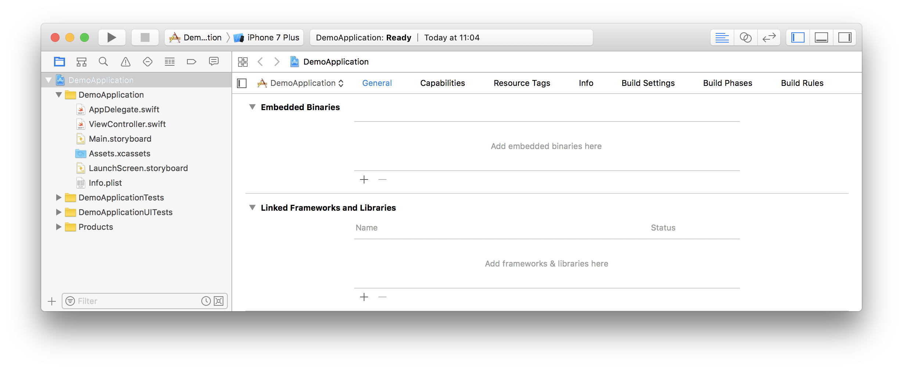
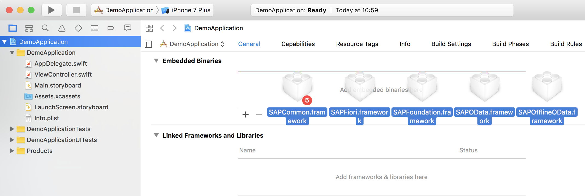
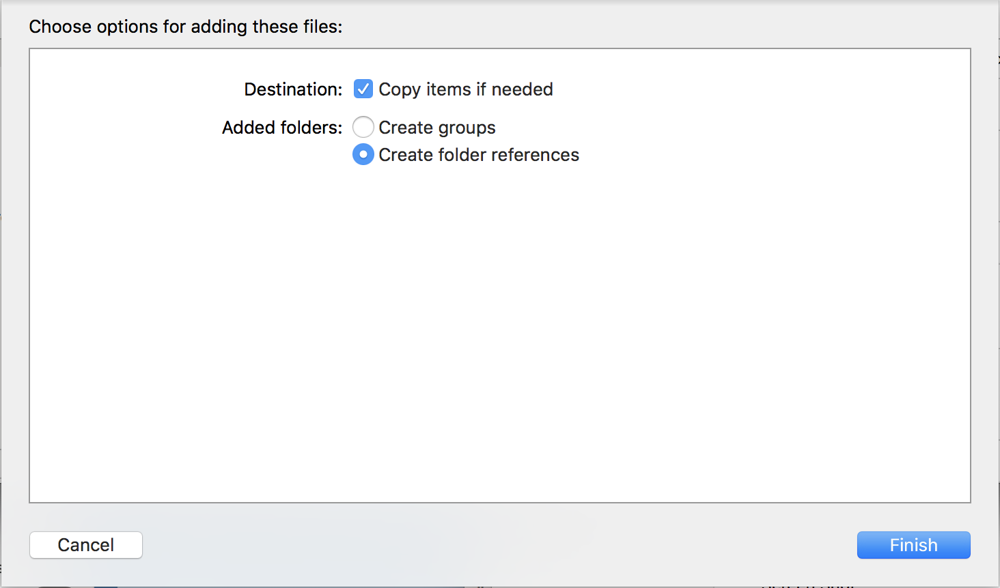
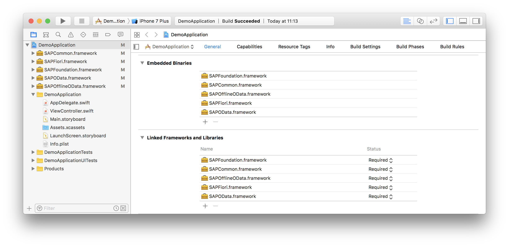
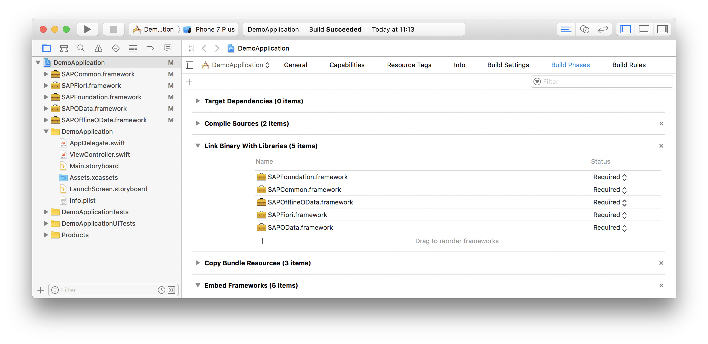

## Prerequisites  
 - **Proficiency:** Beginner
 - **Development machine:** Access to a Mac computer
 - **Tutorials:** [Debug and deploy the iOS app to an iPad](https://go.sap.com/developer/tutorials/xcode-debug-deploy.html)

## Next Steps
 - [Enable SAP Cloud Platform, mobile services](https://go.sap.com/developer/tutorials/fiori-ios-hcpms-setup.html)

## Details
### You will learn  
In this small tutorial, you will learn to add the SAP Cloud Platform for iOS SDK framework files to your project, and set the correct references.

> **NOTE: If you plan to use the *SDK Assistant* tool, you can skip this tutorial. The *SDK Assistant* will set the correct SDK configuration and references in the generated Xcode project**

### Time to Complete
**5 Min**.

---

[ACCORDION-BEGIN [Step 1: ](Store SDK files locally)]

Download the `SAP-CP-SDK-for-iOS.dmg` disk image file. Double-clicking the file will mount it as a drive. Open the mounted image, and you will see it contains 3 folder and one application:

1.  Application `SAP Cloud Platform SDK for iOS Assistant` will be covered in tutorial [Creating an app using the SDK Assistant](https://go.sap.com/developer/tutorials/fiori-ios-hcpms-sdk-assistant.html).
2.  Folder `Documentation` contains the API docs for the SDK.
3.  Folder `Tools` contain scripts to generate OData proxy classes manually
3.  Folder `Frameworks` contain the actual SDK framework files.

    Open the folder `Frameworks > Release-fat`. These contain the following 5 framework files:

    | Filename | Description |
    |---|---|
    | `SAPCommon.framework` | Includes fundamental components that integrate the application with SAP Cloud Platform mobile service for development and operations, such as logging, that are also used by other framework components|
    | `SAPFoundation.framework` | Includes components that integrate the application with SAP Cloud Platform mobile services, including communication, authentication, caching, remote notifications, and so on |
    | `SAPOData.framework` | Use the `SAPOData` component to interact with an OData endpoint. `SAPOData` parses OData payloads, produces OData requests, and handles responses for OData versions 2 and 4. |
    | `SAPOfflineOData.framework` | Use the `SAPOfflineOData` component to add offline capability to your application. |
    | `SAPFiori.framework` | Includes a number of UI components which implement the Fiori Design Language. These inherit from the Apple `UIKit` components. |

**Copy** the content of the mounted `SAP-CP-SDK-for-iOS.dmg` image to a local folder on your development machine.

[DONE]
[ACCORDION-END]

[ACCORDION-BEGIN [Step 2: ](Open or create Xcode project)]

Open your Xcode `com.sap.tutorial.demoapp.DemoApplication` project (or create a new one)

[DONE]
[ACCORDION-END]

[ACCORDION-BEGIN [Step 3: ](Open the project configuration)]

Select your **project file** from the **Project Navigator** and under the **General** tab, scroll down to the **Embedded Binaries** section:

[DONE]
[ACCORDION-END]

[ACCORDION-BEGIN [Step 4: ](Add SDK files to group)]

Open a **Finder** window and navigate to `./<local_SDK_root>/Frameworks/Release-fat` folder.

Drag and drop the 5 framework files into the **Embedded Binaries** section in the **General** tab of your project configuration:

In the dialog that appears, make sure you have selected **Copy items if needed** as well as **Create folder references**:

[DONE]
[ACCORDION-END]

[ACCORDION-BEGIN [Step 5: ](Close dialog)]

Click **Finish** to close the dialog. Your project structure should now resemble the following:

[DONE]
[ACCORDION-END]

[ACCORDION-BEGIN [Step 6: ](Check if SDK files are linked)]

In the same editor, switch to the **Build Phases** tab.

Expand the **Link Binary With Libraries** panel, and make sure the three SDK files are referenced:

[DONE]
[ACCORDION-END]

## Next Steps
 - [Enable SAP Cloud Platform, mobile services](https://go.sap.com/developer/tutorials/fiori-ios-hcpms-setup.html)
