## Prerequisites  
 - **Proficiency:** Intermediate
 - **Development machine:** Access to a Mac computer
 - **Tutorials:** [Configure a back-end connection (Sample OData service)](https://www.sap.com/developer/tutorials/fiori-ios-hcpms-sample-odata-service.html)

## Next Steps
 - [Push Notifications](https://www.sap.com/developer/tutorials/fiori-ios-hcpms-push-notifications.html)

## Details
### You will learn  
In this tutorial, you will install and setup the SAP Cloud Platform SDK for iOS Assistant which comes as part of the SAP Cloud Platform SDK for iOS. After the initial setup, you generate a simple Xcode project using the Sample OData service, which can be run as an app.

### Time to Complete
**10 Min**.

---

The SAP Cloud Platform SDK for iOS Assistant ("SDK Assistant") is a macOS application that helps developing iOS applications which use the SAP Cloud Platform SDK for iOS frameworks. It speeds up development by generate code for accessing OData services, define authentication mechanism, enable remote push notifications and add logging statements.

> **It is important to realize the generated application is not suitable in a productive application.** The generated application demonstrates the OData proxy classes are working, browse their properties, and demonstrates push notifications and the various authentication mechanisms. For productive use, it is recommended to start with a new, empty project, and use parts of the generated app into your own project.

[ACCORDION-BEGIN [Step 1: ](Start SDK Assistant)]

Open a **Finder** window and navigate to the location you stored the SAP Cloud Platform SDK for iOS files, and double-click the **SAP Cloud Platform SDK for iOS Assistant** application.

The SDK Assistant runs on any Mac computer running OS X El Capitan 10.11.5 or higher.

Upon first loading, you are greeted with a welcome message, indicating the SDK Assistant needs to gather some data from SAP Cloud Platform mobile service for development and operations first:

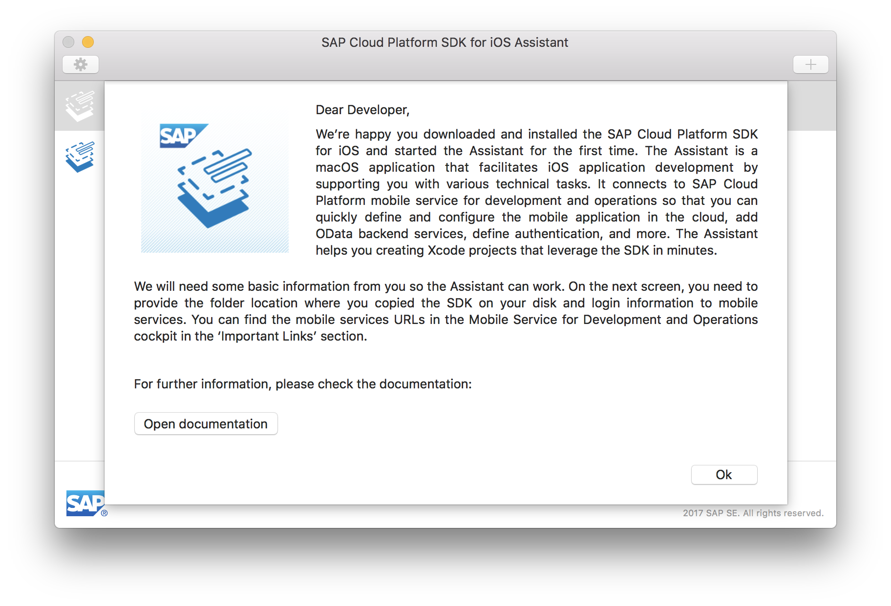

Click **OK** to continue. The SDK Assistant opens with a screen which lists any previously created projects using the SDK Assistant (if any), a **Settings** button and a **Create New Project** button.

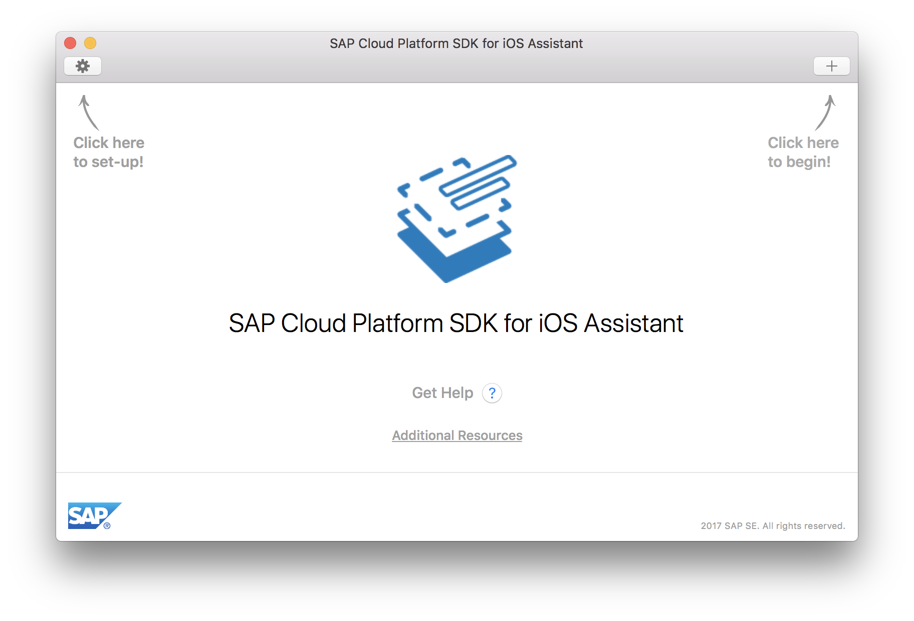

[ACCORDION-END]

[ACCORDION-BEGIN [Step 2: ](Open the Settings dialog)]

Click the **Settings** button. It will display an empty, initial configuration:

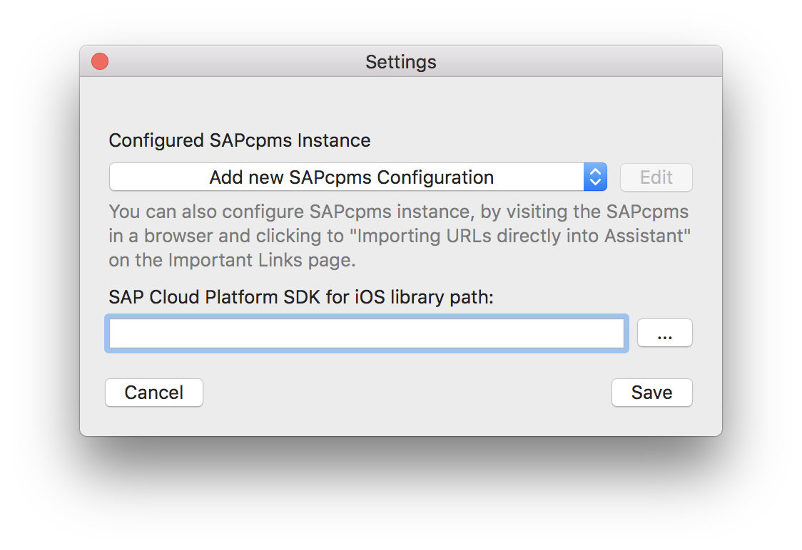

Before you can create an application using the SDK Assistant, you need to setup your SAP Cloud Platform mobile service for development and operations configuration, and specify the path to the SAP Cloud Platform SDK for iOS framework files.

[ACCORDION-END]

[ACCORDION-BEGIN [Step 3: ](Specify SAP Cloud Mobile Services details)]

Select the **Add new SAP Cloud Platform mobile service for development and operations Configuration** option from the drop-down box. It will open a new dialog where you specify your SAP Cloud Platform mobile service for development and operations configuration:

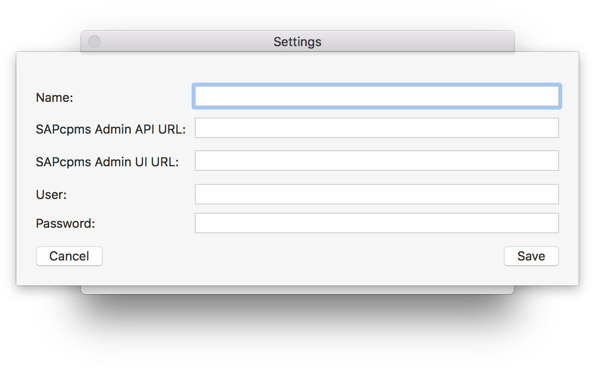

Enter the following details:

| Field | Value |
|----|----|
| `Name` | A descriptive name for your configuration, for instance 'SAP Cloud Platform mobile service for development and operations trial' |
| `SAPcpms Admin API URL` | `https://hcpms-<your ID>trial.hanatrial.ondemand.com` |
| `SAPcpms Admin UI URL` | `https://hcpmsadmin-<your ID>trial.dispatcher.hanatrial.ondemand.com/` |
| `User` | Your SAP Cloud Platform mobile service for development and operations user ID (should have Administrator role) |
| `Password` | Password for your user ID |

> If you are using a productive SAP Cloud Platform account, use the following URL's matching your subscription:

> For accounts on **`hana.ondemand.com`**, use:

> | Field | Value |
> |----|----|
> | `SAPcpms Admin API URL` | `https://mobile-<your ID>.hana.ondemand.com` |
> | `SAPcpms Admin UI URL` | `https://mobile-<your ID>.dispatcher.hanatrial.ondemand.com/` |

> For accounts on **`us1.hana.ondemand.com`**, use:

> | Field | Value |
> |----|----|
> | `SAPcpms Admin API URL` | `https://mobile-<your ID>.us1.hana.ondemand.com` |
> | `SAPcpms Admin UI URL` | `https://mobile-<your ID>.dispatcher.us1.hanatrial.ondemand.com/` |

> For accounts on **`us2.hana.ondemand.com`**, use:

> | Field | Value |
> |----|----|
> | `SAPcpms Admin API URL` | `https://mobile-<your ID>.us2.hana.ondemand.com` |
> | `SAPcpms Admin UI URL` | `https://mobile-<your ID>.dispatcher.us2.hanatrial.ondemand.com/` |

> For accounts on **`ap1.hana.ondemand.com`**, use:

> | Field | Value |
> |----|----|
> | `SAPcpms Admin API URL` | `https://mobile-<your ID>.ap1.hana.ondemand.com` |
> | `SAPcpms Admin UI URL` | `https://mobile-<your ID>.dispatcher.ap1.hanatrial.ondemand.com/` |

Click **Save** to store your SAP Cloud Platform mobile service for development and operations configuration.

[ACCORDION-END]

[ACCORDION-BEGIN [Step 4: ](Specify SDK framework path)]

Now, you need to specify the path to the SAP Cloud Platform SDK for iOS. Point to the `Frameworks` folder which contains the `Release-fat` folder, along with the other `Release-xxx` folders.

Click **Save** to store your SDK Assistant configuration.

[ACCORDION-END]

[ACCORDION-BEGIN [Step 5: ](Create application)]

You are now ready to create your first application using the SDK Assistant. Click the **Create New Project** button in the top right.

Enter the following details:

| Field | Value |
|----|----|
| Product Name | `Demo` |
| Author | Your name |
| Organization Name | `SAP` |
| Organization Identifier | `com.sap.tutorial.demoapp` |
| Destination | Path to store the generated Xcode project |

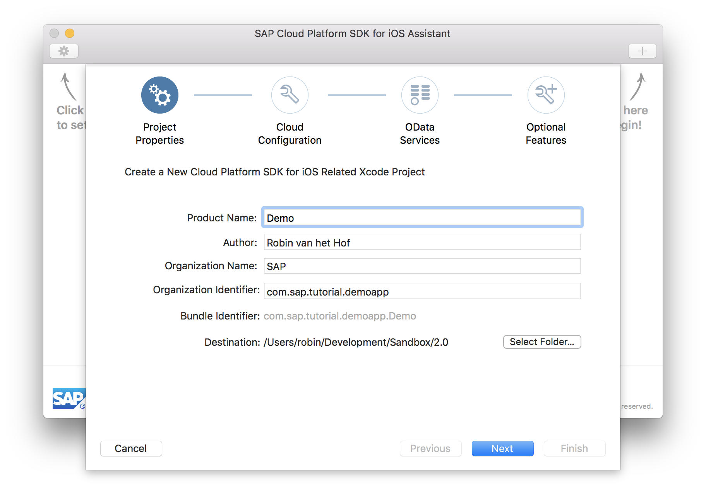

> You can use any **Product Name** and **Organization Identifier**, but this tutorial as well as the follow-up tutorials use the names as provided here.

Click **Next** to continue.

[ACCORDION-END]

[ACCORDION-BEGIN [Step 6: ](Select the application definition)]

Select the **Use Existing** tab:

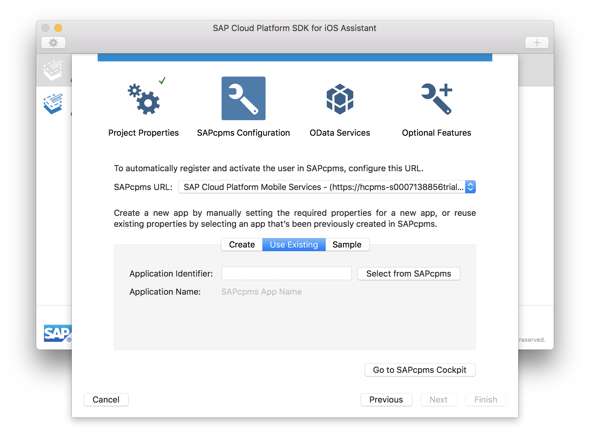

Click the **Select from SAP Cloud Platform mobile service for development and operations** button, and from the dialog, select the `com.sap.tutorial.demoapp.Demo` application from the list:

Click **OK** when done. The application identifier and application name are now pre-filled.

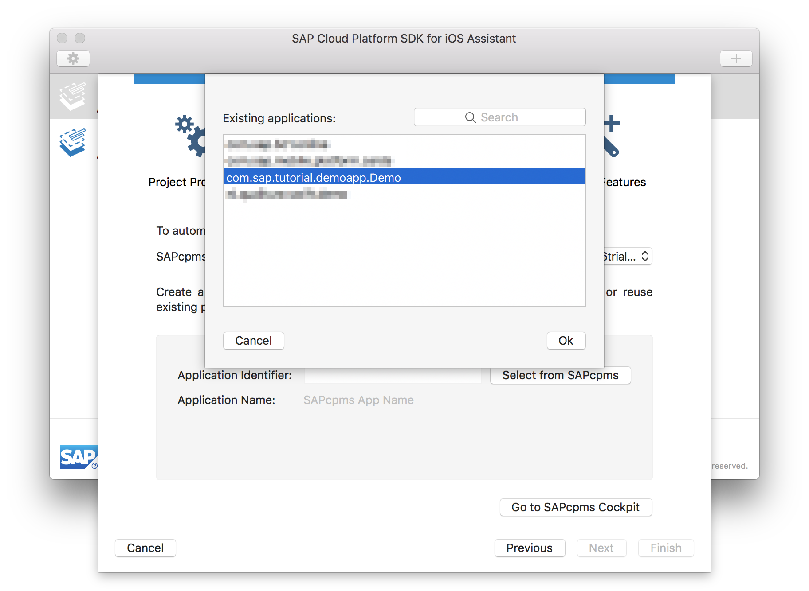

Click **Next** to continue.

[ACCORDION-END]

[ACCORDION-BEGIN [Step 7: ](Select the back end connection)]

In the next screen, the available OData connection is displayed. Since you already defined an OData connection when creating the application on SAP Cloud Platform mobile service for development and operations, it is listed here and set as the primary.

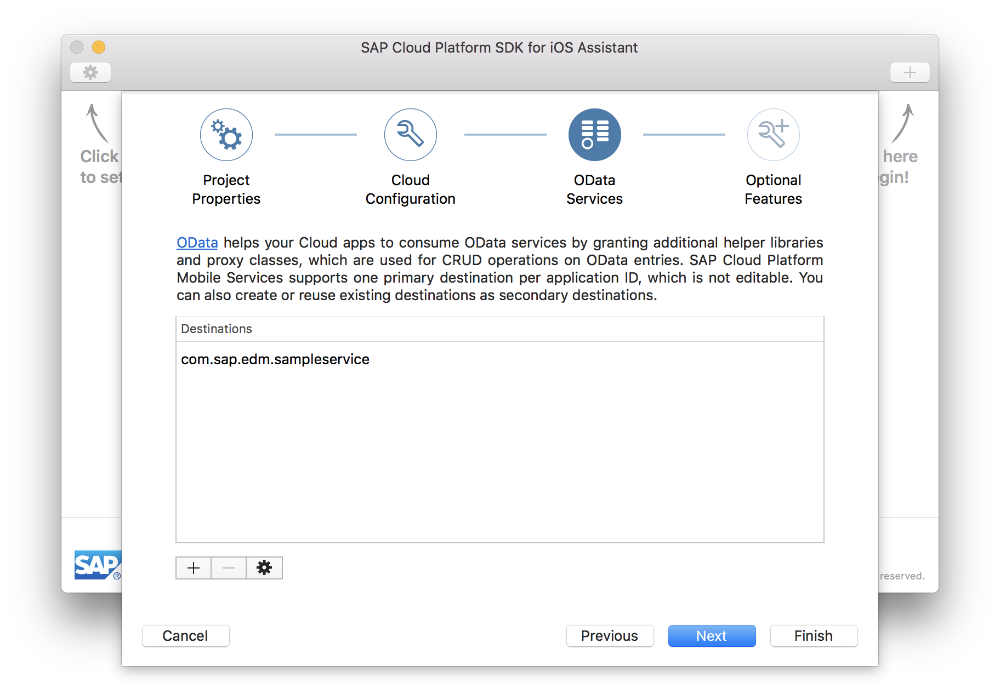

Click **Next** to continue.

[ACCORDION-END]

[ACCORDION-BEGIN [Step 8: ](Select additional options)]

In the final screen, you have a few options.

You can choose whether or not you want to **Generate a Master-Detail application** based on the OData service linked with your application. If you uncheck the checkbox, the wizard will simply generate a placeholder Xcode project containing generated proxy classes for all entities in your OData service, allowing your application to communicate with the back-end system.

If you leave the checkbox checked, it will generate not only the proxy classes, but also create a data browser user interface for testing the configuration.

> **It is important to realize the generated application is not suitable in a productive application.** The generated application demonstrates the OData proxy classes are working, browse their properties, and demonstrates push notifications and the various authentication mechanisms. For productive use, it is recommended to start with a new, empty project, and use parts of the generated app into your own project.

In addition, when you leave the **Generate Master-Detail Application** checked, you can also choose whether or not you want to enable the logging service, as well as allow your application to receive remote push notification.

For this tutorial, make sure you have all checkboxes checked:

Click **Finish** to continue.

[ACCORDION-END]

[ACCORDION-BEGIN [Step 9: ](Examine the generated application project)]

The SDK Assistant now takes a few seconds to generate the application project, and once finished, it will open **Xcode** with the generated application project:

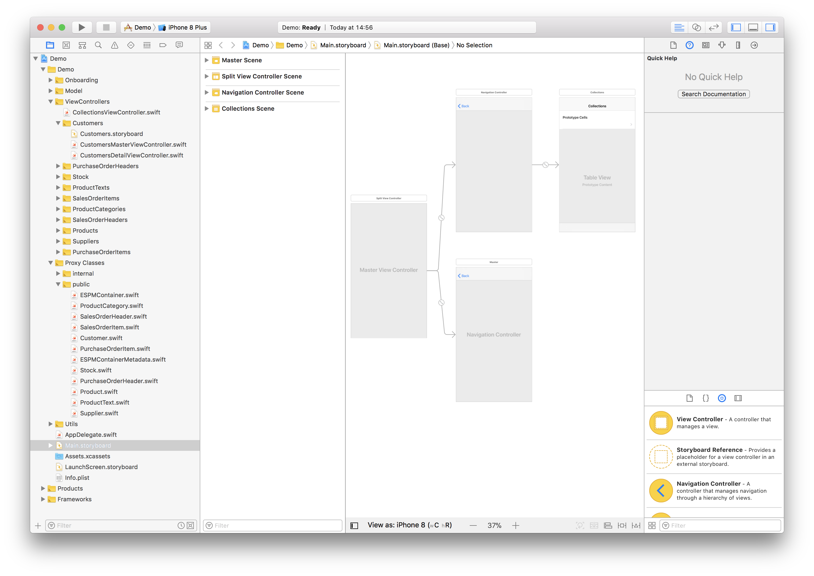

As you see, it has generated **Proxy Classes** for each entity of the specified OData service, generated **Views** and **View Controllers**, and tied them together in the **Storyboard**.

> In the previous tutorial where you set up the Sample OData service, you also set the application's **Security Configuration** to **Basic**. This forces the SDK Assistant to generate an extra **Authentication View** and **Controller**. For our application, authentication is needed to access the Sample OData service.

> Would you have set **Security Configuration** to **None**, the authentication views and logic would not be generated, and users will access your application anonymously.

[ACCORDION-END]

[ACCORDION-BEGIN [Step 10: ](Build and run the application)]

Click the **Build and Run** button in Xcode.

The **Simulator** now starts up, and launches your application.

[ACCORDION-END]

[ACCORDION-BEGIN [Step 11: ](Push Notifications confirmation message)]

Once finished loading, you will get a confirmation message asking permission to allow push notifications:

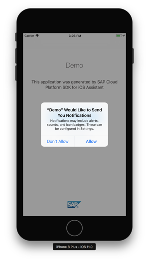

Click the **Allow** button to allow receiving of push notifications.

> If you run the app in the **Simulator**, you can select any option, since the simulator does not support receiving push notifications.

> If you run the app on a physical iOS device, it then stores your preference in the settings. You can change these preferences later in the iOS device by navigating to **Settings > Notifications > Demo App** and enable/disable notifications from here.

[ACCORDION-END]

[ACCORDION-BEGIN [Step 12: ](Log on to the application via SAP Cloud Platform mobile service for development and operations)]

At the **Logon** screen in your app, enter your **SAP Cloud Platform mobile service for development and operations login credentials** and click the **Log in** button:

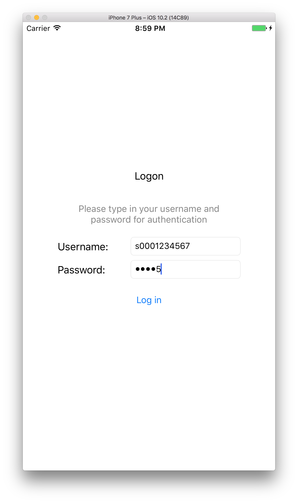

[ACCORDION-END]

[ACCORDION-BEGIN [Step 13: ](Examine the list of available entities)]

You will now see your app with all your OData service entities in the Master view:

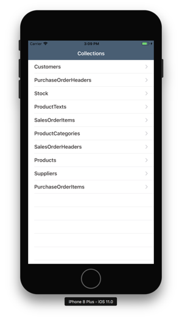

[ACCORDION-END]

[ACCORDION-BEGIN [Step 14: ](Examine the Suppliers Master view)]

Click on, for instance, **Suppliers**, it will now load the **Supplier** entities and display their name and ID:

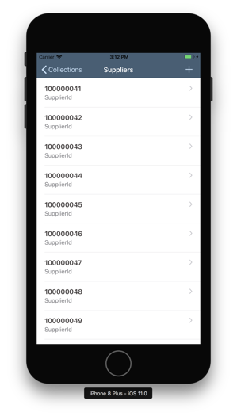

[ACCORDION-END]

[ACCORDION-BEGIN [Step 15: ](Examine a Supplier Detail view)]

If you now click on one of the **Supplier** entities, it will display the **Detail** view for that entity:

[ACCORDION-END]

## Next Steps
- [Push Notifications](https://www.sap.com/developer/tutorials/fiori-ios-hcpms-push-notifications.html)
