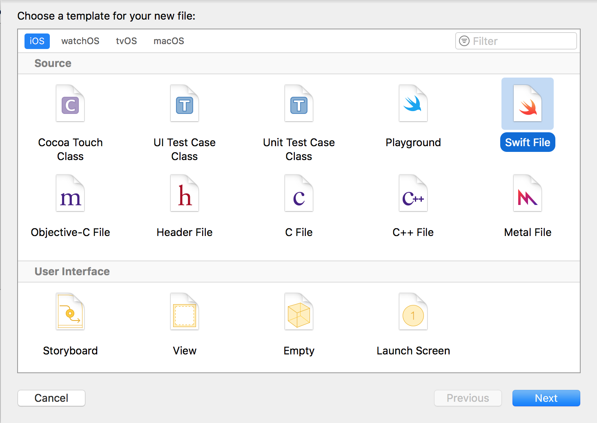
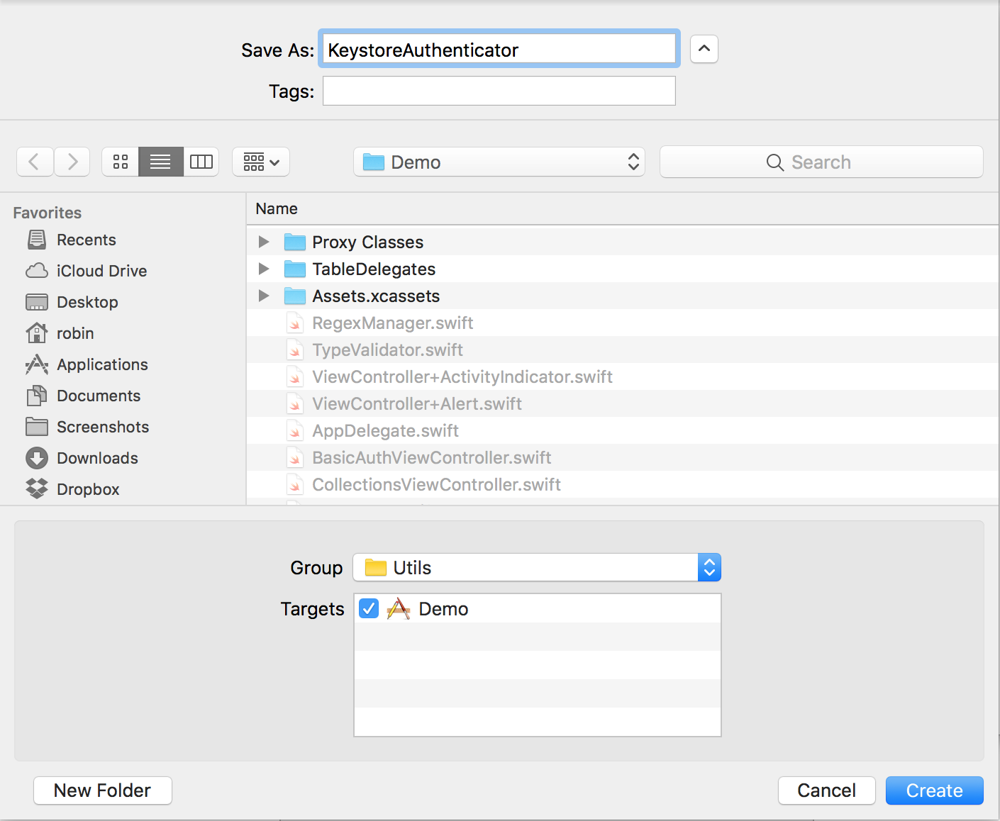

## Prerequisites  
 - **Proficiency:** Intermediate
 - **Development machine:** Access to a Mac computer
 - **Tutorials:** [Offline OData - Error handling](https://www.sap.com/developer/tutorials/fiori-ios-hcpms-offline-odata-errorhandling.html)

## Next Steps
 - [SAML and OAuth 2 authentication](https://www.sap.com/developer/tutorials/fiori-ios-hcpms-saml-oauth.html)

## Details
### You will learn  
In this tutorial, you will use the Basic Authentication secured application and store the credentials in the SDK's secure store.

### Time to Complete
**10 Min**.

---

In the previous tutorials, you have worked with an application generated by the SDK Assistant. The application definition on SAP Cloud Platform Mobile Services was configured to use basic authentication.

In this tutorial, we will implement the SAP Cloud Platform SDK for iOS secure store to store the user credential, so you need to provide your login credentials just once. Every subsequent login will then use the credentials stored in this secure store.

[ACCORDION-BEGIN [Step 1: ](Create new Swift class)]

Open the Xcode project, and locate the `Demo > Utils` group. Right-click this folder, and from the context menu, select **New File...**


Select the template **iOS > Swift File** and click **Next**



[DONE]
[ACCORDION-END]

[ACCORDION-BEGIN [Step 2: ](Specify class name)]

Specify name `KeystoreAuthenticator` for this file and click **Next**



The new Swift file is now created. In this file, you will now add logic to initialize the secure store, and read / save functionality.

[DONE]
[ACCORDION-END]

[ACCORDION-BEGIN [Step 3: ](Add import statements)]

First, you need a few extra imports. Below the already existing `Foundation` import, add the following two imports:

```swift
import UIKit
import SAPFoundation
```

[DONE]
[ACCORDION-END]

[ACCORDION-BEGIN [Step 4: ](Implement type definition)]

Next, set up a the class definition along with a couple of private fields inside the class. These will be used in the methods you will implement later. Just below the import statements you added, add the following type definition:

```swift
class KeystoreAuthenticator: NSObject, URLSessionTaskDelegate {
    private static let logger = Logger.shared(withName: "KeystoreAuthenticator")
    private var store: SecureKeyValueStore! = nil
    private let encryptionKey = "mySuperStrongEncryptionKey"	    
    private var username: String!
    private var password: String!
    private var urlSession: SAPURLSession!
}    
```

[DONE]
[ACCORDION-END]

[ACCORDION-BEGIN [Step 5: ](Initialize Secure Store)]

Now you need to initialize the store. Add the following private method:

```swift
private func initializeSecureStore() {
    self.store = SecureKeyValueStore(databaseFileName: "authenticationKeystore.db")
    do {
        try store.open(with: encryptionKey)
        let username = try store.getString("username")
        let password = try store.getString("password")

        if let username = username, let password = password {
            self.username = username
            self.password = password
        }
    } catch let error {
        KeystoreAuthenticator.logger.error(error.localizedDescription)
    }
}
```

This method will first initialize a new `SecureKeyValueStore` in the default location with the database file name `authenticationKeystore.db`. It then tries to open it with the `encryptionKey` you have specified earlier, and then reads the contents of the mapped keys `username` and `password`. If it finds a stored value, it will assign these values to their respective fields. In case it doesn't find any previously stored values, it will just finish silently.

[DONE]
[ACCORDION-END]

[ACCORDION-BEGIN [Step 6: ](Call initialization method from init event hook)]

In order to call this initializing method, implement it in the class' `init` method. Just below the private fields, add the following method:

```swift
override init() {
    super.init()
    initializeSecureStore()
}
```

[DONE]
[ACCORDION-END]

[ACCORDION-BEGIN [Step 7: ](Create authentication method)]

Now, add a method which will challenge the authentication. Below the just added `init` function, add the following method:

```swift
public func authenticate() {
    let sapcpmsObserver = SAPcpmsObserver(applicationID: Constants.appId)
    urlSession = SAPURLSession(urlSessionDelegate: self)
    urlSession.register(sapcpmsObserver)
    var request = URLRequest(url: URL(string: Constants.appUrl)!)
    request.httpMethod = "GET"

    let dataTask = urlSession.dataTask(with: request) { (data, response, error) in
        KeystoreAuthenticator.logger.info("OK")
    }
    dataTask.resume()
}
```

[DONE]
[ACCORDION-END]

[ACCORDION-BEGIN [Step 8: ](Add authenticator field)]

Switch to the `AppDelegate.swift` file, add the following field:

```swift
var authenticator: KeystoreAuthenticator!
```

[DONE]
[ACCORDION-END]

[ACCORDION-BEGIN [Step 9: ](Change logon view controller behavior)]

Next, identify the `applicationDidFinishLaunching` method. At the bottom of that method, you will see the following lines of code:

```swift
// ...etc...
if (storyboard != nil) {
    let splitViewController = self.window!.rootViewController as! UISplitViewController
    let logonViewController = (storyboard?.instantiateViewController(withIdentifier: "BasicAuth"))! as! BasicAuthViewController
    splitViewController.modalPresentationStyle = UIModalPresentationStyle.currentContext
    splitViewController.preferredDisplayMode = .allVisible
    splitViewController.present(logonViewController, animated: false, completion: {})
}
```

These lines ensure you will be presented with the Basic Authentication view every time the application starts. Since you don't want to show the screen if user credentials are stored in the secure keychain, you now need to change this behaviour. Replace these lines with the following:

```swift
// ...etc...
if (storyboard != nil) {
  authenticator = KeystoreAuthenticator()
  authenticator.authenticate()
}
```

Now the `KeystoreAuthenticator` class will be initialized, and checks whether user credentials are already stored in the key store.

[DONE]
[ACCORDION-END]

[ACCORDION-BEGIN [Step 10: ](Implement storing of credentials)]

For now, you have only implemented the reading of stored keys. Now you will also add a method for storing key/value pairs when logging on for the first time.

Below the `authenticate` method in `KeystoreAuthenticator.swift` class, add the following public method:

```swift
public func storeCredential(username: String, password: String) {
    do {
        try self.store!.open(with: self.encryptionKey)
        try self.store.put(username, forKey: "username")
        try self.store.put(password, forKey: "password")
    } catch let error {
        KeystoreAuthenticator.logger.error(error.localizedDescription)
    }
}
```

This method will be called when tapping the login button from the Basic Authentication view.

[DONE]
[ACCORDION-END]

[ACCORDION-BEGIN [Step 11: ](Store credentials after successful logon)]

12. Switch to the `BasicAuthenticationViewController.swift` file located in `Demo > ViewControllers`. In action method `loginButtonTapped`, locate the part where the non-existence of a SAML challenge is checked, and the message **"Logged in successfully"** is being logged:


Just below that logger line `self.logger.info("Logged in successfully.")`, add the following lines of code:

```swift
// store username and password in secure store
let appDelegate = UIApplication.shared.delegate as! AppDelegate
let authenticator = appDelegate.authenticator
authenticator?.storeCredential(username: self.usernameTextField.text!,
                               password: self.passwordTextField.text!)

```

This will store the credentials upon first login via the Basic Authentication screen.

[DONE]
[ACCORDION-END]

[ACCORDION-BEGIN [Step 12: ](Implement urlSession task delegate)]

If you look closely at the previously created `authenticate` method, you have seen it actually doesn't do much. That is because the `urlSession` task delegate is not yet implemented.

In addition, you haven't yet implemented the logic for cases where authentication fails -- or couldn't be performed because the secure store is empty -- and the Basic Authentication view should be presented first instead of the Master page.

To remedy that, add the following two methods to the `KeystoreAuthenticator.swift` file:

```swift
func urlSession(_ session: URLSession,
                  task: URLSessionTask,
                  didReceive challenge: URLAuthenticationChallenge,
                  completionHandler: @escaping(URLSession.AuthChallengeDisposition,
                                               URLCredential?) -> Void) {
    if challenge.protectionSpace.authenticationMethod == NSURLAuthenticationMethodServerTrust {
        let credential = URLCredential(trust: challenge.protectionSpace.serverTrust!)
        completionHandler(URLSession.AuthChallengeDisposition.useCredential, credential)
    } else if challenge.protectionSpace.authenticationMethod == NSURLAuthenticationMethodHTTPBasic {
        if let username = self.username, let password = self.password {
            let cred = URLCredential(user: username,
                                     password: password,
                                     persistence: URLCredential.Persistence.forSession)
            completionHandler(URLSession.AuthChallengeDisposition.useCredential, cred)
            let appDelegate = UIApplication.shared.delegate as! AppDelegate
            appDelegate.urlSession = urlSession
        } else {
            presentBasicAuthViewController()
        }
    } else {
        KeystoreAuthenticator.logger.error("Unknown authentication method")
    }
}

private func presentBasicAuthViewController() {
    DispatchQueue.main.async {
        let storyboard: UIStoryboard? = UIStoryboard(name: "Main", bundle: nil)
        let logonViewController = (storyboard?.instantiateViewController(withIdentifier: "BasicAuth"))
            as! BasicAuthViewController
        let appDelegate = UIApplication.shared.delegate as! AppDelegate
        let rootViewController = appDelegate.window?.rootViewController
        rootViewController?.present(logonViewController, animated: false, completion: {})
    }
}
```

If you now build and run the application, it will present the Basic Authentication screen just as usual. Upon logging in, it will now store your user credentials in the secure key store.

If you now close the application and open it again, it will not ask for your user credentials, but immediately log you in using the stored credentials.

[DONE]
[ACCORDION-END]

## Next Steps
- [SAML and OAuth 2 authentication](https://www.sap.com/developer/tutorials/fiori-ios-hcpms-saml-oauth.html)
