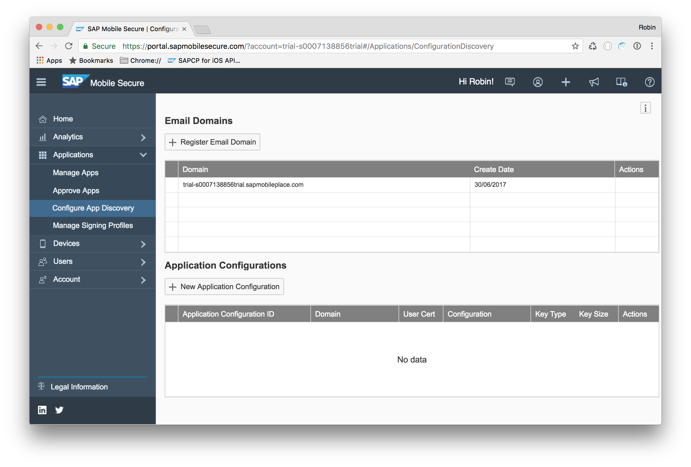
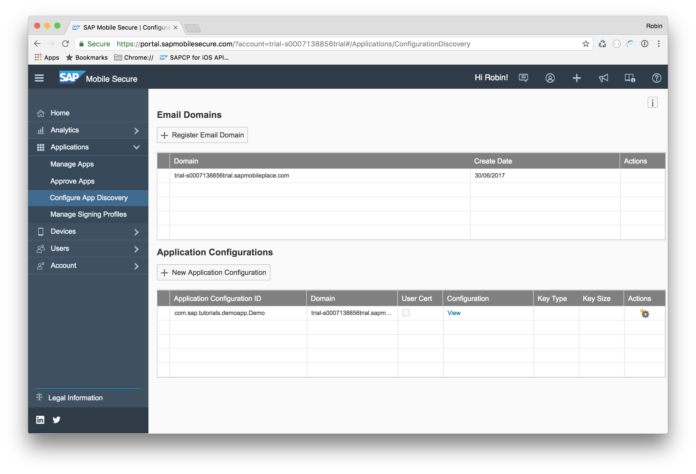

## Prerequisites  
 - **Proficiency:** Intermediate
 - **Tutorials:** [SAML and OAuth 2 authentication](https://www.sap.com/developer/tutorials/fiori-ios-scpms-saml-oauth.html)


## Next Steps
 - Select a tutorial group from the [Tutorial Navigator](http://www.sap.com/developer/tutorial-navigator.html) or the [Tutorial Catalog](https://www.sap.com/developer/tutorial-navigator.tutorials.html)

## Details
### You will learn  
In this tutorial, you will first create and store configuration data into SAP Cloud Platform Mobile Secure. Then you will extend your app to load that configuration data using the SAP Cloud Platform SDK for iOS [Configuration Provider](https://help.sap.com/doc/978e4f6c968c4cc5a30f9d324aa4b1d7/Latest/en-US/Documents/Frameworks/SAPFoundation/Configuration%20Provider.html) functionality.


### Time to Complete
**20 Min**

---

[ACCORDION-BEGIN [Step 1: ](Login to SAP Cloud Platform Mobile Secure)]

Login to your **SAP Cloud Platform Cockpit** on your trial account at [https://account.hanatrial.ondemand.com/cockpit](https://account.hanatrial.ondemand.com/cockpit) and from the menu bar, select **Services**.

From the **All Categories** drop-down at the right, choose **Mobile Services** and check whether **App & Device Management** is enabled.


If it's not yet enabled, click the tile and press the blue **Enable** button at the top.

If it is already enabled, click the tile and click the **Go to Admin Console** link. **SAP Cloud Platform Mobile Secure** now opens:


[ACCORDION-END]

[ACCORDION-BEGIN [Step 2: ](Create a configuration)]

In **SAP Mobile Secure**, navigate to **Applications > Configure App Discovery**.



Here you see the configured **Email domains** and any **Application Configurations** for these email domains. By default, the trial landscape's email domain is already listed.

> You may register your own domain instead, but this involves configuring an additional DNS TXT record in your mail server. For simplicity, this tutorial uses the preconfigured trial domain.

.

Click the **New Application Configuration** button. In the dialog that opens, enter the following details:

| Field Name | Value |
|----|----|
| Configuration ID | `com.sap.tutorials.demoapp.Demo` |
| Email Domain | `<Select from the dropdown>` |

Inside the **Configuration** text area, enter the following JSON structure:

```json
{
    "appPurpose" : "Demo",
    "supportedOptions" : [
        { "key" : "1", "value" : "Cats" },        
        { "key" : "2", "value" : "Dogs" }
    ]
}
```


Click **OK** when finished.

The configuration for the specified email domain is now saved:




[ACCORDION-END]


[ACCORDION-BEGIN [Step 3: ](Test your configuration)]

You can now test whether you can retrieve the configuration for the specified application ID and email domain.

Open a browser to:
`https://portal.sapmobilesecure.com/config-api.svc/ApplicationConfigurations/getApplicationConfiguration(AppConfigID='<application_id>',EmailAddress='<email_address>')` where `<application_id>` is the ID you specified in **Step 2**, and `<email_address>` is an email address which is within the email domain you specified in **Step 2**.

For instance, `https://portal.sapmobilesecure.com/config-api.svc/ApplicationConfigurations/getApplicationConfiguration(AppConfigID='com.sap.tutorials.demoapp.Demo',EmailAddress='user@trial-s0001234567trial.sapmobileplace.com')`.

You should get the following response:


[ACCORDION-END]

[ACCORDION-BEGIN [Step 4: ](Add ConfigurationLoaderDelegate)]

Launch Xcode and open your `com.sap.tutorials.demoapp.Demo` application.

In order to be able to load a configuration, you need to implement a `ConfigurationLoader` and its `ConfigurationLoaderDelegate` delegate.

Add the `ConfigurationLoaderDelegate` to the class `AppDelegate`:

```swift
class AppDelegate: UIResponder,
                   UIApplicationDelegate,
                   UISplitViewControllerDelegate,
                   UNUserNotificationCenterDelegate,
                   ConfigurationLoaderDelegate /* Added delegate */ {
```

The project now gives a build error. This is because the `AppDelegate` class hasn't implemented the `ConfigurationLoaderDelegate` methods yet.

Add the following delegate methods:

```swift
// MARK: - ConfigurationLoaderDelegate methods

func configurationProvider(_ provider: ConfigurationProviding, didCompleteWith result: Bool) {
    // TODO: Implement
}

func configurationProvider(_ provider: ConfigurationProviding, didEncounter error: Error) {
    // TODO: Implement
}

func configurationProvider(_ provider: ConfigurationProviding, requestedInput: [String : [String : Any]], completionHandler: @escaping ([String : [String : Any]]) -> ()) {
    // TODO: Implement
}

```


[ACCORDION-END]

[ACCORDION-BEGIN [Step 5: ](Load configuration)]

In the `AppDelegate` class method `xx`, add the following lines of code:

```swift
var providers = [ConfigurationProviding]( )
providers.append(DiscoveryServiceConfigurationProvider())

let configLoader = ConfigurationLoader(delegate: self, customQueueOfConfigurationProviders: providers, alternateOutputMethod: nil)

configLoader.loadConfiguration(userInputs: ["com.sap.configuration.provider.discoveryservice": ["emailAddress": "someuser@<your_email_domain>"]])
```

This forces the configuration loader to only check the Discovery Service provider queue, and loads the configuration for the given email address into key `com.sap.configuration.provider.discoveryservice`.

> For simplicity of this tutorial, the email address is hard-coded here. In a productive scenario, you should provide an input screen where the user enters his email address, use the Onboarding storyboard to provide the email address, or use a different mechanism.


[ACCORDION-END]

[ACCORDION-BEGIN [Step 6: ](Retrieve loaded configuration)]

If you now run the app (and set the default logging level to `debug`) you could see the configuration seems to be successfully loaded. However, to access the actual retrieved configuration data, you must implement the delegate methods.

Locate the previously added `configurationProvider(_:result:)` method, and add the following code:

```swift
let userDefaults = UserDefaults.standard

let storedConfig = userDefaults.dictionary(forKey: "com.sap.configuration.provider.configurationstore")

logger.info("Stored configuration : \(String(describing: storedConfig!))")
```

Upon successful retrieval of the configuration, the data is stored in the `UserDefaults` with key `com.sap.configuration.provider.configurationstore`.

Then you simply print the retrieved configuration `Dictionary` object to the debug console:


[ACCORDION-END]

## Next Steps
- Select a tutorial from the [Tutorial Navigator](http://www.sap.com/developer/tutorial-navigator.html) or the [Tutorial Catalog](http://www.sap.com/developer/tutorials.html)
