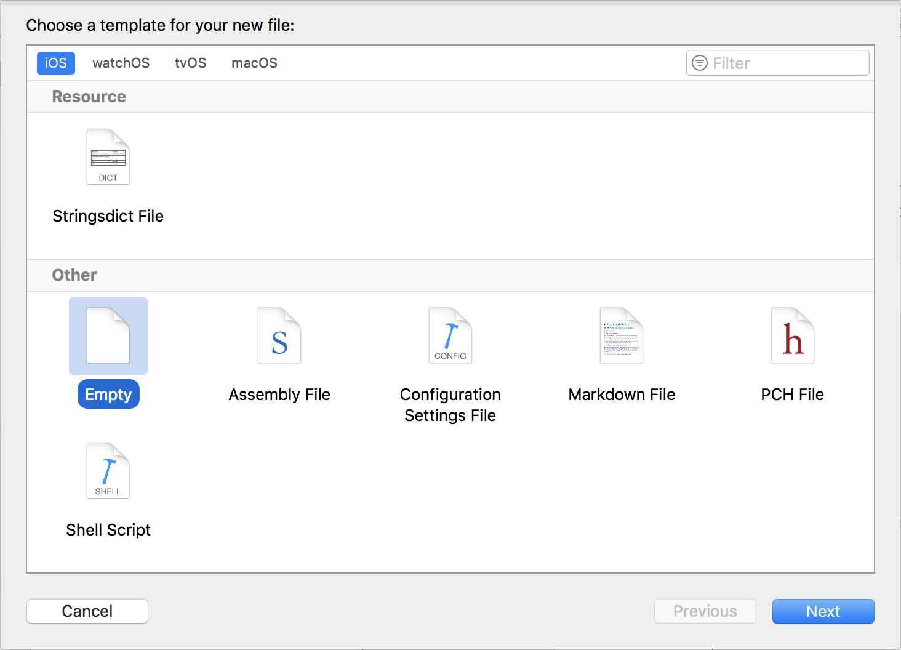
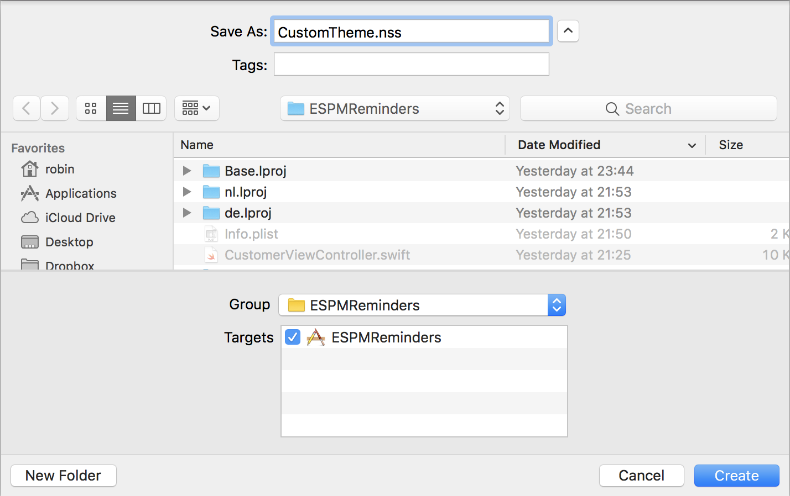
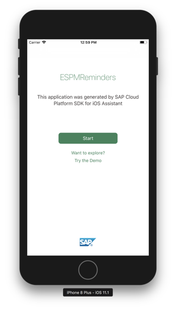
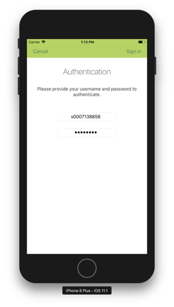
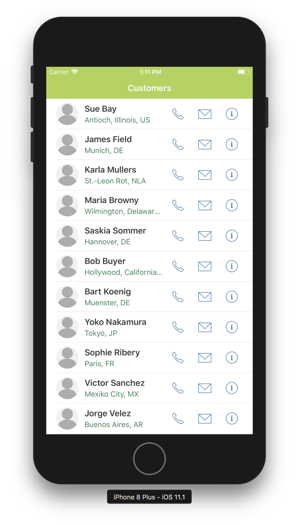
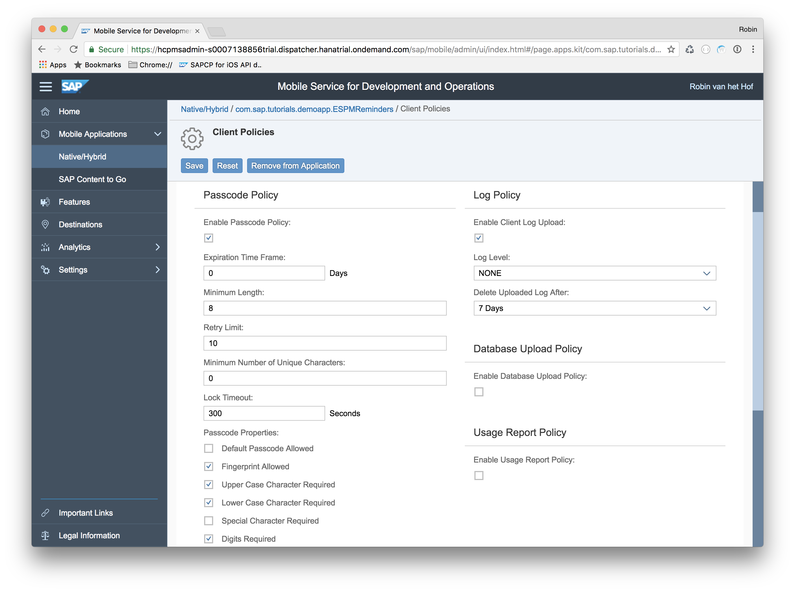
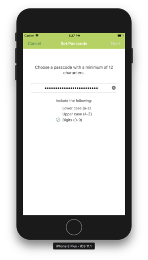
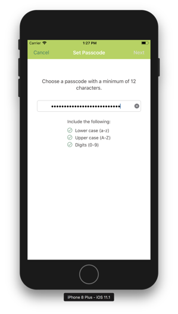
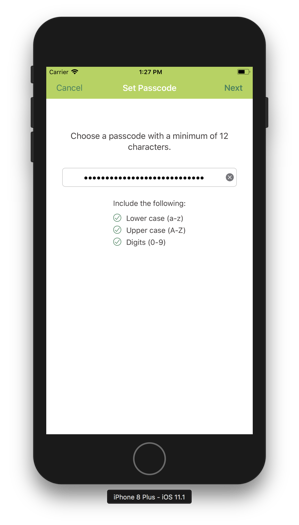

## Prerequisites  
 - **Proficiency:** Intermediate
 - **Development environment:** Apple iMac, MacBook or MacBook Pro running Xcode 9 or higher
 - **SAP Cloud Platform SDK for iOS:** Version 2.0

## Details
### You will learn  
In the previous tutorials, you have created an iOS app with a custom, multilingual user interface.

In this tutorial, you will apply a custom theme to your app using [`NUI`](https://github.com/tombenner/nui). `NUI` enables you to style iOS components with style sheets similar to CSS. `NUI` is already integrated in the SAP Cloud Platform SDK for iOS so you don't need to install anything. In addition, you will change the app's on-boarding behavior by changing certain client policies in SAP Cloud Platform mobile service for development and operations.

### Time to Complete
**20 Min**

---

[ACCORDION-BEGIN [Step 1: ](Create a NUI stylesheet)]

`NUI` uses CSS-like stylesheets with extension `.nss`. In this tutorial step, you will create a `*.nss` file.

In Xcode, right-click the `ESPMReminders` folder and from the context menu, select **New File...**. In the dialog, scroll down to the **Other** section and select the **Empty** template:



Click **Next** to proceed.

In the next screen, provide the following details:

| Field | Value |
|----|----|
| File Name | `CustomTheme.nss` |



Make sure it is saved in the `ESPMReminders` group and click **Create**. The new `CustomTheme.nss` file is now created in the root of your project.

[DONE]
[ACCORDION-END]

[ACCORDION-BEGIN [Step 2: ](Add styles to the stylesheet)]

The styles in the stylesheet can be applied to both standard iOS components such as `UINavigationBar`, `UITableView` etc. as well as SAP Fiori for iOS components.

For a reference of the standard iOS components classes, you can refer to [NUI style classes](https://github.com/tombenner/nui#style-classes).

For SAP Fiori for iOS components style classes, the following conventions should be followed:

- Global definitions
   - `fdl<lower camelcase enum name>_<property name>`
   - example: `fdlFontStyle_subheadline`

- SAP Fiori component specific definitions
   - `fdl<class name>_<property name>`
   - example: `fdlFUIWelcomeScreen_primaryActionButton`

Open the just created `CustomTheme.nss` file, and add the following:

```css
NavigationBar {
    bar-tint-color: #B0D450;
}

BarButton {
    font-color: #3A835B;
}

fdlFontStyle_subheadline {
    font-style: subheadline;
    font-color: #3A835B;
}

fdlFUIWelcomeScreen_headlineLabel {
    font-color: #3A835B;
}

fdlFUIWelcomeScreen_primaryActionButton {
    background-color-normal: #3A835B;
    background-color-highlighted: #B0D450;
}
```

This adds a light-green tint to the standard iOS navigation bar as well as a darker green for the navigation bar buttons.

The standard SAP Fiori `subheadline` font style (member of the SDK's `SAPFiori FDLFontStyle` enum) is also changed to green, as is the on-boarding's application title and primary action button.

[DONE]
[ACCORDION-END]


[ACCORDION-BEGIN [Step 3: ](Load stylesheet)]

In order for your app to apply the custom styles, you need to tell your app to use the custom stylesheet.

Open the app's `AppDelegate.swift` file, and in method `application(_:didFinishLaunchingWithOptions:)`, at the top of the method's body, add the following line:

```swift
NUISettings.initWithStylesheet(name: "CustomTheme")
```

This tells your app to use `NUI` with your custom stylesheet `CustomTheme.nss`.

[DONE]
[ACCORDION-END]

[ACCORDION-BEGIN [Step 4: ](Build and run the app)]

First, remove the app from your device, so you will go through the onboarding again.

Then build and run the app.

When launched, you should now see the restyled on-boarding screen with the greenish theme:



If you proceed further, you will see the navigation bar is also styled:



And, unsurprisingly, the custom UI you have created earlier follows the same theme:



> For more on theming SAP Fiori for iOS components, see [Branding & Theming](https://help.sap.com/doc/978e4f6c968c4cc5a30f9d324aa4b1d7/Latest/en-US/Documents/Frameworks/SAPFiori/Branding%20and%20Theming.html)

> For more on `NUI`, see [NUI readme](https://github.com/tombenner/nui/)

[DONE]
[ACCORDION-END]

[ACCORDION-BEGIN [Step 5: ](Modify on-boarding behavior)]

By default, the on-boarding flow provides you with a means to authenticate against SAP Cloud Platform mobile service for development and operations, provides Touch ID functionality and passcode functionality.

By default, the passcode simply needs 8 characters, but this could be as simple as `11111111`, which is not very secure.

To enforce a more secure passcode policy, you can set this in the application definition for your app in SAP Cloud Platform mobile service for development and operations.

Log on to SAP Cloud Platform mobile service for development and operations at `https://hcpmsadmin-<your_trial_account_user>trial.dispatcher.hanatrial.ondemand.com/`

Navigate to **Mobile Applications > Native/Hybrid** and click on the `com.sap.tutorials.demoapp.ESPMReminders` entry.

In the next page, click on **Client Policies** in the **Assigned Features** panel.

In the page that opens, under the **Passcode Policy** panel, tick the checkbox next to **Enable Passcode Policy**

Set the following properties:

| Field | Value |
|----|----|
| Miniumum Length | `12` |
| Minimum Number of Unique Characters | `4` |
| Upper Case Character Required | `YES` |
| Upper Case Character Required | `YES` |
| Digits Required | `YES` |



Click **Save** when done.

[DONE]
[ACCORDION-END]

[ACCORDION-BEGIN [Step 6: ](Build and run the application)]

First, remove the app from your device, so you will go through the onboarding again.

Then build and run the app.

Now, when you reach the passcode screen, you will notice the minimum number of characters has changed to 12, and the passcode policy is displayed.

Enter passcode `11111111111111111111`.



Only the **Digits** policy is met, and the **Next** button is still disabled.

Add an uppercase and lowercase letter to the passcode.



Now all character policies are met, but the **Next** button is still disabled. That's because you have supplied only 3 unique characters and the policy dictates 4 unique characters.

Add a different character, and now the **Next** button is enabled:



[DONE]
[ACCORDION-END]


---
