## Prerequisites  
 - **Proficiency:** Intermediate
 - **Development environment:** Apple iMac, MacBook or MacBook Pro running Xcode 9 or higher
 - **SAP Cloud Platform SDK for iOS:** Version 2.0

## Details
### You will learn  
In the previous tutorial you have created an iOS app generated with the SDK Assistant, but with a custom user interface.

In this tutorial, you will use the SAP Cloud Platform's integration with SAP Translation Hub to add multilingual features to your app. This way, you can run your app in many languages, depending on your device's preferred language.

### Time to Complete
**15 Min**

---

[ACCORDION-BEGIN [Step 1: ](Enable SAP Translation Hub)]

Log on to your SAP Cloud Platform cockpit at [https://account.hanatrial.ondemand.com/cockpit/](https://account.hanatrial.ondemand.com/cockpit/) and navigate to **Services**.

Locate the **SAP Translation Hub** tile (search for `translation`):

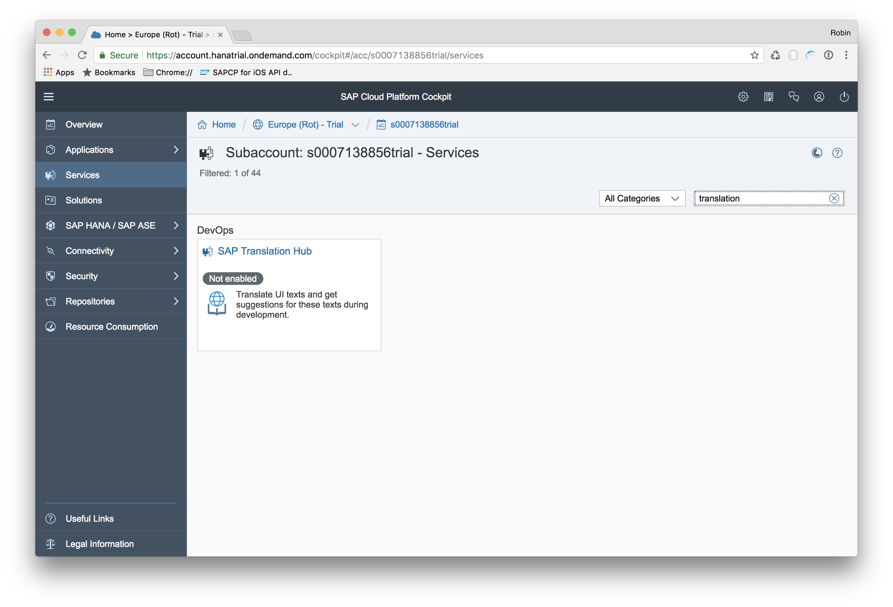

If it is not yet enabled, click the tile.

In the next page, click the **Enable** button:

Once the **SAP Translation Hub** service is enabled, click the **Go to UI for Translation Workflow** link at the bottom. The **SAP Translation Hub** web interface will open in a new tab:

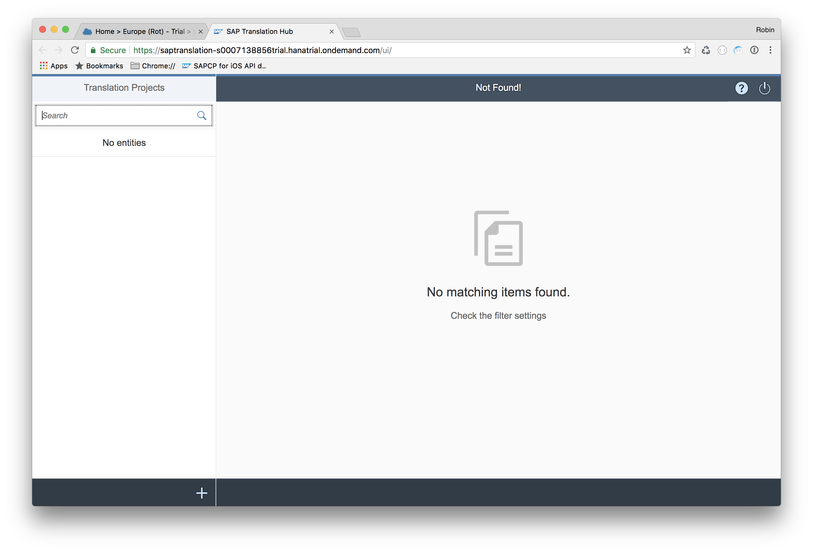

[DONE]
[ACCORDION-END]

[ACCORDION-BEGIN [Step 2: ](Enable SAP Translation Hub in the SDK Assistant)]

Open the **SDK Assistant**. Click the **Settings** icon in the top-left, and open the **Accounts** page:

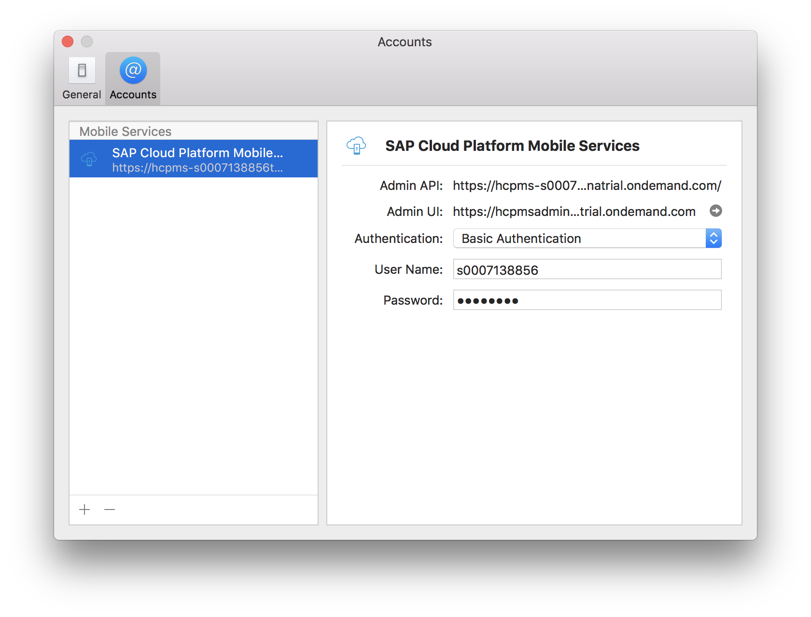

Click the **Plus** button to add a new account. From the list, select **Translation Hub**:

Click **Continue**.

In the next screen, add the following details:

| Field | Value |
|----|----|
| Name | A descriptive name for the configuration, for instance `SAP Translation Hub` |
| Base URL | `https://saptranslation-<your_trial_account_user>trial.hanatrial.ondemand.com/translationhub/api/v1` |
| User | Your trial account user |
| Password | Password for your trial account user |

Click **Add** when done. The account is now added to the SDK Assistant:

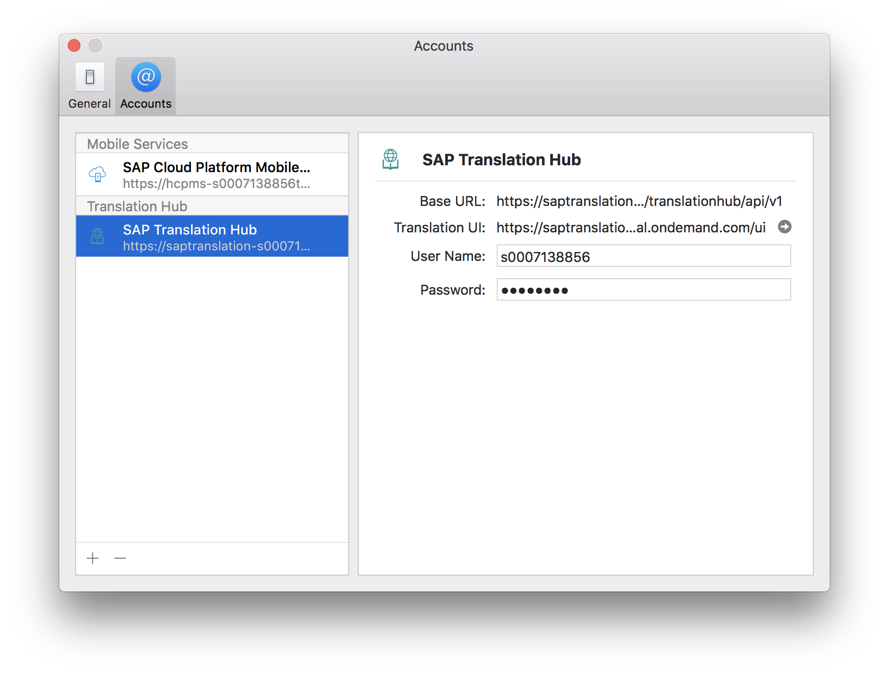

Close the **Accounts** dialog.

[DONE]
[ACCORDION-END]

[ACCORDION-BEGIN [Step 3: ](Add translations)]

In the **SDK Assistant**, right-click the `ESPMReminders` app and from the context menu, select **Add translation...**

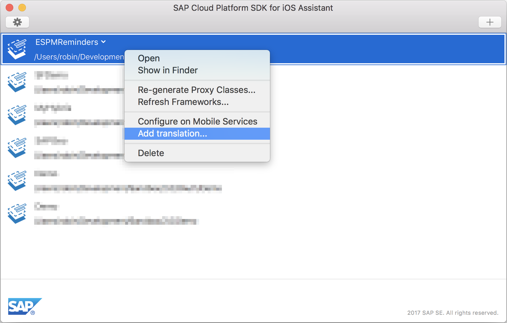

[DONE]
[ACCORDION-END]

[ACCORDION-BEGIN [Step 4: ](Choose one or more languages)]

In the next page, leave the pre-populated values as they are.

Select one or more languages from the list for which you want to translate your app:

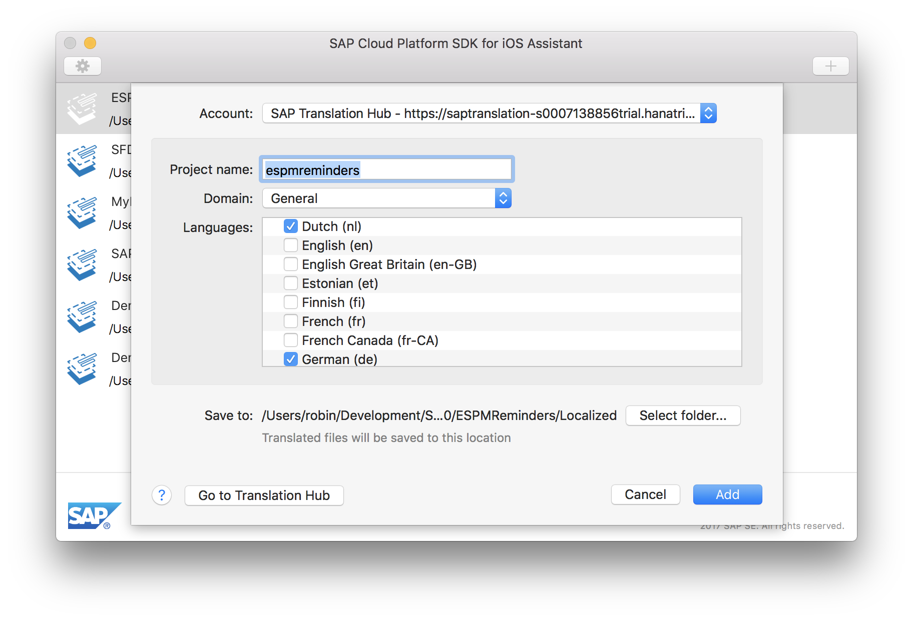

Click the **Add** button. The project will now be translated in the chosen languages:

[DONE]
[ACCORDION-END]

[ACCORDION-BEGIN [Step 5: ](Examine the updated Xcode project)]

Open the Xcode project for your app. Notice the added `InfoPlist.strings` and `Localizable.strings` files for the languages you have selected for translation:

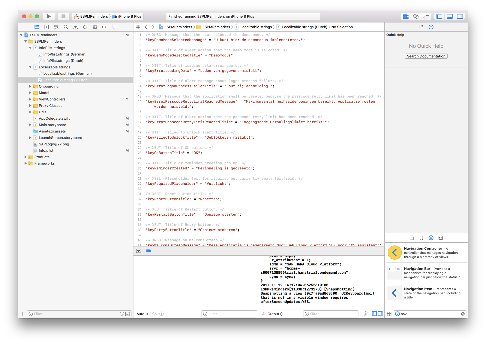

While most translations seem right, some may not be translated correctly.

Although you can fix this from within the file itself, it may be more convenient to change it in the **SAP Translation Hub** web app.

[DONE]
[ACCORDION-END]

[ACCORDION-BEGIN [Step 6: ](Modify the generated translations)]

Navigate to **Services > SAP Translation Hub** in your SAP Cloud Platform trial account and click the **Go to UI for Translation Workflow** link at the bottom. The **SAP Translation Hub** web interface will open in a new tab. you will now see the just added `espmreminders` project:

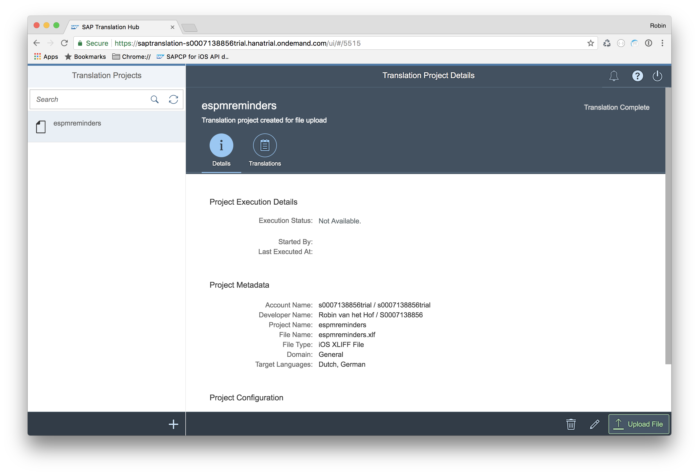

Click the **Translations** tab. In this page, an overview of the original texts and the translated texts for the selected languages are shown:

Here you can correct any translations that may be incorrect, and click the **Save Project** button once done.

[DONE]
[ACCORDION-END]

[ACCORDION-BEGIN [Step 7: ](Localize the application name)]

You may have noticed the texts containing `$(PRODUCT_NAME)` are changed to `(PRODUCT_NAME) $`. You may change it back, but you could also provide a proper, translated name for your app.

Check the **Source Texts** which lists `$(PRODUCT_NAME)`, and provide a translated app name instead. Click the **Save Project** button when done.

[DONE]
[ACCORDION-END]

[ACCORDION-BEGIN [Step 8: ](Re-import the modified translations)]

Open the **SDK Assistant**, right-click the `ESPMReminders` app and from the context menu, select **Add translation...**. Select the same languages from the list you have chosen in **Step 4**, and click the **Add** button.

Once finished, open your Xcode project and notice the modified translations:

[DONE]
[ACCORDION-END]

[ACCORDION-BEGIN [Step 9: ](Enable your app for localized app name)]

Open the file `Info.plist` and add the following entry:

| Field | Value |
|----|----|
| Key | `Application has localized display name` |
| Value | `YES` |

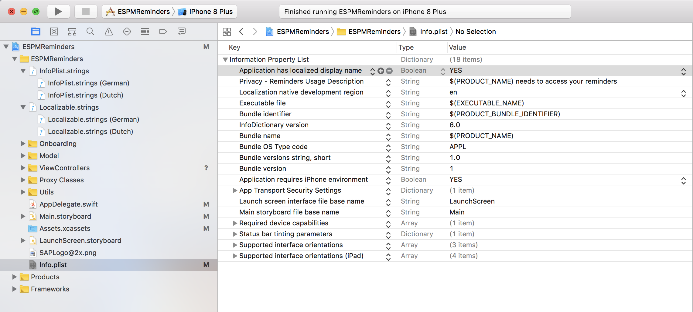

[DONE]
[ACCORDION-END]

[ACCORDION-BEGIN [Step 10: ](Change the device language)]

On your device, open the **Settings** app and navigate to **General > Language & Region** and click **iPhone Language**.

From the list, select one of the languages you have created a translation for, and confirm the language change for your device:

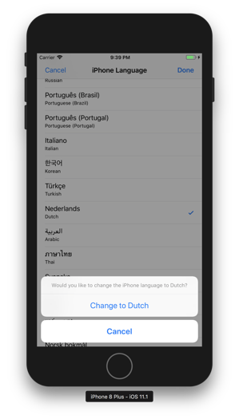

[DONE]
[ACCORDION-END]

[ACCORDION-BEGIN [Step 11: ](Run the translated app)]

When the device has started up in the new language, remove the old application from the device.

Build and run the application. You will now see the (partial) translation of the onboarding flow, as well as the translation of your custom UI:

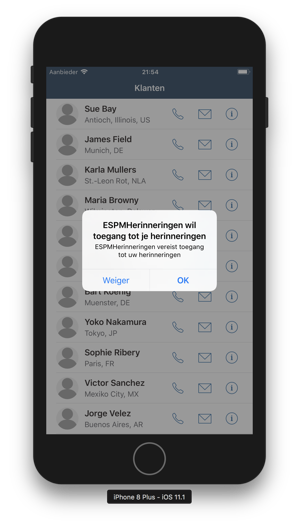

[DONE]
[ACCORDION-END]

---
