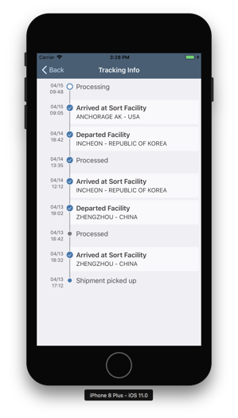

## Prerequisites  
 - **Proficiency:** Intermediate
 - **Development environment:** Apple iMac, MacBook or MacBook Pro running Xcode 8.3 or higher
 <!-- - **Tutorials:** [Using the SAP Fiori for iOS Mentor app](https://www.sap.com/developer/tutorials/fiori-ios-scpms-deliveryapp-part4.html) -->


<!-- ## Next Steps
 - [Enable the app for Offline OData](https://www.sap.com/developer/tutorials/fiori-ios-scpms-deliveryapp-part6.html) -->

## Details
### You will learn  
In this tutorial, you implement Fiori Timeline cells to show the `DeliveryStatus` entities in a logical way.

### Time to Complete
**10 Min**

---

[ACCORDION-BEGIN [Step 1: ](Initialize table layout)]

In this step, you implement Fiori Timeline cells to show the `DeliveryStatus` entities in a logical way.

Open the file `./MyDeliveries/ViewControllers/TrackingInfoViewController.swift` and locate the method `viewDidLoad()`.

Replace the commented-out part with the following code:

```swift
tableView.register(FUITimelineCell.self, forCellReuseIdentifier: "FUITimelineCell")
tableView.register(FUITimelineMarkerCell.self, forCellReuseIdentifier: "FUITimelineMarkerCell")
tableView.estimatedRowHeight = 44
tableView.rowHeight = UITableViewAutomaticDimension
tableView.backgroundColor = UIColor.preferredFioriColor(forStyle: .backgroundBase)
tableView.separatorStyle = .none
```

> **NOTE** The above code originated from the **SAP Fiori for iOS Mentor** app, but has been slightly modified to show both `FUITimelineCell` and `FUITimelineMarkerCell` control.

[DONE]
[ACCORDION-END]

[ACCORDION-BEGIN [Step 2: ](Implement table row methods)]

Next, locate method `numberOfSections(in tableView:)`.

Change it so it returns 1 section:

```swift
override func numberOfSections(in tableView: UITableView) -> Int {
    return 1
}
```

Now, locate method `tableView(_ tableView:, numberOfRowsInSection section:)`.

Change it to return the number of loaded entities:

```swift
override func tableView(_ tableView: UITableView, numberOfRowsInSection section: Int) -> Int {
    return self._entities.count
}
```
<!---
```swift
override func tableView(_ tableView: UITableView, numberOfRowsInSection section: Int) -> Int {
    return self._entity.deliveryStatus.count
}
```
-->

[DONE]
[ACCORDION-END]

[ACCORDION-BEGIN [Step 3: ](Implement FUITimelineCell logic)]

Finally, remove the remaining commented-out methods and replace them with these methods:

```swift
override func tableView(_ tableView: UITableView, cellForRowAt indexPath: IndexPath) -> UITableViewCell {

    let deliverystatustype = self._entities[indexPath.row]

    if deliverystatustype.selectable != 0 {
        return self.getFUITimelineCell(deliverystatustype: deliverystatustype, indexPath: indexPath)
    }
    else {
        return self.getFUITimelineMarkerCell(deliverystatustype: deliverystatustype, indexPath: indexPath)
    }
}

private func getFUITimelineMarkerCell(deliverystatustype: DeliveryStatusType, indexPath: IndexPath) -> UITableViewCell {

    let cell = tableView.dequeueReusableCell(withIdentifier: "FUITimelineMarkerCell", for: indexPath)
    guard let timelineCell = cell as? FUITimelineMarkerCell else {
        return cell
    }
    timelineCell.nodeImage = self.getNodeImage(statusType: deliverystatustype.statusType!)
    timelineCell.showLeadingTimeline = indexPath.row == 0 ? false : true
    timelineCell.showTrailingTimeline = indexPath.row == self._entities.count - 1 ? false : true
    timelineCell.eventText = self.getFormattedDateTime(timestamp: deliverystatustype.deliveryTimestamp!)
    timelineCell.titleText = deliverystatustype.status

    return timelineCell
}

private func getFUITimelineCell(deliverystatustype: DeliveryStatusType, indexPath: IndexPath) -> UITableViewCell {

    let cell = tableView.dequeueReusableCell(withIdentifier: "FUITimelineCell", for: indexPath)
    guard let timelineCell = cell as? FUITimelineCell else {
        return cell
    }
    timelineCell.nodeImage = self.getNodeImage(statusType: deliverystatustype.statusType!)
    timelineCell.eventText = self.getFormattedDateTime(timestamp: deliverystatustype.deliveryTimestamp!)
    timelineCell.headlineText = deliverystatustype.status
    timelineCell.subheadlineText = deliverystatustype.location

    return timelineCell
}

private func getFormattedDateTime(timestamp: LocalDateTime) -> String {
    let formatter = DateFormatter()
    formatter.dateFormat = "MM/dd HH:mm"

    return formatter.string(from: timestamp.utc())
}

private func getNodeImage(statusType: String) -> UIImage {
    switch statusType {
    case "start"    : return FUITimelineNode.start
    case "inactive" : return FUITimelineNode.inactive
    case "complete" : return FUITimelineNode.complete
    case "earlyEnd" : return FUITimelineNode.earlyEnd
    case "end"      : return FUITimelineNode.end
    default         : return FUITimelineNode.open
    }
}
```

The first method `tableView(_ tableView:, cellForRowAt indexPath:)` decides based on `DeliveryStatus` property `selectable` which specific timeline cell to render. This rendering is done via two private methods `getFUITimelineMarkerCell(deliverystatustype:, indexPath:)` and `getFUITimelineCell(deliverystatustype:, indexPath:)`.

> These two private methods are implemented based on the code from the **SAP Fiori for iOS Mentor** app, but the code from the Mentor app has been split into two separate functions and control binding has already been implemented for easier implementation in this tutorial.

.

The final two private methods are helpers to format the timestamp into something more readable, and to get the correct `FUITimelineNode` image indicator based on the `DeliveryStatus` property `StatusType`.

[DONE]
[ACCORDION-END]


[ACCORDION-BEGIN [Step 4: ](Run the application)]

Build and run the application. Navigate to the `Packages` master page and select a package. If you now click on the **Show Tracking Info...** cell, you'll navigate to the **Tracking Info** scene, and the `Package`'s related `DeliveryStatus` records are now shown in descending order using two flavors of the **Fiori Timeline** cell control.



[VALIDATE_4]

[ACCORDION-END]


<!-- ## Next Steps
- [Enable the app for Offline OData](https://www.sap.com/developer/tutorials/fiori-ios-scpms-deliveryapp-part6.html) -->
