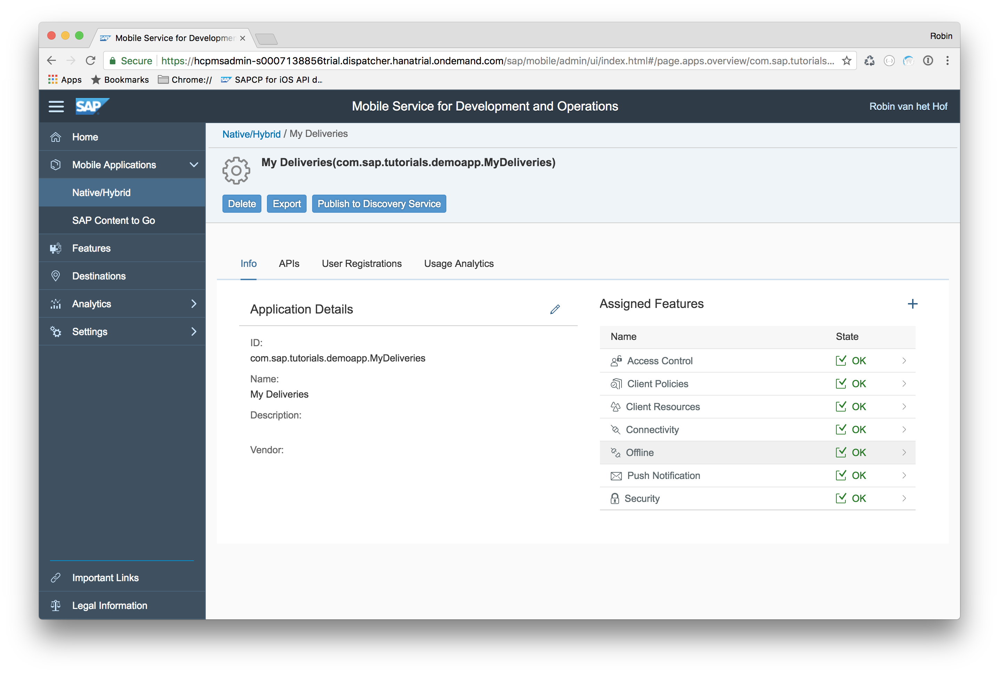
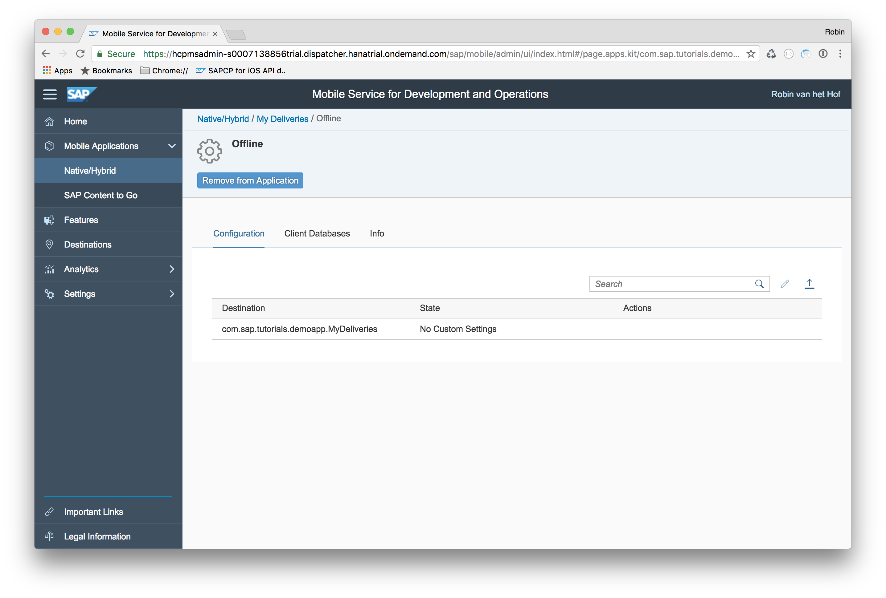
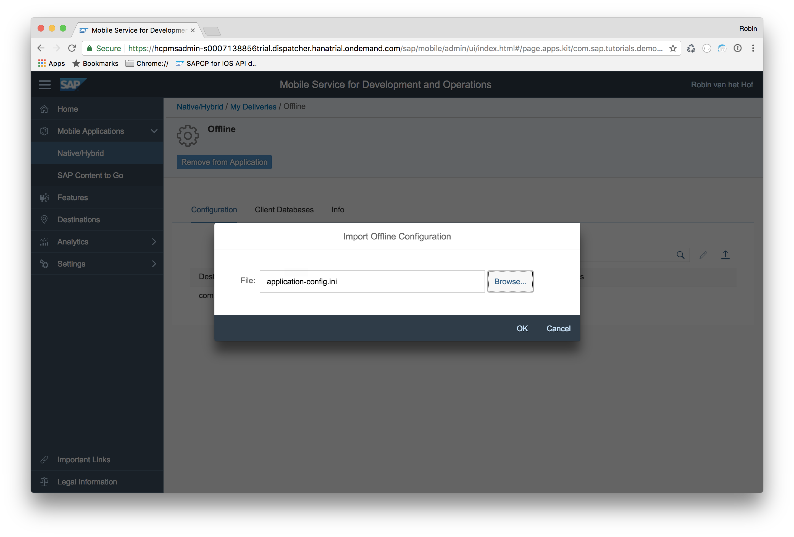
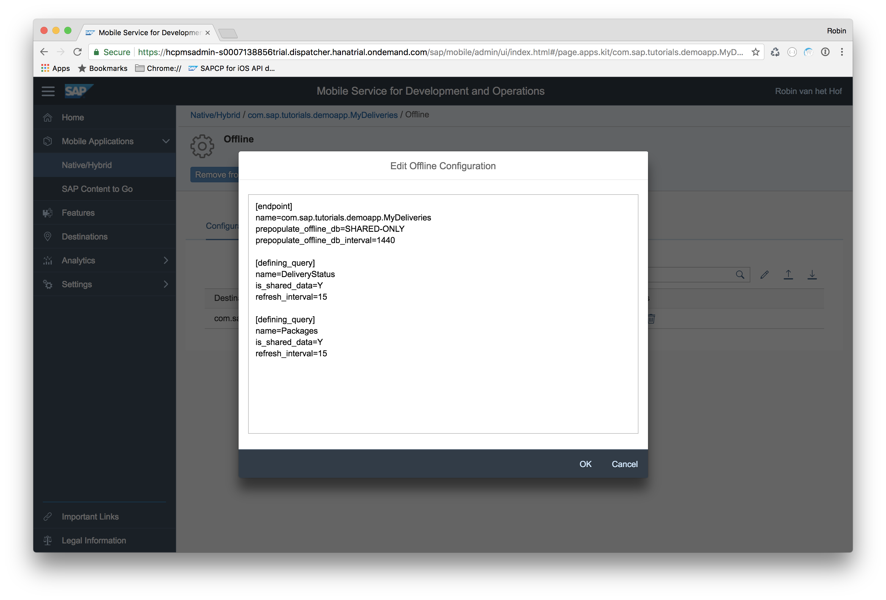
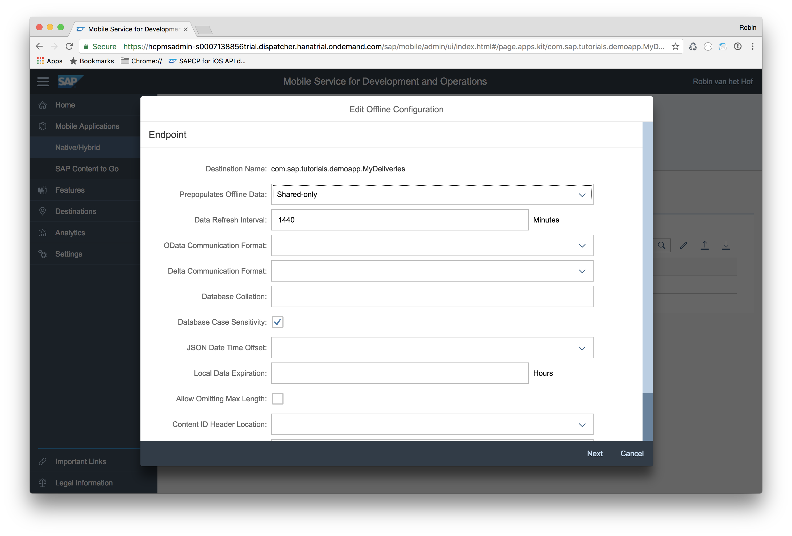
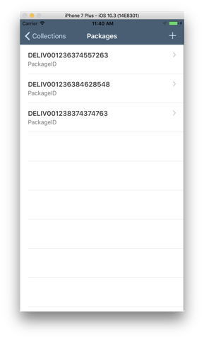

## Prerequisites  
 - **Proficiency:** Intermediate
 - **Development environment:** Apple iMac, MacBook or MacBook Pro running Xcode 8.3 or higher
 <!-- - **Tutorials:** [Implement the Fiori Timeline cell control](https://www.sap.com/developer/tutorials/fiori-ios-scpms-deliveryapp-part5.html) -->


<!-- ## Next Steps
 - [Manage and monitor your app on SAP Cloud Platform Mobile Services](https://www.sap.com/developer/tutorials/fiori-ios-scpms-deliveryapp-part7.html) -->

## Details
### You will learn  
In this tutorial, you will implement the necessary coding so your application can use OData while offline.

### Time to Complete
**15 Min**

---

[ACCORDION-BEGIN [Step 1: ](Run the app while offline)]

Build and run the app, either on a physical device or on the iOS Simulator.

Log in to your app with your SAP Cloud Platform credentials.

If you now switch on Airplane mode on your physical device -- or, if running from the iOS Simulator, disable the network connections on your Mac -- and try opening a collection from the app, you will see a message similar to this:


[DONE]
[ACCORDION-END]


[ACCORDION-BEGIN [Step 2: ](Create Application Configuration File)]

To use the Offline OData service, it is not necessary to to add any specific configuration to your application. The SAP Cloud Platform mobile service for development and operations will apply defaults that will make a good amount of applications run smoothly.

However, the Offline OData service can be configured to best meet the needs of your use cases.

- Configure indexes on properties
- Configure data to be cached on server
- Change delta determination

>Note: Offline configuration is created in a file and uploaded to SAP Cloud Platform mobile service for development and operations application configuration and is only required to change default behavior

.

The Offline OData service configuration file is made up of one or more end point configurations, each of
which has one or more defining request configurations

End point configuration allows:

- Set indexes on entity properties
- Configure what data will be allowed in the database initially sent to device
- Configure if data is cached or not
- Refresh interval on cached data

Defining request configuration allows:

- Set if data is cached or not
- Refresh interval on cached data
- Delta tracking behavior

A full list of Offline OData configuration options is available on https://help.sap.com/saphelp_smp307sdk/helpdata/en/f5/a25877c16f4fc384c44fcf0b92dab8/content.htm.

To define what to use offline, you now create an **Application Configuration File**

On your laptop, create a file `application-config.ini`.

Add the following content to this file:

```ini
[endpoint]
Name=com.sap.tutorials.demoapp.MyDeliveries
prepopulate_offline_db=SHARED-ONLY
prepopulate_offline_db_interval=1440

[defining_request]
name=DeliveryStatus
is_shared_data=Y
refresh_interval=15

[defining_request]
name=Packages
is_shared_data=Y
refresh_interval=15
```

In this configuration file, you have specified the following:

End point configuration:

| Properties (endpoint) | Description |
|----|----|
| `name` | The name of the OData connection, as specified in SAP Cloud Platform mobile service for development and operations |
| `prepopulate_offline_db` | Indicated what data to include in database delivered to device when it if first created |
| `prepopulate_offline_db_interval` | Database refresh interval for the shared data. The default value is 1440 minutes (one day) |

Defining request configuration:

| Properties (`defining_request`) | Description |
|----|----|
| `name` | The name of the entity set query |
| `is_shared_data` | Specifies if data is shared between users or not and prevents sending the same query to the originating OData service for each user if it is set to Y |
| `download_interval` | Database refresh interval for the shared data. It is set to 15 minutes, meaning that SAP Cloud Platform mobile service for development and operations will try to update the delivery status and packages data every 15 minutes |

Save the file locally.

[DONE]
[ACCORDION-END]


[ACCORDION-BEGIN [Step 3: ](Configure application definition)]

In SAP Cloud Platform mobile service for development and operations, navigate to **Mobile Applications > Native/Hybrid > My Deliveries**:



Click on the **Offline** feature. The Offline configuration page opens:



[DONE]
[ACCORDION-END]


[ACCORDION-BEGIN [Step 4: ](Upload Application Configuration File)]

Click the **Import** button.


Browse to the `application-config.ini` file you created earlier.



Click **OK** to import the configuration. If everything goes well, the state has now changed to **Configured**.


[DONE]
[ACCORDION-END]


[ACCORDION-BEGIN [Step 5: ](Examine uploaded configuration)]

If you now click the **Edit** button next to the **Search field**, you can examine the uploaded configuration:



Click **Cancel** to dismiss, and click **OK** in the confirmation dialog to dismiss.

Next, click the **Edit** action next to the destination. Here you can examine the offline settings for the destination endpoint:

Using the **Next** buttons, you can advance through the various pages of the offline configuration.



Click **Finish** to dismiss the dialog.

[VALIDATE_4]
[ACCORDION-END]


[ACCORDION-BEGIN [Step 6: ](Switch from SAPOData to SAPOfflineOData)]

First you need to change the **Online** behavior to **Offline** usage. Open the `AppDelegate.swift` file.

Add the import declaration for `SAPOfflineOData` just below the already existing `SAPOData` import declaration:

```swift
import SAPOfflineOData
```

[DONE]
[ACCORDION-END]


[ACCORDION-BEGIN [Step 7: ](Add Service Declaration to Offline)]

Since the data service is used offline, you need to add a service declaration for offline usage. In order to do so, add a new service declaration `deliveryServiceOffline` just below the existing service declaration:

```swift
var deliveryService: DeliveryService<OnlineODataProvider>!
var deliveryServiceOffline: DeliveryService<OfflineODataProvider>!
```

[DONE]
[ACCORDION-END]

[ACCORDION-BEGIN [Step 8: ](Change OData initializer)]

Scroll down to method `configureOData(urlSession:serviceRoot:)` and add the following at the bottom of the method:

```swift
// Here come's the offline part
var offlineParameters = OfflineODataParameters()
offlineParameters.enableRepeatableRequests = true

// create offline OData provider
let offlineODataProvider = try! OfflineODataProvider(
    serviceRoot: URL(string: serviceRoot.absoluteString)!,
    parameters: offlineParameters,
    sapURLSession: urlSession
)

try! offlineODataProvider.add(
    definingQuery: OfflineODataDefiningQuery(
        name: CollectionType.deliveryStatus.rawValue,
        query: "/\(CollectionType.deliveryStatus.rawValue)",
      automaticallyRetrievesStreams: false
    )
)
try! offlineODataProvider.add(
    definingQuery: OfflineODataDefiningQuery(
        name: CollectionType.packages.rawValue,
        query: "/\(CollectionType.packages.rawValue)",
        automaticallyRetrievesStreams: false
    )
)

deliveryServiceOffline = DeliveryService(provider: offlineODataProvider)
```
> The first part is untouched, and handles the online requests. The second part handles is added, and addresses the offline requests.

> To initialize the offline OData provider, you first set up an instance of `OfflineODataParameters`. With this instance, you set the custom header, and ensure an OData request is applied only once in case of multiple executions.

> Then, a reference to the offline data provider is set to the variable `offlineODataProvider`.

> The two defining queries are added to the offline OData provider to define the initial set of data.

> Finally, the `deliveryServiceOffline` field is set to reference the `DeliveryService` based on the offline data provider.

[DONE]
[ACCORDION-END]

[ACCORDION-BEGIN [Step 9: ](Maintain State of the Offline Store)]

Next, we need to modify the online behavior of the view controller for both the `Packages` and `DeliveryStatus` entities. First, in the `AppDelegate.swift` file, add a new field which holds the state of the store, whether it's open or not. Add the following boolean field:

```swift
private var _isStoreOpened = false
var isStoreOpened: Bool {
    get { return _isStoreOpened }
    set { self._isStoreOpened = newValue }
}
```

To close the store from the view controllers, add the following method at the bottom of the `AppDelegate` class:

```swift
func closeOfflineStore() {
    if _isStoreOpened {
        do {
            try deliveryServiceOffline.close()
            _isStoreOpened = false
        } catch {
            logger.error("Offline Store closing failed")
        }
    }
    logger.info("Offline Store closed")
}
```

[DONE]
[ACCORDION-END]

[ACCORDION-BEGIN [Step 10: ](Add offline service to the Master view controllers)]

Then, open file `PackagesMasterViewController.swift` in `Demo > ViewControllers > Packages` and add import the offline framework here as well:

```swift
import SAPOfflineOData
```

Then add a reference in the `PackagesMasterViewController.swift` file to the `deliveryServiceOffline` field which was created in the `AppDelegate.swift` file at step 7. Below the `deliveryService` declaration, add a similar declaration but now for offline usage:

```swift
private var deliveryServiceOffline: DeliveryService<OfflineODataProvider> {
    return self.appDelegate.deliveryServiceOffline
}
```

Repeat the same for the `DeliveryStatusMasterViewController.swift` file.

[DONE]
[ACCORDION-END]

[ACCORDION-BEGIN [Step 11: ](Change request methods for offline usage)]

Go back to file `PackagesMasterViewController.swift`, locate method `requestEntities(completionHandler:)`, and replace its implementation with the following:

```swift
func requestEntities(completionHandler: @escaping (Error?) -> Void) {
    // Only request the first 20 values. If you want to modify the requested entities, you can do it here.
    deliveryServiceOffline.open { error in
        guard error == nil else {
            return;
        }

        self.appDelegate.isStoreOpened = true

        self.deliveryServiceOffline.download { error in
            guard error == nil else {
                let query = DataQuery().selectAll().top(20)
                self.deliveryServiceOffline.fetchPackages(matching: query) { packages, error in
                    guard let packages = packages else {
                        completionHandler(error!)
                        self.appDelegate.closeOfflineStore()
                        return
                    }
                    self.entities = packages
                    completionHandler(nil)
                    self.appDelegate.closeOfflineStore()
                }
                return
            }

            let query = DataQuery().selectAll().top(20)
            self.deliveryService.fetchPackages(matching: query) { packages, error in
                guard let packages = packages else {
                    completionHandler(error!)
                    self.appDelegate.closeOfflineStore()
                    return
                }
                self.entities = packages
                completionHandler(nil)
                self.appDelegate.closeOfflineStore()
            }
        }
    }
}
```

The first methods tries to open the offline store first, and then try to perform a download of the data. If no download is possible, chances are the app is offline, and the `deliveryServiceOffline` is queried to retrieve the data. If the download is successful, the app is online, and the online `deliveryService` is queried instead.

> In a real-world scenario, you would not code it this way because there could be other reasons why the download fails. You would rather download data in the background, and not triggered by a navigation.

Repeat the same for file `DeliveryStatusMasterViewController.swift`:

```swift
func requestEntities(completionHandler: @escaping (Error?) -> Void) {
    // Only request the first 20 values. If you want to modify the requested entities, you can do it here.
    deliveryServiceOffline.open { error in
        guard error == nil else {
            return;
        }

        self.appDelegate.isStoreOpened = true

        self.deliveryServiceOffline.download { error in
            guard error == nil else {
                let query = DataQuery().selectAll().top(20)
                self.deliveryServiceOffline.fetchDeliveryStatus(matching: query) { deliveryStatus, error in
                    guard let deliveryStatus = deliveryStatus else {
                        completionHandler(error!)
                        self.appDelegate.closeOfflineStore()
                        return
                    }
                    self.entities = deliveryStatus
                    completionHandler(nil)
                    self.appDelegate.closeOfflineStore()
                }
                return
            }

            let query = DataQuery().selectAll().top(20)
            self.deliveryService.fetchDeliveryStatus(matching: query) { deliveryStatus, error in
                guard let deliveryStatus = deliveryStatus else {
                    completionHandler(error!)
                    self.appDelegate.closeOfflineStore()
                    return
                }
                self.entities = deliveryStatus
                completionHandler(nil)
                self.appDelegate.closeOfflineStore()
            }
        }
    }
}
```

[DONE]
[ACCORDION-END]

[ACCORDION-BEGIN [Step 12: ](Build and run the application)]

Build and run the application, and log in to your application. Click on each entity type to load both entity sets, and navigate back to the main screen.

Now disable the network connection, and try to navigate to the master page of one of the entities. Instead of the error message in **Step 1** the data should now be loaded:



However, if you now navigate to **Packages**, click on an entry in the list and click **Show Tracking Info...**, you will see an empty screen and the following message in the console: `HTTPError; Caused by: Error Domain=NSURLErrorDomain Code=-1009 "The Internet connection appears to be offline."`

This is because the request to load the `DeliveryStatus` items for that particular `Package` uses the online service only (you added this in the 3rd tutorial [Implement a new Table View Controller](https://www.sap.com/developer/tutorials/fiori-ios-scpms-deliveryapp-part3.html) at **Step 6**)

In the next step, you will correct this.

[DONE]
[ACCORDION-END]

[ACCORDION-BEGIN [Step 13: ](Offline usage for Fiori Timeline tableview)]

In Xcode, open the file `PackagesDetailViewController.swift` and locate method `prepare`. At the end of this method, locate the following lines of code:

```swift
let query = DataQuery()
    .from(esDeliveryStatus)
    .where(propPackageId.equal((currentEntity.packageID)!))
    .orderBy(propTimestamp, SortOrder.descending)

self.deliveryService.fetchDeliveryStatus(matching: query) { deliveryStatus, error in
    guard let deliveryStatus = deliveryStatus else {
        return
    }
    trackingInfoView.entities = deliveryStatus
    trackingInfoView.tableView.reloadData()
}
```

This is the part that executes the query to load the related `DeliveryStatus` entities for the selected `Package` in an online manner.

In case of the device being offline, the request will fail and the error will be logged in the `catch` block.

Since you're entering the `catch` block if online, you could add the logic to retrieve the data from the offline store here, so the app will gracefully continue to work.

Replace the above mentioned lines of code with the following:

```swift
let query = DataQuery()
    .from(esDeliveryStatus)
    .where(propPackageId.equal((currentEntity.packageID)!))
    .orderBy(propTimestamp, SortOrder.descending)

if ConnectivityUtils.isConnected() {
    self.deliveryService.fetchDeliveryStatus(matching: query) { deliveryStatus, error in
        guard let deliveryStatus = deliveryStatus else {
            return
        }
        trackingInfoView.entities = deliveryStatus
        trackingInfoView.tableView.reloadData()
    }
} else {
    self.logger.info("Now trying to open offline store")

    // try opening the store
    self.deliveryServiceOffline.open { error in
        guard error == nil else {
            return;
        }

        self.deliveryServiceOffline.fetchDeliveryStatus(matching: query) { deliveryStatus, error in
            guard let deliveryStatus = deliveryStatus else {
                self.appDelegate.closeOfflineStore()
                return
            }
            trackingInfoView.entities = deliveryStatus
            trackingInfoView.tableView.reloadData()
            self.appDelegate.closeOfflineStore()
        }
        return
    }
}
```

What happens here is that if the online request fails, it will then try to open the offline store, and perform the query with the `offlineService`.

And except for the (online) requirement to log in, your app is now fully available offline.

[DONE]
[ACCORDION-END]


<!-- ## Next Steps
- [Manage and monitor your app on SAP Cloud Platform Mobile Services](https://www.sap.com/developer/tutorials/fiori-ios-scpms-deliveryapp-part7.html) -->
