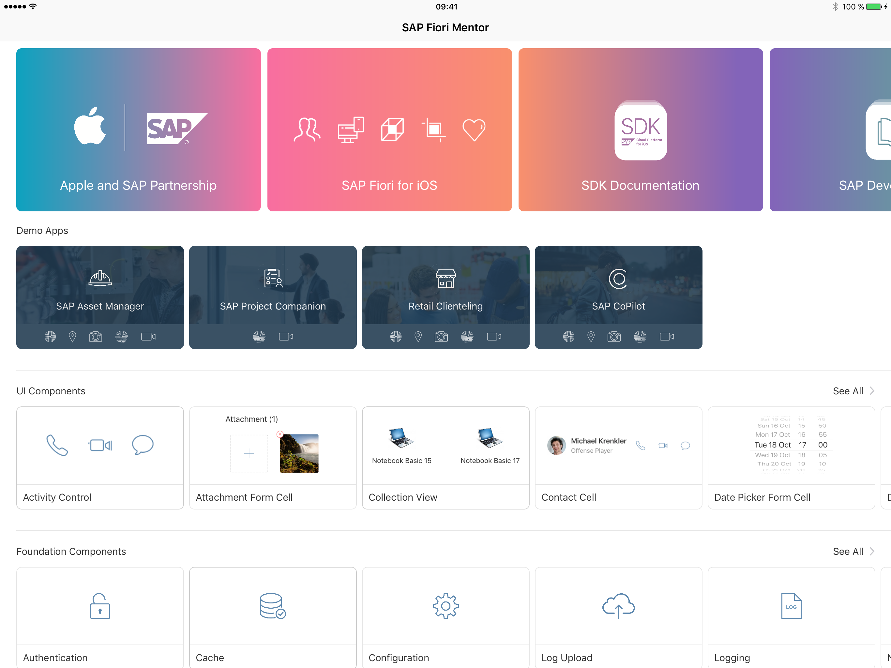
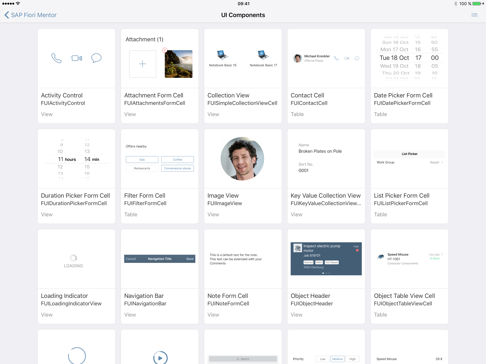
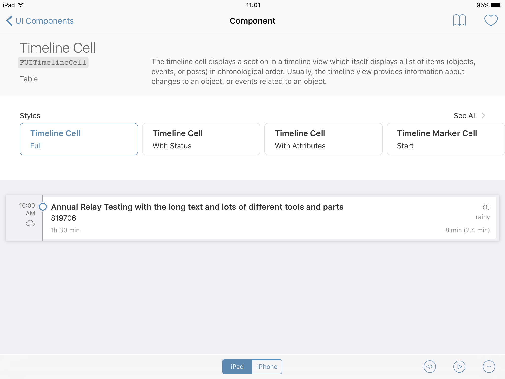
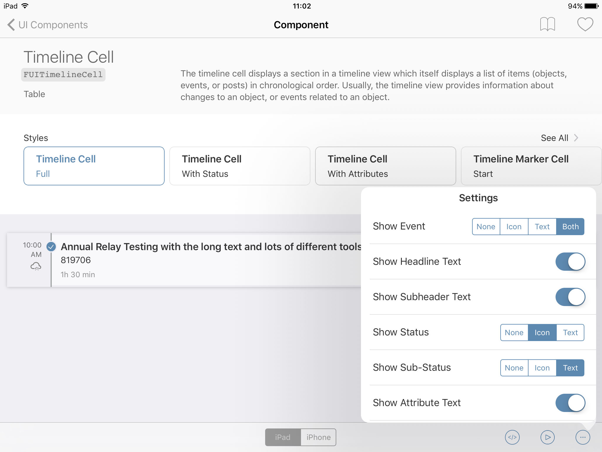
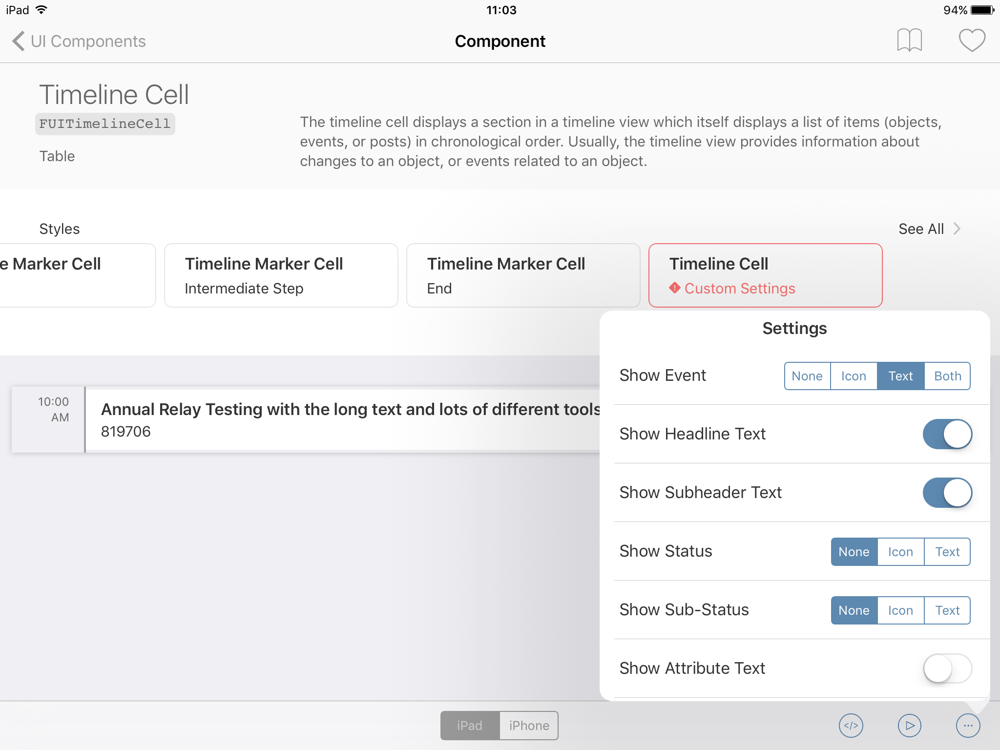
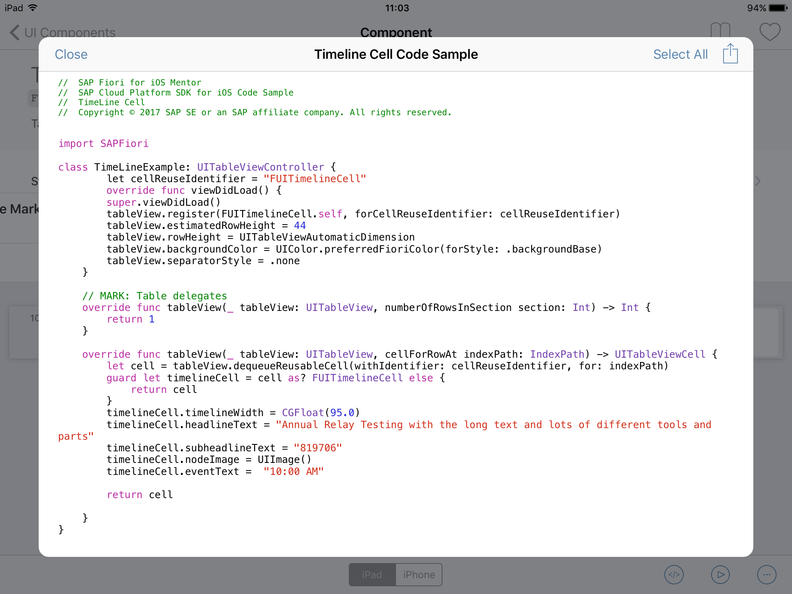
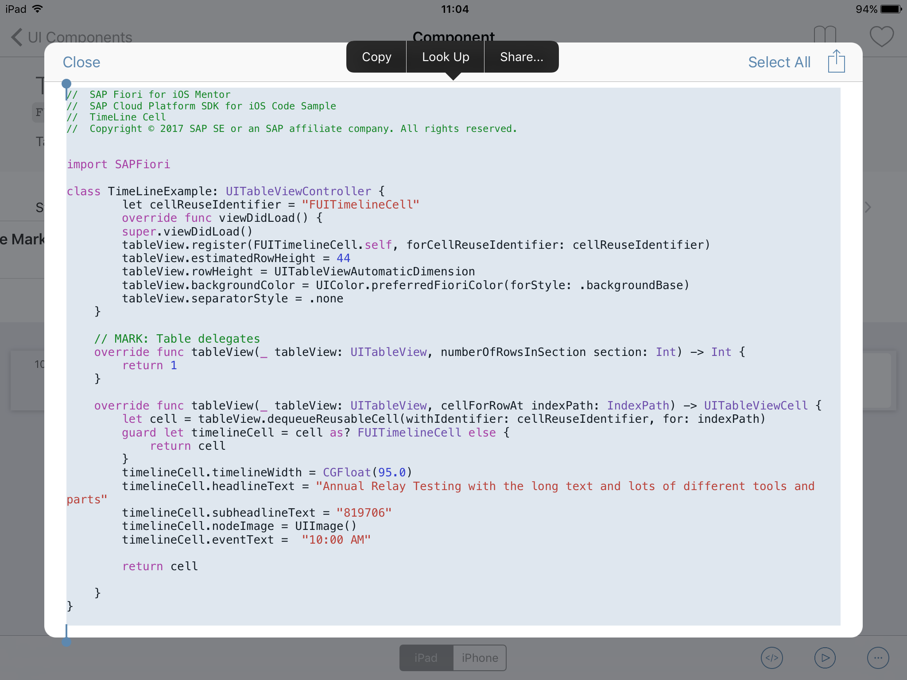
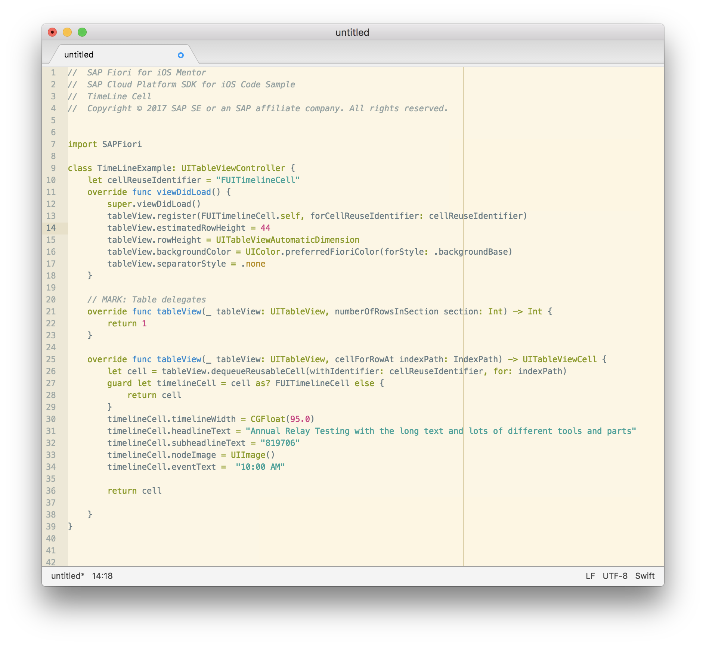
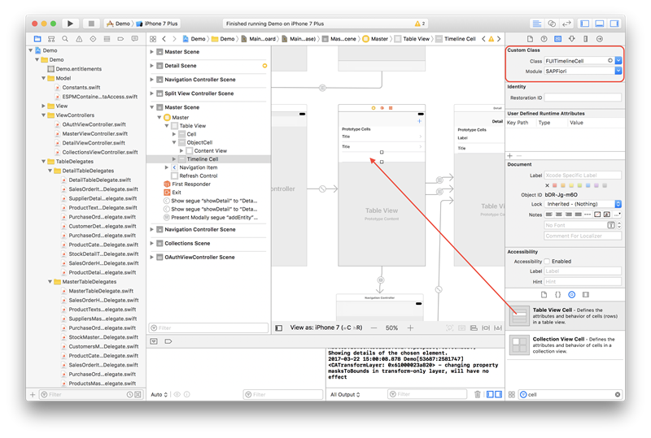
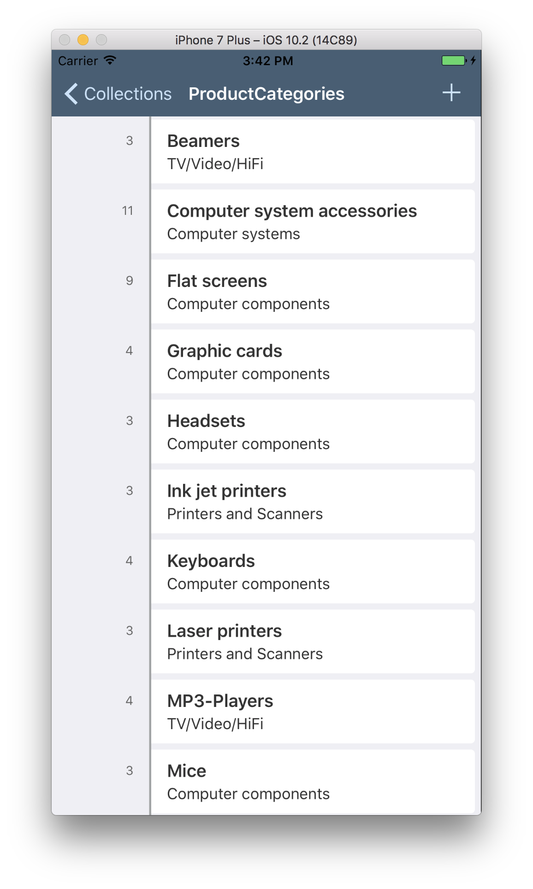

## Prerequisites  
 - **Proficiency:** Intermediate
 - **Device:** Apple iPad running iOS 10
 - **Development machine:** Access to a Mac computer
 - **Tutorials:** [Implement Fiori for iOS controls](https://www.sap.com/developer/tutorials/fiori-ios-hcpms-fioriuikit.html)


## Next Steps
 - [List Report Floorplan](https://www.sap.com/developer/tutorials/fiori-ios-scpms-floorplan.html)

## Details
### You will learn  
In the last blog, you added a Fiori Object Cell to a table view. Unfortunately, the Xcode Storyboard does not allow previews of third-party UI elements when contained in a binary framework file, such as the Fiori UI elements in the SAP Cloud Platform for iOS SDK. In this blog, you will learn to use the SAP Fiori Mentor iPad app to explore the various Fiori for iOS UI elements, modify them to your taste, and then transfer the generated code to your Xcode project.

### Time to Complete
**15 Min**

---

[ACCORDION-BEGIN [Step 1: ](Download the SAP Fiori Mentor app from the App Store)]

On your iPad running iOS 10, open the **App Store** application. In the search bar on the top-right, enter **SAP Fiori Mentor** and press **Search**.

At the search results screen, tap the **Get** button next to the **SAP Fiori Mentor** app icon. The app will now download and install on your device.


[ACCORDION-END]

[ACCORDION-BEGIN [Step 2: ](Explore the SAP Fiori Mentor app)]

Tap the **SAP Fiori Mentor** icon on your iPad's home screen. The app's **landing page** is now shown:



At the top, you see tiles linking to online documentation about the **Apple and SAP partnership**, the **SDK Documentation**, **iOS Development** tutorials from Apple, etc.

At the next row, a set of **demo apps** are shown, with icons indicating implemented functionality such as Touch ID support, location-based services, camera, etc. Clicking on these tiles will show details of the app, as well as screenshots of how it will look on both iPhone and iPad.

The next row lists the **Fiori UI components**, which will be explained in more detail in the next step.

The next row lists the SDK's **Foundation Components** concepts such as Authentication, Logging, etc. Clicking on one of these tiles will navigate to the API documentation for that foundation component.


[ACCORDION-END]


[ACCORDION-BEGIN [Step 3: ](Exploring Fiori UI Components)]

At the **Fiori UI Components** tile row, click the **See All** button. A page with all possible Fiori UI Components are shown:



Scroll through the page to get an idea of the available Fiori UI Components.


[ACCORDION-END]

[ACCORDION-BEGIN [Step 4: ](Explore the Timeline Cell)]

Scroll to the bottom of the page, and locate the **Timeline Cell** component tile. Click the tile, and the details page for this control are shown:



At the top, you see details about the control, as well as the Swift class name for the control, `FUITimelineCell`.

Below that is a row of **quick links** to various styles of the control. Clicking these quick links lets you switch between the most used representations of the control.

A preview of the control is displayed according to the currently selected style. At the bottom you can switch the layout of the control between iPad and iPhone modes.


[ACCORDION-END]

[ACCORDION-BEGIN [Step 5: ](Modify the Timeline Cell)]

At the lower-right of the screen are three buttons. Tap the **Settings** button (the button with the 3 dots). A **Settings Pop-out** is now displayed:



If you now change some properties for the control, you will see the changes are reflected immediately in the control's preview:




[ACCORDION-END]

[ACCORDION-BEGIN [Step 6: ](Use the modified Timeline Cell in your project)]

If you are happy with the way your modified Timeline Cell component looks, click the **Code Sample** button (the button displaying `</>`). A code sample is being generated based on the preferences you defined in the **Settings Pop out**:



The code sample shows a standalone example, but it is fairly easy to implement the sample code in your own project.

Tap the **Select All** button in the top-right. The sample code is now selected, and the selection action buttons are shown:



Click the **Copy** action button.


[ACCORDION-END]

[ACCORDION-BEGIN [Step 7: ](Examine the copied code)]

On your Mac, open a text editor of your choice, and using the [Universal Clipboard](https://support.apple.com/kb/PH25168) paste the copied code from the SAP Fiori Mentor app to the editor:



As you see, the sample code generates an example implementation extending from a `UITableViewController`. In the constructor, it declares a variable for the cell identifier.

In method `viewDidLoad()`, it sets up the table view with a specific height, style, and registers a `FUITimelineCell` class as the table cell.

Method `tableView(cellForRowAt)` returns a `FUITimelineCell` instance, and has the exact properties set you have selected in the SAP Fiori Mentor app.


[ACCORDION-END]

[ACCORDION-BEGIN [Step 8: ](Implement the copied code)]

If you were using a dedicated table view controller, you could simply copy the copied methods from the Mentor app into the table view controller. The SDK Assistant, on the other hand, uses a single `MasterViewController` with delegates for each entity in the model, so you need to adjust a bit. If you do not adjust and simply copy the code to the `MasterViewController`, all entities master table view would use the same `FUITimelineCell`.

In this example, however, you just want to implement the `FUITimelineCell` for the `ProductCategories` master table delegate.

Similar to the previous tutorial, drag a **Table View Cell** to the **Master Table View Controller**.



With the newly added **Table View Cell** selected, switch to it's **Attributes Inspector**.

Set the following properties:

| Property   | Value
|----------- |-------------
| Style      | Basic
| Identifier | `TimelineCell`

Switch to the cell's **Identity Inspector**, and change the class and module to the Fiori **Timeline Cell** control:

| Property | Value
|--------- | -----
| Class    | `FUITimelineCell`
| Module   | `SAPFiori`

Now, you need to implement logic to bind the **Object Cell**'s display properties to the model data.

Open the file `ProductCategoriesMasterTableDelegate.swift` under `Demo > TableDelegates > MasterTableDelegates`.

Import the SAP Fiori UI module:

```swift
import SAPFiori
```

Locate the following function:

```swift
func tableView(_ tableView: UITableView, cellForRowAt indexPath: IndexPath) -> UITableViewCell {
    let productcategory = self.entities[indexPath.row] as! ProductCategory
    let cell = cellWithNonEditableContent(tableView: tableView, indexPath: indexPath, with: "Category :\(productcategory.category)")
    return cell
}
```

Replace this function with the following code:

```swift
func tableView(_ tableView: UITableView, cellForRowAt indexPath: IndexPath) -> UITableViewCell {
    // These 4 rows are from the copied `viewDidLoad()` method
    tableView.estimatedRowHeight = 44
    tableView.rowHeight = UITableViewAutomaticDimension
    tableView.backgroundColor = UIColor.preferredFioriColor(forStyle: .backgroundBase)
    tableView.separatorStyle = .none

    // this line stays as it is
    let productcategory = self.entities[indexPath.row] as! ProductCategory

    // These lines are from the copied `tableView(cellForRowAt)` method
    let timelineCell = tableView.dequeueReusableCell(withIdentifier: "TimelineCell", for: indexPath) as! FUITimelineCell

    timelineCell.timelineWidth = CGFloat(95.0)
    timelineCell.headlineText = "Annual Relay Testing with the long text and lots of different tools and parts"
    timelineCell.subheadlineText = "819706"
    timelineCell.nodeImage = UIImage()
    timelineCell.eventText =  "10:00 AM"

    return timelineCell
}
```


[ACCORDION-END]

[ACCORDION-BEGIN [Step 9: ](Add model binding to implemented code)]

The implemented code now uses hard-coded values. Bind it to the `ProductCategory` entity model to have the Timeline Cell display meaningful data:

```swift
func tableView(_ tableView: UITableView, cellForRowAt indexPath: IndexPath) -> UITableViewCell {
timelineCell.headlineText = productcategory.categoryName!
timelineCell.subheadlineText = productcategory.mainCategoryName!
timelineCell.nodeImage = UIImage()
timelineCell.eventText =  String(describing: productcategory.numberOfProducts)
}
```


[ACCORDION-END]

[ACCORDION-BEGIN [Step 10: ](Build and run the app)]

Build and run the application. After logging in, click the **Product Categories** item. You should now see the master list with **Timeline Cell** items displaying the various properties of the **Product Category** entities:




[ACCORDION-END]


## Next Steps
- [List Report Floorplan](https://www.sap.com/developer/tutorials/fiori-ios-scpms-floorplan.html)
