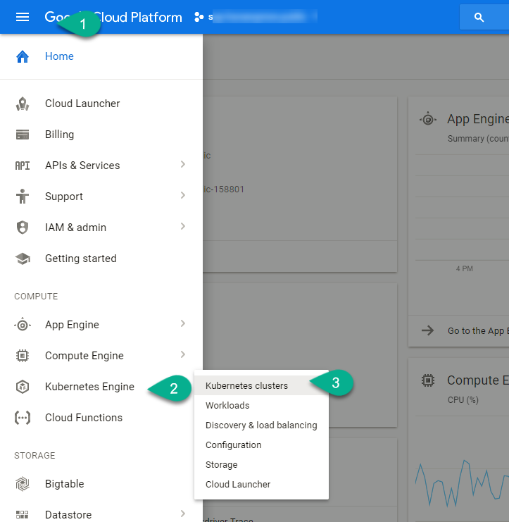
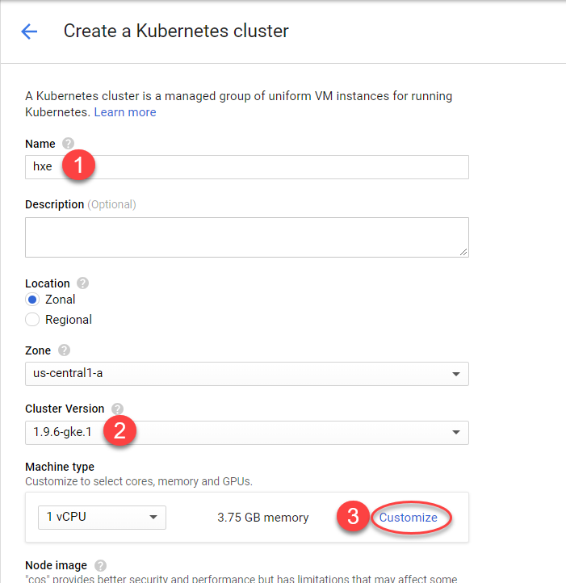
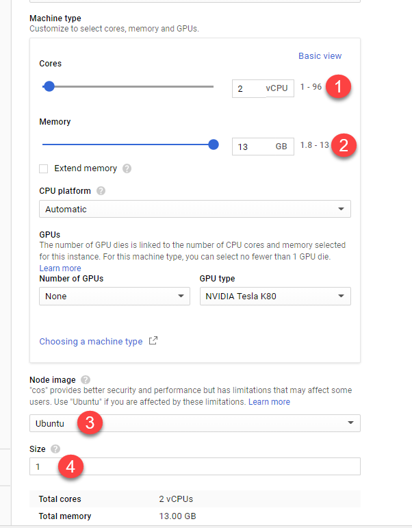
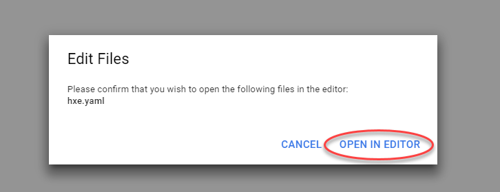
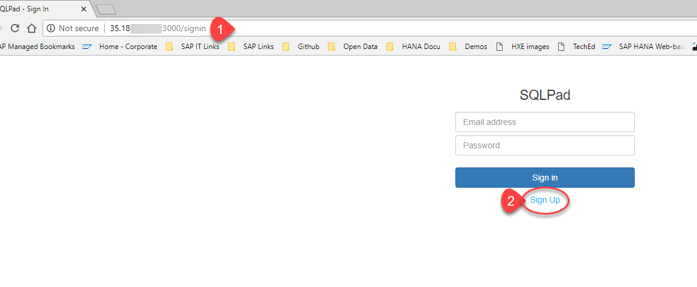
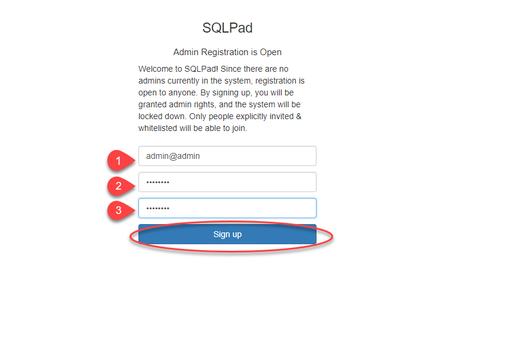
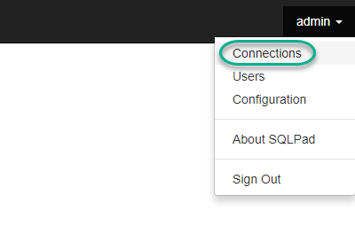
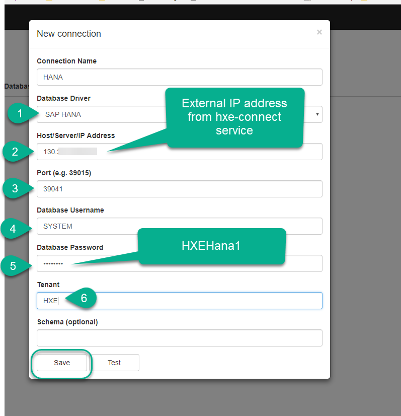
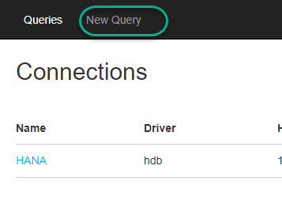

## Prerequisites  
 - **Proficiency:** Beginner

## Details
### You will learn  
- How to deploy SAP HANA, express edition on Google Kubernetes Engine
- How to connect to the database and perform advanced analytics

### Time to Complete
**15 Min**

---

[ACCORDION-BEGIN [Step 1: ](Create and configure a new Kubernetes cluster)]
Use the credentials provided by one of the experts at the booth at Google Next '18 to log into the [Google Cloud Platform console](https://console.cloud.google.com).


Once there, use the menu on the top left corner to navigate a new Kubernetes cluster from the `Kubernetes Engine` menu.



Click **Create cluster**.


Fill in the name, choose version `1.9.6` and click **Customize**.



Set the CPU to 2 and memory to 13. Choose **Ubuntu** as the operating system and set the size of the cluster to **1**.



Scroll down and click **Create**.

[ACCORDION-END]


[ACCORDION-BEGIN [Step 2: ](Connect to your cluster)]

The setup will take some time. Meanwhile, here is some information about what is SAP HANA, express edition to make waiting easier.

<iframe width="560" height="315" src="https://www.youtube.com/embed/xUWqP8wWJIQ" frameborder="0" allow="autoplay; encrypted-media" allowfullscreen></iframe>

Once the cluster has finished deploying, click **Connect**.


Use **Run in Cloud Shell** to connect from the web console.


This will open a `gcloud` console with a command ready to connect to the cluster in your project and selected zone. Hit **enter** to execute the command.


[ACCORDION-END]

[ACCORDION-BEGIN [Step 3: ](Create the deployment configuration files)]

Go back to the `gcloud` console for your cluster.


Create a secret to fetch the Docker image using the command below. **Copy and paste** the command into the console and press **enter**.

```ssh
kubectl create secret docker-registry docker-secret --docker-server=https://index.docker.io/v1/ --docker-username=gnext18 --docker-password=SAP@GoogleNext18 --docker-email=hana.express.rocks@gmail.com
```


From the console, use the following commands to create a new file and open the web text editor:

```
touch hxe.yaml
edit hxe.yaml
```


Confirm opening an editor:



This will open an online editor where you will paste the contents of the file below.


```text
kind: ConfigMap
apiVersion: v1
metadata:
  creationTimestamp: 2018-01-18T19:14:38Z
  name: hxe-pass
data:
  password.json: |+
    {"master_password" : "HXEHana1"}
`---`
kind: PersistentVolume
apiVersion: v1
metadata:
  name: persistent-vol-hxe
  labels:
    type: local
spec:
  storageClassName: manual
  capacity:
    storage: 150Gi
  accessModes:
    - ReadWriteOnce
  hostPath:
    path: "/data/hxe_pv"
`---`
kind: PersistentVolumeClaim
apiVersion: v1
metadata:
  name: hxe-pvc
spec:
  storageClassName: manual
  accessModes:
    - ReadWriteOnce
  resources:
    requests:
      storage: 50Gi
`---`
apiVersion: apps/v1
kind: Deployment
metadata:
  name: hxe
  labels:
    name: hxe
spec:
  selector:
    matchLabels:
      run: hxe
      app: hxe
      role: master
      tier: backend
  replicas: 1
  template:
    metadata:
      labels:
        run: hxe
        app: hxe
        role: master
        tier: backend
    spec:
      initContainers:
        - name: install
          image: busybox
          command: [ 'sh', '-c', 'chown 12000:79 /hana/mounts' ]
          volumeMounts:
            - name: hxe-data
              mountPath: /hana/mounts
      volumes:
        - name: hxe-data
          persistentVolumeClaim:
             claimName: hxe-pvc
        - name: hxe-config
          configMap:
             name: hxe-pass
      imagePullSecrets:
      - name: docker-secret
      containers:
      - name: hxe-container
        image: "store/saplabs/hanaexpress:2.00.030.00.20180403.2"
        ports:
          - containerPort: 39013
            name: port1
          - containerPort: 39015
            name: port2
          - containerPort: 39017
            name: port3
          - containerPort: 8090
            name: port4
          - containerPort: 39041
            name: port5
          - containerPort: 59013
            name: port6
        args: [ "--agree-to-sap-license", "--dont-check-system", "--passwords-url", "file:///hana/hxeconfig/password.json" ]
        volumeMounts:
          - name: hxe-data
            mountPath: /hana/mounts
          - name: hxe-config
            mountPath: /hana/hxeconfig
      - name: sqlpad-container
        image: "sqlpad/sqlpad"
        ports:
        - containerPort: 3000

`---`
apiVersion: v1
kind: Service
metadata:
  name: hxe-connect
  labels:
    app: hxe
spec:
  type: LoadBalancer
  ports:
  - port: 39013
    targetPort: 39013
    name: port1
  - port: 39015
    targetPort: 39015
    name: port2
  - port: 39017
    targetPort: 39017
    name: port3
  - port: 39041
    targetPort: 39041
    name: port5
  selector:
    app: hxe
`---`
apiVersion: v1
kind: Service
metadata:
  name: sqlpad
  labels:
    app: hxe
spec:
  type: LoadBalancer
  ports:
  - port: 3000
    targetPort: 3000
    protocol: TCP
    name: sqlpad
  selector:
    app: hxe
```

The file will be automatically saved to your home directory (`/home/YOUR_GOOGLE_ID`).

[ACCORDION-END]

[ACCORDION-BEGIN [Step 4: ](Deploy a HANA Express Docker container on your Docker pod)]

Use the following command to deploy the image on your pods and check deployment:

```
kubectl create -f hxe.yaml
kubectl describe pods
```

Initially, you will probably see a message stating that the image is being pulled. Repeat the command a couple of minutes later until you see the container is started:

  

Use the following command to check the name of the pod. Make sure the status is `Running` and `2/2`.

```text
kubectl get pods
```

Use the name of the pod to replace it in the following command

```text
kubectl exec -it <<pod-name>> bash
```
For example:

  

Use the following SQL commands to connect to the database and enable document store for later user

```SQL
hdbsql -i 90 -d systemdb -u SYSTEM -p HXEHana1
```

Paste the following command into the SQL prompt

```sql
alter database HXE add 'docstore';
```

Use `quit` to exit the SQL command line and `exit`

  


[ACCORDION-END]

[ACCORDION-BEGIN [Step 5: ](Check your external IP address to connect to SAP HANA, express edition)]

Get the external IP addresses from the SQLPAD service

```
kubectl get services
```

  

Open a new tab, and use the IP address and port 3000 to connect to SQLPAD. Click on **Sign in** to create an administration account

  

Fill in the details and create the account and sign up

  

**Sign in** using your credentials and use the **Connections** option on the top right corner to connect to your database

  

Use the external IP address from the `hxe-connect` service this time


Click on **New connection** and fill the details as below



[ACCORDION-END]

[ACCORDION-BEGIN [Step 6: ](Play with SQL and earn a prize)]

Click **New Query**



Paste the following commands in `SQLPAD`. Execute them one by one by selecting them and pressing **Run**.

```sql

create collection quotes;


--Create a collection for document store and insert JSON values

insert into quotes values ( { "FROM" : 'HOMER',   "QUOTE" :  'I want to share something with you: The three little sentences that will get you through life. Number 1: Cover for me. Number 2: Oh, good idea, Boss! Number 3: It wai like that when I got here.', "MOES_BAR" : 'Point(  -86.880306 36.508361 )', "QUOTE_ID" : 1  });
insert into quotes values ( { "FROM" : 'HOMER',   "QUOTE" :  'Wait a minute. Bart''s teacher is named Krabappel? Oh, I''ve been calling her Crandall. Why did not anyone tell me? Ohhh, I have been making an idiot out of myself!', "QUOTE_ID" : 2, "MOES_BAR" : 'Point( -87.182708 37.213414 )' });
insert into quotes values ( { "FROM" : 'HOMER',   "QUOTE" :  'Oh no! What have I done? I smashed open my little boy''s piggy bank, and for what? A few measly cents, not even enough to buy one beer. Weit a minute, lemme count and make sure…not even close.', "MOES_BAR" : 'Point( -122.400690 37.784366 )', "QUOTE_ID" : 3 });

--Create a columnar table with a text fuzzy search index
create column table quote_analysis
(
	id integer,
	homer_quote text FAST PREPROCESS ON FUZZY SEARCH INDEX ON,
	lon_lat nvarchar(200)

);


-- Copy the quotes form the JSON store to the relational table
insert into quote_analysis
with doc_store as (select quote_id, quote from quotes)
select doc_store.quote_id as id, doc_store.quote as homer_quote, 'Point( -122.676366 45.535889 )'
from doc_store;


--Find out the lowest similarity with word "wait". Take note of the first ID
select  id, score() as similarity , lon_lat, TO_VARCHAR(HOMER_QUOTE)
from quote_analysis
where contains(HOMER_QUOTE, 'wait', fuzzy(0.5,'textsearch=compare'))
order by similarity asc

--Do you want a prize? Fill in the ID in the WHERE clause below with the first result in the previous query
-- to calculate the distance in kilometers between two points using the geospatial engine
-- Share the result with any of the experts, they will give you something to cope with the distance
with doc_store as (select quote_id, moes_bar from quotes)
select st_geomFromText( quote_analysis.lon_lat, 4326).st_distance(st_geomFromtext( doc_store.moes_bar, 4326), 'meter') / 1000 as DISTANCE_KM
from doc_store
inner join quote_analysis on doc_store.quote_id = <<Fill in with the ID of the lowest similarity score>>;
```

**Congratulations!**
You have completed this tutorial. Visit **`developers.sap.com`** to get your free deployment of SAP HANA, express edition and learn from hundreds of available tutorials.

[ACCORDION-END]
