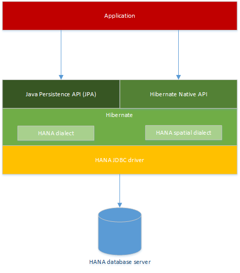

## Prerequisites  
 - **Proficiency:** Beginner


## Details
### You will learn  
In this tutorial you will learn the basic concepts of the Hibernate ORM (Object/Relational Mapping) framework.

### Time to Complete
**10 Min**

[ACCORDION-BEGIN [Step 1: ](The Hibernate ORM framework)]

[Hibernate](http://hibernate.org/) is an open source object-relational mapping framework for the Java programming language. Its primary purpose is to map an object-oriented domain model written in Java to a relational model that can be persisted in a relational database.



The Hibernate framework presents the user with an abstraction of the database thereby freeing the user from knowing too many details about the representation of the data in the database. The user only deals with the objects of the object-oriented model and can stay entirely within the concepts of the Java programming language.

The Hibernate framework thus solves the so called "[object-relational impedance mismatch](http://hibernate.org/orm/what-is-an-orm/#the-object-relational-impedance-mismatch)", i.e. it takes care of the conceptual differences between the object-oriented model and the relational model. The database specifics are implemented as so-called dialects that are called by the Hibernate core to generate valid SQL statements for the different database systems.

The general concept of object-relational mapping has been standardized in Java by the [Java Persistence API (JPA)](https://jcp.org/en/jsr/detail?id=338). Hibernate is also an implementation of the JPA and can therefore be used with any JPA-compliant application.

[ACCORDION-END]

[ACCORDION-BEGIN [Step 2: ](Entities)]

The core concept of the Hibernate domain model is the notion of an entity. An entity in the object-oriented model is usually an object which maps to a table row in the relational model. The entity's structure is defined by the corresponding class which is mapped to a database table.

Entities are objects that don't depend on other objects. They are identified by a unique identifier and usually contain the data that the application needs to be persisted. The data persisted in the database corresponding to an entity can be manipulated (created, altered, retrieved, deleted) via the Hibernate framework.

Entities are defined in the object-oriented model by means of Java annotations. The minimum required annotation is `@javax.persistence.Entity` which declares a class an entity. The identifier of the entity is specified using the `@javax.persistence.Id` annotation. There are many more annotations available that allow for a high degree of customization.

An example of an entity could be a person, an address, a phone number, etc. which would be transposed like this in your Java code:

```java
@Entity
public class Person {
  @Id
  private String name;
  private String address;
  private String phoneNumber;
}

@Entity
public class Address {
  private String street;
  private String city;
}

@Entity
public class PhoneNumber {
  private String areaCode;
  private String phoneNumber;
}
```

[ACCORDION-END]

[ACCORDION-BEGIN [Step 3: ](Associations)]

A domain model usually defines relation between different entities. These relations are represented in the Hibernate model by different types of associations. These association types include one-to-one, one-to-many, many-to-one, and many-to-many.

In the object-oriented model the associations are usually members of a class (simple objects or lists or sets of objects, depending on the type of association). The associations are mapped to the relational model by means of intermediary tables and/or foreign key relations.

Like entities associations are defined in the Hibernate model via Java annotations. The annotations corresponding to the above associations are `@javax.persistence.OneToOne`, `@javax.persistence.OneToMany`, `@javax.persistence.ManyToOne`, and `@javax.persistence.ManyToMany`.

An example for an association is a one-to-many association between a person and a phone number, i.e. a person can have one or more phone numbers, and this would be transposed like this in your Java code:

```java
@Entity
public class Person {
   @Id
   private String name;
   @OneToOne
   private Address address;
   @OneToMany
   private List<PhoneNumber> phoneNumbers;
}

@Entity
public class Address {
   private String street;
   private String city;
}

@Entity
public class PhoneNumber {
   private String areaCode;
   private String phoneNumber;
}
```


[ACCORDION-END]

[ACCORDION-BEGIN [Step 4: ](The Hibernate Session)]

At application boot time the model is read from the Java classes by the Hibernate framework and transformed into a runtime representation.

This runtime representation is created and validated by a Hibernate `SessionFactory` instance. The `SessionFactory` instance can then be used to create Hibernate Session objects which can be used to interact with the database. The Hibernate `Session` object provides methods for reading and writing data as well as querying capabilities.

The JPA equivalent of the Hibernate `SessionFactory` is the `EntityManagerFactory`, the JPA equivalent of the Hibernate `Session` is the `EntityManager`.

[ACCORDION-END]

[ACCORDION-BEGIN [Step 5: ](Queries)]

The data in the database can be queried in different ways providing different degrees of customization. The entry point of all retrieval methods is an active Hibernate `Session`, or JPA `EntityManager`, respectively.

- **Entity retrieval via identifier**

  An entity can be queried easily by specifying the type of entity and the identifier.

```java
Session session = openSession();
Person johnDoe = session.get(Person.class, "John Doe");
```

- **Entity retrieval via HQL/JPQL query**

  Hibernate comes with a custom SQL-like query language called Hibernate Query Language (HQL) which is a super-set of the JPA Query Language (JPQL) specification. Retrieving entities via this query language allows for greater flexibility while still being database independent.

```java
Session session = openSession();
Query<Person> query = session.createQuery( "SELECT p FROM Person p WHERE p.name=:name", Person.class );
query.setParameter( "name", "John Doe" );
Person johnDoe = query.uniqueResult();
```

- **Entity retrieval via native SQL query**

  If necessary it is still possible to query the database via native SQL queries. This should be done as little as possible as the application will generally not be portable to another database any more.

```java
Session session = openSession();
NativeQuery<Person> query = session.createNativeQuery( "SELECT * FROM Person WHERE name=?", Person.class );
query.setParameter( 1, "John Doe" );
Person johnDoe = query.uniqueResult();
```

[ACCORDION-END]

[ACCORDION-BEGIN [Optional: ](Hibernate References)]

More information about Hibernate can be found using the following links:

 - [Hibernate ORM website](http://hibernate.org/orm/)
 - [Hibernate documentation](http://hibernate.org/orm/documentation/),
 - [Hibernate user guide](http://docs.jboss.org/hibernate/orm/current/userguide/html_single/Hibernate_User_Guide.html).

[ACCORDION-END]
