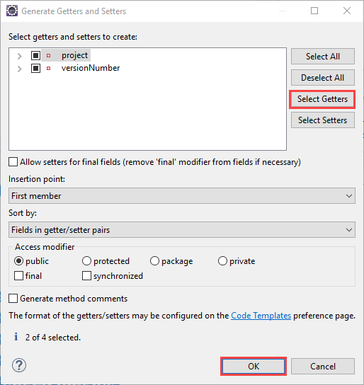
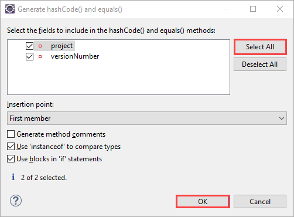

## Prerequisites  
 - **Proficiency:** Beginner

## Details
### You will learn  
In this tutorial you will learn how to create a simple object-oriented data model in Java and use Hibernate to read and write data from and to a SAP HANA database instance.

### Time to Complete
**15 Min**

[ACCORDION-BEGIN [Step 1: ](Define the model)]

In this tutorial you will model a small software project portal where developers can create projects, upload code, and create software releases.

The model consists of three entities: project, developer, and version:


A project has exactly one owner and can have zero or more contributors. A project can have zero or more released versions.

As defined by the model three Java classes representing the entities will be created:

 - Project
 - Developer
 - Version

As the identity of a version entity will be defined by a composite value (i.e. the project to which it belongs and the version string), we will need an additional class named `VersionPK` to represent it.

[ACCORDION-END]

[ACCORDION-BEGIN [Step 2: ](Create the Version Key Entity)]

As the identity of a version entity is defined by a composite value (i.e. the project to which it belongs and the version string), we will need an additional class named `VersionPK` to represent it.

This class will be referenced by the `Version` class via the `@IdClass` annotation and could subsequently be used to query the database for a specific version.

Create a Java class named **`VersionPK`** in a package named **`com.sap.hana.hibernate.tutorial.simple`** (either using a right-click on the project and choose ***New -> Class*** or use the ***File -> New -> Class*** menu bar), then paste the following content:

```java
package com.sap.hana.hibernate.tutorial.simple;

import java.io.Serializable;

public class VersionPK implements Serializable {
	private String versionNumber;
	private Project project;
}
```

Now, generate the ***Getters*** for all the attributes using the ***Source -> Generate Getters and Setters...*** menu bar or using a right click in the code, click on ***Select Getters***, and then click on ***Finish***.



Next, we need to generate the ***`hashCode` & equals*** function for all the attributes using the ***Source -> Generate `hashCode`() and equals()...*** menu bar or using a right click in the code, click on ***Select All***, and then click on ***Finish***.



Save the class file.

> **Note:** Upon saving the class, a warning will remain as the class is missing the `serialVersionUID` attribute. To fix it, add the following code:
```java
private static final long serialVersionUID = 1L;
```

&nbsp;
[ACCORDION-END]

[ACCORDION-BEGIN [Step 3: ](Create the Version Entity)]

This class defines three attributes:

- ***The version number***: this string is used to uniquely identify a version of a project.
- ***The project***: the project is also part of the version identifier since two different projects could both specify a version with the same name, e.g. "1.0".
- ***The release date***: contains the date on which the version was released.

Create a Java class named **`Version`** in a package named **`com.sap.hana.hibernate.tutorial.simple`** (either using a right-click on the project and choose ***New -> Class*** or use the ***File -> New -> Class*** menu bar), then paste the following content:

```java
package com.sap.hana.hibernate.tutorial.simple;

import java.util.Date;

import javax.persistence.Entity;
import javax.persistence.Id;
import javax.persistence.IdClass;
import javax.persistence.ManyToOne;

@IdClass(value = VersionPK.class)
@Entity
public class Version {
  @Id
	private String versionNumber;
	@ManyToOne
	private Project project;
	private Date releaseDate;

	protected Version() {
	}
	public Version(String versionNumber, Project project) {
		this.versionNumber = versionNumber;
		this.project = project;
		this.releaseDate = new Date();
	}
	public void setReleaseDate(Date releaseDate) {
		this.releaseDate = releaseDate;
	}
}
```

Now, generate the ***Getters*** for all the attributes using the ***Source -> Generate Getters and Setters...*** menu bar or using a right click in the code, click on ***Select Getters***, and then click on ***Finish***.

Save the class file.

> **Note:** Upon saving the class, a series of errors will remain as the ***Project*** class is missing. this will be resolved when the next steps will be completed.

&nbsp;

[ACCORDION-END]

[ACCORDION-BEGIN [Step 4: ](Create the Developer Entity)]

The class defines four attributes:

- ***The developer's e-mail address***: since e-mail addresses are globally unique, a developer's e-mail address can serve as a natural identifier (defined via the `@Id` annotation).
- ***The developer's name***: the name of the developer.
- ***The list of projects owned by the developer***: a list of `Project` instances. The association is defined as one-to-many via the `@OneToMany` annotation as a developer can own zero or more projects, but a project is always owned by exactly one developer.

> **Note:** upon saving the class, a series of errors will be triggered as the other classes are not yet created.

&nbsp;

Create a Java class named **`Developer`** in a package named **`com.sap.hana.hibernate.tutorial.simple`** (either using a right-click on the project and choose ***New -> Class*** or use the ***File -> New -> Class*** menu bar), then paste the following content:

```java
package com.sap.hana.hibernate.tutorial.simple;

import java.util.List;

import javax.persistence.Entity;
import javax.persistence.Id;
import javax.persistence.OneToMany;

import org.hibernate.annotations.NaturalId;

@Entity
public class Developer {
  @Id
	private String eMailAddress;
	private String name;
	@OneToMany(mappedBy = "projectOwner")
	private List<Project> ownedProjects;

	protected Developer() {
	}

	public Developer(String eMailAddress) {
		this.eMailAddress = eMailAddress;
	}

	public void setName(String name) {
		this.name = name;
	}
}
```

Now, generate the ***Getters*** for all the attributes using the ***Source -> Generate Getters and Setters...*** menu bar or using a right click in the code, click on ***Select Getters***, and then click on ***Finish***.

Save the class file.

> **Note:** Upon saving the class, a series of errors will remain as the ***Project*** class is missing. this will be resolved when the next steps will be completed.

&nbsp;

[ACCORDION-END]

[ACCORDION-BEGIN [Step 5: ](Create the Project Entity)]

The class defines four attributes:

- ***The project name***: serves as the identifier of the project as denoted by the `@Id` annotation.
- ***The project owner***: an instance of the `Developer` entity. The association is defined as many-to-one via the `@ManyToOne` annotation as a project always has exactly one owner, but a developer could own several projects.
- ***The list of project contributors****: a list of `Developer` instances. The association is defined as many-to-many via the `@ManyToMany` annotation as a project can have zero or more contributors, and a developer could contribute to zero or more projects.
- ***The list of project versions***: a list of `Version` instances. The association is defined as one-to-many via the `@OneToMany` annotation as a project can have zero or more versions, but a version always belongs to exactly one project.


Create a Java class named **`Project`** in a package named **`com.sap.hana.hibernate.tutorial.simple`** (either using a right-click on the project and choose ***New -> Class*** or use the ***File -> New -> Class*** menu bar), then paste the following content:

```java
package com.sap.hana.hibernate.tutorial.simple;

import java.util.ArrayList;
import java.util.List;

import javax.persistence.Entity;
import javax.persistence.Id;
import javax.persistence.ManyToMany;
import javax.persistence.ManyToOne;
import javax.persistence.OneToMany;

@Entity
public class Project {
  @ManyToMany
	private List<Developer> contributors;

	@Id
	private String name;

	@ManyToOne
	private Developer projectOwner;

	@OneToMany(mappedBy = "project")
	private List<Version> versions;

	protected Project() {
	}
	public Project(String name) {
		this.name = name;
	}
	public void addContributor(Developer contributor) {
		if (this.contributors == null) {
			this.contributors = new ArrayList<>();
		}
		this.contributors.add(contributor);
	}
	public void addVersion(Version version) {
		if (this.versions == null) {
			this.versions = new ArrayList<>();
		}
		this.versions.add(version);
	}
	public void setProjectOwner(Developer projectOwner) {
		this.projectOwner = projectOwner;
	}
}
```

Save the class file.

> **Note:** upon saving the class, a series of errors will be triggered as the other classes are not yet created.

&nbsp;

[ACCORDION-END]

[ACCORDION-BEGIN [Step 6: ](Test your entities)]

Now let's test our created entities with the following:

 1. creates two developers, John Doe and Jane Doe.
 2. creates a project owned by John and adds Jane as a contributor.
 3. creates version 1.0 of the project.
 4. search for the created project and test its content

Create a Java class named **`TestSimple`** in a package named **`com.sap.hana.hibernate.tutorial.simple`** (either using a right-click on the project and choose ***New -> Class*** or use the ***File -> New -> Class*** menu bar), then paste the following content:

```java
package com.sap.hana.hibernate.tutorial.simple;

import javax.persistence.EntityManager;
import javax.persistence.EntityManagerFactory;
import javax.persistence.Persistence;

public class TestSimple {

	private static Developer createDeveloper(String name, String eMail) {
		Developer developer = new Developer(eMail);
		developer.setName(name);
		return developer;
	}

	private static Project createProject(String name, Developer owner) {
		Project project = new Project(name);
		project.setProjectOwner(owner);
		return project;
	}

	private static Version createVersion(String versionNumber, Project project) {
		Version version = new Version(versionNumber, project);
		return version;
	}

	public static void main(String[] args) {
		try {
			EntityManagerFactory entityManagerFactory = Persistence.createEntityManagerFactory("Tutorial");
			EntityManager entityManager = entityManagerFactory.createEntityManager();

			entityManager.getTransaction().begin();

			System.out.println("************************************************************************");
			System.out.println(" >> Creating entities");
			System.out.println("************************************************************************");

			Developer john = createDeveloper("John Doe", "john@doe.com");
			entityManager.persist(john);

			Developer jane = createDeveloper("Jane Doe", "jane@doe.com");
			entityManager.persist(jane);

			Project project = createProject("John's big project", john);
			project.addContributor(jane);

			Version version = createVersion("1.0", project);
			project.addVersion(version);

			entityManager.persist(project);

			project.addVersion(version);

			entityManager.persist(version);

			entityManager.getTransaction().commit();
			entityManager.clear();

			System.out.println("************************************************************************");
			System.out.println(" >> Creating entities completed");
			System.out.println("************************************************************************");

			System.out.println("************************************************************************");
			System.out.println(" >> Finding project by name");
			System.out.println("************************************************************************");

			Project johnsBigProject = entityManager.find(Project.class, "John's big project");

			System.out.println("************************************************************************");
			System.out.println(" >> Getting project name : " + johnsBigProject.getName());
			System.out.println(" >> Getting project owner: " + johnsBigProject.getProjectOwner().getName());
			System.out.println("************************************************************************");

			assert johnsBigProject.getName().equals("John's big project");
			assert johnsBigProject.getProjectOwner().getName().equals("John Doe");
			System.out.println("************************************************************************");
			entityManager.clear();
			entityManager.close();
		} catch (Exception e) {
			e.printStackTrace();
		}
		System.exit(0);
	}
}
```

Save the class file.

Run the application by right-clicking the class file and choosing ***Run As -> Java Application*** or click on the  icon.

You should see the following output log in your console:

```
INFO: HHH000204: Processing PersistenceUnitInfo [
	name: Tutorial
	...]
INFO: HHH000412: Hibernate Core {5.2.12.Final}
INFO: HHH000206: hibernate.properties not found
INFO: HHH80000001: hibernate-spatial integration enabled : true
INFO: HCANN000001: Hibernate Commons Annotations {5.0.1.Final}
WARN: HHH10001002: Using Hibernate built-in connection pool (not for production use!)
INFO: HHH10001005: using driver [com.sap.db.jdbc.Driver] at URL [jdbc:sap://rhhxehost:39015]
INFO: HHH10001001: Connection properties: {user=SYSTEM, password=****}
INFO: HHH10001003: Autocommit mode: false
INFO: HHH000115: Hibernate connection pool size: 5 (min=1)
INFO: HHH000400: Using dialect: org.hibernate.dialect.HANAColumnStoreDialect
INFO: HHH000424: Disabling contextual LOB creation as createClob() method threw error : java.lang.reflect.InvocationTargetException
Hibernate:

    drop table Developer cascade
INFO: HHH10001501: Connection obtained from JdbcConnectionAccess [org.hibernate.engine.jdbc.env.internal.JdbcEnvironmentInitiator$ConnectionProviderJdbcConnectionAccess@72ea6193] for (non-JTA) DDL execution was not in auto-commit mode; the Connection 'local transaction' will be committed and the Connection will be set into auto-commit mode.
Hibernate:

    drop table Project cascade
Hibernate:

    drop table Project_Developer cascade
Hibernate:

    drop table Version cascade
Hibernate: create column table Developer (eMailAddress varchar(255) not null, name varchar(255), primary key (eMailAddress))
INFO: HHH10001501: Connection obtained from JdbcConnectionAccess [org.hibernate.engine.jdbc.env.internal.JdbcEnvironmentInitiator$ConnectionProviderJdbcConnectionAccess@7c541c15] for (non-JTA) DDL execution was not in auto-commit mode; the Connection 'local transaction' will be committed and the Connection will be set into auto-commit mode.
Hibernate: create column table Project (name varchar(255) not null, projectOwner_eMailAddress varchar(255), primary key (name))
Hibernate: create column table Project_Developer (Project_name varchar(255) not null, contributors_eMailAddress varchar(255) not null)
Hibernate: create column table Version (versionNumber varchar(255) not null, releaseDate timestamp, project_name varchar(255) not null, primary key (project_name, versionNumber))
Hibernate:

    alter table Project
       add constraint FK3oeqfkq5jn0kjy2mdaft7rp5u
       foreign key (projectOwner_eMailAddress)
       references Developer
Hibernate:

    alter table Project_Developer
       add constraint FKfjmrxrx78c50vodgyffyfu1ni
       foreign key (contributors_eMailAddress)
       references Developer
Hibernate:

    alter table Project_Developer
       add constraint FKs6slwia2sper8m6sqjma71g3d
       foreign key (Project_name)
       references Project
Hibernate:

    alter table Version
       add constraint FK9igf86no0jfeogkcj9q46l290
       foreign key (project_name)
       references Project
INFO: HHH000476: Executing import script 'org.hibernate.tool.schema.internal.exec.ScriptSourceInputNonExistentImpl@3b2c0e88'
************************************************************************
 >> Creating entities
************************************************************************
Hibernate:
    insert
    into
        Developer
        (name, eMailAddress)
    values
        (?, ?)
Hibernate:
    insert
    into
        Developer
        (name, eMailAddress)
    values
        (?, ?)
Hibernate:
    insert
    into
        Project
        (projectOwner_eMailAddress, name)
    values
        (?, ?)
Hibernate:
    insert
    into
        Version
        (releaseDate, project_name, versionNumber)
    values
        (?, ?, ?)
Hibernate:
    insert
    into
        Project_Developer
        (Project_name, contributors_eMailAddress)
    values
        (?, ?)
************************************************************************
 >> Creating entities completed
************************************************************************
************************************************************************
 >> Finding project by name
************************************************************************
************************************************************************
 >> Getting project name : John's big project
 >> Getting project owner: John Doe
************************************************************************
************************************************************************
```

This output shows the SQL statements that were generated to insert the values into the database and to read the project from the database again.

[ACCORDION-END]
