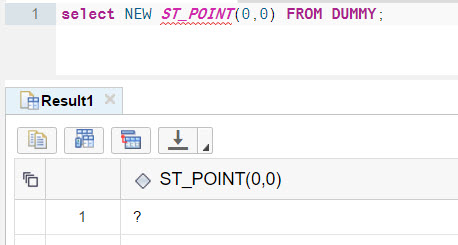
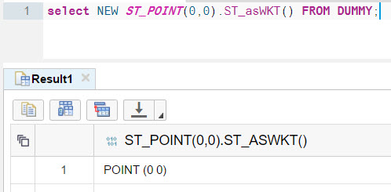
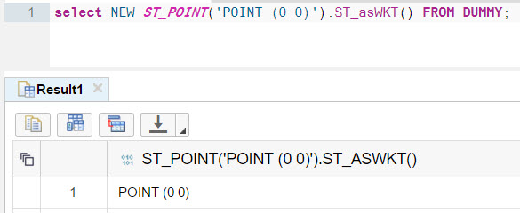
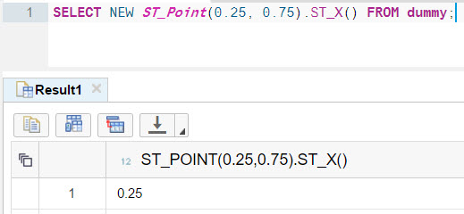
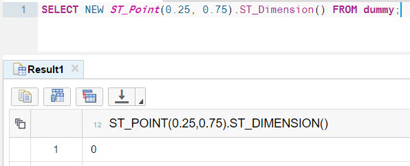

## Prerequisites  
- **Proficiency:** Beginner
- **System access:** You have developer access to SAP HANA database instance, for example [SAP HANA, express edition](https://www.sap.com/developer/topics/sap-hana-express.html), or [SAP HANA MDC instance in SAP Cloud Platform Trial account](https://www.sap.com/developer/tutorials/hana-web-development-workbench.html).

## Next Steps
- [SAP HANA Spatial: Strings](https://www.sap.com/developer/tutorials/hana-spatial-intro2-string.html)

## Details
### You will learn  
You will learn the basics of spatial processing starting with points, and use them to understand the types, constructors and methods defined by the SQL/MM standard implemented by a SAP HANA database.

### Time to Complete
**5 Min**.

---

[ACCORDION-BEGIN [Step 1: ](Select a point in the 2D Euclidean space)]

SAP HANA includes a spatial engine and supports spatial data types and methods for processing spatial data. **Spatial data** is data that describes the position, shape, and orientation of objects in a defined space.

>Source: SAP HANA Spatial Reference

Open the SQL editor of your choice (web or desktop based) connected to your SAP HANA database instance.

Type the following SQL statement.
```sql
select NEW ST_POINT(0,0) FROM DUMMY;
```

This query selects a point in the 2-dimensional `2D` Euclidean space. A point defines a single location in space. A point always has an X and Y coordinate. In the example above it is (0, 0), i.e. `X=0` and `Y=0`.

Spatial support in SAP HANA database follows the **`ISO/IEC 13249-3` "SQL multimedia and application packages -- Part 3: Spatial"** (`SQL/MM`) standard. This standard defines:
- how to store, retrieve and process spatial data using SQL,
- how spatial data is to be represented as values,
- which functions are available for converting, comparing, and processing this data in various ways.

A key component of this standard is the use of the ___spatial data types hierarchy___. Within the hierarchy, the prefix `ST` is used for all data types (also referred to as ___classes___ or ___types___).

The **`ST_POINT`** type is a 0-dimensional geometry which represents a single location. To get an object of the `ST_POINT` spatial type you need to call a type's constructor following the syntax **`NEW ST_Point(<x>,<y>)`**, where x and y are the corresponding longitude and latitude coordinate values of data type DOUBLE.

Execute the query. Congratulations! You've just run your very first query using the spatial capabilities of SAP HANA.




[ACCORDION-END]

[ACCORDION-BEGIN [Step 2: ](Change result format)]

The Web-based workbench returns a question mark (`?`) as a result of the query execution. In some other SQL clients the value like `010100000000000000000000000000000000000000` can be returned.

This is because SAP HANA database stores spatial objects not in the text, but in the binary form. To get a human-readable value you need to apply a method **`ST_asWKT()`** to the `ST_POINT` object. ___WKT___ stands for **Well-known text**, which is a text markup language for representing vector geometry objects defined by the Open Geospatial Consortium (OGC). SAP HANA follows this industry standard.

Syntax for Spatial Functions must be in ___Objective-style___, therefore modify the statement to use object syntax as shown below and execute.

```sql
select NEW ST_POINT(0,0).ST_asWKT() FROM DUMMY;
```

Now the result of the query `POINT (0 0)` can be read and understood by a human.




[ACCORDION-END]

[ACCORDION-BEGIN [Step 3: ](Define a point in the constructor)]

The WKT standard can also be used to define a point in the constructor. The following query

```sql
select NEW ST_POINT('POINT (0 0)').ST_asWKT() FROM DUMMY;
```

will return the same result as `NEW ST_POINT(0,0)`




[ACCORDION-END]

[ACCORDION-BEGIN [Step 4: ](Try other spatial methods)]

There are more spatial methods that can be applied to `ST_POINT` objects. For now try two of them. Both will be **Access Functions** used to retrieve characteristics of spatial geometries.

`ST_X()` returns the X coordinate of the `ST_POINT` value as a DOUBLE data type.



`ST_Dimension()` returns the dimension of the point or other geometry objects. In the case of points the result is obviously `0`.




[ACCORDION-END]


### Optional
- Check the [SAP HANA Spatial Reference](https://help.sap.com/viewer/cbbbfc20871e4559abfd45a78ad58c02/latest/en-US)

## Next Steps
- [SAP HANA Spatial: Strings](https://www.sap.com/developer/tutorials/hana-spatial-intro2-string.html)
