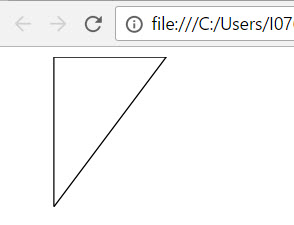
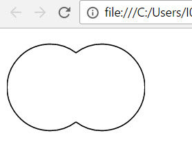
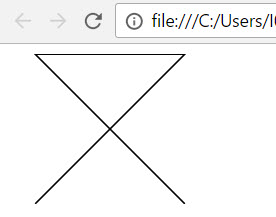

## Prerequisites  
- **Proficiency:** Beginner
- **Tutorials:** [Intro to SAP HANA Spatial: Points](https://www.sap.com/developer/tutorials/hana-spatial-intro1-point.html)

## Next Steps
- [Intro to SAP HANA Spatial: Polygons](https://www.sap.com/developer/tutorials/hana-spatial-intro3-polygon.html)

## Details
### You will learn  
You will continue learning the basics of spatial processing now with the ___strings___ (also known as ___curves___) data types.

### Time to Complete
**5 Min**.

---

[ACCORDION-BEGIN [Step 1: ](Create new line)]

Open the SQL editor of your choice (web or desktop based) connected to your SAP HANA database instance.

Type the following SQL statement.
```sql
SELECT NEW ST_LineString('LineString (0 0, 4 3)').ST_Dimension() FROM dummy;
```

This query instantiates a line in the 2-dimensional Euclidean space and returns its dimensions. In the example above it is a line connecting point (0, 0); i.e. `X=0` and `Y=0`, with a point (4, 3),  i.e. `X=4` and `Y=3`. The constructor is using ___Well-known Text (WKT)___. As explained in the previous tutorial, WKT is a text markup language for representing vector geometry objects defined by the Open Geospatial Consortium (OGC).

Execute the query. The `ST_Dimension()` method will return `1`. In the previous tutorial the same method applied to the point returned `0`.


[ACCORDION-END]

[ACCORDION-BEGIN [Step 2: ](Caclulate the length)]

Unlike a point, a line has length. Use the `ST_Length()` method to calculate it.

```sql
SELECT NEW ST_LineString('LineString (0 0, 4 3)').ST_Length() FROM dummy;
```

Obviously accordingly to the Pythagorean Theorem the result will be `5`. This proves the famous `3-4-5 Rule` used to get a perfect right angle.


[ACCORDION-END]

[ACCORDION-BEGIN [Step 3: ](Add more points)]

Strings are not just straight lines. The `ST_LineString` type is used to represent a multi-segment curve using straight line segments by adding more control points.

```sql
SELECT NEW ST_LineString('LineString (0 0, 3 4, 0 4, 0 0)').ST_asSVG() as SVG FROM dummy;
```

The method `ST_asSVG()` returns the spatial object from the query in an XML-based vector image format called a ___Scalable Vector Graphics (`SVG`)___. SVG is supported by most of the modern web browsers.

Copy the content of the cell with SVG. In the SAP HANA web-based workbench right click on a the cell and choose **Details...**


Here is slightly modified code. It has `width="160" height="120"` added and the default `stroke-width="0.1%"` changed to `stroke-width="1%"`

```xml
<?xml version="1.0" standalone="no"?>
<!DOCTYPE svg PUBLIC "-//W3C//DTD SVG 1.1//EN"
"http://www.w3.org/Graphics/SVG/1.1/DTD/svg11.dtd">
<svg width="160" height="120" xmlns="http://www.w3.org/2000/svg" version="1.1" viewBox="-.003 -4.004 3.006 4.008">
	<path fill="none" stroke="black" stroke-width="1%" d="M 0,0 l 3,-4 -3,0 0,4 "/>
</svg>
```

Opening the SVG code above in a web browser allows you to see a drawn spatial object.




[ACCORDION-END]

[ACCORDION-BEGIN [Step 4: ](Create circular string)]

The `ST_CircularString` type of strings uses circular line segments (arcs) between control points.

```sql
SELECT NEW ST_CircularString('CircularString (0 0, 3 4, 0 4)').ST_asSVG() as SVG FROM dummy;
```

The first point is the start point of the segment. The second point is any point on the segment other than the start or end point. The third point is the end point of the segment. Here is an SVG representation of the above statement.


Subsequent segments are defined by two points only (intermediate and end point). The start point is taken to be the end point of the preceding segment.

```sql
SELECT NEW ST_CircularString('CircularString (0 0, 3 4, 0 4, -3 4, 0 0)').ST_asSVG() as SVG FROM dummy;
```



A string that starts and ends at the same point is **closed**. Above is an example. Strings can also be characterized by whether they are simple or not. A **simple** means a string that does not cross itself. A **ring** is a simple, closed string. The geometry above is a ring, according to this definition in spatial processing.


[ACCORDION-END]

[ACCORDION-BEGIN [Step 5: ](Using spatial predicates)]

All these characteristics can be tested and if needed used as **Spatial Predicates**. Spatial predicates are implemented as member functions that return 0 or 1.

```sql
SELECT 'isClosed' as Feature, NEW ST_CircularString('CircularString (0 0, 3 4, 0 4, -3 4, 0 0)').ST_isClosed() as FeatureTest FROM dummy
union all
SELECT 'isSimple' as Feature, NEW ST_CircularString('CircularString (0 0, 3 4, 0 4, -3 4, 0 0)').ST_isSimple() as FeatureTest FROM dummy
union all
SELECT 'isRing' as Feature, NEW ST_CircularString('CircularString (0 0, 3 4, 0 4, -3 4, 0 0)').ST_isRing() as FeatureTest FROM dummy;
```


Do the same test for another geometry, defined by `ST_LineString('LINESTRING(0 0, 1 1, 0 1, 1 0)')`



```sql
SELECT 'isClosed' as Feature, NEW ST_LineString('LINESTRING(0 0, 1 1, 0 1, 1 0)').ST_isClosed() as FeatureTest FROM dummy
union all
SELECT 'isSimple' as Feature, NEW ST_LineString('LINESTRING(0 0, 1 1, 0 1, 1 0)').ST_isSimple() as FeatureTest FROM dummy
union all
SELECT 'isRing' as Feature, NEW ST_LineString('LINESTRING(0 0, 1 1, 0 1, 1 0)').ST_isRing() as FeatureTest FROM dummy;
```


[ACCORDION-END]

[ACCORDION-BEGIN [Step 6: ](Create a circle)]

A `CircularString` with three points can be a complete circle, if the start and end points are coincident. In this case, the intermediate point is the midpoint of the segment.

```sql
SELECT ST_GeomFromText( 'CircularString (0 0, 3 4, 0 0)' ).ST_asSVG() as SVG FROM dummy;
```


Note this time you did not use a geometry constructor using the `NEW` keyword. Instead you used the method `ST_GeomFromText` that parses a string containing a representation of a geometry and creates a geometry value of the appropriate type. You use method `ST_GeometryType()` then to verify.


[ACCORDION-END]


### Optional
- Check SAP HANA Spatial Reference at https://help.sap.com/hana_platform

## Next Steps
- [Intro to SAP HANA Spatial: Polygons](https://www.sap.com/developer/tutorials/hana-spatial-intro3-polygon.html)
