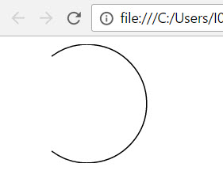
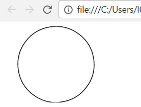

## Prerequisites  
 - **Proficiency:** Beginner
 - **Tutorials:** [Intro to SAP HANA Spatial: Points](http://go.sap.com/developer/tutorials/hana-spatial-intro1-point.html)

## Next Steps
 - Intro to SAP HANA Spatial: Polygons (coming soon), or
 - Select a tutorial from the [Tutorial Navigator](http://go.sap.com/developer/tutorial-navigator.html) or the [Tutorial Catalog](http://go.sap.com/developer/tutorials.html)

## Details
### You will learn  
What the reader should take away from this time investment. You can also add screenshot(s) to illustrate what they will do.

### Time to Complete
**5 Min**.

---

1. Open SQL Editor of your choice (web or desktop based) connected to your SAP HANA database instance.

    Type the following SQL statement.
    ```sql
    SELECT NEW ST_LineString('LineString (0 0, 4 3)').ST_Dimension() FROM dummy;
    ```

    This query instantiate a line in the 2-dimensional Euclidean space and returns its dimension. In the example above it is a line connecting point (0, 0), ie. `X=0` and `Y=0`, with a point (4, 3),  ie. `X=4` and `Y=3`. The constructor is using ___WKT___. As explained in the previous tutorial, the Well-known text is a text markup language for representing vector geometry objects defined by the Open Geospatial Consortium (OGC).

2. Execute the query. The `ST_Dimension()` method will return `1`. In the exercise with the point the same method returned `0`.

    

3. Differently from the point, the line has a length. Use the `ST_Length()` method to calculate it.

    ```sql
    SELECT NEW ST_LineString('LineString (0 0, 4 3)').ST_Length() FROM dummy;
    ```

    Obviously accordingly to the Pythagorean Theorem the result will be `5` proving famous `3-4-5 Rule` used in practice to get a perfect right angle.

    

4. Strings are not just straight lines. The `ST_LineString` type is used to represent a multi-segment curve using straight line segments by adding more control points.

    ```sql
    SELECT NEW ST_LineString('LineString (0 0, 3 4, 0 4, 0 0)').ST_asSVG() as SVG FROM dummy;
    ```

    The method `ST_asSVG()` returns the spatial object from the query in an XML-based vector image format called as a Scalable Vector Graphics (`SVG`). SVG is supported by most of the modern web browsers.

    Copy the content of the cell with SVG. Eg. by right click on it in SAP HANA web-based workbench and choosing **Details...**

    

    Here is a slightly modified code - with added `width="160" height="120"` and thicker `stroke-width="1%"` instead of default `"0.1%"`
    ```xml
    <?xml version="1.0" standalone="no"?>
    <!DOCTYPE svg PUBLIC "-//W3C//DTD SVG 1.1//EN"
    "http://www.w3.org/Graphics/SVG/1.1/DTD/svg11.dtd">
    <svg width="160" height="120" xmlns="http://www.w3.org/2000/svg" version="1.1" viewBox="-.003 -4.004 3.006 4.008">
    	<path fill="none" stroke="black" stroke-width="1%" d="M 0,0 l 3,-4 -3,0 0,4 "/>
    </svg>
    ```

    Opening it in a web browser will allow you to see a drawn spatial object.

    

5. The `ST_CircularString` type of strings uses circular line segments (arcs) between control points.

    ```sql
    SELECT NEW ST_CircularString('CircularString (0 0, 3 4, 0 4)').ST_asSVG() as SVG FROM dummy;
    ```

    The first point is the start point of the segment. The second point is any point on the segment other than the start and end point. The third point is the end point of the segment. Here is an SVG representation of the above statement.

    

    Subsequent segments are defined by two points only (intermediate and end point). The start point is taken to be the end point of the preceding segment.

    ```sql
    SELECT NEW ST_CircularString('CircularString (0 0, 3 4, 0 4, -3 4, 0 0)').ST_asSVG() as SVG FROM dummy;
    ```

    

    String as above that starts and ends at the same point is **closed**. Strings can be characterized as well by whether they are simple or not. **Simple** means a string that does not cross itself. A **ring** is a simple, closed string. The geometry above is a ring, accordingly to this definition in the spatial processing.

6. All these characteristics can be tested and if needed used as **Spatial Predicates**. Spatial predicates are implemented as member functions that return 0 or 1.

    ```sql
    SELECT 'isClosed' as Feature, NEW ST_CircularString('CircularString (0 0, 3 4, 0 4, -3 4, 0 0)').ST_isClosed() as FeatureTest FROM dummy
    union all
    SELECT 'isSimple' as Feature, NEW ST_CircularString('CircularString (0 0, 3 4, 0 4, -3 4, 0 0)').ST_isSimple() as FeatureTest FROM dummy
    union all
    SELECT 'isRing' as Feature, NEW ST_CircularString('CircularString (0 0, 3 4, 0 4, -3 4, 0 0)').ST_isRing() as FeatureTest FROM dummy;
    ```

    

    Do the same test for another geometry, defined by `ST_LineString('LINESTRING(0 0, 1 1, 0 1, 1 0)')`

    

    ```sql
    SELECT 'isClosed' as Feature, NEW ST_LineString('LINESTRING(0 0, 1 1, 0 1, 1 0)').ST_isClosed() as FeatureTest FROM dummy
    union all
    SELECT 'isSimple' as Feature, NEW ST_LineString('LINESTRING(0 0, 1 1, 0 1, 1 0)').ST_isSimple() as FeatureTest FROM dummy
    union all
    SELECT 'isRing' as Feature, NEW ST_LineString('LINESTRING(0 0, 1 1, 0 1, 1 0)').ST_isRing() as FeatureTest FROM dummy;
    ```

    

7. A `CircularString` with three points can be a complete circle, if the start and end points are coincident. In this case, the intermediate point is the midpoint of the segment.

    ```sql
    SELECT ST_GeomFromText( 'CircularString (0 0, 3 4, 0 0)' ).ST_asSVG() as SVG FROM dummy;
    ```

    

    Note this time you did not use an geometry constructor started with the key word `NEW`. Instead you used the method `ST_GeomFromText` that parses a string containing a representation of a geometry and creates a geometry value of the appropriate type. You use method `ST_GeometryType()` then to verify.

    

### Optional
 - Check SAP HANA Spatial Reference at http://help.sap.com/hana_platform

## Next Steps
- Intro to SAP HANA Spatial: Polygons (coming soon), or
- Select a tutorial from the [Tutorial Navigator](http://go.sap.com/developer/tutorial-navigator.html) or the [Tutorial Catalog](http://go.sap.com/developer/tutorials.html)
