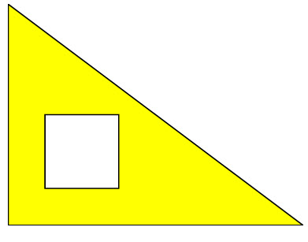
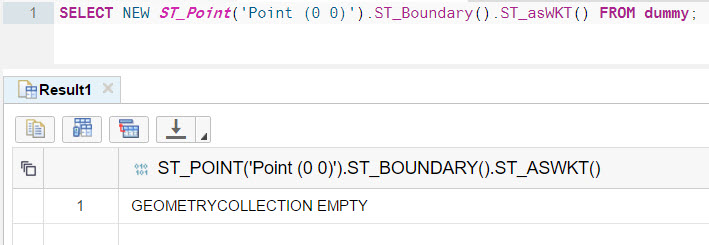

## Prerequisites  
- **Proficiency:** Beginner
- **Tutorials:** [Intro to SAP HANA Spatial: Strings](https://www.sap.com/developer/tutorials/hana-spatial-intro2-string.html)

## Next Steps
- [Intro to SAP HANA Spatial: Tables with spatial columns](https://www.sap.com/developer/tutorials/hana-spatial-intro4-columns.html)

## Details
### You will learn  
You will continue learning basics of spatial processing now with ___polygons___ (also known as ___surfaces___) data types.

### Time to Complete
**5 Min**.

---

[ACCORDION-BEGIN [Step 1: ](Instantiate a surface)]
Rings, from the previous tutorials, are still strings; i.e. they have length, but no surface. To construct the surface you use ___polygons___. A polygon defines a region of space. A polygon is constructed from one exterior bounding ring that defines the outside of the region and zero or more interior rings, which define holes in the region.

Open the SQL Editor of your choice (web or desktop based) connected to your SAP HANA database instance.

Type and execute the following SQL statement.
```sql
SELECT NEW ST_Polygon('Polygon ((0 0, 4 0, 0 3, 0 0), (0.5 0.5, 0.5 1.5, 1.5 1.5, 1 0.5, 0.5 0.5))').ST_asSVG() FROM dummy;
```
This query instantiates a surface in the 2-dimensional Euclidean space and returns its dimensions. In the example above it is a polygon defined by an external ring with the shape of a triangle connecting points (0, 0); i.e., `X=0` and `Y=0`, with points (4, 0) and (4, 3) and an internal ring with the shape of a square. The constructor is using ___Well-known text (WKT)___. As explained in the previous tutorial, WKT is a text markup language for representing vector geometry objects defined by the Open Geospatial Consortium (OGC).

Below is an SVG modified to fill a geometry with the color using `fill="yellow"` to better illustrate the meaning of the external and internal rings of polygons.




[ACCORDION-END]

[ACCORDION-BEGIN [Step 2: ](Get dimension)]

Now, execute the following query.

```sql
SELECT NEW ST_Polygon('Polygon ((0 0, 4 0, 0 3, 0 0), (0.5 0.5, 0.5 1.5, 1.5 1.5, 1 0.5, 0.5 0.5))').ST_Dimension() FROM dummy;
```

The `ST_Dimension()` method will return `2`. In the earlier point exercise the same method returned `0`, and in the strings exercise it returned `1`.


[ACCORDION-END]

[ACCORDION-BEGIN [Step 3: ](Get area)]

Unlike a string, a polygon has a surface, and therefore has an area. Use the `ST_Area()` method to calculate it.

```sql
SELECT NEW ST_Polygon('Polygon ((0 0, 4 0, 0 3, 0 0))').ST_Area() FROM dummy;
```

Please note the double round brackets, as this polygon consists of only an external ring.

This statement calculates the area of right triangle (also known as 'right-angled triangle'), with `catheti` (also known as legs) having lengths of 3 and 4. Obviously the area is half of 3*4 and equals 6.


[ACCORDION-END]

[ACCORDION-BEGIN [Step 4: ](Get boundary)]

You can calculate the ___boundary___ of a polygon using the `ST_Boundary()` method.

Check the boundary of the first polygon from this tutorial; i.e., a triangle with a square inside.

```sql
SELECT NEW ST_Polygon('Polygon ((0 0, 4 0, 0 3, 0 0), (0.5 0.5, 0.5 1.5, 1.5 1.5, 1 0.5, 0.5 0.5))').ST_Boundary().ST_asWKT() FROM dummy;
```


The result is a `MultiLineString` containing two `LineStrings`, one representing a triangle and the another representing a square.

`MultiLineString` is another spatial type. It is a collection of line strings. There are two more spatial collection types supported by SAP HANA: `MultiPoint` and `MultiPolygon`. Their names describe what they represent.

Strings too have their boundaries, represented by their endpoints, except when they are rings. Rings - curves where the start point is the same as the end point and there are no self-intersections - have no boundaries.

Now, check the boundaries of a triangle string from the previous query.

```sql
SELECT NEW ST_LineString('LineString (0 0,4 0,0 3,0 0)').ST_Boundary().ST_asWKT() FROM dummy;
```

The result is an empty geometry.


[ACCORDION-END]

[ACCORDION-BEGIN [Step 5: ](Get boundaries of a multi-segment line)]

Check the boundaries of a multi-segment line, where the end points are not the same.

```sql
SELECT NEW ST_LineString('LineString (0 0,4 0,0 3,1 0)').ST_Boundary().ST_asWKT() FROM dummy;
```

The result is a `MultiPoint` collection containing two end points.


Points do not have boundaries.




[ACCORDION-END]

[ACCORDION-BEGIN [Step 6: ](Check if one geometry is within another)]

A typical requirement in spatial calculations is to find relationships between different geometries. For example, you may need to determine if one geometry is covered by another geometry; if some particular point of interest is within a city's boundaries, for instance.

`ST_Within()` is a method that will allow you to determine if one geometry is within another. As with other spatial methods in SAP HANA the result `1` means 'true', and `0` means 'false'.

```sql
SELECT NEW ST_Point (1,1).ST_Within(NEW ST_Polygon('Polygon ((0 0, 4 0, 0 3, 0 0), (0.5 0.5, 0.5 1.5, 1.5 1.5, 1 0.5, 0.5 0.5))')) FROM dummy;
```

Indeed the point (1, 1) is not within ___interior___ of your polygon from the earlier exercise, defined by the external ring in the shape of a triangle and an internal ring in the shape of a square. An area inside a square is the ___exterior___ of this particular geometry.


[ACCORDION-END]

[ACCORDION-BEGIN [Step 7: ](Check if a point is within a given disk)]

To check if a point is within a given [disk](https://en.wikipedia.org/wiki/Disk_%28mathematics%29) you use the `ST_Within()` method to define the circle around an area of a particular distance from a central point.

```sql
SELECT NEW ST_Point (1,1).ST_Within(NEW ST_Point(0, 0).ST_Buffer(2)) FROM dummy;
```

The point (1, 1) is in the circle with the center point of (0, 0) and the radius of 2.


[ACCORDION-END]


### Optional
- See the SAP HANA Spatial Reference at https://help.sap.com/hana_platform for the complete list of objects and methods

## Next Steps
- [Intro to SAP HANA Spatial: Tables with spatial columns](https://www.sap.com/developer/tutorials/hana-spatial-intro4-columns.html)
