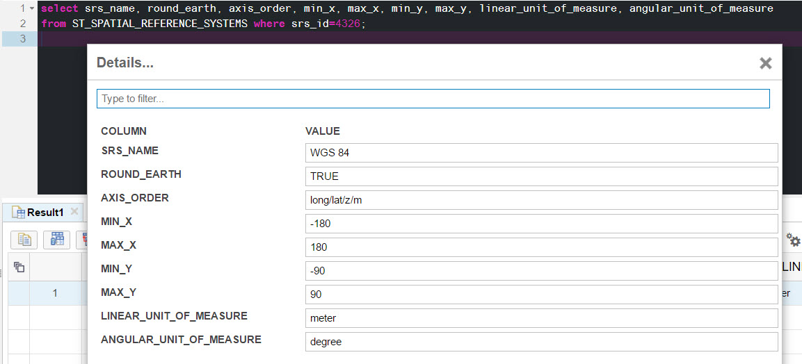

## Prerequisites  
 - [Intro to SAP HANA Spatial: Z and M coordinates](http://www.sap.com/developer/tutorials/hana-spatial-intro5-z-m-coordinates.html)


## Next Steps
- Select a tutorial from the [Tutorial Navigator](http://www.sap.com/developer/tutorial-navigator.html) or search in the [Tutorial Catalog](http://www.sap.com/developer/tutorials.html)

## Details
### You will learn  
You will learn what Spatial Reference Systems and Spatial Units of Measure are, how they are defined and used in SAP HANA.

### Time to Complete
**15 Min**

---

[ACCORDION-BEGIN [Step 1: ](Calculating the distance on the flat surface)]
What is the distance between two points: (0, 0) and (1, 0)?
```sql
select new st_point('POINT (0 0)').st_distance(new st_point('POINT (1 0)')) as distance from dummy;
```

The result is `1`.

But what if you want to measure a distance between two geographic point where coordinates are latitude and longitude? Then you need to specify what **Spatial Reference System (`SRS`)** is used for geometries in spatial queries.
A spatial reference system defines, at minimum:
- units of measure of the underlying coordinate system (degrees, meters, and so on),
- maximum and minimum coordinates (also referred to as ___the bounds___),
- whether the data is planar or spheroid data,
- projection information for transforming the data to other reference systems.

When not SRS is specified in the query, then the default SRS with id (`SRID`) equal `0` is assumed by SAP HANA. Spatial reference system details can be viewed in the `ST_SPATIAL_REFERENCE_SYSTEMS` system view.

Check some of the characteristics of SRS with SRID equal `0`
```sql
select srs_name, round_earth, axis_order, min_x, max_x, linear_unit_of_measure
from ST_SPATIAL_REFERENCE_SYSTEMS where srs_id=0;

```


As you can see it is the `DEFAULT` reference system, with all `x`, `y`, `z` and `m` coordinates. It is based on the flat surface. It has `meter` defined as a linear unit of measure, and so conversion to other units is possible in some spatial methods. The list of pre-installed units is available in the system view `ST_UNITS_OF_MEASURE`. One of them is `yard`, used in the following example.
```sql
select new st_point('POINT (0 0)').st_distance(new st_point('POINT (1 0)'), 'yard') as distance from dummy;
```


>More units of measures can be manually created or loaded into the SAP HANA using separate Geospatial Metadata Installer. Geospatial Metadata Installer is available for registered customers and partners.

[DONE]
[ACCORDION-END]

[ACCORDION-BEGIN [Step 2: ](Calculating the distance on the round Earth)]

The Spatial Reference System that implements geodetic coordinate system of the Global Positioning System (`GPS`), or [`WGS 84`](https://en.wikipedia.org/wiki/World_Geodetic_System#WGS84), has SRID `4326`.
```sql
select srs_name, round_earth, axis_order, min_x, max_x, min_y, max_y, linear_unit_of_measure, angular_unit_of_measure
from ST_SPATIAL_REFERENCE_SYSTEMS where srs_id=4326;
```


This SRS has `degree` defined as the angular unit of measure and boundaries are between -180 to 180 degrees longitude and -90 to 90 degrees latitude.

To calculate a distance of one degree of longitude at the equator in kilometers run this query.
```sql
select new st_point('POINT (0 0)', 4326).st_distance(new st_point('POINT (1 0)', 4326), 'kilometer') as distance from dummy;
```


A distance of one degree of longitude at the 45 degrees latitude should be shorter.
```sql
select new st_point('POINT (0 45)', 4326).st_distance(new st_point('POINT (1 45)', 4326), 'kilometer') as distance from dummy;
```


SRS with id 4326 is the one of many standardized reference systems. Other may have different assumptions regarding the Earth shape, or may define boundaries to cover only selected countries.

More spatial reference systems can be manually created or loaded into the SAP HANA using separate Geospatial Metadata Installer. Geospatial Metadata Installer is available for registered customers and partners.

[DONE]
[ACCORDION-END]

### Optional
- Read SAP HANA Spatial Reference for more details at https://help.sap.com/hana_platform
- Read how to turn shape file into ASCII art map at https://blogs.sap.com/2017/02/13/ascii-art-map-of-the-world-using-sap-hana-geospatial-processing/

## Next Steps
- Select a tutorial from the [Tutorial Navigator](http://www.sap.com/developer/tutorial-navigator.html) or search in the [Tutorial Catalog](http://www.sap.com/developer/tutorials.html)
