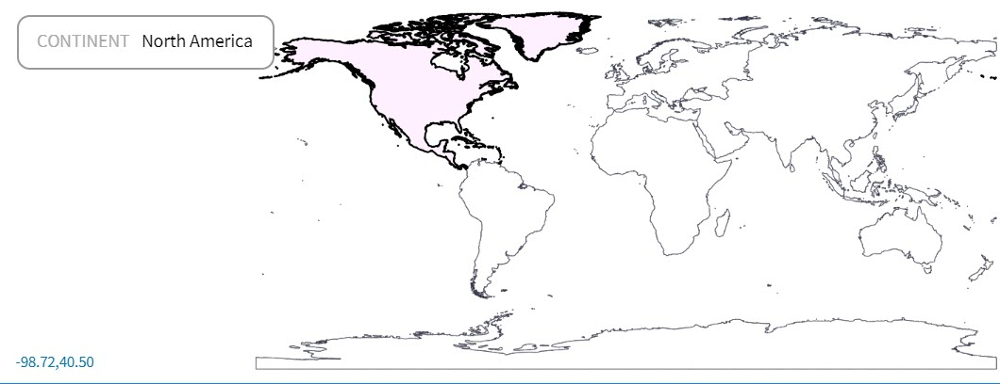
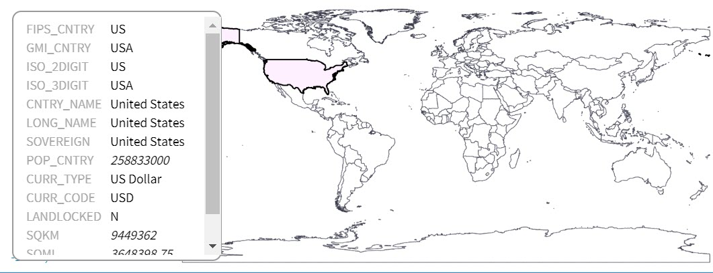
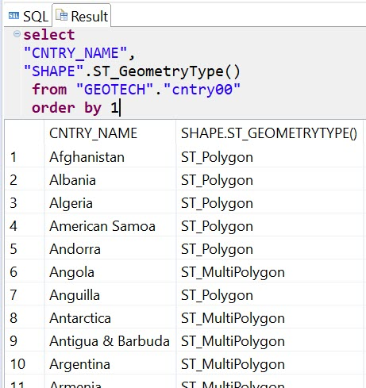
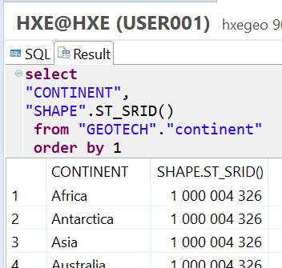
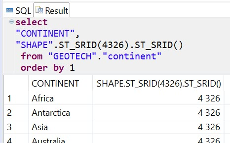
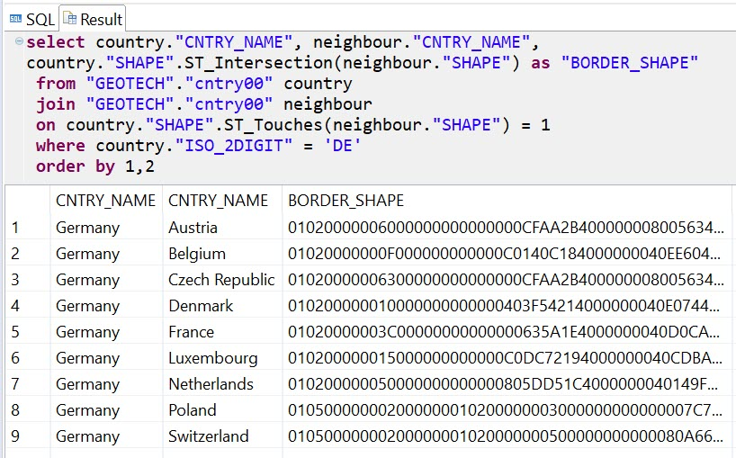
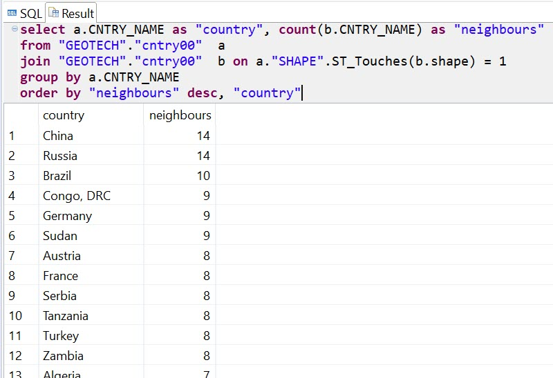
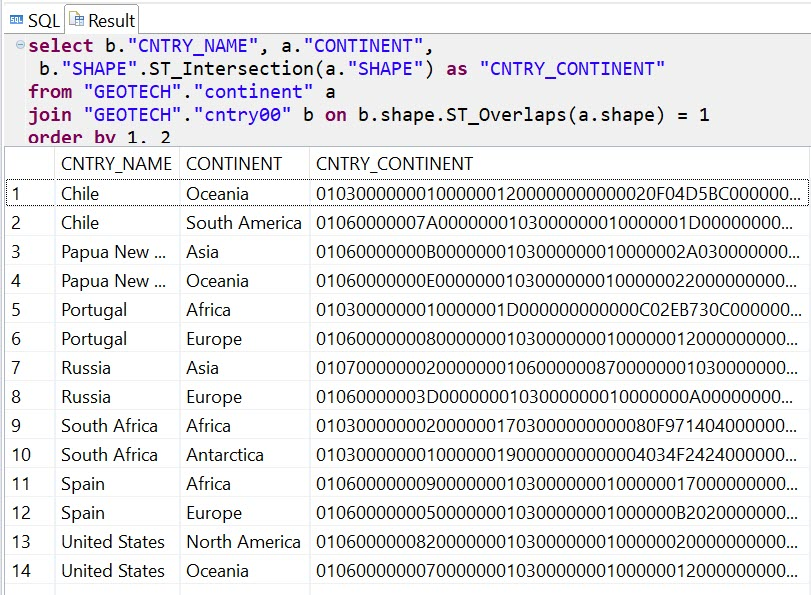

## Prerequisites  
 - **Proficiency:** Beginner

## Details
### You will learn  
how you can use SAP HANA to analyze data from Shapefiles

### Time to Complete
**5 Min**

---

[ACCORDION-BEGIN [Step 1: ](ESRI shapefiles)]
Good news, you do not need to create all geographic or geodetic data manually! There are some open data available using one of many geospatial data formats.

One of the most used formats of geospatial data exchange is a [**Shapefile**](https://en.wikipedia.org/wiki/Shapefile) developed by ESRI.

Two of such Shapefiles have been preloaded into the instance of SAP HANA database you are using:
1. `"GEOTECH"."continent"` with shapes of continents,
2. `"GEOTECH"."cntry00"` with shapes of countries.

Preview of shapes of continents using <http://mapshaper.org/> website:



Preview of shapes of countries:



Both these table contain a column `"SHAPE"` that stores geometries of particular continents or countries - depending on a table. This column has `ST_GEOMETRY` datatype, that allows to store any geospatial data: points, strings, polygons, or their collections.

```sql
select
"CNTRY_NAME",
"SHAPE".ST_GeometryType()
 from "GEOTECH"."cntry00"
 order by 1;
```



You can see that some country's shapes are single polygons, while some others are collections of polygons. In the second case it is most probably mainland and islands.

[ACCORDION-END]

[ACCORDION-BEGIN [Step 2: ](Round Earth vs Planar projection)]
In previous tutorial you learned about SRID `4326` based on Round Earth model used by GPS. Geospatial data in tables you will use in this tutorial, are loaded using special SAP HANA's SRID `1000004326`, which is a planar 2D projection.

You can check it using `.ST_SRID()` method.

```sql
select
"CONTINENT",
"SHAPE".ST_SRID()
 from "GEOTECH"."continent"
 order by 1;
```



Some geospatial methods will not work with geometries on the Round Earth, and can work only on planes. On the other hand some measurements on Round Earth will give you more precise values, than for geometries on planar projections.

The same method `.ST_SRID(srid)`, but with SRID as an argument is used to do simple conversion between different Spatial Reference Systems that are using the same coordinates.

```sql
select
"CONTINENT",
"SHAPE".ST_SRID(4326).ST_SRID()
 from "GEOTECH"."continent"
 order by 1;
```



Please note the way spatial methods are chained to have sequential execution of data.

[ACCORDION-END]


[ACCORDION-BEGIN [Step 3: ](Finding neighbouring countries)]
Based on loaded data let's find all neighbours of Germany - counties sharing land boarders.

```sql
select country."CNTRY_NAME", neighbour."CNTRY_NAME",
country."SHAPE".ST_Intersection(neighbour."SHAPE") as "BORDER_SHAPE"
 from "GEOTECH"."cntry00" country
 join "GEOTECH"."cntry00" neighbour
 on country."SHAPE".ST_Touches(neighbour."SHAPE") = 1
 where country."ISO_2DIGIT" = 'DE'
 order by 1,2;
```



[ACCORDION-END]

[ACCORDION-BEGIN [Step 4: ](What countries have the biggest number of neighbours)]
So, Germany has 9 land neighbours. Are there countries with more?

```sql
select a.CNTRY_NAME as "country", count(b.CNTRY_NAME) as "neighbours"
from "GEOTECH"."cntry00"  a
join "GEOTECH"."cntry00"  b on a."SHAPE".ST_Touches(b.shape) = 1
group by a.CNTRY_NAME
order by "neighbours" desc, "country";
```



[ACCORDION-END]

[ACCORDION-BEGIN [Step 5: ](Transcontinental countries)]

Transcontinental countries or intercontinental states are countries located on more than one continent.

>Please note that below query is computationally intensive, and will take about one minute to execute.

```sql
select b."CNTRY_NAME", a."CONTINENT",
 b."SHAPE".ST_Intersection(a."SHAPE") as "CNTRY_CONTINENT"
from "GEOTECH"."continent" a
join "GEOTECH"."cntry00" b on b.shape.ST_Overlaps(a.shape) = 1
order by 1, 2;
```



There are some countries missing in the query output, like Turkey. Why? Upon closer investigation you would find that a continent border between Asia and Europe was not properly defined in the source file. As a result not only Turkey, but as well Azerbaijan, Georgia and Kazakhstan are missing, although they are all transcontinental countries with parts in both Asia and Europe.

[ACCORDION-END]

---
