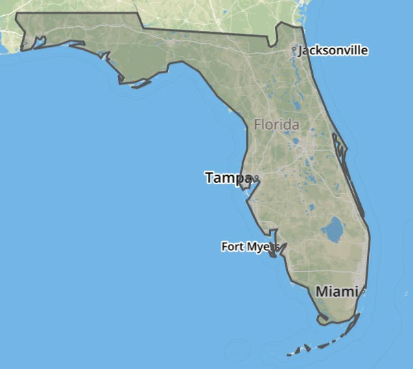
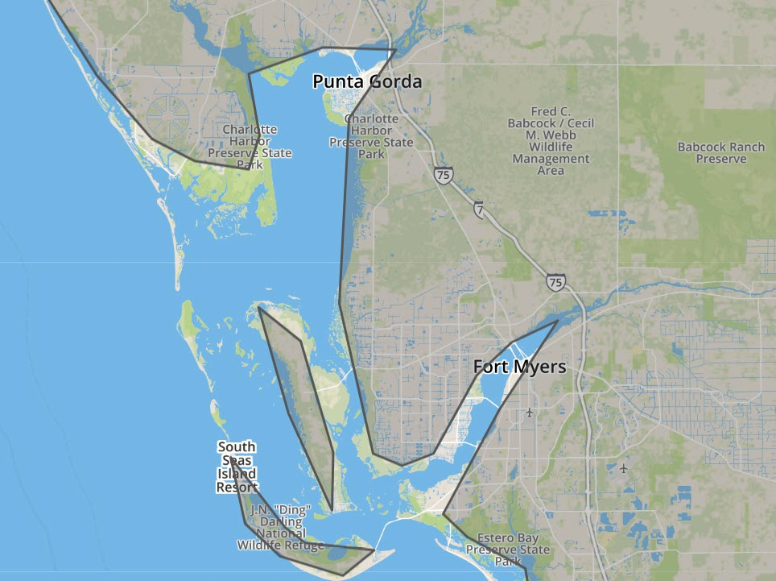
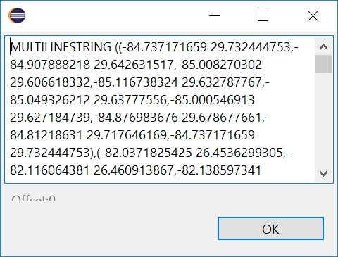
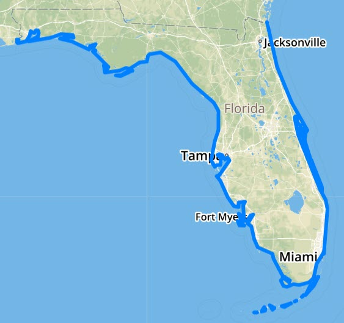
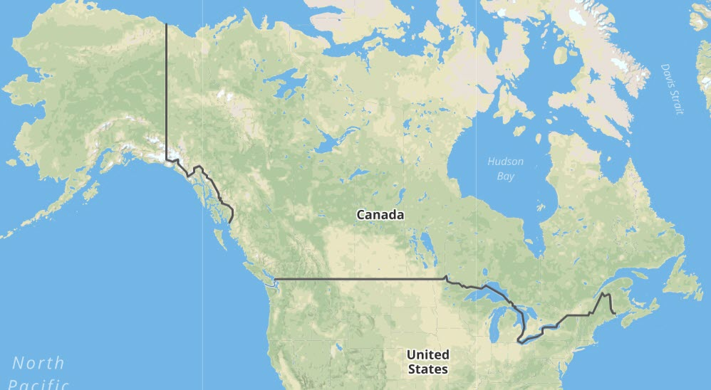

## Prerequisites  
 - **Proficiency:** Beginner

## Details
### You will learn  
how you can use SAP HANA to analyze data from Shapefiles

### Time to Complete
**5 Min**

---

[ACCORDION-BEGIN [Step 1: ](Natural Earth data)]
Natural Earth website is one of the most popular resources of open geodata.

One of these files - `Admin 1` (States, provinces) administrative boundaries in scale `1:50m` has been imported into `"NATURAL_EARTH"."ne_50m_admin_1_states"` table, but only for the USA and Canada.


Again, geographical shapes of states and provinces are stored in the column `"SHAPE"` with `SRID = 1000004326`, i.e. planar projection.

[ACCORDION-END]

[ACCORDION-BEGIN [Step 2: ](Borderline of Florida)]
Let's take Florida as an example. What is a total length of the state's borderline?

```sql
select "SHAPE".ST_SRID(4326).ST_Perimeter() as "Borderline"
from "NATURAL_EARTH"."ne_50m_admin_1_states"
where "iso_3166_2"='US-FL';
```


What is `3875857,373022288`? This is the length in meters, as `meter` is the default linear unit of measure defined for `SRID` = `4326`.

Let's check what miles definitions are available in `"PUBLIC"."ST_UNITS_OF_MEASURE"`, which table is a part of geospatial content in SAP HANA.

```sql
select * from "PUBLIC"."ST_UNITS_OF_MEASURE"
where unit_name like '%mile%';
```


Let's recalculate the borderline in US survey miles, and rounded.

```sql
select round("SHAPE".ST_SRID(4326).ST_Perimeter('US survey mile')) as "Borderline"
from "NATURAL_EARTH"."ne_50m_admin_1_states"
where "iso_3166_2"='US-FL'
```


[ACCORDION-END]


[ACCORDION-BEGIN [Step 3: ](Area of Florida)]

To calculate the proper area of the geography you need to convert it to the plan projection with the least distortion. Unfortunately every projection of Round Earth or its fragments on a flat surface is introducing some distortion.

```sql
select round("SHAPE".ST_Transform(3857).ST_Area('US survey mile')) as "Area"
from "NATURAL_EARTH"."ne_50m_admin_1_states" a
where "iso_3166_2"='US-FL';
```


[SRS `3857`](https://epsg.io/3857) is the one used by web maps, like OpenStreetMap, Google Maps, Bing Maps etc. It is based on so called Mercator projection, where distances are significantly increasing the further from Equator the geography is located.

Instead for higher precision local projections are being used, like [SRS `3513`](https://epsg.io/3513) for Florida.

```sql
select round("SHAPE".ST_Transform(3513).ST_Area('US survey mile')) as "Area"
from "NATURAL_EARTH"."ne_50m_admin_1_states" a
where "iso_3166_2"='US-FL';
```


Unfortunately it is still not precise measurement, as the scale of the shape loaded is not precise enough. You can see it on the visualizations comparing complete state:



 ...to a zoomed area:



[ACCORDION-END]

[ACCORDION-BEGIN [Step 4: ](Coastline of Florida)]
Let's calculate a geometry that is a coastline of Florida. This example shows the use of a spatial set operations and aggregations.

```sql
with "FL_LandBoarder" as
(select ST_unionAggr(b."SHAPE".ST_Intersection(c."SHAPE")) as "SHAPE"
from "NATURAL_EARTH"."ne_50m_admin_1_states" b
join "NATURAL_EARTH"."ne_50m_admin_1_states" c on 1=1
where 'US-FL' <> c."iso_3166_2"
and b."iso_3166_2" = 'US-FL'),
"FL_Boarder" as
(select "SHAPE".ST_Boundary() as "SHAPE"
from "NATURAL_EARTH"."ne_50m_admin_1_states" a
where "iso_3166_2"='US-FL')
select m."SHAPE".ST_Difference(n."SHAPE").st_asWKT()
from
"FL_Boarder" m,
"FL_LandBoarder" n;
```

The result is a collection of string lines...



...which visualized looks like this.




[ACCORDION-END]

[ACCORDION-BEGIN [Step 5: ](Calculate US-Canadian border)]
In tables you have only shapes of states and provinces. Can we calculate the Canada–United States border based on this? Sure, with the help of spatial aggregates and set operations again!

```sql
select ST_UnionAggr(us.shape.ST_Intersection(ca.shape)) as "Border"
from "NATURAL_EARTH"."ne_50m_admin_1_states"  us
join "NATURAL_EARTH"."ne_50m_admin_1_states"  ca
 on 1=1
where us."iso_a2" in ('US') and ca."iso_a2" in ('CA');
```

And visualized.



[ACCORDION-END]

---
