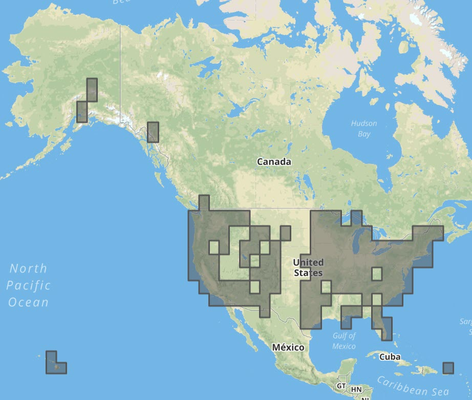

## Prerequisites  
 - **Proficiency:** Beginner

## Details
### You will learn  
how you can use SAP HANA's spatial clustering to analyze PoI data

### Time to Complete
**5 Min**

---

[ACCORDION-BEGIN [Step 1: ](OpenBeerDB)]
This time you will analyze geographical distribution of Points of Interest, using data from `OpenBeerDB` as an example. This data set was last updated in 2011, but is still OK for the tutorial.

Data has been loaded into tables:

1. `"OPENBEERDB"."BREWERIES"` with breweries attributes,
2. `"OPENBEERDB"."BREWERIES_GEO"` with geographical locations derived from geocoding based on address data from previous table.

The table `"OPENBEERDB"."BREWERIES_GEO"` has been already extended with two columns:

* `"loc_4326"` contains locations as points in spatial reference system `4326` (GPS locations on the Round Earth model),
* `"loc_3857"` contains locations as points in spatial reference system `3857` (planar projection used on web maps).

An SQL union `"OPENBEERDB"."V_BREWERIES_GEO"`has been created joining both.

[ACCORDION-END]

[ACCORDION-BEGIN [Step 2: ](Minibreweries in the US)]
The `OpenBeerDB` data set is covering the entire globe. To select only breweries in the US you will use `"country"` attribute of the view.

>As a bonus exercise you can try to use geospatial predicate `ST_Within()` joining data with country shapes from `"GEOTECH"."cntry00"` table!

```sql
select ST_UnionAggr("loc_4326").st_asWKT()
from "OPENBEERDB"."V_BREWERIES_GEO"
where "country" = 'United States';
```

If visualized.


[ACCORDION-END]


[ACCORDION-BEGIN [Step 3: ](Grid clustering)]

SAP HANA Spatial provides spatial clustering using the algorithms grid, k-means, and DBSCAN. Spatial clustering can be performed on a set of geospatial points.

Grid clustering provides a quick and easy way to use clustering. It is useful for providing a first impression. For deeper analysis, you can use the other algorithms.

```sql
select ST_UnionAggr("Envelope").st_asWKT() from
(select ST_CLUSTERID() AS "CID",
	ST_CLUSTERENVELOPE() AS "Envelope",
	COUNT(*) AS "Number of breweries in this cluster"
 from "OPENBEERDB"."V_BREWERIES_GEO"
 where "country" = 'United States'
 GROUP CLUSTER BY "loc_4326"
USING GRID X CELLS 40 Y CELLS 20
order by 3 desc);
```




[ACCORDION-END]

[ACCORDION-BEGIN [Step 4: ](K-Means clustering)]

K-means tries to find an assignment of points to clusters, so that the sum of squared distances of the points to the center of the cluster they belong to is minimal.

```sql
select ST_UnionAggr("ConvexHull").st_asWKT() from
(select ST_CLUSTERID() AS "CID",
	ST_CONVEXHULLAGGR("loc_3857").st_transform(4326) AS "ConvexHull",
	COUNT(*) AS "Number of breweries in this cluster"
 from "OPENBEERDB"."V_BREWERIES_GEO"
 where "country" = 'United States'
 GROUP CLUSTER BY "loc_3857"
 USING KMEANS CLUSTERS 20
order by 3 desc);
```


[ACCORDION-END]

[ACCORDION-BEGIN [Step 5: ](DBSCAN Clustering)]

DBSCAN is the Density-based spatial clustering of applications with noise.

```sql
select st_unionAggr("cluster") from (
select "cluster_id", st_unionAggr("loc_3857").ST_AlphaShape(250000).st_transform(4326) as "cluster"
from (
SELECT
  ST_ClusterID() OVER (CLUSTER BY "loc_3857" USING DBSCAN EPS 250000 MINPTS 9) AS "cluster_id",
  "brewery_id",
  "loc_3857"
FROM "OPENBEERDB"."V_BREWERIES_GEO"
WHERE "country" = 'United States'
ORDER BY 1, "brewery_id"
)
where "cluster_id" <> 0
group by "cluster_id");
```

The clustering algorithm in this example creates clusters where there is a minimum of `9` breweries within a maximum distance of `250` kilometers from each other.


[ACCORDION-END]

---
