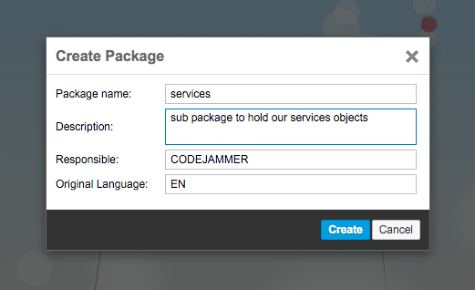
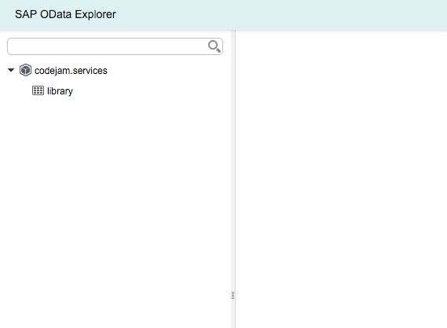
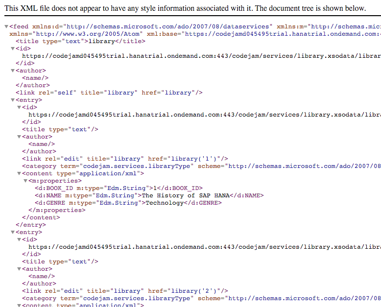

## Prerequisites  
- [Access your first data in a SAP HANA XSC Application](http://www.sap.com/developer/tutorials/hana-data-access-authorizations.html)

## Next Steps
- [Consume XSODATA in your SAP HANA XSC Application](http://www.sap.com/developer/tutorials/hana-consume-xsodata.html)
 
## Details

### You will learn  
1. How to create a simple `xsodata` service.

### Time to Complete
Beginners might take **10 minutes** to execute this tutorial.


[ACCORDION-BEGIN [Step 1: Create a sub package for your services](Create a sub package for your services)]

Now that you have a table with data in it, you need to be able to access the data and for that you will need to create and `.xsodata` file which defines an OData service. To start create a new sub package for your services.



[ACCORDION-END]

[ACCORDION-BEGIN [Step 2: Create your service definition](Create your service definition)]

Next create a new file `library.xsodata` and add the following code to it, the file name itself is only important in the sense that it is part of the URL when it is called most important though is that the ending of the file is `.xsodata`

```
service namespace "codejam.services" {
	"codejam.data::mydata.Book" as "library"; 
}
```

[ACCORDION-END]

[ACCORDION-BEGIN [Step 3: Access your service](Access your service)]

At this point you should be able to launch your XSODATA file in your browser or right click and choose the `OData Explorer` to view and see the data from your table.





Congratulations: You have just enabled a simple REST interface for your application.

[ACCORDION-END]

### Optional: Related Information
[SAP HANA Development Information - Official Documentation](https://help.sap.com/hana_platform#section6)

