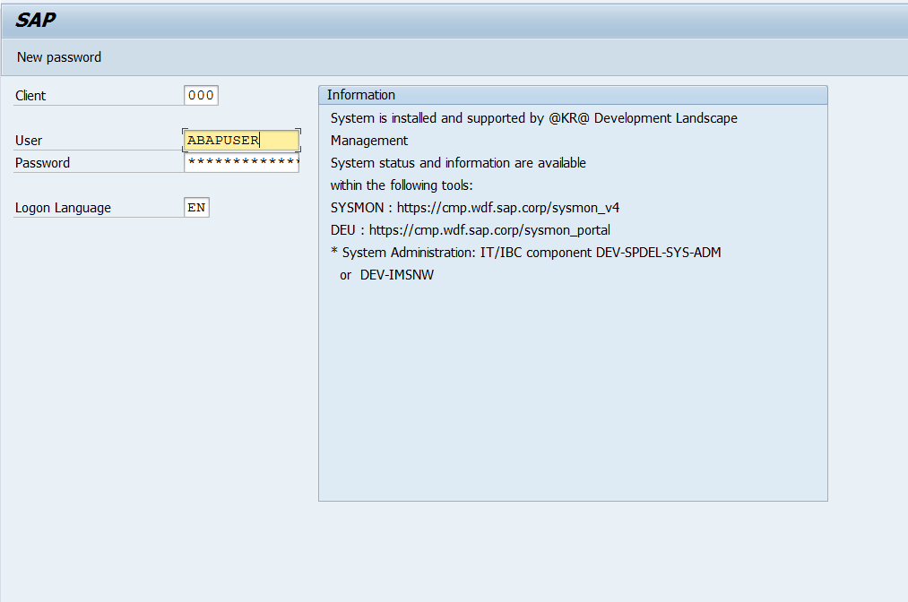
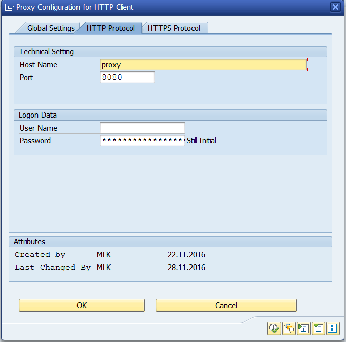
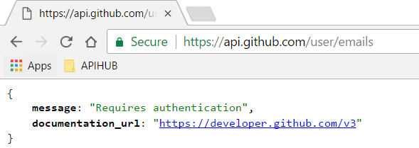
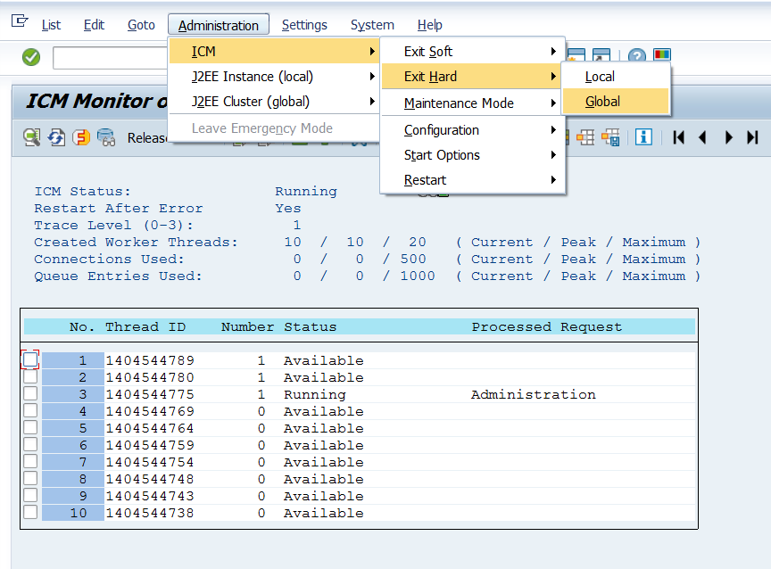
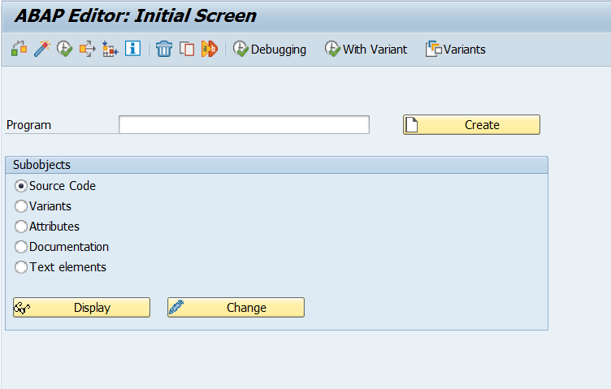
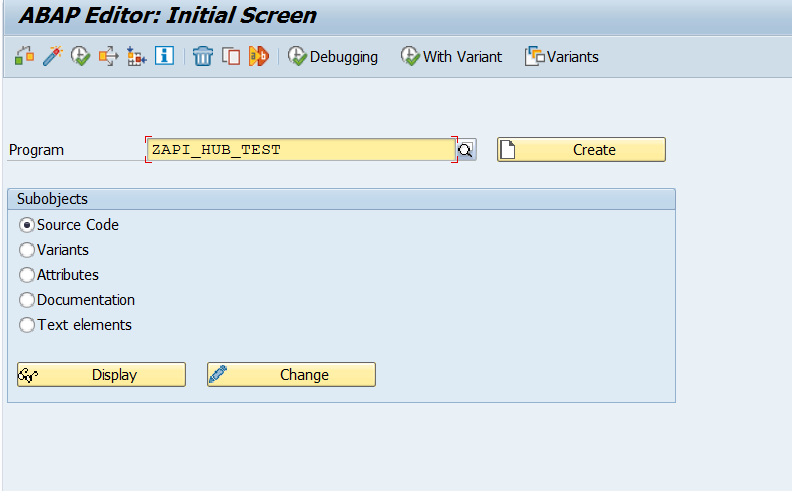
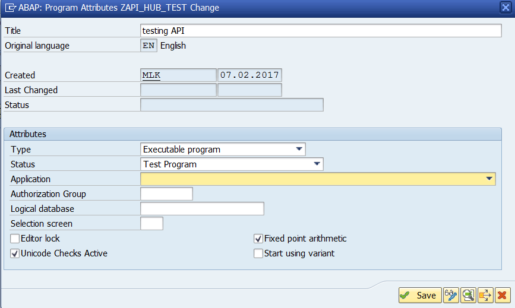
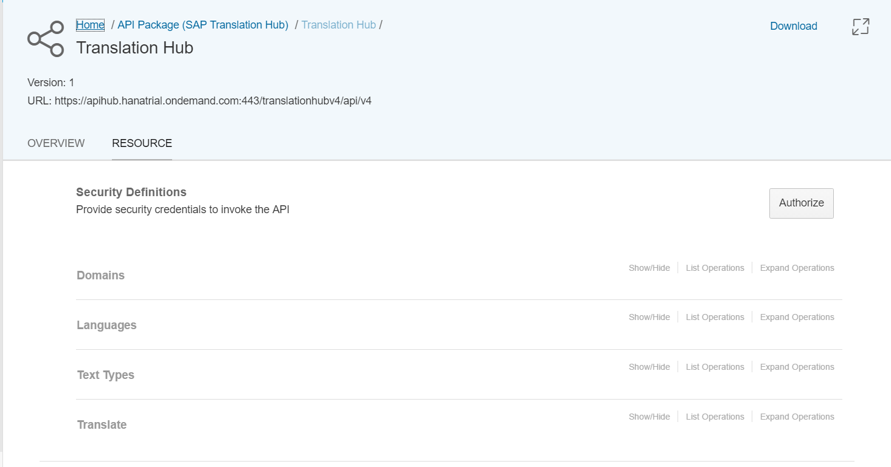
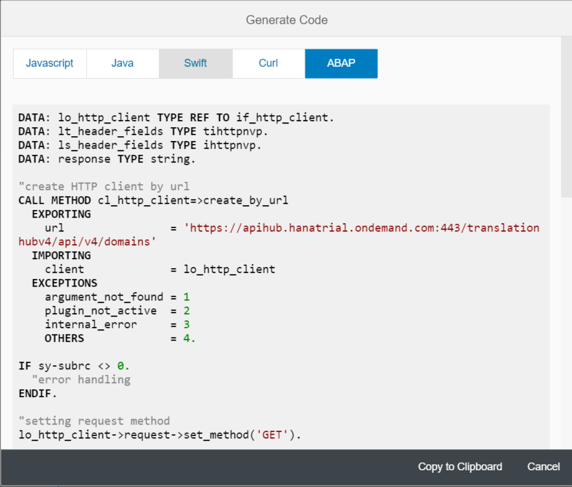
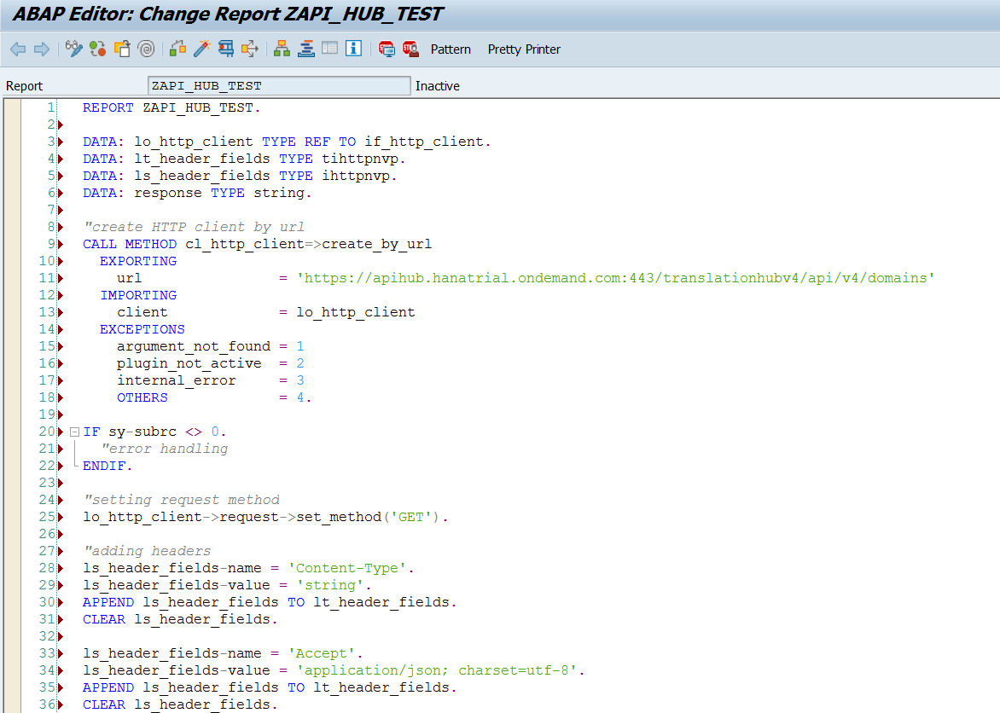

## Prerequisites  
 - ABAP system should be configured to call http APIs
 - [Testing API Business Hub APIs with Curl](https://www.sap.com/developer/tutorials/hcp-abh-test-locally.html)

## Next Steps
 - Select a tutorial from the [Tutorial Navigator](http://www.sap.com/developer/tutorial-navigator.html) or the [Tutorial Catalog](http://www.sap.com/developer/tutorials.html)

## Details
### You will learn  
In this tutorial, you will learn how to use the pre-generated code from the SAP API Business Hub in an ABAP report. You will need to have configured your ABAP system to make an HTTP request.

Configuring the proxy settings is not a required step for all systems. Verify that your system needs to have the proxy configured before completing steps 1 through 3.

### Time to Complete
**15 Min**

---

[ACCORDION-BEGIN [Step 1: ](Configure your ABAP Proxy)]
From the SAP Logon pad, launch the SAP Logon screen.

Enter the login credentials in R/3 ABAP System.

Configure your proxy settings by going to `transaction SICF` and clicking on **Execute**.

Open Proxy settings page by pressing **Ctrl + F2** and set the proxy.

[DONE]
[ACCORDION-END]

[ACCORDION-BEGIN [Step 2: ](Get your SSL Certificate)]
In Google Chrome, export SSL certification.

To get to the SSL certificate, enter **F12**, go to **Security** tab, click on **View Certificate**, click on **Details**, and select **Copy to File**. From here, you can export the certificate by path.

[DONE]
[ACCORDION-END]

[ACCORDION-BEGIN [Step 3: ](Add your certificate to ABAP)]
Once you export the certificate by path, you will need to import it into your ABAP system. To import the certificate in your ABAP system, go to the `transaction STRUST`, open **SSL client SSL Client (Standard)**, and switch to **Edit mode**.

Click on **Import Certificate**. Select the certificate you exported from Google Chrome in the previous step. Click **Add to Certificate List** and save.

In order to reflect your new SSL settings, you will need to **restart your ICM**. To restart the ICM, go to the `transaction SMICM`. Navigate to **Administration > ICM > Exit Hard > Global**.

The ICM restart message will appear. Select **Yes**.

Restart the ICM processes. Make sure no client is communicating during restart.

[DONE]
[ACCORDION-END]

[ACCORDION-BEGIN [Step 4: ](Create the ABAP program report)]

In your ABAP system, go to the `transaction se38`.

Create a new report. Enter the program name, such as `ZAPI_HUB_TEST`, select **Source Code**, and click **Create**.

Provide the following details on the **Program Attributes** screen.

| Field Name | Value |
|:--------|:--------|
| Title | testing API |
| Type | Executable program |
| OPTIONAL: Status | Test Program |

**Save**, **Activate**, and **Execute** the report.

[DONE]
[ACCORDION-END]

[ACCORDION-BEGIN [Step 5: ](Get the ABAP code from API Business Hub)]

To get the ABAP code snippets that are available in the SAP API Business Hub, go to the [SAP API Business Hub](https://api.sap.com), which can be found at `api.sap.com`, from your browser. Navigate to the **API packages page** and find the **SAP Translation Hub API**.

Click the **Expand Operations** link on the **Domains** API. Click **Generate Code** on the `GET /domains` method.

Click on the tab for **ABAP** from available languages and click **Copy to Clipboard**.

[DONE]
[ACCORDION-END]

[ACCORDION-BEGIN [Step 6: ](Add API call and run from ABAP)]
Back in your **ABAP system**, **paste the code snippet** into the report.

Replace the `<API_KEY>` with your API key value. This is also available in the SAP API Business Hub and is specific to your user and app. **Save**, **Activate**, and **Execute** the report.

If you see a message returned with data, and not an error, you have successfully tested a call to an API from the SAP API Business Hub.

[DONE]
[ACCORDION-END]

## Next Steps
- Select a tutorial from the [Tutorial Navigator](http://www.sap.com/developer/tutorial-navigator.html) or the [Tutorial Catalog](http://www.sap.com/developer/tutorials.html)
