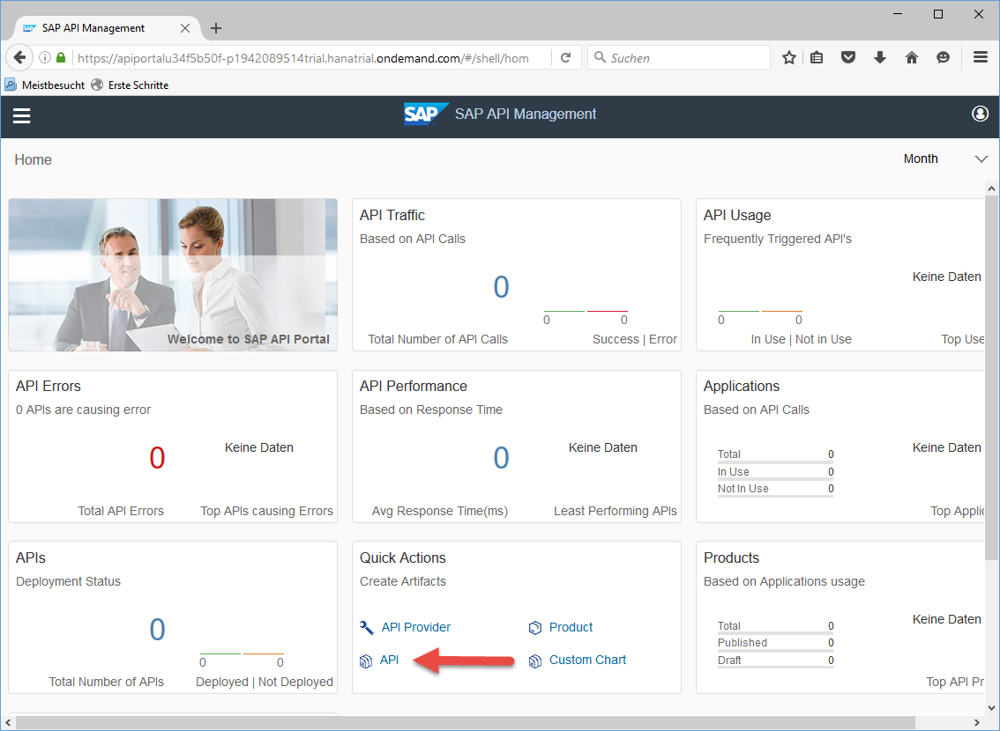
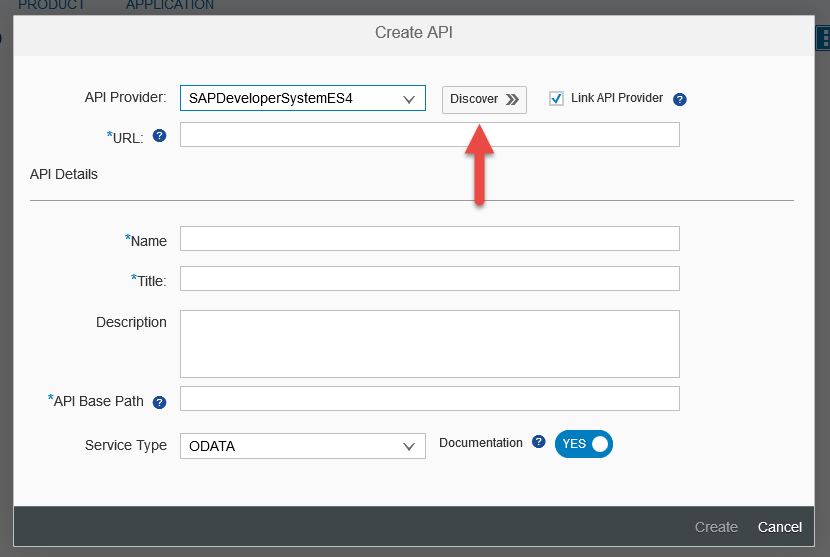
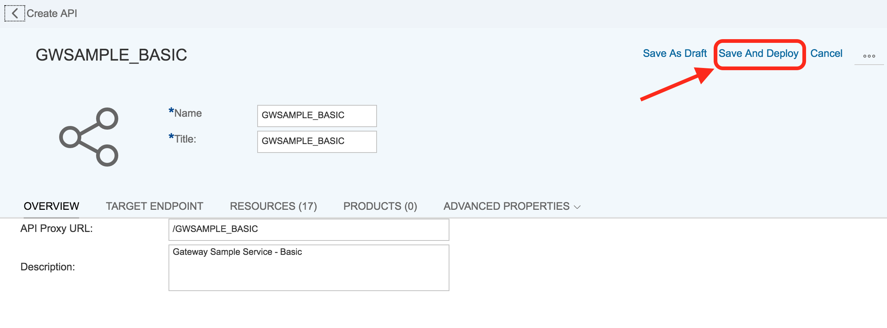

## Prerequisites  
- **Proficiency:** Beginner
- **Tutorials:**  [Create an API Provider System](https://www.sap.com/developer/tutorials/hcp-apim-create-provider.html)

## Next Steps
- [Add the API Proxy to a product](https://www.sap.com/developer/tutorials/hcp-apim-create-product.html)

## Details
### You will learn  
SAP Cloud Platform, API Management uses three main components to expose APIs.
- The API Provider is used to abstract the connection to the backend / target system
- The API Proxy is the actual API which contains the logic to connect to the target system. Here you can model the flow, add security policies, transform the incoming message or look for content injections
- The API Product which bundles one or more API Proxies before they are exposed in the API Developer portal so they can be consumed by a developer

In this tutorial you will learn how to create an API Proxy based on the API Provider created in the previous step. You will learn how SAP Cloud Platform, API Management can leverage the OData catalog service to retrieve relevant information from a SAP Gateway system and pre-populate required information for the API Proxy

### Time to Complete
**15 Min**.

---

[ACCORDION-BEGIN [Step 1: ](Learn about creating an API proxy and the Policy Editor)]

[Create an API proxy](https://blogs.sap.com/2016/06/22/part-6-overview-of-api-proxy-policies/) and take a look at the Policy Editor. You will start to look into the details of building an API Proxy that contains some real life functionality.

[VALIDATE_1]
[ACCORDION-END]

[ACCORDION-BEGIN [Step 2: ](Access the SAP API Management API Portal )]

Open the SAP API Management API Portal (you can get the URL from Enable the SAP Cloud Platform, API Management Service.

[ACCORDION-END]

[ACCORDION-BEGIN [Step 3: ](Quick start an API creation)]

From the Home screen under the Quick Actions tile, click on **API**. This will bring up the Create API wizard.

[ACCORDION-END]

[ACCORDION-BEGIN [Step 4: ](View and create APIs)]
To view your APIs that you have previously created, select from the **Hamburger Menu** in the upper left corner and click **Develop**.

This will open the list of previously created APIs.

To create a new API from this page, click **Create**.

[ACCORDION-END]

[ACCORDION-BEGIN [Step 5: ](Select API provider)]

From the drop-down select the `SAPDeveloperSystemES4` API Provider created in the previous tutorial.

[ACCORDION-END]

[ACCORDION-BEGIN [Step 6: ](Discover the services)]

Click on **Discover**.

[ACCORDION-END]

[ACCORDION-BEGIN [Step 7: ](Select the services)]

Select the `GWSAMPLE_BASIC` services by using the search bar to search for _sample_.

> You can use the Search to narrow down the list.

Click on **OK**.

The remaining fields from the API Proxy creation screen are populated. Click **Create**.

> In the trial version, there is only 1 option for the Host Alias which is your default trial account. Leave this as is.

[ACCORDION-END]

[ACCORDION-BEGIN [Step 8: ](Save and deploy your API)]

Click on **Save and Deploy**.

[ACCORDION-END]

[ACCORDION-BEGIN [Step 9: ](View APIs created)]

Click on the arrow next to **Create API** to go back to the overview page

A new API Proxy has been created

[ACCORDION-END]

## Next Steps
- [Add the API Proxy to a product](https://www.sap.com/developer/tutorials/hcp-apim-create-product.html)
