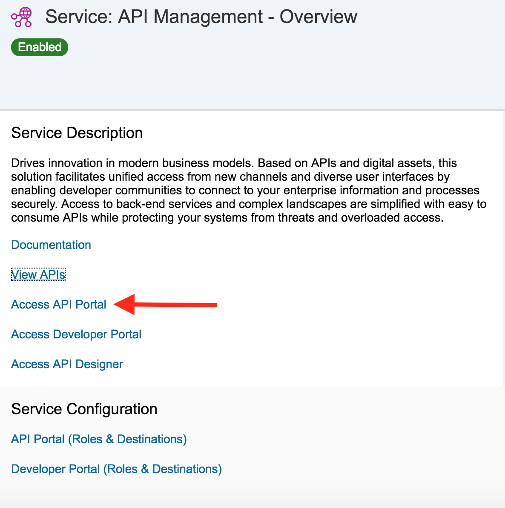
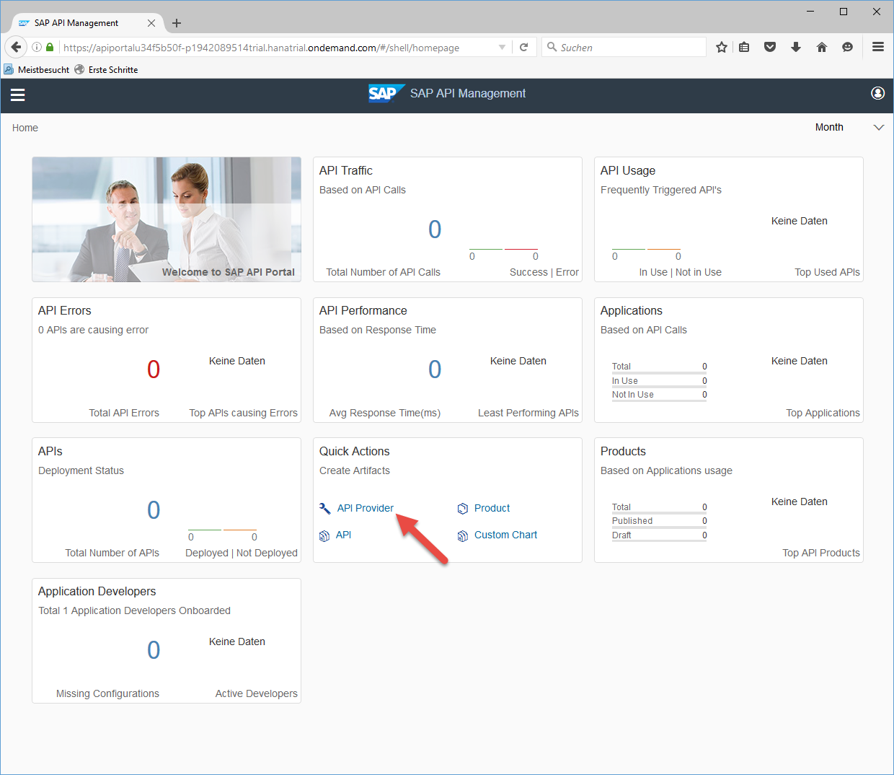
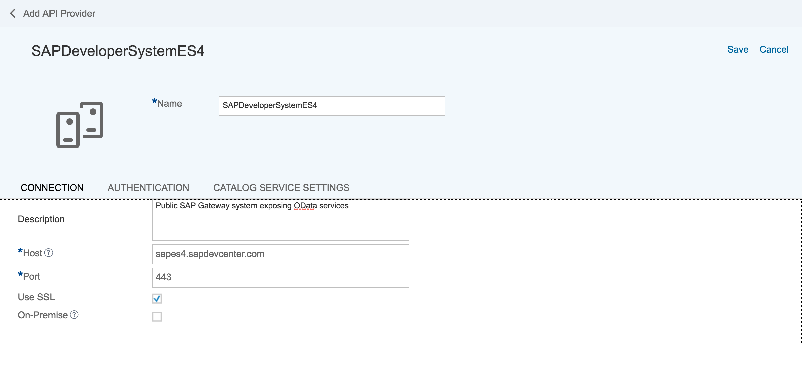
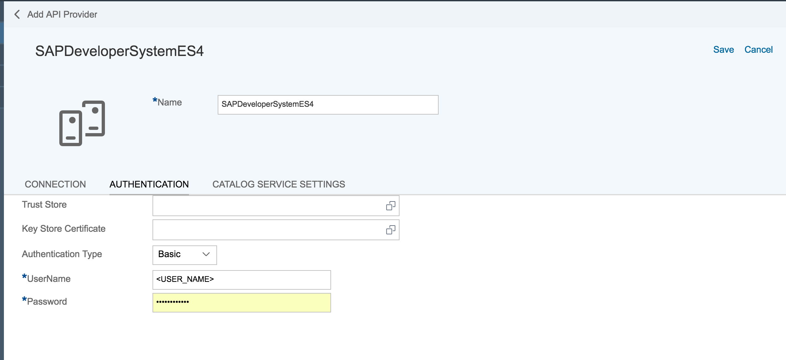
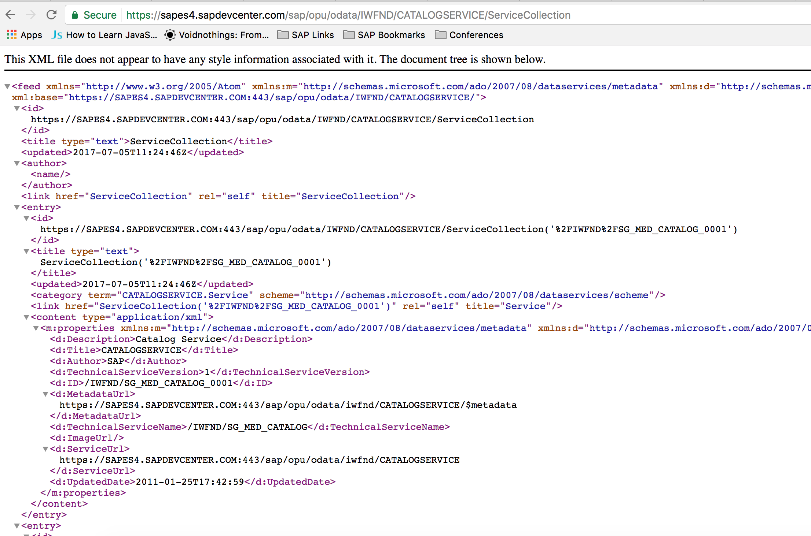

## Prerequisites  
- **Proficiency:** Beginner
- **Tutorials:** [Enable the SAP Cloud Platform, API Management Service](https://www.sap.com/developer/tutorials/hcp-apim-enable-service.html)
Create a user in the SAP Gateway Developer System: [Create an account on the Gateway Demo system](http://www.sap.com/developer/tutorials/gateway-demo-signup.html)

## Next Steps
- [Create an API Proxy](https://www.sap.com/developer/tutorials/hcp-apim-create-api.html)

## Details
### You will learn  
SAP Cloud Platform, API Management uses three main components to expose APIs.

- The API Provider is used to abstract the connection to the backend / target system
- The API Proxy is the actual API which contains the logic to connect to the target system. Here you can model the flow, add security policies, transform the incoming message or look for content injections
- The API Product which bundles one or more API Proxies before they are exposed in the API Developer portal so they can be consumed by a developer

You will use SAP Cloud Platform, API Management to create an API Provider. This API Provider will connect to a backend system, in your case to the SAP Gateway Developer System. In a real-life scenario the API Provider could connect to your Developer System. Once you have created and tested an API Proxy on it, you would transport the proxy to your productive system and the underlying API Provider would now point to your productive backend system.  

### Time to Complete
**15 Min**.

---

[ACCORDION-BEGIN [Step 1: ](Learn about the API Management tools)]

In the next couple tutorials that are part of this series, you will take a look at the different tools that API Management provides. [Get an overview of the tooling](https://blogs.sap.com/2016/06/20/part-2-overview-of-sap-api-management-tools/) and how each component works together to help create your proxy.

Your proxy is what you expose to the outside world so they can consume your API. Review the blog to learn about the different building blocks of a proxy and how the tools SAP provided through API Management make it easier for you as a developer.

[VALIDATE_1]
[ACCORDION-END]

[ACCORDION-BEGIN [Step 2: ](Open the SAP API Management Portal)]

Open the **SAP API Management API Portal** (you can get the URL from Enable the SAP Cloud Platform, API Management Service).

[DONE]
[ACCORDION-END]

[ACCORDION-BEGIN [Step 3: ](Quick start an API Provider creation)]

From the **Quick Action** tile on the Home screen you can immediately create an API Provider by clicking on **API Provider**.

This will bring up the create wizard for an API Provider.

[DONE]
[ACCORDION-END]

[ACCORDION-BEGIN [Step 4: ](View and create API Providers)]

To navigate to the API Developer area, select the **Hamburger Menu** in the upper left corner and click on **Develop**.

Here you will see 5 tabs where APIs is preselected. Select **API Providers** from the tab menu to see the previously created providers and to create a new one.

To create a new provider from this page, click on **Create**

[DONE]
[ACCORDION-END]

[ACCORDION-BEGIN [Step 5: ](Enter information about the API Provider)]

In the blue overview area, enter the **Name** for the API Provider.

**Field** | **Value**
----|----
Name | `SAPDeveloperSystemES4`

Under the **Connection** tab, provide the following information.

**Field** | **Value**
----|----
Description | Public SAP Gateway system exposing OData
Host | `sapes4.sapdevcenter.com`
Port | 443
Use SSL | _(checked)_
On Premise | _(unchecked)_

 

On the **Authentication** tab, provide the following information.

**Field** | **Value**
----|----
Authentication Type | Basic
`UserName` | `<your_GATEWAY_username>`
Password | `<your_GATEWAY_password>`

On the **Catalog Service Settings** tab, provide the following information.

**Field** | **Value**
----|----
Path Prefix | `/sap/opu/odata`
Service Collection URL | `/IWFND/CATALOGSERVICE/ServiceCollection`

[DONE]
[ACCORDION-END]

[ACCORDION-BEGIN [Step 6: ](Save your API provider)]

Click on **Save** at the top-right side.

[DONE]
[ACCORDION-END]

[ACCORDION-BEGIN [Step 7: ](Test your settings)]

To Test your settings, click the **Catalog Service Settings** tab on the API Provider. Click on the **Catalog URL** link to see the catalog.

[DONE]
[ACCORDION-END]

[ACCORDION-BEGIN [Step 8: ](View list of services)]

When the URL was correct you should see a list of services available on the SAP Gateway system (this screen may look different on different browsers). If you entered your authentication details correctly, you **should not** be prompted for a username and password. If you are asked for a username and password, verify your credentials in the API Provider Authentication tab are your correct **Gateway credentials**. After 3 failed attempts, your Gateway will lock.

[DONE]
[ACCORDION-END]

[ACCORDION-BEGIN [Step 9: ](Go back to the API Provider overview)]

When the API Provider was saved successful a toast will quickly show up and you will see all the values you had previously entered. Click on the **`SAPDeveloperSystemES4`** link to go back to the API Provider overview screenshot

[DONE]
[ACCORDION-END]

[ACCORDION-BEGIN [Step 10: ](View providers)]

Now you can see one API Provider in the list of available API Providers.

[DONE]
[ACCORDION-END]

## Next Steps
- [Create an API Proxy](https://www.sap.com/developer/tutorials/hcp-apim-create-api.html)
