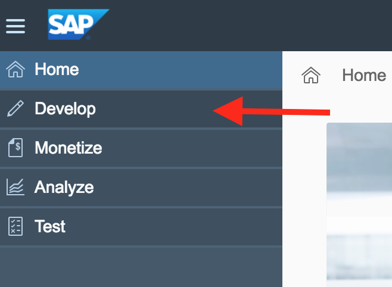
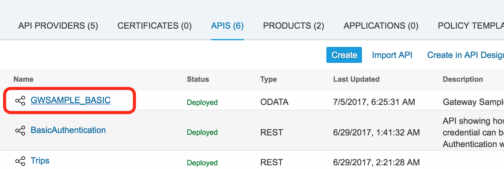
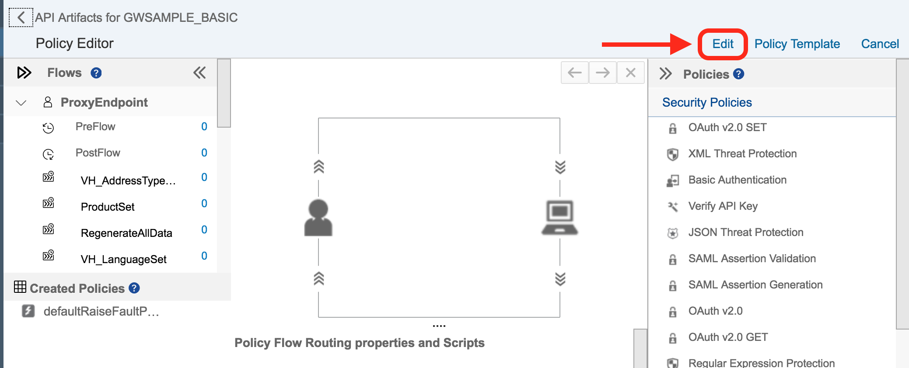
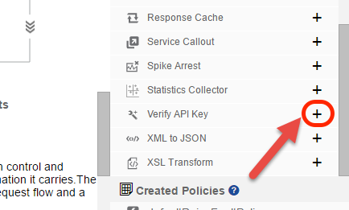
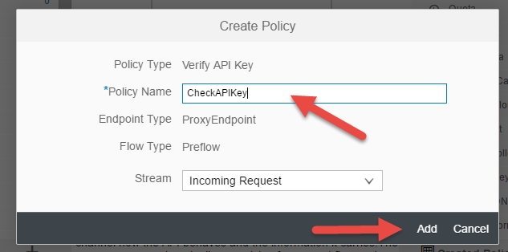
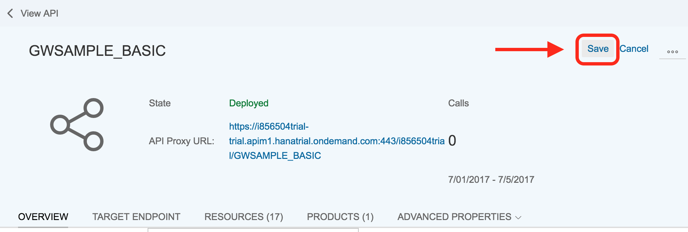

## Prerequisites  
- **Proficiency:** Beginner
- **Tutorials:** [Add the API Proxy to a product](https://www.sap.com/developer/tutorials/hcp-apim-create-product.html)

## Next Steps
- [Consume the API Proxy in SAP Web IDE](https://www.sap.com/developer/tutorials/hcp-apim-webide-int.html)

## Details
### You will learn  
SAP Cloud Platform, API Management offers several out of the box policies which help you protect, model and "work" with your APIs. One of the security related Policies is the "Verify API Key" Policy.

In this tutorial you will learn how to protect your API Proxy with the "Verify API Key" Policy. This policy allows you to add a simple protection via a so called API Key. Only calls which send a valid API Key along with the main request will be allowed to call the API Proxy.

### Time to Complete
**20 Min**.

---

[ACCORDION-BEGIN [Step 1: ](Learn about the API call flow)]

It is important to [understanding the API policy flow](https://blogs.sap.com/2016/06/22/part-7-understanding-api-policy-flow-routing/) so you gain an understanding of why a policy is applied at a certain time in the flow. For instance, access policies should be verified before the API call to reduce using resources unnecessarily. The entire request/response cycle is divided up, first into segments, then within each segment, into processing stages.

[VALIDATE_1]
[ACCORDION-END]

[ACCORDION-BEGIN [Step 2: ](Learn about the Policy Editor)]

When creating a policy, you will need to know how the information is available in the policy and policy editor. [Understand how the Policy Designer accesses the proxy flow](https://blogs.sap.com/2016/06/23/part-8-understanding-the-api-policy-designer/) by reading this blog post.

[VALIDATE_2]
[ACCORDION-END]

[ACCORDION-BEGIN [Step 3: ](Learn about how to assign a policy to a proxy)]

[Edit a policy and assign it to your proxy flow](https://blogs.sap.com/2016/06/23/part-9-assigning-policies-to-an-api-proxy/). This blog will ensure you know how to identify the proper stage to add a policy, as well as how to assign a policy to the flow.

[VALIDATE_3]
[ACCORDION-END]

[ACCORDION-BEGIN [Step 4: ](Learn about assigning multiple policies)]

You will look at [assigning multiple policies to various processing stages](https://blogs.sap.com/2016/06/24/part-10-assigning-multiple-policies-to-an-api-proxy/), and how the outcome of one policy can be used to influence the behavior of another policy.

[VALIDATE_4]
[ACCORDION-END]

[ACCORDION-BEGIN [Step 5: ](Access the SAP API Management API Portal)]

Open the SAP API Management API Portal (you can get the URL from Enable the SAP Cloud Platform, API Management Service.

[DONE]
[ACCORDION-END]

[ACCORDION-BEGIN [Step 6: ](View created APIs)]

From the **Hamburger Menu** in the upper left corner and click on **Develop**.

[DONE]
[ACCORDION-END]

[ACCORDION-BEGIN [Step 7: ](Select an API)]

Select the API `GWSAMPLE_BASIC` created in a previous step in the this tutorial series.

[DONE]
[ACCORDION-END]

[ACCORDION-BEGIN [Step 8: ](View API Policies)]

In the upper right corner click on **Policies** to open the policy information for the API.

[DONE]
[ACCORDION-END]

[ACCORDION-BEGIN [Step 9: ](Open the edit page for policies)]

In the Policy Editor, click on **Edit**.

[DONE]
[ACCORDION-END]

[ACCORDION-BEGIN [Step 10: ](Edit the PreFlow policies)]

Select the `PreFlow` from the `ProxyEndpoint` on the left hand side.

[DONE]
[ACCORDION-END]

[ACCORDION-BEGIN [Step 11: ](Add Verify API Key policy)]

On the right hand, find the **Security Policies** section under the _Policies_ pane. Find the **Verify API Key** policy and click the **+** next to the policy name.

[DONE]
[ACCORDION-END]

[ACCORDION-BEGIN [Step 12: ](Enter policy name)]

Enter the Policy Name `CheckAPIKey` and click on **Add**.

[DONE]
[ACCORDION-END]

[ACCORDION-BEGIN [Step 13: ](Update API Key tag)]

In the **Code Editor** found in the bottom pane, look for the `<APIKey ... />` tag. Replace the string `variable_containing_api_key` with `request.header.APIKey`.

[DONE]
[ACCORDION-END]

[ACCORDION-BEGIN [Step 14: ](Update and save changes)]

Click on **Update** to apply the new policies.

Click on **Save** to save the changes to the API and enforce the new policies.

[DONE]
[ACCORDION-END]

### Optional
- When you now open the API Proxy in a browser you will get an error message stating that you need to pass an API Key in the header `APIKey`.

## Next Steps
- [Consume the API Proxy in SAP Web IDE](https://www.sap.com/developer/tutorials/hcp-apim-webide-int.html)
